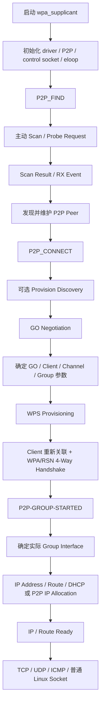
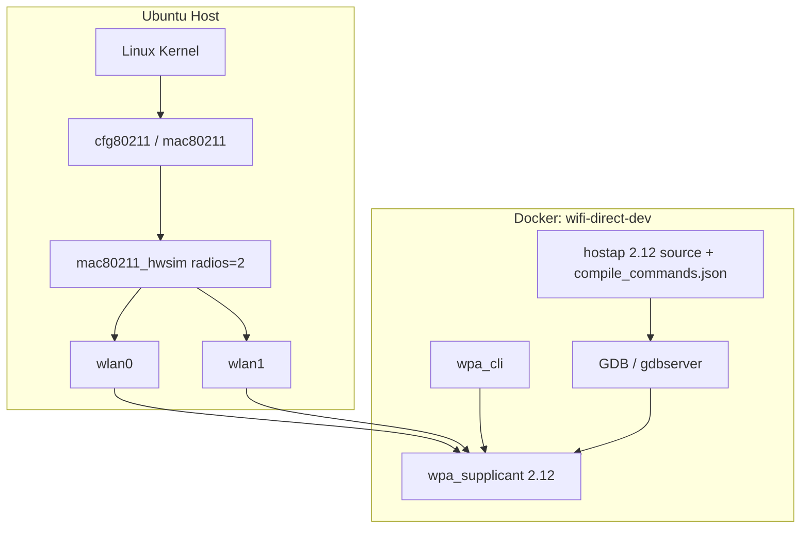

# Wi-Fi Direct Source Lab

面向 Linux Wi-Fi Direct / Wi-Fi P2P 源码学习、协议实验与 GDB 调试的可重复实验环境。

项目以 **hostap / wpa_supplicant 2.12** 为固定 userspace 基线：Ubuntu Host 提供真实 Linux wireless kernel stack 与 `mac80211_hwsim`，Docker 固化源码、Debug binary、编译选项和工具链，VS Code Dev Containers 提供源码跳转与 GDB 调试入口。

本仓库的目标不是封装一个“直接可用的 Wi-Fi Direct 产品”，而是把 Wi-Fi Direct 从：

```text
wpa_cli / control interface
        ↓
wpa_supplicant / P2P state machine
        ↓
nl80211 / cfg80211 / mac80211
        ↓
802.11 management + data path
        ↓
P2P Group / IP / Socket
```

这条链完整拆开，形成一套可以重复实验、逐步单步调试、对照源码阅读的学习基线。

---

## Wi-Fi Direct / P2P 是什么

Wi-Fi Direct 是一种让两台或多台 Wi-Fi 设备在**不依赖现有基础设施 AP** 的情况下直接建立无线连接的 P2P（Peer-to-Peer）机制。

它不是简单的“两个设备互相发包”。完整过程至少包含：

1. 发现附近的 P2P Device；
2. 协商谁成为 Group Owner（GO），谁成为 P2P Client；
3. 选择 Group 使用的信道和参数；
4. 完成 WPS provisioning；
5. 建立 WPA/RSN 安全连接；
6. 创建或复用 P2P Group Interface；
7. 配置 IP 地址和路由；
8. 最终把这个 P2P Group 作为普通 IP 网络交给应用使用。

可以把它理解为：

> **Wi-Fi Direct 负责“发现对端、协商角色、建立并维护一条安全无线链路”；Linux IP/Socket 负责“在已经建立好的链路上承载真正的业务数据”。**

典型用途包括设备间直连、文件传输、局域网控制、视频/数据流、嵌入式设备与手机直连，以及不依赖外部 AP 的本地通信。

### GO / Client 与普通 TCP Client / Server 不是一回事

Wi-Fi Direct Group 内会存在：

- **GO（Group Owner）**：在当前 P2P Group 中承担类似 AP 的角色；
- **P2P Client**：加入 GO 创建的 Group。

但这个角色只属于 Wi-Fi Direct 控制面。

当 IP 网络已经 ready 后：

- GO 可以作为 TCP Server；
- GO 也可以主动 `connect()` P2P Client；
- P2P Client 也可以监听 TCP 端口；
- 双方都可以直接发送 UDP。

因此不要把：

```text
P2P GO     == TCP Server
P2P Client == TCP Client
```

当成固定关系。

---

## Wi-Fi Direct 的核心运行机制：阻塞等待 + Event 驱动

`wpa_supplicant` 的 P2P 主流程不是靠一个高频 while 循环不断轮询状态，也不是每个协议步骤创建一个新线程。

它的核心运行模型是 hostap 的 `eloop`：

```text
main()
  -> wpa_supplicant_run()
      -> eloop_run()
          -> 阻塞等待 fd / timeout / signal
          -> 某个事件发生
          -> dispatch 对应 callback
          -> 状态机向前推进
          -> 再次进入阻塞等待
```

### 当前项目实际是 `select()`，不是 `epoll_wait()`

这里需要特别区分“运行机制”和“具体 I/O multiplexing backend”。

hostap 的 `eloop` 可以使用：

```text
select
poll
epoll
kqueue
```

当前仓库的 Dockerfile **没有启用 `CONFIG_ELOOP_EPOLL` / `CONFIG_ELOOP_POLL` / `CONFIG_ELOOP_KQUEUE`**，因此 hostap 2.12 会回退到：

```text
CONFIG_ELOOP_SELECT
```

也就是说，本项目当前最准确的描述是：

> **`select()` 阻塞 + eloop Event/Callback 驱动。**

如果以后把构建配置切换为 `CONFIG_ELOOP_EPOLL`，同一套注册和 callback 模型可以改为由 `epoll_wait()` 阻塞等待；P2P 上层状态机的整体设计思想并不会因此改变。

### 什么事件会把主循环唤醒

| 事件来源 | 典型例子 | 后续行为 |
|---|---|---|
| Control socket fd readable | `wpa_cli` 发送 `P2P_FIND` / `P2P_CONNECT` | `recvfrom()` → command parser → P2P Core |
| nl80211 event socket readable | scan 完成、RX management frame、连接状态变化 | driver event → `wpa_supplicant_event()` → 对应状态机 |
| TX status event | Action frame ACK / NO_ACK / FAILED | 推动 GO Negotiation 等异步流程继续 |
| timeout 到期 | Find timeout、scan timeout、radio work、协议重试 | timeout callback 被执行 |
| signal | terminate / reconfigure | 在 eloop 上下文中处理退出或重配置 |

因此一个典型异步过程不是：

```text
发送请求
  -> 原地等待所有协议过程完成
```

而是：

```text
发起一个操作
  -> 返回 eloop
  -> 阻塞等待
  -> RX / TX status / scan result / timeout 等事件到达
  -> callback 被调度
  -> 状态机继续下一步
```

例如扫描：

```text
P2P Core
  -> NL80211_CMD_TRIGGER_SCAN
  -> kernel 接受请求
  -> wpa_supplicant 回到 eloop
  -> scan 在 kernel / driver 中异步执行
  -> NL80211_CMD_NEW_SCAN_RESULTS
  -> nl80211 event fd 就绪
  -> eloop callback
  -> EVENT_SCAN_RESULTS
  -> P2P peer table 更新
```

同时还会注册 scan timeout 作为兜底，防止底层异常情况下永远收不到 scan-complete event。

GO Negotiation 的 Action frame 也是同样模型：

```text
构造并发送 Action frame
  -> driver TX
  -> 回到 eloop
  -> EVENT_TX_STATUS
  -> ACK / NO_ACK / FAILED
  -> P2P callback
  -> 继续下一状态
```

因此理解 `eloop + fd event + timeout + callback`，是理解整个 wpa_supplicant/P2P 源码的关键。

详细分析见：

- [教程 05：control socket 与 eloop](docs/05-ctrl-iface-eloop.md)
- [教程 07：第一次 P2P Scan](docs/07-p2p-first-scan.md)
- [教程 08：Scan Result 到 P2P Peer](docs/08-scan-result-to-peer.md)
- [教程 09：P2P_CONNECT 与 GO Negotiation](docs/09-p2p-connect-go-negotiation.md)

---

## 从 P2P_FIND 到普通 Socket 通信的完整流程



可以把这条主线拆成四层。

### 1. Device Discovery：先找到对端

```text
P2P_FIND
  -> P2P Core
  -> P2P Scan
  -> nl80211
  -> cfg80211 / mac80211 / driver
  -> Probe Request / Probe Response
  -> scan result event
  -> P2P peer table
  -> P2P-DEVICE-FOUND
```

### 2. Group Negotiation：决定怎么组网

执行 `P2P_CONNECT` 后，可能先进行 Provision Discovery，然后进入经典 GO Negotiation：

```text
GO Negotiation Request
GO Negotiation Response
GO Negotiation Confirm
```

这里确定的是：

- GO / Client 角色；
- operating channel；
- Group 参数；
- 后续 Group Formation 所需协商结果。

它还不等于最终的数据连接已经 ready。

### 3. Group Formation / Security：真正建立安全 Group

经典路径继续经过：

```text
GO Negotiation
  -> WPS provisioning
  -> Credential
  -> Client 重新关联
  -> WPA/RSN 4-Way Handshake
  -> WPA_COMPLETED
  -> P2P-GROUP-STARTED
```

其中：

- WPS 负责 provisioning / credential；
- WPA/RSN 4-Way Handshake 负责真正建立安全数据链路；
- `P2P-GROUP-STARTED` 表示 P2P Group 生命周期已经进入 Started。

### 4. Group Operating Channel：建链后通常固定在一个工作信道

P2P Discovery 和 P2P Group Runtime 要区分来看。

在发现 / 建链阶段，设备需要执行 Scan、Listen、Probe Request/Response，因此可能在多个可用信道之间切换。2.4 GHz 下常见的 P2P Social Channel 包括 Channel 1、6、11，但实际扫描和协商范围还受 regulatory domain、driver/firmware capability 和本地配置影响。

进入 GO Negotiation 后，双方会协商并确定这个 Group 使用的 **Operating Channel**。当 Group 建立完成后，GO 与该 Group 内的 P2P Client 正常情况下都在这个 Operating Channel 上收发 802.11 数据帧，而不是继续像 Discovery 阶段那样在多个信道之间不断扫描通信。

例如事件中如果看到：

```text
P2P-GROUP-STARTED ... freq=2412 ...
```

则表示当前 Group 的 operating frequency 是 `2412 MHz`，也就是 2.4 GHz 的 Channel 1。也可以通过：

```bash
iw dev
```

观察实际 Group Interface 所在的 channel / frequency。

可以把信道变化理解成：

```text
Discovery / Negotiation
  -> Scan / Listen on multiple channels
  -> 选择 Operating Channel
  -> P2P-GROUP-STARTED
  -> GO + Client 在同一 Group Operating Channel 上运行
  -> IP / TCP / UDP Socket
```

这里的“固定”不是“协议上永久锁死”。hostap / `wpa_supplicant` 2.12 中存在 GO frequency move / channel switch 处理：在 driver、对端能力和当前并发条件允许时，GO 可以尝试通过 CSA/eCSA 等机制迁移到新的 frequency；如果 channel switch 不被支持或失败，实现也可能需要停止并重新建立 GO/Group。因此更准确的结论是：

> **P2P Group 建立后会有一个明确的 Operating Channel，正常数据通信长期工作在该信道；只有在特定策略、法规或并发需求下才会发生信道迁移。**

这在“同一块单 Radio Wi-Fi 同时连接基础设施 AP，又运行 P2P Group”时尤其重要：硬件/固件如果只能做 SCC（Single Channel Concurrency），P2P GO 往往需要迁移到已有 STA 所在信道；支持 MCC（Multi Channel Concurrency）的平台才可能让不同虚拟接口同时工作在不同信道。最终行为取决于 Wi-Fi 芯片、driver/firmware 和 `wpa_supplicant` 的并发能力。

无论底层 operating channel 是否发生迁移，应用层 Socket 的编程模型都不改变。信道选择和切换属于 Wi-Fi MAC/driver/firmware 数据链路层管理；只要 Group 与 IP/route 仍然有效，应用继续通过标准 TCP/UDP Socket 通信即可。

### 5. IP / Socket Data Plane：把 P2P 当普通网络使用

`P2P-GROUP-STARTED` **不应直接等价为“现在一定可以调用 `connect()`”**。

还需要确认：

```text
Group Interface
  + IP Address
  + Netmask
  + Route
  + Peer IP
```

GO 常见做法是在 Group Interface 上配置地址并运行 DHCP Server；Client 可以通过 DHCP 获取地址，也可能使用 P2P IP Address Allocation 提供的参数。具体 IP 配置属于系统集成层，不是 P2P Core 本身固定完成的工作。

当 IP / route ready 后，应用层不再需要“Wi-Fi Direct 专用数据 API”，可以直接使用标准 BSD Socket：

```text
socket()
bind()
listen()
accept()
connect()
send() / recv()
sendto() / recvfrom()
```

业务数据路径变成：

```text
Application
  -> TCP / UDP / IP
  -> Linux routing
  -> P2P Group netdev
  -> Wi-Fi driver / firmware
  -> 802.11 encrypted data frame
  -> Peer
```

普通 TCP/UDP payload **不会逐包经过 `wpa_cli` control socket，也不会逐包进入 P2P Core**。`wpa_supplicant` 仍负责 Group 生命周期、断连、安全和必要的无线管理事件，但真正的业务数据已经进入 Linux 网络数据面。

一句话总结：

> **P2P 协议负责把路建起来；IP/Socket 负责在已经建好的路上通信。**

详细分析见 [教程 10：Group Formation 与安全建立](docs/10-group-formation-security.md) 和 [教程 11：Group Runtime / Data Path](docs/11-group-runtime.md)。

---

## 实验架构



职责边界：

| 层 | 负责内容 |
|---|---|
| Ubuntu Host | Linux kernel、`cfg80211`、`mac80211`、`mac80211_hwsim`、真实 network namespace |
| Docker Container | 固定 `wpa_supplicant 2.12`、源码、Debug binary、libnl、GDB 和实验工具 |
| VS Code Dev Containers | F12 源码跳转、`compile_commands.json`、F5/GDB 调试入口 |

Container 使用 `network_mode: host`，因此可以看到 Host network namespace 中由 `mac80211_hwsim` 创建的无线 interface。

Container 故意不授予 `SYS_MODULE`。`mac80211_hwsim` 的加载和卸载必须由 Host 完成。

---

## 固定源码基线

项目 Dockerfile 固定：

```text
wpa_supplicant / hostap: 2.12
commit: 831364bf02710ad09c2f27d3efa92abeeb5634c0
source: https://git.w1.fi/hostap.git
```

Container 内源码：

```text
/opt/wifi-direct/src/wpa_supplicant-2.12
```

Debug binary：

```text
/usr/local/bin/wpa_supplicant-2.12
/usr/local/bin/wpa_cli-2.12
```

源码、Debug binary 与 `compile_commands.json` 来自同一次 Docker build，避免源码阅读对象和实际运行 binary 不一致。

---

## 工程结构

```text
wifi-direct/
├── Dockerfile
├── compose.yaml
├── .env.example
├── README.md
├── workspace.code-workspace
├── mkdocs.yml
├── requirements-docs.txt
│
├── .devcontainer/
│   └── devcontainer.json
│
├── .vscode/
│   ├── c_cpp_properties.json
│   ├── launch.json
│   └── settings.json
│
├── config/
│   ├── p2p-a.conf
│   └── p2p-b.conf
│
├── docs/
│   ├── index.md
│   ├── 00-series-index.md
│   ├── 01-wifi-direct-lab.md
│   ├── 02-wpa-cli-to-p2p-find.md
│   ├── 03-wpa-supplicant-startup-driver.md
│   ├── 04-interface-protocol-init.md
│   ├── 05-ctrl-iface-eloop.md
│   ├── 06-p2p-find-to-core.md
│   ├── 07-p2p-first-scan.md
│   ├── 08-scan-result-to-peer.md
│   ├── 09-p2p-connect-go-negotiation.md
│   ├── 10-group-formation-security.md
│   ├── 11-group-runtime.md
│   ├── 12-group-teardown.md
│   ├── 13-persistent-group.md
│   ├── 14-kernel-wireless-control-path.md
│   ├── 15-group-data-plane-tx-rx.md
│
├── source-reading/
│   ├── README.md
│   ├── SOURCE-INDEX.md
│   ├── fetch-linux-master.sh
│   └── hostap-2.12-relevant/
│
└── .github/workflows/
    ├── ci.yml
    ├── deploy-pages.yml
    └── publish-image.yml
```

默认实验路径：

```text
Ubuntu Host: /home/wdfk/share/wifi-direct
Container:   /workspace
```

---

## 快速开始

以下命令在 Ubuntu Host 执行。

### 1. 创建两个虚拟 Wi-Fi radio

```bash
cd /home/wdfk/share/wifi-direct

sudo modprobe mac80211_hwsim radios=2
iw dev
```

默认实验假设两个 interface 为 `wlan0` / `wlan1`。如果 NetworkManager 正在管理它们，先释放：

```bash
sudo nmcli device set wlan0 managed no
sudo nmcli device set wlan1 managed no
```

如果 `iw dev` 显示的是其他 interface 名称，后面在 `.env` 中修改 `P2P_A` / `P2P_B`。

### 2. 生成 `.env`

```bash
printf 'LOCAL_UID=%s\nLOCAL_GID=%s\nWIFI_DIRECT_IMAGE=wifi-direct-lab:2.12\nP2P_A=wlan0\nP2P_B=wlan1\n' \
    "$(id -u)" "$(id -g)" > .env
```

或者先复制模板后手工调整：

```bash
cp .env.example .env
```

### 3. 构建并启动 Container

```bash
docker compose config --quiet
docker compose up -d --build
docker compose ps
```

进入 Container：

```bash
docker compose exec wifi-direct-dev bash
```

检查固定版本和 interface：

```bash
wpa_supplicant-2.12 -v
wpa_cli-2.12 -v

git -C "$WPA_SUPPLICANT_SRC" rev-parse HEAD
printf 'P2P_A=%s\nP2P_B=%s\n' "$P2P_A" "$P2P_B"
iw dev
```

---

## 第一次 P2P 实验

Container 内打开三个 Terminal。

Terminal A：

```bash
sudo wpa_supplicant-2.12 \
    -Dnl80211 \
    -i "$P2P_A" \
    -c /workspace/config/p2p-a.conf \
    -dd \
    -t
```

Terminal B：

```bash
sudo wpa_supplicant-2.12 \
    -Dnl80211 \
    -i "$P2P_B" \
    -c /workspace/config/p2p-b.conf \
    -dd \
    -t
```

Terminal C 先确认 control interface：

```bash
sudo wpa_cli-2.12 \
    -p /run/wpa_supplicant-p2p-a \
    -i "$P2P_A" \
    ping
```

正常返回：

```text
PONG
```

开始 Device Discovery：

```bash
sudo wpa_cli-2.12 \
    -p /run/wpa_supplicant-p2p-a \
    -i "$P2P_A" \
    p2p_find
```

查看 peer：

```bash
sudo wpa_cli-2.12 \
    -p /run/wpa_supplicant-p2p-a \
    -i "$P2P_A" \
    p2p_peers
```

后续 `P2P_CONNECT`、GO Negotiation、WPS、4-Way Handshake 与 Group Runtime 按教程 09～11 继续。

---

## VS Code：源码阅读与 GDB 调试

推荐工作流：

```text
Windows VS Code
  -> Remote-SSH: Ubuntu Host
      -> Reopen in Container
          -> wifi-direct-dev
```

Dev Container 中：

- C/C++ 扩展使用 `/opt/wifi-direct/src/wpa_supplicant-2.12/wpa_supplicant/compile_commands.json`；
- F12 跳转基于真实构建参数；
- F5 使用 `.vscode/launch.json`；
- GDB 本身以普通 `dev` 用户运行；
- `gdbserver` 通过受限 sudo 启动需要无线管理权限的 `wpa_supplicant`。

F5 前先停止正在占用目标 WLAN interface 的手工 `wpa_supplicant` 实例。

Dev Container 默认声明：

```text
ms-vscode.cpptools
intellsmi.comment-translate
```

可检查：

```bash
code --list-extensions | grep -E 'cpptools|comment-translate'
```

---

## 为什么当前主线不用 D-Bus

本实验主线固定研究：

```text
wpa_cli
  -> AF_UNIX control interface
  -> wpa_supplicant
  -> P2P Core
  -> nl80211 / cfg80211
```

Dockerfile 也明确没有启用 D-Bus control interface。

D-Bus 更适合后续分析 NetworkManager、桌面网络管理程序或真实 Linux 产品控制栈时单独学习，不需要插入当前 P2P 源码主线。

---

## 文档路线

完整源码系列入口：[docs/00-series-index.md](docs/00-series-index.md)

| 编号 | 内容 |
|---|---|
| 01 | [实验与调试环境](docs/01-wifi-direct-lab.md) |
| 02 | [wpa_cli 到 P2P_FIND](docs/02-wpa-cli-to-p2p-find.md) |
| 03 | [wpa_supplicant 启动与 driver](docs/03-wpa-supplicant-startup-driver.md) |
| 04 | [Interface 协议子系统初始化](docs/04-interface-protocol-init.md) |
| 05 | [control socket 与 eloop](docs/05-ctrl-iface-eloop.md) |
| 06 | [P2P_FIND 进入 P2P Core](docs/06-p2p-find-to-core.md) |
| 07 | [第一次 P2P Scan](docs/07-p2p-first-scan.md) |
| 08 | [Scan Result 到 P2P Peer](docs/08-scan-result-to-peer.md) |
| 09 | [P2P_CONNECT 与 GO Negotiation](docs/09-p2p-connect-go-negotiation.md) |
| 10 | [Group Formation 与安全建立](docs/10-group-formation-security.md) |
| 11 | [Group Runtime / Data Path](docs/11-group-runtime.md) |
| 12 | [Group Teardown](docs/12-group-teardown.md) |
| 13 | [Persistent Group / Invitation](docs/13-persistent-group.md) |
| 14 | [Linux Wireless 控制面：ROC 与 Management Frame TX/RX](docs/14-kernel-wireless-control-path.md) |
| 15 | [P2P Group 普通 IP 数据面 TX/RX](docs/15-group-data-plane-tx-rx.md) |

教程 14～15 的配套源码阅读入口：[`source-reading/SOURCE-INDEX.md`](source-reading/SOURCE-INDEX.md)。其中 hostap 2.12 相关文件已随仓库保存；Linux Wireless 使用 `fetch-linux-master.sh` sparse-checkout 当前 `master`，也可用 `LINUX_REF=72d3fcf802c45d00b300f25b848a93c3a2bd7c7e` 复现文章校对快照。

GitHub Pages 首页由 [docs/index.md](docs/index.md) 生成。

---

## CI / CD

仓库当前拆分为三个 workflow：

| Workflow | 作用 |
|---|---|
| `CI` | Compose 配置、MkDocs strict build、Docker Image 与 userspace 工具验证 |
| `CD - GitHub Pages` | 构建并发布 MkDocs 文档站点 |
| `CD - Docker Image` | 构建并发布 GHCR userspace Image |

CI 不把 GitHub-hosted runner 当作完整 `mac80211_hwsim` P2P 集成测试环境。真正的双 radio、空口管理帧、P2P Group 和 Socket 数据面验证仍应在 Linux Host 实验环境完成。

---

## 日常命令

```bash
# Host：创建 hwsim radio
sudo modprobe mac80211_hwsim radios=2

# 查看无线 interface
iw dev

# 启动开发 Container
docker compose up -d

# 查看状态
docker compose ps

# 查看日志
docker compose logs

# 进入 Container
docker compose exec wifi-direct-dev bash

# 停止 Container
docker compose down
```

停止相关无线进程后，如需卸载 Host hwsim：

```bash
sudo modprobe -r mac80211_hwsim
```

`docker compose down` 只处理 Container；`mac80211_hwsim` 属于 Host kernel module，两者是独立生命周期。

---

## 最终心智模型

如果只记住这套项目的一条主线，可以记成：

```text
P2P_FIND
  -> Scan / Listen
  -> Peer Discovery
  -> P2P_CONNECT
  -> GO Negotiation
  -> 确定 Group Operating Channel
  -> WPS
  -> WPA/RSN 4-Way Handshake
  -> P2P-GROUP-STARTED
  -> Group Interface
  -> IP / Route Ready
  -> TCP / UDP Socket
```

运行时则记成：

```text
注册 fd / timeout / callback
        ↓
eloop 阻塞等待
        ↓
RX / TX status / scan result / timeout / control command
        ↓
dispatch callback
        ↓
推进 P2P 状态机
        ↓
再次阻塞等待
```

本仓库当前具体 backend 是 **`select()`**；如果后续启用 `CONFIG_ELOOP_EPOLL`，底层阻塞点可以变成 **`epoll_wait()`**，但上层 Event/Callback 驱动模型不变。
