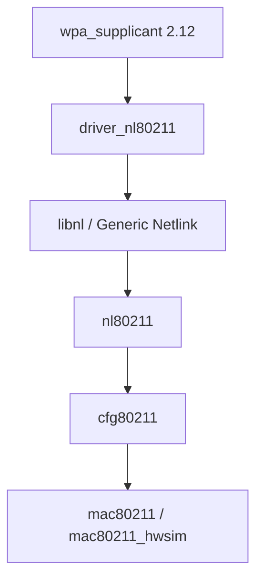
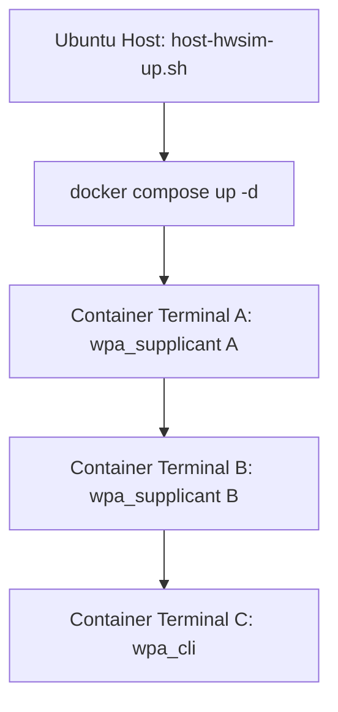
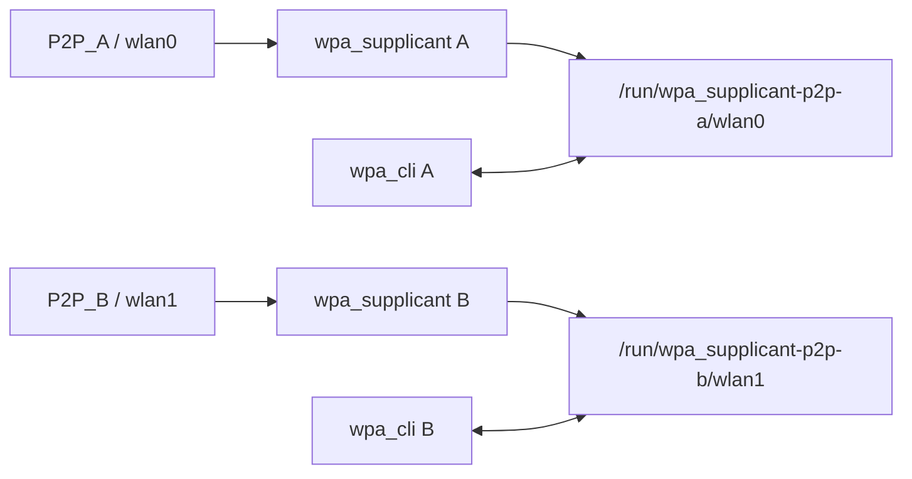

<meta name="referrer" content="no-referrer" />

# Wi-Fi Direct教程 01：在 Ubuntu 搭建双 mac80211_hwsim + wpa_supplicant 2.12

> 摘要：Ubuntu Host 提供双 mac80211_hwsim radio，Docker 固化 wpa_supplicant 2.12 源码、构建依赖和 F12/F5 调试环境，并说明 nl80211/Netlink 边界。

[TOC]

实验环境固定分成两层：Ubuntu Host 负责 Linux kernel 与 `mac80211_hwsim`，Docker 负责 `wpa_supplicant 2.12` userspace、源码、编译依赖和调试工具。本文固定使用下面的工程路径：

```text
Ubuntu Host: /home/wdfk/share/wifi-direct
Container:   /workspace
```

```text
Ubuntu x86 VM
│
├── Linux kernel
│   └── mac80211_hwsim radios=2
│       ├── virtual radio A -> WLAN interface A
│       └── virtual radio B -> WLAN interface B
│
└── Docker
    └── wifi-direct-dev
        ├── wpa_supplicant 2.12 source
        ├── wpa_supplicant 2.12 Debug binary
        ├── wpa_cli 2.12
        ├── iw / ip / tcpdump
        ├── GDB / gdbserver
        ├── compile_commands.json
        └── VS Code Dev Containers（推荐）
```

`mac80211_hwsim` 是 Linux kernel module。Linux Wireless 官方文档将它定义为用于模拟 IEEE 802.11 radio 的内核模块，并提供 `radios` 参数控制虚拟 radio 数量。[S1](#source-s1)Docker Image 不携带一个脱离 Host kernel 独立工作的 `mac80211_hwsim.ko`；Container 只通过 Host network namespace 使用 Host 已经创建好的虚拟无线接口。

这样既保留了 hwsim 对 Linux 内核的真实依赖，又能把容易产生版本差异的 `wpa_supplicant 2.12`、依赖、源码、Debug symbols 和 VS Code 配置固定下来。

<a id="idx-project"></a>
## 1. 工程结构与固定路径

工程在 Ubuntu Host 上固定放在：

```text
/home/wdfk/share/wifi-direct
```

终端提示符通常类似：

```text
wdfk@wdfk-ubuntu24:~/share/wifi-direct$
```

其中 `~` 代表当前用户 home，即 `/home/wdfk`，因此 `~/share/wifi-direct` 与 `/home/wdfk/share/wifi-direct` 是同一个目录。

Compose 把整个工程 bind mount 到 Container：

```text
Host:      /home/wdfk/share/wifi-direct
             |
             | bind mount
             v
Container: /workspace
```

工程结构如下：

```text
wifi-direct/
├── Dockerfile
├── compose.yaml
├── .env.example
├── README.md
│
├── scripts/
│   └── host-hwsim-up.sh
│
├── .devcontainer/
│   └── devcontainer.json
│
├── .vscode/
│   ├── c_cpp_properties.json
│   ├── launch.json
│   └── settings.json
│
├── config/
│   ├── p2p-a.conf
│   └── p2p-b.conf
│
├── .github/
│   └── workflows/
│       ├── ci.yml
│       ├── deploy-pages.yml
│       └── publish-image.yml
│
├── mkdocs.yml
├── requirements-docs.txt
│
└── docs/
    ├── index.md
    └── Wi-Fi_Direct教程_01_在Ubuntu搭建双mac80211_hwsim_wpa_supplicant_2.12.md
```

`wpa_supplicant 2.12` 源码直接构建进 Image，固定位置为。上游官方发布页当前也将 2.12 列为 release 版本。[S3](#source-s3)

```text
/opt/wifi-direct/src/wpa_supplicant-2.12
```

Debug binary 固定为：

```text
/usr/local/bin/wpa_supplicant-2.12
```

源码、Debug binary 与 `compile_commands.json` 来自同一次 Image build，后续 F12 和 F5 因此都针对同一份 2.12 源码。

<a id="idx-hwsim"></a>
## 2. 在 Ubuntu Host 创建两个 hwsim radio

以下命令都在 Ubuntu VM 的 **Host Terminal** 执行，不在 Container 中执行。

先进入固定工程目录：

```bash
cd /home/wdfk/share/wifi-direct
```

`cd` 是 change directory，用于切换当前工作目录。后续 `docker compose` 会默认读取当前目录里的 `compose.yaml`，因此先进入工程根目录。

日常复现实验时，不需要每次重新手敲 `modinfo` / `modprobe`。项目现在提供 Host-only 脚本：

```bash
./scripts/host-hwsim-up.sh
```

它负责检查当前 kernel 是否提供 `mac80211_hwsim`、必要时以 `radios=2` 加载 module，并确认 `iw dev` 至少能看到两个无线 interface。**这个脚本必须在 Ubuntu Host 执行，不能在 Container 中执行。** 后面的 2.1～2.3 仍保留手工命令，是为了把脚本背后的 kernel module 生命周期讲清楚。

### 2.1 用 modinfo 确认 kernel 是否提供 mac80211_hwsim

执行：

```bash
modinfo mac80211_hwsim
```

`modinfo` 是 module information，用于查看一个 Linux kernel module 的元信息，例如：

```text
模块文件路径
license
作者
依赖
支持的参数
```

它只是查询，不会把 module 加载进 kernel。

这里执行 `modinfo mac80211_hwsim` 的目的只有一个：确认当前 Ubuntu kernel 对应的模块目录中确实存在 `mac80211_hwsim`。

如果输出中能看到类似：

```text
filename: .../mac80211_hwsim.ko...
```

即可继续。

### 2.2 用 modprobe 加载 module 并创建两个虚拟 radio

执行：

```bash
sudo modprobe mac80211_hwsim radios=2
```

这条命令拆开看：

| 部分 | 含义 |
|---|---|
| `sudo` | 以管理员权限执行，因为加载 kernel module 会修改正在运行的 Linux kernel 状态 |
| `modprobe` | 加载 Linux kernel module，并自动处理它声明的模块依赖 |
| `mac80211_hwsim` | 要加载的无线仿真 module |
| `radios=2` | 传给 module 的参数，请求创建两个虚拟 IEEE 802.11 radio |

这一步真正发生在 **Ubuntu Host kernel**：

```text
sudo modprobe mac80211_hwsim radios=2
                    |
                    v
              Linux kernel
                    |
                    v
            mac80211_hwsim
             /            \
        virtual radio A  virtual radio B
```

Docker 此时还没有参与。

### 2.3 确认 module 已经实际加载

执行：

```bash
lsmod | grep '^mac80211_hwsim'
```

其中：

- `lsmod`：列出当前已经加载进 kernel 的 modules；
- `|`：shell pipe，把左侧命令输出交给右侧；
- `grep '^mac80211_hwsim'`：只保留以 `mac80211_hwsim` 开头的行。

`modinfo` 回答“系统有没有这个 module”，`lsmod` 回答“这个 module 现在有没有真正加载”。两个命令不要混淆。

还可以直接查看 kernel 注册的无线 PHY：

```bash
ls -1 /sys/class/ieee80211
```

正常情况下应出现两个 `phy` 目录，例如：

```text
phy0
phy1
```

如果模块已经以其它参数加载，需要重新创建两个 radio，应先停止占用测试 interface 的进程，然后执行：

```bash
sudo modprobe -r mac80211_hwsim
sudo modprobe mac80211_hwsim radios=2
```

`modprobe -r` 中的 `-r` 表示 remove，即卸载 module。卸载会删除该 module 创建的虚拟 radio/interface，因此不要在实验进程仍然占用它们时直接执行。

从此处开始固定边界：

```text
Ubuntu Host:
    modinfo
    modprobe / modprobe -r
    mac80211_hwsim 生命周期

Docker Container:
    wpa_supplicant / wpa_cli / iw / tcpdump / GDB
    不执行 modprobe
    不挂载 /lib/modules
    不拥有 SYS_MODULE
```

如果 `modinfo mac80211_hwsim` 提示 module 不存在，应先解决当前 Host kernel 对应模块缺失问题，再继续 Docker 环境。

### 2.4 后续每次实验统一用 Host 脚本恢复 hwsim

VM 重启、Host 重启或主动执行 `modprobe -r mac80211_hwsim` 后，hwsim radio 会消失。重新 build/recreate Docker **不会**把它们创建回来，因为 module 生命周期属于 Host kernel。

实验统一把下面命令作为前置步骤：

```bash
cd /home/wdfk/share/wifi-direct
./scripts/host-hwsim-up.sh
```

正常情况下脚本会输出当前可见的 WLAN interface，并以 `ready` 结束。如果 module 已经以其它 `radios` 数量加载，脚本不会贸然卸载正在使用的 module，而是提示先停止相关 `wpa_supplicant`，再显式执行：

```bash
./scripts/host-hwsim-up.sh --reload
```

这样可以把“恢复 Host radio”固化为一条命令，同时保留 Host/Container 权限边界。

<a id="idx-netlink"></a>
## 3. 为什么 wpa_supplicant 需要通过 Linux Netlink 子系统通信

Dockerfile 中会安装：

```text
libnl-3-dev
libnl-genl-3-dev
```

启动 `wpa_supplicant` 时还会显式使用：

```bash
-Dnl80211
```

这三处配置都来自同一个 Linux 无线控制边界。

### 3.1 wpa_supplicant 在 userspace，Wi-Fi driver 在 kernel

`wpa_supplicant` 是 userspace daemon。真正管理无线硬件或虚拟 radio 的 `cfg80211`、`mac80211` 和 driver 位于 Linux kernel。

因此 userspace 中的 `wpa_supplicant` 不能像普通 C 函数那样直接调用 kernel 内部函数：

```text
错误理解：

wpa_supplicant
    -> 直接调用 cfg80211 某个 C 函数
```

userspace 和 kernel 之间必须经过 Linux 提供的用户态 ABI/API 边界。

现代 Linux 无线配置使用的核心边界就是：

```text
Netlink
  + Generic Netlink
      + nl80211 family
```

Linux kernel 文档把 Netlink 描述为 userspace 与 kernel 双向交换结构化消息的一套 socket 机制；`nl80211` 则是 Linux 802.11 wireless subsystem 暴露给 userspace 的 Generic Netlink family。`cfg80211` 在 kernel 内把这个统一接口继续连接到 `mac80211` 或具体 wireless driver。[S2](#source-s2)

### 3.2 Wi-Fi Direct 为什么尤其需要这条控制路径

`wpa_supplicant` 需要 kernel/driver 执行大量无法靠普通应用 socket 完成的无线管理动作，例如：

```text
扫描无线环境
切换/选择信道
remain-on-channel
发送/接收 management frame
创建或管理无线 interface
接收异步无线事件
```

这些动作最终都需要从 userspace 进入 Linux wireless subsystem。

本系列会逐步看到下面的真实分层：



在当前 hwsim 实验中，最下层不是实体 Wi-Fi 芯片，而是：

```text
mac80211_hwsim
```

因此这套环境仍然能保留非常关键的一段真实 Linux 无线控制链。

### 3.3 Netlink、nl80211、libnl 三个名字不要混在一起

可以先这样记：

| 名称 | 当前文章中的定位 |
|---|---|
| `Netlink` | Linux userspace 与 kernel 交换结构化消息的 socket 机制 |
| `Generic Netlink` | Netlink 上用于注册和组织不同 kernel family 的通用框架 |
| `nl80211` | Linux 802.11 无线控制使用的 Generic Netlink family |
| `libnl` | userspace C library，帮助程序创建、发送、解析 Netlink/Generic Netlink 消息 |
| `driver_nl80211` | wpa_supplicant 内部对 Linux nl80211 接口的 driver backend |

所以 Dockerfile 安装 `libnl-3-dev` / `libnl-genl-3-dev`，不是因为“Wi-Fi Direct 协议本身依赖 libnl”，而是因为当前 Linux 平台上的 `wpa_supplicant` 需要通过 `driver_nl80211` 使用 Linux 的 nl80211/Generic Netlink 控制接口。

当前只需要建立 userspace、nl80211/cfg80211 与 driver 之间的边界。

<a id="idx-dockerfile"></a>
## 4. Dockerfile 固化 wpa_supplicant 2.12 与 Debug 环境

### 4.1 apt-get update 和 apt-get install 分别做什么

下面两件事含义不同：

```text
apt-get update
    -> 下载/刷新 Ubuntu 软件源的 package index
    -> 不等于升级系统，也不负责安装下面这些工具

apt-get install ...
    -> 根据刚刷新的 index 真正安装 package
```

`-y` 表示自动回答安装确认；`--no-install-recommends` 表示只安装必需依赖，不额外拉入大量推荐软件。

构建最后执行：

```bash
rm -rf /var/lib/apt/lists/*
```

删除只在 build 阶段使用的 APT package index，减少 Docker Image layer 体积。

### 4.2 Image 中安装了哪些工具

| Package | 作用 | 本项目为什么需要 |
|---|---|---|
| `build-essential` | GCC/G++、make 等基础编译工具集合 | 编译 `wpa_supplicant 2.12` |
| `pkg-config` | 查询开发库的 include/lib 编译参数 | 构建时定位 libnl、OpenSSL 等依赖 |
| `libnl-3-dev` | libnl 核心 Netlink 开发头文件/库 | `driver_nl80211` 构建所需的 userspace Netlink API |
| `libnl-genl-3-dev` | libnl Generic Netlink 开发库 | `nl80211` 属于 Generic Netlink family |
| `libssl-dev` | OpenSSL 开发头文件/库 | wpa_supplicant 的加密/认证相关实现依赖 |
| `libreadline-dev` | GNU Readline 开发库 | 改善 `wpa_cli` 交互式命令编辑 |
| `iw` | Linux nl80211 无线管理工具 | 查看 `phy`、interface、无线能力和事件 |
| `iproute2` | 提供 `ip` 等现代 Linux 网络工具 | 查看 interface/address/route |
| `iputils-ping` | 提供 `ping` | 通用 IP 连通性验证 |
| `rfkill` | 查看/控制无线设备 block 状态 | 排查 radio 被 soft/hard block |
| `tcpdump` | 抓包工具 | 观察网络数据包 |
| `gdb` | GNU Debugger | VS Code F5 源码调试 |
| `gdbserver` | GDB 远程调试端 | 为后续远程/分离式调试保留能力 |
| `bear` | 记录真实 compiler invocation | 生成 `compile_commands.json`，供 F12/IntelliSense 使用 |
| `git` | Git 客户端 | 对照 upstream、commit 和源码历史 |
| `less` | 分页查看长文本 | 查看日志和源码输出 |
| `vim` | Terminal 编辑器 | 临时查看/修改配置 |
| `procps` | 提供 `ps`、`pgrep` 等 | 检查 wpa_supplicant 进程 |
| `sudo` | 受控提权 | Container 内执行需要管理员权限的无线/GDB 操作 |
| `curl` | HTTP/HTTPS 下载 | 资料获取和网络调试；wpa_supplicant 源码由 `git clone` 获取 |
| `ca-certificates` | HTTPS CA 根证书 | 校验 `git clone https://git.w1.fi/hostap.git` 等 HTTPS 连接证书 |

其中最容易误解的是两个 libnl package：它们不是“网络基础知识练习工具”，而是 Linux `driver_nl80211` userspace 构建链的一部分。原因见上一节。

<a id="idx-compose"></a>
## 5. Compose 连接 Host hwsim 与 Docker userspace

当前 `compose.yaml`：

这里最关键的是 `network_mode: host`。Docker 官方文档说明 host network mode 让容器共享主机网络命名空间而不获得独立网络栈。[S4](#source-s4)

`mac80211_hwsim` 在 Host kernel 中创建 interface；如果 Container 使用默认独立 network namespace，Container 通常只看到自己的 Docker veth/lo，而不是 Host 上那组测试 WLAN interface。

设置：

```yaml
network_mode: host
```

后，实验 Container 与 Host 共用 network namespace，所以 Container 内：

```bash
iw dev
```

才能看到 Host hwsim 创建的 interface，并由 `wpa_supplicant -Dnl80211` 对它们执行无线控制操作。

三个 capability 的用途也不同：

```text
NET_ADMIN
    -> 网络/无线管理操作，例如需要管理权限的 nl80211 command

NET_RAW
    -> raw packet / tcpdump 等实验能力

SYS_PTRACE
    -> GDB ptrace 调试进程
```

这&#x91CC;**没有**：

```text
SYS_MODULE
/lib/modules bind mount
```

因为 Container 不负责加载 Host kernel module。

## 6. 构建并启动 Container

所有命令重新回到 Ubuntu Host，并确保当前目录是：

```bash
cd /home/wdfk/share/wifi-direct
```

### 6.1 生成 .env

执行：

```bash
printf 'LOCAL_UID=%s\nLOCAL_GID=%s\nWIFI_DIRECT_IMAGE=wifi-direct-lab:2.12\nP2P_A=wlan0\nP2P_B=wlan1\n' \
    "$(id -u)" "$(id -g)" > .env
```

这条命令把两类参数写入 Compose 自动读取的 `.env`：

- `LOCAL_UID` / `LOCAL_GID`：让 Container 中 `dev` 用户尽量与 Host 用户身份一致；
- `WIFI_DIRECT_IMAGE`：固定本地开发 Image 名；
- `P2P_A` / `P2P_B`：为实验命令提供稳定的逻辑接口变量，默认分别为 `wlan0` / `wlan1`。

查看：

```bash
cat .env
```

例如：

```text
LOCAL_UID=1000
LOCAL_GID=1000
WIFI_DIRECT_IMAGE=wifi-direct-lab:2.12
P2P_A=wlan0
P2P_B=wlan1
```

这里需要区分“变量名”和“真实 WLAN interface 名”。Compose 只是把 `P2P_A`、`P2P_B` 注入 Container，并不会把 Linux kernel 中的网卡强制改名为 `wlan0`、`wlan1`。如果后面的 `iw dev` 实际显示其他名称，修改 `.env` 中这两项，然后重新创建 Container：

```bash
docker compose up -d --force-recreate
```

### 6.2 先展开 Compose 配置

```bash
docker compose config
```

`docker compose config` 不启动 Container，它会读取：

```text
compose.yaml
+.env
```

然后输出变量替换后的最终 Compose 配置。这里可以提前确认 UID/GID、Image 名和 `network_mode: host` 是否符合预期。

### 6.3 构建 Image

首次准备环境时执行：

```bash
docker compose build
```

`docker compose build` 根据当前目录中的 Dockerfile 构建 `wifi-direct-lab:2.12` Image，但不会启动 Container。后续只有 Dockerfile 或构建参数发生变化时才需要重新构建。

构建成功后启动：

```bash
docker compose up -d
```

其中：

- `up`：创建并启动 Compose service；
- `-d`：detached，后台运行。

以后 Dockerfile 没有变化时，日常只需要 `docker compose up -d`。

### 6.4 检查 Container 状态

```bash
docker compose ps
```

应能看到 `wifi-direct-dev` 为 `Up`/`running` 状态。

进入 Container：

```bash
docker compose exec wifi-direct-dev bash
```

`exec` 表示在已经运行的 service Container 中再启动一个命令；这里启动的是交互式 Bash。

进入后先检查开发用户，确认 UID ：

```bash
id
```

应看到当前用户为 `dev`，UID/GID 与 `.env` 对应。

然后检查版本和调试产物：

```bash
wpa_supplicant-2.12 -v
wpa_cli-2.12 -v
gdb --version | head -n 1
iw --version

printf '%s\n' "$WPA_SUPPLICANT_SRC"
test -f "$WPA_SUPPLICANT_SRC/wpa_supplicant/main.c" && echo 'source: OK'
test -f "$WPA_SUPPLICANT_SRC/wpa_supplicant/compile_commands.json" && echo 'compile_commands: OK'
test -x "$WPA_SUPPLICANT_BIN" && echo 'binary: OK'
readelf -S "$WPA_SUPPLICANT_BIN" | grep -E '\.debug_(info|line)'
```

这里：

- `test -f`：检查普通文件是否存在；
- `test -x`：检查文件存在且具有 executable 权限；
- `&&`：只有左侧检查成功才执行右侧 `echo`；
- `readelf -S`：列 ELF section；
- `grep`：筛选 `.debug_info`、`.debug_line` 等 DWARF section。

`wpa_supplicant` 应报告：

```text
wpa_supplicant v2.12
```

看到 `.debug_info` / `.debug_line` 后，说明当前 binary 保留了源码级 GDB 调试信息。

## 7. 从 Container 验证两个 hwsim radio

仍在 Container 中执行：

```bash
iw phy
iw dev
```

`iw` 是 Linux 无线配置/查询工具，它本身也是 nl80211 的 userspace client。

两条命令分别关注不同对象：

```text
iw phy
    -> 查看 wireless PHY / wiphy 能力
    -> 更接近“radio/无线硬件能力”这一层

iw dev
    -> 查看当前创建出的 wireless interface
    -> 后面 wpa_supplicant 的 -i 参数就使用这里看到的 interface 名
```

正常情况下应看到两个 `Wiphy` 与对应 interface，例如：

```text
phy#1
    Interface wlan1

phy#0
    Interface wlan0
```

实际 interface 名可能不是 `wlan0` / `wlan1`，后续始终以 `iw dev` 输出为准。

这一步同时验证了两件事：

```text
Host kernel
    mac80211_hwsim radios=2
        |
        +-- radio/interface A
        +-- radio/interface B

Container userspace
    network_mode: host
        |
        +-- iw 通过 nl80211 能看到同一组 interface
```

如果 Host 已加载 module，但 Container 中 `iw dev` 看不到同一组 interface，先回到 Host 执行：

```bash
docker compose config
```

确认确实展开为：

```yaml
network_mode: host
```

不要为了解决“Container 看不到 interface”而在 Container 中再次 `modprobe mac80211_hwsim`。

<a id="idx-supplicant"></a>
## 8. 每次实验都必须先启动两个独立 wpa_supplicant 2.12 实例

这里是阶段 0/1 最容易遗漏的运行时步骤：**Docker Container 处于 `Up` 并不代表 A/B 两个 `wpa_supplicant` 已经运行。** `compose.yaml` 的 `command` 只是 `sleep infinity`，因此每次重启/重建 Container 后，都必须重新打开 Terminal A、B 启动两个 daemon，再在 Terminal C 使用 `wpa_cli`。

固定顺序如下：



Compose 已经把 `P2P_A`、`P2P_B` 注入 Container，所以进入任意 Container Terminal 后都可以直接使用，不需要重复执行 `export`：

```bash
printf 'P2P_A=%s\nP2P_B=%s\n' "$P2P_A" "$P2P_B"
iw dev
```

默认应看到：

```text
P2P_A=wlan0
P2P_B=wlan1
```

如果 `iw dev` 中的实际 interface 名不同，回到上一节修改 `.env`，再重新创建 Container。后续终端命令统一使用 `$P2P_A` / `$P2P_B`，避免在教程命令中重复写死 interface 名。

先确认两个变量指向的 interface 确实存在：

```bash
iw dev "$P2P_A" info
iw dev "$P2P_B" info
```

### 8.1 Terminal A：启动 A 端 wpa_supplicant

打开第一个 Container Terminal，执行：

```bash
sudo wpa_supplicant-2.12 \
    -Dnl80211 \
    -i "$P2P_A" \
    -c /workspace/config/p2p-a.conf \
    -dd \
    -t
```

这条命令的整体含义是：**启动一个前台运行的 `wpa_supplicant 2.12` 进程，让它只管理 A 端 WLAN interface，并读取 A 端独立配置，同时输出详细带时间戳日志。**

| 参数 | 当前实验中的作用 |
|---|---|
| `sudo` | 本实验让 `wpa_supplicant` 以 root 身份执行，确保 nl80211 无线管理操作具备所需权限 |
| `wpa_supplicant-2.12` | 使用 Docker build 固定下来的 2.12 Debug binary，而不是 Ubuntu 系统自带的其他版本 |
| `-Dnl80211` | 选择 `driver_nl80211` backend，通过 Generic Netlink / `nl80211` 与 Linux wireless subsystem 通信 |
| `-i "$P2P_A"` | 让这个实例只绑定 A 端 interface，默认就是 `wlan0` |
| `-c /workspace/config/p2p-a.conf` | 读取 A 端配置；其中 `ctrl_interface=/run/wpa_supplicant-p2p-a` 决定 control socket 目录 |
| `-dd` | 打开较详细的 debug 日志，后续源码跟踪时用于对应函数和状态变化 |
| `-t` | 在 debug 日志前加入时间戳，方便与另一端日志和后续抓包按时间对齐 |

这里最容易混淆的是 `-Dnl80211`：它不是一种 Wi-Fi Direct 协议，而是 Linux 平台上 `wpa_supplicant` 控制无线内核子系统时使用的 driver backend。

命令启动后 Terminal A 会一直被这个前台进程占用，这是预期行为。不要关闭 Terminal A；后续命令在新的 Terminal 中执行。

### 8.2 Terminal B：启动 B 端 wpa_supplicant

打开第二个 Container Terminal，执行：

```bash
sudo wpa_supplicant-2.12 \
    -Dnl80211 \
    -i "$P2P_B" \
    -c /workspace/config/p2p-b.conf \
    -dd \
    -t
```

它与 A 端使用同一个 binary 和同一个 `nl80211` backend，但绑定的是 `$P2P_B`，读取的是 `/workspace/config/p2p-b.conf`。两个进程因此拥有各自的 interface、配置和 control socket 目录：



这张图只表达 control interface 隔离关系：A 端 `wpa_cli` 不应连到 B 端 socket，B 端也一样。无线帧如何在两个 hwsim radio 之间交互属于后续 P2P 实验，不在这里展开。

### 8.3 第三个 Terminal：用 wpa_cli 验证 control interface

打开第三个 Container Terminal，先验证 A：

```bash
sudo wpa_cli-2.12 \
    -p /run/wpa_supplicant-p2p-a \
    -i "$P2P_A" \
    ping
```

这条命令不是 ICMP 网络 `ping`。它是在 **`wpa_cli` control interface** 上向 A 端 `wpa_supplicant` 发送 `PING` 命令，用于确认 CLI 与 daemon 之间的本地控制通道是否可用。

| 参数 | 当前实验中的作用 |
|---|---|
| `sudo` | 让 `wpa_cli` 可以访问由 root `wpa_supplicant` 创建的 UNIX control socket；这是本实验的权限处理，不是 P2P 协议要求 |
| `wpa_cli-2.12` | 使用与 `wpa_supplicant-2.12` 同一源码版本构建的 CLI |
| `-p /run/wpa_supplicant-p2p-a` | 指定 A 端 control socket 所在目录 |
| `-i "$P2P_A"` | 指定目录下对应的 interface 名；默认组合成 `/run/wpa_supplicant-p2p-a/wlan0` |
| `ping` | 发送 control command `PING`，用于验证 daemon 的 request/reply 通路 |

成功时返回：

```text
PONG
```

`PONG` 只能证明：

```text
wpa_cli A
    -> UNIX control socket
    -> wpa_supplicant A
    -> reply PONG
```

它还不能证明后续 Wi-Fi Direct 协议流程已经工作。

再验证 B：

```bash
sudo wpa_cli-2.12 \
    -p /run/wpa_supplicant-p2p-b \
    -i "$P2P_B" \
    ping
```

同样应返回：

```text
PONG
```

两个实例都返回 `PONG` 后，可以确认阶段 0 需要的两条独立 control interface 已经建立。

这里同时存在两类不同的通信边界：

```text
wpa_cli
    -> UNIX control socket
    -> wpa_supplicant

wpa_supplicant
    -> driver_nl80211
    -> Generic Netlink / nl80211
    -> Linux kernel wireless subsystem
```

第一条是“用户态工具控制 `wpa_supplicant` daemon”，第二条是“`wpa_supplicant` 控制 Linux wireless subsystem”。阶段 1 执行 `p2p_find` 时，首先研究第一条控制路径。

<a id="idx-devcontainer"></a>
## 9. 为什么推荐使用 Dev Containers 阅读 2.12 源码

`F12` 本身并不要求必须运行在 Container 中。只要 VS Code C/C++ 扩展能够同时访问源码和正确的编译信息，在 Ubuntu Host 上直接打开源码同样可以完成跳转。

本工程仍然推荐选择 **Reopen in Container**，原因不是 F12 依赖 Docker，而是当前 `wpa_supplicant 2.12` 的源码、编译数据库、系统头文件、Debug binary 和 GDB 本来就都固定在 Docker Image 中。VS Code Dev Containers 的官方说明也明确了 extension host、terminal 与开发工具可以运行在容器环境中。[S5](#source-s5)

当前文件位置是：

```text
Ubuntu Host
└── /home/wdfk/share/wifi-direct
        └── bind mount -> Container /workspace

Docker Container
├── /workspace
├── /opt/wifi-direct/src/wpa_supplicant-2.12
│   └── wpa_supplicant/compile_commands.json
├── /usr/include/...
├── /usr/local/bin/wpa_supplicant-2.12
└── /usr/bin/gdb
```

Host 上的 `/home/wdfk/share/wifi-direct` 只对应 Container 的 `/workspace`。Docker Image 内的：

```text
/opt/wifi-direct/src/wpa_supplicant-2.12
```

并不是 Host 文件系统中的普通目录，因此 Host 上直接运行的 VS Code C/C++ 扩展默认看不到这棵源码树。

另外，Bear 在 Image build 时生成的 `compile_commands.json` 记录的是实际编译环境，其中的源码路径、include path 和 compiler 参数都以 Container 文件系统为基准。F12/IntelliSense 真正需要的不是“有一份 C 文件”这么简单，而是：

```text
source
+ compile_commands.json
+ include path
+ defines
+ compiler context
```

因此让 C/C++ 扩展进入同一个 Container，可以直接复用真实构建环境，不需要再维护第二份路径映射。

### 9.1 Reopen in Container 实际移动了什么

VS Code 图形界面仍然运行在 Ubuntu Desktop。`Reopen in Container` 主要把 workspace 的开发后端放到 Container 中：

```text
Ubuntu Host
└── VS Code UI
        |
        | Dev Containers
        v
Docker Container
├── VS Code Server / Extension Host
├── C/C++ extension
├── Terminal
├── wpa_supplicant 2.12 source
├── compile_commands.json
└── GDB / Debug binary
```

因此这里所说的“在 Container 里阅读源码”，不是在 Container 里运行一个新的图形化 VS Code，而是让 VS Code 的 C/C++ 扩展、终端和调试器直接工作在目标开发环境中。

这样 F12 时使用的路径就是实际构建时的路径：

```text
/opt/wifi-direct/src/wpa_supplicant-2.12/...
```

不会出现 Host 路径和 Container 路径各维护一份的问题。

### 9.2 不使用 Dev Containers 能不能在 Host 上 F12

可以，但需要额外准备。

一种做法是把 `wpa_supplicant 2.12` 源码复制到 Host，再让 Host 上的 C/C++ 扩展读取这份源码。但此时 Docker Image 中已经存在一份实际参与编译的源码，Host 又多出一份源码副本，两者需要人为保证一致。

如果还希望使用 Bear 生成的 `compile_commands.json`，还需要处理其中的 Container 绝对路径，例如：

```text
/opt/wifi-direct/src/wpa_supplicant-2.12/...
```

这些路径在 Host 上并不存在，需要重写路径或改成另一套 `includePath` / `defines` 配置。

所以两种方式的区别可以概括为：

| 方式 | 能否 F12 | 额外工作 |
|---|---|---|
| VS Code Host 直接打开源码 | 可以 | 需要把源码放到 Host，并维护编译数据库或 include/define 路径 |
| Reopen in Container | 可以 | 直接使用 Image 中已经构建过的源码和 `compile_commands.json` |

本系列选择第二种方式，目标是让“正在阅读的源码”“实际编译的源码”“F5 调试的 binary”始终属于同一次 Image build。

### 9.3 使用 Dev Containers 与 F12

VS Code 安装：

```text
Dev Containers
C/C++
```

在 Ubuntu Host 上打开：

```text
/home/wdfk/share/wifi-direct
```

从左下角 Remote 指示器选择：

```text
Reopen in Container
```

`.devcontainer/devcontainer.json` 复用工程根目录的 `compose.yaml`：

| 字段 | 作用 |
|---|---|
| `dockerComposeFile` | 告诉 Dev Containers 使用哪个 Compose 文件 |
| `service` | 指定进入 `wifi-direct-dev` service |
| `workspaceFolder` | 在 Container 中把 `/workspace` 作为工程工作目录 |
| `shutdownAction: none` | 关闭 VS Code 窗口时不自动停止实验 Container |
| `remoteUser: dev` | VS Code Extension Host 使用 `dev` 用户 |
| `C_Cpp.default.compileCommands` | 让 C/C++ 扩展读取 Bear 生成的真实编译数据库 |

C/C++ 扩展读取：

```text
/opt/wifi-direct/src/wpa_supplicant-2.12/wpa_supplicant/compile_commands.json
```

打开：

```text
/opt/wifi-direct/src/wpa_supplicant-2.12/wpa_supplicant/main.c
```

在 `main.c` 中找到：

```c
wpa_supplicant_init(...)
```

把光标放到 `wpa_supplicant_init` 上按 `F12`，VS Code 应跳转到同一棵 2.12 source tree 中的定义。

如果跳转没有建立，先在 Dev Container Terminal 检查：

```bash
test -f /opt/wifi-direct/src/wpa_supplicant-2.12/wpa_supplicant/compile_commands.json
```

然后执行：

```text
Ctrl+Shift+P
-> C/C++: Log Diagnostics
```

确认 `compileCommands` 指向：

```text
/opt/wifi-direct/src/wpa_supplicant-2.12/wpa_supplicant/compile_commands.json
```

### 9.4 Comment Translate 在 Dev Container 中如何使用

`.devcontainer/devcontainer.json` 已配置：

```text
intellsmi.comment-translate
```

同时默认设置：

```text
commentTranslate.targetLanguage = zh-CN
```

这里的 `customizations.vscode.extensions` 是项目级自动安装声明，但判断扩展是否可用时要看 **Container Extension Host 中实际安装结果**，不能只看配置文件。

进入 Dev Container 后先执行：

```bash
code --list-extensions | grep -E 'cpptools|comment-translate'
```

正常应看到：

```text
intellsmi.comment-translate
ms-vscode.cpptools
```

如果只有：

```text
ms-vscode.cpptools
```

说明当前 Dev Container 没有真正安装 Comment Translate。当前项目已经实际验证下面的命令可以在 Dev Container 中安装 `intellsmi.comment-translate` v3.1.0：

```bash
code --install-extension intellsmi.comment-translate --force
```

安装成功后重新确认：

```bash
code --list-extensions | grep -E 'cpptools|comment-translate'
```

因此本项目采用两层策略：

```text
正常路径：devcontainer.json 自动声明扩展
    ↓
进入 Container 后检查 code --list-extensions
    ↓
若 Comment Translate 缺失
    ↓
code --install-extension intellsmi.comment-translate --force
```

手工安装只作为当前 Container 的兜底，不替代 `devcontainer.json` 中的项目级声明。源码位于 Container 内时，扩展应安装在对应的 Container Extension Host 中，不需要把 Host 的扩展目录手工 mount 进 Docker。

如果 Host VS Code 已经装了 Comment Translate，也可以从 Extensions 视图的 `Local - Installed` 使用 **Install Local Extensions in Dev Container**；如果希望所有 Dev Container 都自动安装，可在 Host VS Code User Settings 中配置 `dev.containers.defaultExtensions`。

<a id="idx-gdb"></a>
## 10. 使用 F5 + GDB 调试同一份源码

F5 同样不是“只有 Dev Containers 才能做到”。本工程选择把 C/C++ 扩展、GDB、Debug binary 和源码统一放到 Dev Container 中，避免再维护一套 Host/Container source path 映射。

当前 `launch.json` 不再使用 `pipeTransport`，也不需要额外的 `gdb-sudo.sh` wrapper。调试权限被拆成两层：

```text
VS Code / C++ Extension
        |
        v
GDB (dev)
        |
        | 127.0.0.1:2345
        v
gdbserver (root)
        |
        v
wpa_supplicant-2.12
        |
        v
nl80211 / Host hwsim interface
```

普通 `dev` 用户运行 GDB；只有 `/usr/bin/gdbserver` 通过受限 `sudoers` 获得 root 身份。这样不需要让整个 VS Code Extension Host 以 root 运行，也不需要给 `dev` 配置 `NOPASSWD:ALL`。

F5 前先停止占用目标 interface 的手工 `wpa_supplicant` 实例。

在：

```text
/opt/wifi-direct/src/wpa_supplicant-2.12/wpa_supplicant/main.c
```

的 `main()` 设置断点。

打开 `Run and Debug`，只需要选择一份配置：

```text
wpa_supplicant 2.12 - P2P
```

按 `F5` 后，`launch.json` 会依次询问：

```text
1. 本次调试使用的 WLAN interface
2. 对应的 p2p-a.conf / p2p-b.conf
```

A/B 共用同一份 debug configuration，因此不需要维护两套几乎相同的 JSON。当前 `launch.json` 的 interface 选项仍以 `wlan0` / `wlan1` 作为阶段 0 默认值；如果 `.env` 中把 `P2P_A` / `P2P_B` 改成了其他真实 interface 名，也需要同步修改 `.vscode/launch.json` 中两个 `p2pInterface` 选项。

调试链路为：

```text
VS Code F5
  -> /usr/bin/gdb                    (dev)
  -> 127.0.0.1:2345
  -> sudo -n /usr/bin/gdbserver      (root)
  -> /usr/local/bin/wpa_supplicant-2.12
  -> -Dnl80211
  -> -i <interface>
  -> /workspace/config/p2p-*.conf
  -> Host hwsim interface
```

这里的 `sudo` 只用于启动 `gdbserver`。Container 仍然没有 `SYS_MODULE` capability，也不会在 Container 内加载 `mac80211_hwsim`。

程序能够停在源码断点后，说明下面几层已经对齐：

```text
F5
 -> GDB
 -> gdbserver
 -> Debug binary
 -> wpa_supplicant 2.12 source
```

之后可以直接在后续要阅读的 2.12 源码函数中设置断点。

## 11. 日常启动只需要两层操作

Host 重启后，先确认 hwsim module：

```bash
lsmod | grep '^mac80211_hwsim' || sudo modprobe mac80211_hwsim radios=2
```

这里的 `||` 是 shell 的“前一条失败才执行后一条”：如果 `grep` 没找到已加载的 `mac80211_hwsim`，才执行 `modprobe`。因此它适合作为日常启动时的简写；第一次学习时仍建议分别执行 `modinfo`、`modprobe`、`lsmod`，看清每一步结果。

然后进入工程目录启动 Container：

```bash
cd /home/wdfk/share/wifi-direct
docker compose up -d
docker compose ps
docker compose exec wifi-direct-dev bash
```

这里 `up -d` 负责启动，`ps` 负责查看状态，`exec ... bash` 负责进入已经运行的开发 Container。

停止 userspace 环境：

```bash
docker compose down
```

如果同时需要清理虚拟 radio，再回到 Host 执行：

```bash
sudo modprobe -r mac80211_hwsim
```

这两个生命周期彼此独立：

```text
Docker down
    !=
卸载 mac80211_hwsim
```

Image 没有变化时，`wpa_supplicant 2.12`、源码、Debug symbols、GDB 和 `compile_commands.json` 都不会重新编译。

## 12. GitHub Actions：CI、GitHub Pages 与 Docker Image CD

工程把“验证”和“正式发布”拆成三条独立 workflow。Pages 自定义工作流和 Docker image 发布均可使用 GitHub 官方 Actions 工作流完成。[S6](#source-s6)

```text
.github/workflows/
├── ci.yml
├── deploy-pages.yml
└── publish-image.yml
```

`ci.yml` 在 Pull Request、push `main` 和手工触发时运行。它负责：

```text
Compose config validation
 -> MkDocs strict build
 -> Docker Image build
 -> wpa_supplicant/wpa_cli version check
 -> compile_commands.json check
 -> GDB/gdbserver check
 -> restricted sudo check
```

CI 只验证 Docker userspace。GitHub-hosted runner 不被当作本项目的双 hwsim 集成环境，因此 `mac80211_hwsim radios=2`、双 interface 和真实 P2P 行为仍由 Linux Host 集成实验验证。

`deploy-pages.yml` 在文档相关内容进入 `main` 后构建 MkDocs，并通过 GitHub 官方 Pages Actions 上传和部署 `site/` artifact。第一次启用时，需要在仓库设置中把 Pages Source 选择为：

```text
GitHub Actions
```

`publish-image.yml` 在 push `main`、`v*` tag 或允许的手工执行中发布 GHCR Image。发布前先构建本地 release Image 并执行 userspace 检查；只有检查通过后才登录 GHCR 并 push 已验证的 tags。

push `main` 时主要得到：

```text
ghcr.io/<owner>/<repository>:main
ghcr.io/<owner>/<repository>:sha-<commit>
```

创建例如 `v1.2.3` tag 时会得到版本 tag 与 `latest`：

```text
v1.2.3
1.2.3
1.2
1
latest
sha-<commit>
```

GHCR Image 可以包含：

```text
Ubuntu 24.04 userspace
wpa_supplicant 2.12 source
wpa_supplicant 2.12 Debug binary
wpa_cli 2.12
GDB / gdbserver
compile_commands.json
iw / ip / tcpdump
```

它不包含 Host kernel 和 `mac80211_hwsim.ko`。

发布后，把 `.env` 中的 Image 改为实际地址，例如：

```text
WIFI_DIRECT_IMAGE=ghcr.io/<owner>/<repository>:main
```

其他开发者只需要先在自己的 Ubuntu Linux Host 准备 hwsim：

```bash
sudo modprobe mac80211_hwsim radios=2
```

然后下载现成 userspace：

```bash
docker compose pull
docker compose up -d --no-build
```

`docker compose pull` 根据 `.env` / `compose.yaml` 中的 Image 地址下载已发布镜像；`--no-build` 明确禁止本地重新执行 Dockerfile，只使用已经拉取的 Image。

发布镜像固定使用 `1000:1000`。如果 Host 用户 UID/GID 不同，并且需要在 bind mount 的 `/workspace` 中修改文件，可以继续使用本地 `docker compose up -d --build`，让 Dockerfile 按 `.env` 中的 UID/GID 重建开发 Image。

## 13. 最终环境关系

最终环境固定为：

```text
Ubuntu Linux Host / VM
│
├── Linux kernel
│   ├── cfg80211
│   ├── mac80211
│   └── mac80211_hwsim radios=2
│       ├── virtual radio A -> interface A
│       └── virtual radio B -> interface B
│
└── Docker Engine
    └── wifi-direct-dev
        ├── wpa_supplicant 2.12 source
        ├── Debug wpa_supplicant 2.12
        ├── wpa_cli 2.12
        ├── GDB / gdbserver
        ├── compile_commands.json
        ├── wpa_supplicant process A
        └── wpa_supplicant process B
```

当前实验已经确认下面的运行结果：

```text
Host:
modprobe mac80211_hwsim radios=2

Container:
iw dev
 -> 两个 hwsim WLAN interface

wpa_cli A ping
 -> PONG

wpa_cli B ping
 -> PONG
```

F12/F5 属于下一步源码阅读与调试能力：F12 用于沿 2.12 源码跳转，F5 用于让 GDB 启动同一份 Debug binary。

最终环境边界固定为：Host 提供 Linux wireless kernel/hwsim，Docker 提供固定版本的 `wpa_supplicant 2.12` userspace、源码和调试环境。

## 关键源码索引

| 关键对象 / 符号 | 本文位置 | Git 源码 |
|---|---|---|
| `mac80211_hwsim` | [hwsim radio](#idx-hwsim) | [Linux Git](https://github.com/torvalds/linux/blob/master/drivers/net/wireless/virtual/mac80211_hwsim.c) |
| `nl80211` | [Netlink / nl80211](#idx-netlink) | [Linux Git](https://github.com/torvalds/linux/blob/master/net/wireless/nl80211.c) |
| `wpa_supplicant 2.12` | [2.12 构建基线](#idx-dockerfile) | [hostap 2.12](https://chromium.googlesource.com/chromiumos/third_party/hostap/+/refs/tags/hostap_2_12) |
| `wpa_supplicant` | [双实例启动](#idx-supplicant) | [hostap 2.12](https://chromium.googlesource.com/chromiumos/third_party/hostap/+/refs/tags/hostap_2_12/wpa_supplicant/main.c) |

## 资料来源

<a id="source-s1"></a>
### [S1] Linux mac80211_hwsim
- 来源：[Linux Git: mac80211_hwsim.c](https://github.com/torvalds/linux/blob/master/drivers/net/wireless/virtual/mac80211_hwsim.c)
- URL/文档：[Linux Wireless: mac80211_hwsim](https://wireless.docs.kernel.org/en/latest/en/users/drivers/mac80211_hwsim.html)
- 使用位置：第 2 节
- 支撑内容：`mac80211_hwsim` 虚拟 radio、`radios` 参数与测试用途。

<a id="source-s2"></a>
### [S2] Linux Netlink / cfg80211 / nl80211
- 来源：[Linux Git: nl80211.c](https://github.com/torvalds/linux/blob/master/net/wireless/nl80211.c)
- URL/文档：[Netlink intro](https://docs.kernel.org/userspace-api/netlink/intro.html)、[cfg80211](https://docs.kernel.org/driver-api/80211/cfg80211.html)、[nl80211](https://wireless.docs.kernel.org/en/latest/en/developers/documentation/nl80211.html)
- 使用位置：第 3 节
- 支撑内容：userspace 与 Linux wireless subsystem 之间的控制边界。

<a id="source-s3"></a>
### [S3] hostap 2.12 release Git tag
- 版本：[`hostap_2_12` / `831364bf02710ad09c2f27d3efa92abeeb5634c0`](https://chromium.googlesource.com/chromiumos/third_party/hostap/+/refs/tags/hostap_2_12)
- 来源：[canonical hostap.git](https://git.w1.fi/hostap.git)
- 使用位置：第 1、4、8～10 节
- 支撑内容：wpa_supplicant 2.12 源码/二进制/调试基线。

<a id="source-s4"></a>
### [S4] Docker Engine Host networking
- URL/文档：[Docker host network driver](https://docs.docker.com/engine/network/drivers/host/)
- 使用位置：第 5～7 节
- 支撑内容：host network mode 的网络栈语义。

<a id="source-s5"></a>
### [S5] Visual Studio Code Dev Containers / C++ Debugging
- URL/文档：[Dev Containers](https://code.visualstudio.com/docs/devcontainers/containers)、[C++ Debugging](https://code.visualstudio.com/docs/cpp/cpp-debug)
- 使用位置：第 9～10 节
- 支撑内容：容器内源码导航、extension host 与 C++/GDB 调试能力。

<a id="source-s6"></a>
### [S6] GitHub Actions 文档
- URL/文档：[GitHub Pages workflow](https://docs.github.com/en/pages/getting-started-with-github-pages/using-custom-workflows-with-github-pages)、[Publish Docker images](https://docs.github.com/en/actions/tutorials/publish-packages/publish-docker-images)
- 使用位置：第 12 节
- 支撑内容：Pages 自定义 workflow 与容器镜像发布。
