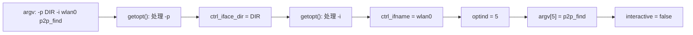
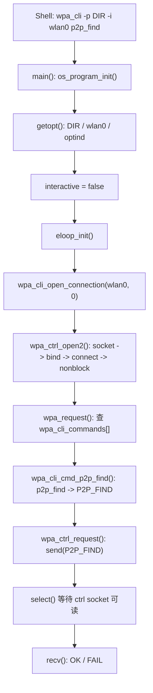

<meta name="referrer" content="no-referrer" />

# Wi-Fi Direct教程 02：从 wpa_cli main() 到 P2P_FIND——用源码注释追踪 CLI 控制命令发送

> 摘要：沿 wpa_supplicant 2.12 的 wpa_cli 实际执行路径，用连续源码片段和行内注释说明参数解析、eloop、UNIX datagram control socket、命令分发以及 P2P_FIND 的发送与同步回复。

[TOC]

上一篇已经完成双 `mac80211_hwsim` radio、双 `wpa_supplicant 2.12` 实例和独立 control interface。本篇只追踪下面这条命令在 **wpa_cli 进程内部**如何执行：

```bash
sudo wpa_cli-2.12 \
    -p /run/wpa_supplicant-p2p-a \
    -i wlan0 \
    p2p_find
```

目标是回答：

```text
Shell 输入 p2p_find
    ↓
wpa_cli 如何解析 -p / -i / p2p_find
    ↓
如何建立本地 control socket
    ↓
p2p_find 如何变成 P2P_FIND
    ↓
P2P_FIND 如何 send() 给 wpa_supplicant
    ↓
为什么最后能收到 OK / FAIL
```

本篇停止在：

```text
src/common/wpa_ctrl.c:wpa_ctrl_request()
    -> send()
    -> select()
    -> recv()
```

本文只分析 `wpa_cli` 进程内部的 CLI 解析、control socket client 和同步 request/reply 边界；server 进程内部不在本文展开。

源码基线固定为 wpa_supplicant 2.12；本文源码结论以同版本 `wpa_cli.c`、`wpa_ctrl.c`、`eloop.c` 为主要证据。[S1](#source-s1)

```text
wpa_supplicant 2.12
/opt/wifi-direct/src/wpa_supplicant-2.12
```

本文主要看：

| 文件 | 关注点 |
|---|---|
| `wpa_supplicant/wpa_cli.c` | `main()`、`wpa_cli_open_connection()`、`wpa_request()`、`wpa_cli_commands[]`、`wpa_cli_cmd_p2p_find()` |
| `src/common/wpa_ctrl.c` | `wpa_ctrl_open2()`、`wpa_ctrl_request()`、`wpa_ctrl_attach()`、`wpa_ctrl_detach()` |
| `src/utils/os_unix.c` | `os_program_init()`、`ANDROID`、`WPA_TRACE` |
| `src/utils/eloop.c` | `eloop_init()` 以及 select/poll/epoll/kqueue backend |
| `wpa_supplicant/Makefile`、`defconfig` | control interface 与 eloop 的编译期选择 |

---

<a id="idx-main"></a>
## 1. 从 main() 看起：Shell 参数怎样变成 wpa_cli 内部状态

当前 Shell 命令进入进程以后，可以先把参数理解为：

```text
argc = 6

argv[0] = "wpa_cli-2.12"
argv[1] = "-p"
argv[2] = "/run/wpa_supplicant-p2p-a"
argv[3] = "-i"
argv[4] = "wlan0"
argv[5] = "p2p_find"
argv[6] = NULL
```

`argc` 不包含最后的 `NULL`。

### 1.1 main() 入口先调用 os_program_init()

`wpa_cli.c` 中与当前主线直接相关的入口片段就是：

```c
/* [解读]
 * main() 先做 OS 相关初始化。
 * 返回非 0 时直接结束；成功后才继续参数解析和 control connection 初始化。
 */
if (os_program_init())
    return -1;
```

随后进入 `src/utils/os_unix.c:os_program_init()`。当前 Ubuntu 构建没有定义 `ANDROID`，因此预处理之后，和本次执行路径直接相关的函数可以完整地读成：

```c
int os_program_init(void)
{
    unsigned int seed;

    /* [解读]
     * 从 OS 获取随机数据，用它初始化 libc random() 的 seed。
     * 这是当前 Ubuntu 路径真实执行的主体。
     */
    if (os_get_random((unsigned char *) &seed, sizeof(seed)) == 0)
        srandom(seed);

    return 0;
}
```

原始源码在随机种子初始化之前还包着一个 `#ifdef ANDROID` 平台分支。阅读它时可以直接按下面的预处理结构理解：

```c
#ifdef ANDROID
    /* [解读]
     * 仅 Android 构建保留：处理 Android 用户组、UID/GID 与 capability。
     * 普通 Ubuntu 构建在预处理阶段会把整个分支删除。
     */
#endif /* ANDROID */
```

这里要把 `ANDROID` 理解成“**平台编译开关**”：

- Ubuntu/Linux 普通构建：没有定义，Android 专用代码在预处理阶段就消失；
- Android 构建：会包含 Android 用户组、UID/GID、capability 等平台适配；
- 它不是“当前是不是手机”的运行时判断，也不是 Wi-Fi Direct 协议本身的一部分。

Android 分支里出现 `PR_SET_KEEPCAPS`、`setuid()`、`setgid()`、`CAP_NET_ADMIN`、`CAP_NET_RAW`，核心目的不是实现 P2P，而是让进程降低普通 root 权限后仍保留完成网络管理所需的有限 capability。

### 1.2 WPA_TRACE 是什么

`os_unix.c`、`eloop.c` 中还会看到由 `WPA_TRACE` 包住的调试代码。阅读结构可以理解为：

```c
#ifdef WPA_TRACE
    /* [解读]
     * 只有编译时启用 WPA_TRACE，开发调试追踪代码才会进入 binary。
     * 当前正常 p2p_find 控制路径不依赖它。
     */
#endif /* WPA_TRACE */
```

`WPA_TRACE` 同样是开发调试用的编译期开关。它主要用于追踪：

- 内存分配；
- 对象/注册关系；
- 错误使用位置；
- backtrace；
- 退出时的内存泄漏线索。

它不是：

```text
Wi-Fi 抓包开关
P2P 状态机日志开关
802.11 trace 开关
```

因此本篇看到 `WPA_TRACE` 时，只需要知道：**它服务于 wpa_supplicant 自身的开发调试，不改变当前 `p2p_find` 正常控制路径的业务语义。**

当前实验没有专门开启它，所以后续源码阅读不沿这条分支深入。

---

<a id="idx-getopt"></a>
## 2. getopt()：-p、-i 和 p2p_find 为什么不是同一类参数

`main()` 接下来进入 option 解析。当前路径的核心代码可以放在一起看：

```c
for (;;) {
    /* [解读]
     * getopt() 只解析以 '-' 开头的 wpa_cli option。
     * "a:Bg:G:hi:p:P:rs:v" 中带 ':' 的 option 后面需要参数。
     */
    c = getopt(argc, argv, "a:Bg:G:hi:p:P:rs:v");
    if (c < 0)
        break;

    switch (c) {
    case 'i':
        /* [解读]
         * -i wlan0
         *     -> optarg == "wlan0"
         *     -> ctrl_ifname 保存接口名。
         */
        os_free(ctrl_ifname);
        ctrl_ifname = os_strdup(optarg);
        break;

    case 'p':
        /* [解读]
         * -p /run/wpa_supplicant-p2p-a
         *     -> ctrl_iface_dir 指向 control socket 所在目录。
         */
        ctrl_iface_dir = optarg;
        break;

    /* [解读] 当前命令没有使用的其他 option 分支此处不展开。 */
    }
}

/* [解读]
 * getopt() 结束以后，optind 指向第一个没有被 option parser 消费的参数。
 * 当前就是 argv[5] = "p2p_find"。
 */
interactive = (argc == optind) && (action_file == NULL);
```

当前值是：

```text
argc   = 6
optind = 5
argv[optind] = "p2p_find"
```

所以：

```text
argc == optind
6 == 5
false
```

最终：

```text
interactive = 0
```

这说明当前运行模式是：

```text
一次性执行 p2p_find
执行完成后退出
```

而不是进入：

```text
wpa_cli>
```

交互提示符。

参数解析过程可以压缩成：



关键点只有一个：

> `p2p_find` 不属于 `getopt()` 的 option。`getopt()` 处理完 `-p/-i` 后，通过 `optind` 把真正的 CLI 子命令留给后面的命令分发逻辑。

---

## 3. main() 为什么调用了 eloop_init()，但这次回复等待却不是 epoll/kqueue

解析完参数以后，`main()` 在打开 control connection 前还有一段初始化：

```c
/* [解读]
 * 初始化 wpa_cli 自己的 event-loop 全局数据。
 */
if (eloop_init())
    return -1;

/* [解读]
 * 只有使用 -g/global control interface 时才进入。
 * 当前没有 -g，所以跳过。
 */
if (global && wpa_cli_open_global_ctrl() < 0)
    return -1;

/* [解读] 注册进程终止信号处理。 */
eloop_register_signal_terminate(wpa_cli_terminate, NULL);

/* [解读]
 * 当前已经通过 -i wlan0 指定 ctrl_ifname，
 * 所以不会自动扫描默认接口。
 */
if (!ctrl_ifname && !global)
    ctrl_ifname = wpa_cli_get_default_ifname();
```

### 3.1 CONFIG_ELOOP_EPOLL / KQUEUE 到底控制什么

`src/utils/eloop.c` 会按编译配置选择事件等待 backend：

| 配置 | 常见平台 | eloop 主循环使用的等待机制 | 本篇需要掌握到什么程度 |
|---|---|---|---|
| 都未定义 | Linux/BSD 都可 | `select()` | 默认 fallback，知道即可 |
| `CONFIG_ELOOP_POLL` | POSIX | `poll()` | 可选 backend |
| `CONFIG_ELOOP_EPOLL` | Linux | `epoll_create1()` / `epoll_wait()` | Linux 大量 fd 场景更适合的事件通知机制 |
| `CONFIG_ELOOP_KQUEUE` | BSD/macOS | `kqueue()` / `kevent()` | BSD 系平台事件通知机制 |

源码逻辑本质上是：

```c
#if !defined(CONFIG_ELOOP_POLL) && \
    !defined(CONFIG_ELOOP_EPOLL) && \
    !defined(CONFIG_ELOOP_KQUEUE)
#define CONFIG_ELOOP_SELECT
#endif
```

也就是说：没有明确选择 `poll/epoll/kqueue` 时，普通 UNIX `eloop` 默认退回 `select()`。

但本篇最容易混淆的是：

> `eloop` backend 的选择，不等于所有地方的 socket 等待都会自动改成该 backend。

当前一次性命令，例如：

```bash
sudo wpa_cli-2.12 -p /run/wpa_supplicant-p2p-a -i wlan0 p2p_find
```

不会进入交互模式的长期 `eloop_run()`。后面 `P2P_FIND` 的同步 request/reply 等待由 `wpa_ctrl_request()` 自己直接调用 `select()` 完成。

因此即使某个构建启用了：

```text
CONFIG_ELOOP_EPOLL=y
```

也不能推导成：

```text
wpa_ctrl_request() 等 OK 时使用 epoll_wait()
```

这是两段不同代码。

---

## 4. main() 进入 non-interactive 分支：现在才打开 control connection

当前：

```text
interactive = 0
```

因此 `main()` 进入一次性命令路径。

把两个关键调用放在同一个连续阅读单元里看。下面是**按当前实际条件裁剪后的执行路径阅读版**：删掉 `action_file`、daemonize 和连接失败分支，只保留本次成功执行必经的语句；因此它用于理解运行顺序，不冒充完整 `main()` 原文。

```c
/* [解读]
 * 当前：global == NULL，ctrl_ifname == "wlan0"。
 * main() 原代码会检查返回值；本次连接成功，所以继续往下执行。
 * attach=0 表示这里只需要普通 command request/reply connection。
 */
wpa_cli_open_connection(ctrl_ifname, 0);

/* [解读]
 * control connection 建立成功以后，
 * 才把 getopt() 留下来的 argv[optind] 交给命令分发。
 */
ret = wpa_request(ctrl_conn,
                  argc - optind,
                  &argv[optind]);
```

原函数如果 `wpa_cli_open_connection()` 返回负值，会在这里报错并直接结束，不会进入后面的 `wpa_request()`；当前主线只跟踪连接成功的实际执行路径。

当前实参等价于：

```c
wpa_cli_open_connection("wlan0", 0);

wpa_request(ctrl_conn,
            1,
            &argv[5]);
```

其中：

```text
&argv[5] -> "p2p_find"
```

所以主线现在分成两个连续问题：

1. `wpa_cli_open_connection("wlan0", 0)` 怎样建立 control transport；
2. 连接成功以后，`wpa_request()` 怎样把 `p2p_find` 分发成 `P2P_FIND`。

先看第一个。

---

<a id="idx-open"></a>
## 5. wpa_cli_open_connection()：先决定 control backend，再拼 server 地址

函数入口：

```c
static int wpa_cli_open_connection(const char *ifname, int attach)
```

当前参数：

```text
ifname = "wlan0"
attach = 0
interactive = 0
```

下面把当前 Linux/UNIX 路径集中在一个代码块里看：

```c
static int wpa_cli_open_connection(const char *ifname, int attach)
{
#if defined(CONFIG_CTRL_IFACE_UDP) || \
    defined(CONFIG_CTRL_IFACE_NAMED_PIPE)

    /* [解读]
     * 如果 binary 编译成 UDP 或 Windows Named Pipe backend，
     * 会走这里。
     * 当前 Ubuntu binary 不是这条路径。
     */
    ctrl_conn = wpa_ctrl_open(ifname);
    if (ctrl_conn == NULL)
        return -1;

    if (attach && interactive)
        mon_conn = wpa_ctrl_open(ifname);
    else
        mon_conn = NULL;

#else
    char *cfile = NULL;
    int flen, res;

    if (ifname == NULL)
        return -1;

#ifdef ANDROID
    /* [解读]
     * Android 特殊兼容路径。
     * access(path, F_OK) 这里只检查 ctrl_iface_dir 是否存在。
     * 若普通目录不存在，就先把 ifname 直接作为 cfile，
     * 后续 Android socket namespace 代码可以按平台规则解释它。
     * 当前 Ubuntu 构建没有 ANDROID，因此整段不存在。
     */
    if (access(ctrl_iface_dir, F_OK) < 0) {
        cfile = os_strdup(ifname);
        if (cfile == NULL)
            return -1;
    }
#endif /* ANDROID */

    /* [解读]
     * 如果用户通过 -s 指定 client_socket_dir，
     * 先确认这个目录存在。
     * 当前没有 -s，因此 client_socket_dir 为空，直接跳过。
     */
    if (client_socket_dir && client_socket_dir[0] &&
        access(client_socket_dir, F_OK) < 0) {
        perror(client_socket_dir);
        os_free(cfile);
        return -1;
    }

    /* [解读]
     * 当前 cfile 仍然是 NULL，进入普通 UNIX filesystem socket 路径。
     * 把 ctrl_iface_dir 和 ifname 拼成 server control socket 地址。
     */
    if (cfile == NULL) {
        flen = os_strlen(ctrl_iface_dir) + os_strlen(ifname) + 2;
        cfile = os_malloc(flen);
        if (cfile == NULL)
            return -1;

        res = os_snprintf(cfile, flen, "%s/%s",
                          ctrl_iface_dir, ifname);
        if (os_snprintf_error(flen, res)) {
            os_free(cfile);
            return -1;
        }
    }

    /* [解读]
     * 当前得到：
     * cfile = "/run/wpa_supplicant-p2p-a/wlan0"
     *
     * wpa_ctrl_open2() 才是真正创建 UNIX datagram client 的地方。
     */
    ctrl_conn = wpa_ctrl_open2(cfile, client_socket_dir);
    if (ctrl_conn == NULL) {
        os_free(cfile);
        return -1;
    }

    /* [解读]
     * 只有 attach != 0 且 interactive != 0 时才额外创建 mon_conn。
     * 当前 attach=0，所以 mon_conn=NULL。
     */
    if (attach && interactive)
        mon_conn = wpa_ctrl_open2(cfile, client_socket_dir);
    else
        mon_conn = NULL;

    os_free(cfile);
#endif

    /* [解读]
     * 当前 mon_conn == NULL，因此不会发送 ATTACH。
     * interactive 模式才会用专门的 monitor connection 订阅异步事件。
     */
    if (mon_conn) {
        if (wpa_ctrl_attach(mon_conn) == 0) {
            wpa_cli_attached = 1;
            if (interactive)
                eloop_register_read_sock(
                    wpa_ctrl_get_fd(mon_conn),
                    wpa_cli_mon_receive,
                    NULL, NULL);
        } else {
            wpa_cli_close_connection();
            return -1;
        }
    }

    return 0;
}
```

### 5.1 access() 是干什么的

这里出现两次：

```c
access(ctrl_iface_dir, F_OK)
access(client_socket_dir, F_OK)
```

`access(path, mode)` 用来检查调用进程按指定模式访问路径是否允许。本文只用到了：

| mode | 含义 |
|---|---|
| `F_OK` | 路径是否存在 |
| `R_OK` | 是否可读 |
| `W_OK` | 是否可写 |
| `X_OK` | 是否可执行/可搜索 |

当前代码使用 `F_OK`，因此不要把它理解成：

```text
这个目录一定可读可写
```

它只是在问：

```text
这个路径存在吗？
```

在当前 Ubuntu 命令里：

```text
ctrl_iface_dir = /run/wpa_supplicant-p2p-a
ifname          = wlan0
```

最终拼成：

```text
/run/wpa_supplicant-p2p-a/wlan0
```

这就是 `wpa_cli` 要联系的 **wpa_supplicant control endpoint**。

### 5.2 CONFIG_CTRL_IFACE_UNIX / UDP / NAMED_PIPE 是编译期 transport 选择

当前构建最终使用 UNIX Domain Socket。它和下面这些是同一层的 transport backend 选择：

| backend | 典型承载 | 适用环境 |
|---|---|---|
| `unix` | UNIX Domain Socket | Linux/BSD 常规本机 control interface |
| `udp` / `udp6` | localhost UDP | 特殊环境/测试 |
| `named_pipe` | Windows Named Pipe | Windows |
| `udp-remote` / `udp6-remote` | 可远端访问 UDP | 上游配置明确偏向测试用途 |

要注意：

```text
P2P_FIND / STATUS / PING / ATTACH
```

是 control interface 的命令语义；

```text
UNIX / UDP / Named Pipe
```

是承载这些命令的 transport。

两者不是同一层。

<a id="idx-ctrl-open"></a>
## 6. wpa_ctrl_open2()：真正创建一个 UNIX datagram client

现在进入：

```text
src/common/wpa_ctrl.c
```

函数：

```c
struct wpa_ctrl * wpa_ctrl_open2(const char *ctrl_path,
                                 const char *cli_path)
```

当前参数：

```text
ctrl_path = "/run/wpa_supplicant-p2p-a/wlan0"
cli_path  = NULL
```

与其拆成十几个两三行的小片段，不如直接把当前 UNIX 路径按执行顺序放在一起看：

```c
struct wpa_ctrl * wpa_ctrl_open2(const char *ctrl_path,
                                 const char *cli_path)
{
    struct wpa_ctrl *ctrl;
    static int counter = 0;
    int ret;
    int tries = 0;
    int flags;

    /* [解读] 没有 server endpoint，无法建立 control connection。 */
    if (ctrl_path == NULL)
        return NULL;

    /* [解读]
     * 为这条 client control connection 分配上下文。
     * UNIX backend 中最重要的成员是：
     *   ctrl->s      socket fd
     *   ctrl->local  client 自己的地址
     *   ctrl->dest   wpa_supplicant 的地址
     */
    ctrl = os_zalloc(sizeof(*ctrl));
    if (ctrl == NULL)
        return NULL;

    /* [解读]
     * 创建 AF_UNIX/PF_UNIX 的 SOCK_DGRAM socket。
     * 注意：这里只是创建内核 socket object，还没有本地地址，也没有 peer。
     */
    ctrl->s = socket(PF_UNIX, SOCK_DGRAM, 0);
    if (ctrl->s < 0) {
        os_free(ctrl);
        return NULL;
    }

    /* [解读] local = wpa_cli 自己的 client address。 */
    ctrl->local.sun_family = AF_UNIX;
    counter++;

try_again:
    /* [解读]
     * 如果 -s 指定了绝对 client socket 目录，使用它；
     * 否则使用默认 CONFIG_CTRL_IFACE_CLIENT_DIR（通常 /tmp）。
     *
     * 典型结果：
     * /tmp/wpa_ctrl_<pid>-<counter>
     */
    if (cli_path && cli_path[0] == '/') {
        ret = os_snprintf(ctrl->local.sun_path,
                          sizeof(ctrl->local.sun_path),
                          "%s/" CONFIG_CTRL_IFACE_CLIENT_PREFIX "%d-%d",
                          cli_path, (int) getpid(), counter);
    } else {
        ret = os_snprintf(ctrl->local.sun_path,
                          sizeof(ctrl->local.sun_path),
                          CONFIG_CTRL_IFACE_CLIENT_DIR "/"
                          CONFIG_CTRL_IFACE_CLIENT_PREFIX "%d-%d",
                          (int) getpid(), counter);
    }

    if (ret < 0 ||
        (size_t) ret >= sizeof(ctrl->local.sun_path)) {
        close(ctrl->s);
        os_free(ctrl);
        return NULL;
    }

    tries++;

    /* [解读]
     * bind() 后 client 才真正拥有一个可被回信的本地 UNIX socket 地址。
     */
    if (bind(ctrl->s,
             (struct sockaddr *) &ctrl->local,
             sizeof(ctrl->local)) < 0) {
        if (errno == EADDRINUSE && tries < 2) {
            /* [解读]
             * 可能是异常退出遗留的同名 client socket 文件。
             * 删除后重试一次。
             */
            unlink(ctrl->local.sun_path);
            goto try_again;
        }

        close(ctrl->s);
        os_free(ctrl);
        return NULL;
    }

#ifdef ANDROID
    /* [解读]
     * Android 还会在这里处理 reserved/abstract socket namespace、
     * socket ownership 等平台差异。
     * 当前 Ubuntu binary 在预处理阶段删除这一整段。
     */
#endif /* ANDROID */

    /* [解读]
     * dest = wpa_supplicant server control socket。
     */
    ctrl->dest.sun_family = AF_UNIX;
    os_strlcpy(ctrl->dest.sun_path,
               ctrl_path,
               sizeof(ctrl->dest.sun_path));

    /* [解读]
     * 对 SOCK_DGRAM 调用 connect()：固定默认 peer。
     * 这里没有 TCP 三次握手，也没有 listen()/accept()。
     */
    if (connect(ctrl->s,
                (struct sockaddr *) &ctrl->dest,
                sizeof(ctrl->dest)) < 0) {
        close(ctrl->s);
        unlink(ctrl->local.sun_path);
        os_free(ctrl);
        return NULL;
    }

    /* [解读]
     * 改成 non-blocking。
     * 后续 send()/recv() 不能简单假设永远立即成功，
     * wpa_ctrl_request() 会处理 EAGAIN/EWOULDBLOCK 等情况。
     */
    flags = fcntl(ctrl->s, F_GETFL);
    if (flags >= 0) {
        flags |= O_NONBLOCK;
        fcntl(ctrl->s, F_SETFL, flags);
    }

    return ctrl;
}
```

执行完以后，最重要的状态是：

```text
ctrl->s
    = 一个 AF_UNIX + SOCK_DGRAM fd

ctrl->local.sun_path
    = /tmp/wpa_ctrl_<pid>-<counter>

ctrl->dest.sun_path
    = /run/wpa_supplicant-p2p-a/wlan0
```

两条地址不要混：

| 地址 | 属于谁 | 作用 |
|---|---|---|
| `/tmp/wpa_ctrl_<pid>-<counter>` | `wpa_cli` | server 回复时需要知道 client 在哪里 |
| `/run/wpa_supplicant-p2p-a/wlan0` | `wpa_supplicant` | client command 的目标 endpoint |

### 6.1 为什么这里用 SOCK_DGRAM，而不是 SOCK_STREAM

对于 UNIX Domain Socket，本文最值得比较的是下面三种类型。`SOCK_DGRAM`、`connect()` 与 pathname socket 的系统调用语义可对照 Linux man-pages。[S2](#source-s2)

| socket type | 是否连接导向 | 是否保留消息边界 | server 是否通常需要 `listen()/accept()` | 当前 control command 是否适合 |
|---|---:|---:|---:|---|
| `SOCK_DGRAM` | 否；但可以 `connect()` 固定默认 peer | 是 | 否 | 很适合“一条命令 = 一条 message” |
| `SOCK_STREAM` | 是 | 否，只有连续 byte stream | 是 | 必须额外解决 framing/拆包问题 |
| `SOCK_SEQPACKET` | 是 | 是 | 是 | 也能保留消息边界，但现有 ctrl_iface 并未按它设计 |

当前 control interface 的文本天然是一条一条的：

```text
PING
STATUS
P2P_FIND
ATTACH
DETACH
```

`SOCK_DGRAM` 能保留 datagram/message 边界，因此收到一条 datagram 时就能按一条 command 处理。

如果改成 `SOCK_STREAM`：

```text
不能只改 socket(PF_UNIX, SOCK_DGRAM, 0)
                    ↓
                SOCK_STREAM
```

因为服务端还要同步改成：

```text
bind()
listen()
accept()
read()/write()
```

并设计：

```text
一条命令到哪里结束？
两条命令粘在一次 read() 里怎么办？
一条命令被拆成多次 read() 怎么办？
```

这就是 stream framing 问题。

### 6.2 SOCK_DGRAM 的 connect() 为什么不是 TCP connect()

这一句：

```c
connect(ctrl->s,
        (struct sockaddr *) &ctrl->dest,
        sizeof(ctrl->dest));
```

不能按 TCP 三次握手理解。

当前是：

```text
AF_UNIX + SOCK_DGRAM
```

这里 `connect()` 的核心作用是给 datagram socket 绑定一个默认通信 peer。这样后续可以直接使用已经固定 peer 的接口：

```c
send(ctrl->s, buf, len, 0);
recv(ctrl->s, reply, reply_len, 0);
```

而不用每次都显式携带目标地址，例如：

```c
sendto(ctrl->s,
       buf,
       len,
       0,
       (struct sockaddr *) &ctrl->dest,
       sizeof(ctrl->dest));
```

所以更准确的心智模型是：

```text
socket()
    -> 创建 endpoint

bind()
    -> 给 client 自己一个 local address

connect()
    -> 固定默认 peer = wpa_supplicant control endpoint
```

---

<a id="idx-dispatch"></a>
## 7. 返回 main()：control connection 建好后才处理 p2p_find

`wpa_cli_open_connection()` 返回成功后，`main()` 执行：

```c
ret = wpa_request(ctrl_conn,
                  argc - optind,
                  &argv[optind]);
```

当前等价于：

```c
wpa_request(ctrl_conn, 1, &argv[5]);
```

所以进入 `wpa_request()` 后，它看到的是：

```text
argc = 1
argv[0] = "p2p_find"
```

不再是原始 Shell 的完整 `argv[]`。

### 7.1 wpa_cli_commands[] 是静态命令分发表

这里不再把整个 `wpa_request()` 用占位符拼成一个“伪完整函数”，而是保留两个真正承担当前主线语义的连续源码片段，并直接把解释写进代码旁边。

先看查表。下面保留原函数与当前输入直接相关的匹配逻辑，并在代码内标出变量怎样变化：

```c
/* [解读]
 * 当前进入 wpa_request() 时：
 *   argc    = 1
 *   argv[0] = "p2p_find"
 */
count = 0;
cmd = wpa_cli_commands;

while (cmd->cmd) {
    if (os_strncasecmp(cmd->cmd,
                       argv[0],
                       os_strlen(argv[0])) == 0) {
        /* [解读] 先记住当前候选表项。 */
        match = cmd;

        /* [解读]
         * 当前 argv[0] 恰好就是完整字符串 "p2p_find"，
         * 因此这里得到 exact match，直接结束查表。
         */
        if (os_strcasecmp(cmd->cmd, argv[0]) == 0) {
            count = 1;
            break;
        }

        /* [解读] 只有“前缀匹配但不是精确匹配”时才继续累计候选。 */
        count++;
    }

    cmd++;
}

/* [解读]
 * 当前 count == 1，因此不会进入 ambiguous/unknown command 分支。
 * 唯一表项通过函数指针进入 wpa_cli_cmd_p2p_find()。
 */
ret = match->handler(ctrl, argc - 1, &argv[1]);
```

命中的 handler 本身很短，可以完整看完：

```c
static int wpa_cli_cmd_p2p_find(struct wpa_ctrl *ctrl,
                                int argc,
                                char *argv[])
{
    /* [解读]
     * 这里完成 CLI command name -> control protocol command 的转换：
     *
     *     p2p_find
     *         ↓
     *     P2P_FIND
     */
    return wpa_cli_cmd(ctrl, "P2P_FIND", 0, argc, argv);
}
```

这里必须建立一个非常明确的概念边界：

```text
p2p_find
    = wpa_cli 提供给人的 CLI command name

P2P_FIND
    = 发送给 wpa_supplicant control interface 的文本 command
```

随后 `wpa_cli_cmd()` 会调用 `write_cmd()` 把命令和参数拼到 buffer 中。

当前没有参数，因此最终发送文本就是：

```text
P2P_FIND
```

如果以后输入：

```text
p2p_find 10 type=social
```

才会继续把参数拼入 control command。

当前调用继续进入：

```text
wpa_cli_cmd()
    -> wpa_ctrl_command()
    -> _wpa_ctrl_command()
    -> wpa_ctrl_request()
```

---

<a id="idx-request"></a>
## 8. wpa_ctrl_request()：P2P_FIND 在这里真正跨进程发送

`_wpa_ctrl_command()` 最终把：

```text
cmd = "P2P_FIND"
```

交给：

```c
int wpa_ctrl_request(struct wpa_ctrl *ctrl,
                     const char *cmd,
                     size_t cmd_len,
                     char *reply,
                     size_t *reply_len,
                     void (*msg_cb)(char *msg, size_t len))
```

这一函数包含 UDP cookie、non-blocking 重试、超时计算等多个分支。当前 binary 使用 UNIX backend，所以先把“UNIX 成功路径”按一个连续逻辑单元读完；UDP 专用分支在编译阶段不存在。

```c
/* [解读]
 * UNIX backend 不需要拼 UDP cookie，因此实际发送内容就是 cmd：
 *   _cmd     = cmd
 *   _cmd_len = cmd_len
 * 当前 cmd = "P2P_FIND"。
 */
_cmd = cmd;
_cmd_len = cmd_len;

/* [解读]
 * 原函数实际把 send() 放在 non-blocking 错误处理/有限重试逻辑里。
 * 本次成功执行时，真正跨进程发送动作就是这一句：
 */
send(ctrl->s, _cmd, _cmd_len, 0);

/* [解读]
 * 若 send() 返回 EAGAIN / EBUSY / EWOULDBLOCK，原函数会有限重试；
 * 其他发送错误会直接结束 request。发送成功后进入下面的同步收包循环。
 */
for (;;) {
    /* [解读] 每一轮都重新设置最长约 10 s 的等待时间。 */
    tv.tv_sec = 10;
    tv.tv_usec = 0;

    FD_ZERO(&rfds);
    FD_SET(ctrl->s, &rfds);

    /* [解读]
     * 同步等待 control socket 可读。
     * 这里明确调用 select()；不是 eloop_run()，也不会因为
     * CONFIG_ELOOP_EPOLL/KQUEUE 而自动替换成 epoll_wait()/kevent()。
     */
    res = select(ctrl->s + 1, &rfds, NULL, NULL, &tv);

    /* [解读] 被信号中断时继续等待。 */
    if (res < 0 && errno == EINTR)
        continue;
    if (res < 0)
        return res;

    if (FD_ISSET(ctrl->s, &rfds)) {
        /* [解读] socket 可读后，一次 recv() 取一条返回 datagram。 */
        res = recv(ctrl->s, reply, *reply_len, 0);
        if (res < 0)
            return res;

        /* [解读]
         * '<' 开头或 "IFNAME=" 开头的数据属于 unsolicited message。
         * 有 msg_cb 时先交给 callback，再继续等待本次 request 的正式 reply。
         */
        if ((res > 0 && reply[0] == '<') ||
            (res > 6 && strncmp(reply, "IFNAME=", 7) == 0)) {
            if (msg_cb)
                msg_cb(reply, res);
            continue;
        }

        /* [解读] 走到这里才是当前 request 的同步 reply。 */
        *reply_len = res;
        break;
    }

    /* [解读] select() 超时，没有等到本次 request 的 reply。 */
    return -2;
}
```

这时跨进程边界已经非常明确：

```text
wpa_cli client socket
/tmp/wpa_ctrl_<pid>-1
        │
        │ send("P2P_FIND")
        ▼
wpa_supplicant control socket
/run/wpa_supplicant-p2p-a/wlan0
```

server 处理完成以后再把 reply 发回 client 地址。

`wpa_ctrl_request()` 收到正式 reply 后返回，最终 `_wpa_ctrl_command()` 打印 buffer，于是 Shell 会看到：

```text
OK
```

或者：

```text
FAIL
```

这里的 `OK` 只表示：

> control interface 接收并成功受理了当前 `P2P_FIND` request。

它不表示：

```text
已经发现 peer
已经完成后续 P2P 协议阶段
已经建立 P2P Group
```

那些不属于本篇的同步 control request/reply 主线。

---

<a id="idx-protocol"></a>
## 9. wpa_supplicant control interface 的应用层文本命令协议


> `ATTACH`、`DETACH`、`PING`、`STATUS`、`P2P_FIND` 等属于 **wpa_supplicant control interface 的应用层文本命令协议**。[S3](#source-s3)

它们不是：

```text
IEEE 802.11 management frame
Wi-Fi Direct 空口 Action Frame
P2P peer 之间直接交换的无线报文
```

### 9.1 ATTACH 的源码语义

`wpa_ctrl.c` 中：

```c
static int wpa_ctrl_attach_helper(struct wpa_ctrl *ctrl, int attach)
{
    char buf[10];
    int ret;
    size_t len = 10;

    /* [解读]
     * attach=1 -> 发送 "ATTACH"
     * attach=0 -> 发送 "DETACH"
     *
     * 它仍然只是通过已经存在的 control connection
     * 发送一条文本 command。
     */
    ret = wpa_ctrl_request(ctrl,
                           attach ? "ATTACH" : "DETACH",
                           6,
                           buf,
                           &len,
                           NULL);

    if (ret < 0)
        return ret;

    if (len == 3 && os_memcmp(buf, "OK\n", 3) == 0)
        return 0;

    return -1;
}

int wpa_ctrl_attach(struct wpa_ctrl *ctrl)
{
    return wpa_ctrl_attach_helper(ctrl, 1);
}

int wpa_ctrl_detach(struct wpa_ctrl *ctrl)
{
    return wpa_ctrl_attach_helper(ctrl, 0);
}
```

因此：

```text
wpa_ctrl_open2()
    = 建立 transport endpoint

ATTACH
    = 在 transport 已经存在以后发送的一条协议命令
    = 请求把当前 client 注册成 event monitor

DETACH
    = 取消 monitor registration
```

`ATTACH` 不是“建立 socket”。

### 9.2 为什么 interactive 模式通常有 ctrl_conn 和 mon_conn

前面 `wpa_cli_open_connection()` 已经看到：

```c
ctrl_conn = wpa_ctrl_open2(cfile, client_socket_dir);

if (attach && interactive)
    mon_conn = wpa_ctrl_open2(cfile, client_socket_dir);
else
    mon_conn = NULL;
```

interactive 模式中通常把职责分开：

| connection | 主要职责 |
|---|---|
| `ctrl_conn` | 普通 command request/reply |
| `mon_conn` | `ATTACH` 后持续接收 unsolicited event |

当前一次性命令，例如：

```bash
sudo wpa_cli-2.12 -p /run/wpa_supplicant-p2p-a -i wlan0 p2p_find
```

调用：

```c
wpa_cli_open_connection(ctrl_ifname, 0)
```

所以：

```text
ctrl_conn = 有
mon_conn  = NULL
ATTACH    = 不因为这次 p2p_find 自动执行
```

---


```bash
sudo wpa_cli-2.12 \
    -p /run/wpa_supplicant-p2p-a \
    -i wlan0 \
    help
```

它直接来自当前 binary 对应的 `wpa_cli_commands[]`，因此不会出现“查到别的版本命令表”的问题。

如果只查 P2P，则优先看当前源码目录中的：

```text
wpa_supplicant/README-P2P
```

---

## 10. control interface 和真正的 P2P 网络通信不要混成一层

这一层关系只需要保留抽象技术边界，不引入具体业务角色。

当前文章讨论的是：

```text
同一台 Linux 主机内

wpa_cli
  -> AF_UNIX + SOCK_DGRAM
  -> wpa_supplicant control interface
```

这属于：

```text
本机 control plane / IPC
```

而 Wi-Fi Direct Group 真正建立以后，另一层才是：

```text
P2P Device A
    -> 802.11 P2P link
    -> IP
    -> TCP/UDP/其他上层协议
    -> P2P Device B
```

所以：

```text
/run/wpa_supplicant-p2p-a/wlan0
```

不是远端 P2P peer 的网络地址。

UNIX Domain Socket 本身也不能跨机器。

这一区分后面非常重要：

```text
ctrl_iface 的 UDP backend
```

也不能自动等价为：

```text
P2P Group 建成以后，两台设备之间应该使用 UDP 业务通信
```

前者是 `wpa_supplicant` 的控制接口承载方式；后者是 P2P Group 形成后的 IP 数据面协议选择。两层应分别分析。

---

<a id="idx-full"></a>
## 11. 把整条 CLI 路径重新串起来

到这里，`wpa_cli` 侧已经形成闭环：



现在再看四个关键边界：

| 边界 | 正确理解 |
|---|---|
| `getopt()` -> `optind` | `-p/-i` 是 wpa_cli option；`p2p_find` 是留下来的 CLI 子命令 |
| `wpa_ctrl_open2()` | 只是在创建 control transport，还没有执行 P2P Discovery |
| `p2p_find` -> `P2P_FIND` | CLI command name 转换成 control interface 文本 command |
| `wpa_ctrl_request()` | CLI 侧真正跨进程：发送文本 command、等待同步 reply |

还可以再把容易混淆的编译期开关放到一张表中：

| 名称 | 控制什么 | 当前 Ubuntu `p2p_find` 主线是否需要深入 |
|---|---|---|
| `ANDROID` | Android 平台权限与 socket 适配代码 | 否，只需认识 |
| `WPA_TRACE` | 内存/注册关系/backtrace 等开发调试追踪 | 否 |
| `CONFIG_CTRL_IFACE_*` | control interface transport backend | 是，当前为 UNIX |
| `CONFIG_ELOOP_EPOLL` | eloop 主循环使用 epoll | 认识即可 |
| `CONFIG_ELOOP_KQUEUE` | eloop 主循环使用 kqueue | 认识即可 |
| `CONFIG_ELOOP_POLL` | eloop 主循环使用 poll | 认识即可 |
| 无上述 eloop backend | eloop 默认 select | 认识即可 |

最后再强调一次本篇最重要的执行事实：

```text
一次性 `wpa_cli [options] p2p_find`
```

虽然前面调用了：

```text
eloop_init()
```

但 `P2P_FIND` 同步 reply 的等待点仍然是：

```text
wpa_ctrl_request()
    -> select()
    -> recv()
```

不是 `eloop_run()`。

---

<a id="idx-boundary"></a>
## 12. 本篇停止点

本篇只完成 client 侧：

```text
Shell
  -> main()
  -> os_program_init()
  -> getopt()/optind
  -> eloop_init()
  -> wpa_cli_open_connection()
  -> wpa_ctrl_open2()
  -> AF_UNIX/SOCK_DGRAM client
  -> wpa_request()
  -> wpa_cli_commands[]
  -> wpa_cli_cmd_p2p_find()
  -> P2P_FIND
  -> wpa_ctrl_request()
  -> send()
  -> select()
  -> recv()
  -> OK/FAIL
```

本篇到 `wpa_ctrl_request()` 收到 `OK/FAIL` 为止；这已经完整回答了 `wpa_cli p2p_find` 如何把文本命令发送到 control interface 并同步等待 reply。

## 关键源码索引

| 关键对象 / 符号 | 本文位置 | Git 源码 |
|---|---|---|
| `main()` | [CLI 入口](#idx-main) | [hostap 2.12](https://chromium.googlesource.com/chromiumos/third_party/hostap/+/refs/tags/hostap_2_12/wpa_supplicant/wpa_cli.c#5307) |
| `wpa_cli_open_connection()` | [control client 打开](#idx-open) | [hostap 2.12](https://chromium.googlesource.com/chromiumos/third_party/hostap/+/refs/tags/hostap_2_12/wpa_supplicant/wpa_cli.c#125) |
| `wpa_ctrl_open2()` | [AF_UNIX client](#idx-ctrl-open) | [hostap 2.12](https://chromium.googlesource.com/chromiumos/third_party/hostap/+/refs/tags/hostap_2_12/src/common/wpa_ctrl.c#94) |
| `wpa_cli_cmd_p2p_find()` | [p2p_find 命令分发](#idx-dispatch) | [hostap 2.12](https://chromium.googlesource.com/chromiumos/third_party/hostap/+/refs/tags/hostap_2_12/wpa_supplicant/wpa_cli.c#2180) |
| `wpa_ctrl_request()` | [send/select/recv](#idx-request) | [hostap 2.12](https://chromium.googlesource.com/chromiumos/third_party/hostap/+/refs/tags/hostap_2_12/src/common/wpa_ctrl.c#481) |

## 资料来源

<a id="source-s1"></a>
### [S1] hostap 2.12 Git：wpa_cli 与 control client
- 版本：[`hostap_2_12` / `831364bf02710ad09c2f27d3efa92abeeb5634c0`](https://chromium.googlesource.com/chromiumos/third_party/hostap/+/refs/tags/hostap_2_12)
- 文件：[wpa_cli.c](https://chromium.googlesource.com/chromiumos/third_party/hostap/+/refs/tags/hostap_2_12/wpa_supplicant/wpa_cli.c)、[wpa_ctrl.c](https://chromium.googlesource.com/chromiumos/third_party/hostap/+/refs/tags/hostap_2_12/src/common/wpa_ctrl.c)、[eloop.c](https://chromium.googlesource.com/chromiumos/third_party/hostap/+/refs/tags/hostap_2_12/src/utils/eloop.c)、[os_unix.c](https://chromium.googlesource.com/chromiumos/third_party/hostap/+/refs/tags/hostap_2_12/src/utils/os_unix.c)
- 使用位置：第 1～8、11～12 节
- 支撑内容：CLI 参数解析、命令分发表、`p2p_find -> P2P_FIND`、control client socket 与 `wpa_ctrl_request()` 同步 request/reply。

<a id="source-s2"></a>
### [S2] Linux man-pages：UNIX domain socket 与 socket API
- URL/文档：[unix(7)](https://man7.org/linux/man-pages/man7/unix.7.html)、[connect(2)](https://man7.org/linux/man-pages/man2/connect.2.html)、[select(2)](https://man7.org/linux/man-pages/man2/select.2.html)
- 使用位置：第 5～8 节
- 支撑内容：AF_UNIX pathname socket、`SOCK_DGRAM`、datagram `connect()` 与 `select()` readiness 语义。

<a id="source-s3"></a>
### [S3] wpa_supplicant control interface 设计文档
- 来源：[hostap Git: doc/ctrl_iface.doxygen](https://chromium.googlesource.com/chromiumos/third_party/hostap/+/refs/tags/hostap_2_12/doc/ctrl_iface.doxygen)
- URL/文档：[w1.fi control interface](https://w1.fi/wpa_supplicant/devel/ctrl_iface_page.html)
- 使用位置：第 9～10 节
- 支撑内容：control interface 是本地管理接口，`ATTACH` 用于事件监视，与空口协议帧不同层。
