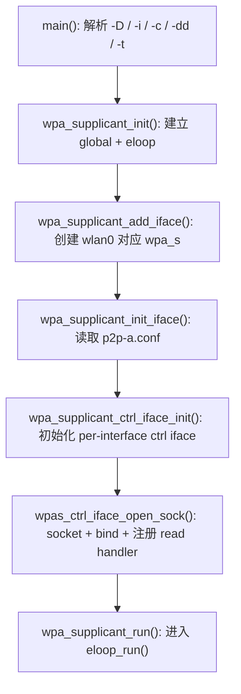
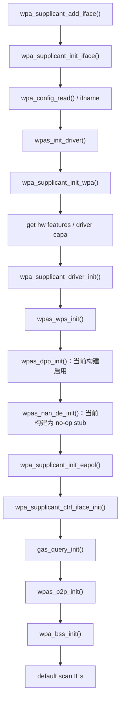
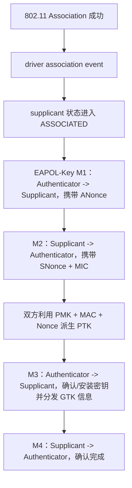
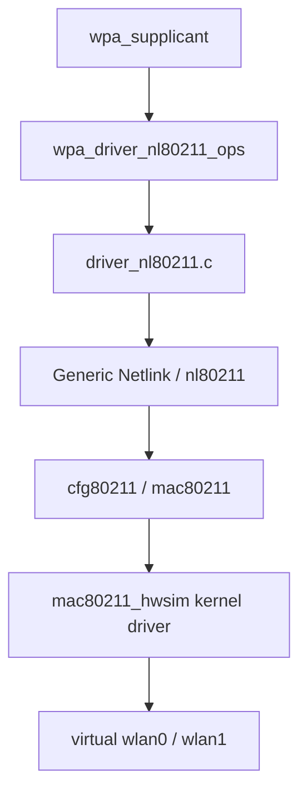

<meta name="referrer" content="no-referrer" />

# Wi-Fi Direct 教程 03：wpa_supplicant 启动到 driver 就绪——main、Interface 对象与 nl80211 backend

> 摘要：从 main() 追踪 global/eloop、interface 对象与 driver backend 选择，明确 nl80211 userspace backend 和 mac80211_hwsim 的层次。

[TOC]

本文从 `wpa_supplicant main()` 开始，只追踪启动骨架：命令行参数如何形成 interface 配置，global/eloop 如何建立，`struct wpa_supplicant` 怎样创建，以及 `-Dnl80211` 最终怎样选中 `wpa_driver_nl80211_ops`。

需要特别区分两层“driver”：`driver_nl80211.c` 是 wpa_supplicant userspace backend；当前实验真正运行在 Linux kernel 中的无线驱动是 `mac80211_hwsim`。

---

## 1. 从 wpa_supplicant/main.c 开始：这条启动命令先变成哪些参数

入口位于：

```text
wpa_supplicant/main.c
```

也就是：

```c
int main(int argc, char *argv[])
```

上一篇分析 `wpa_cli` 时，`main()` 的参数解析决定了 control socket 的**客户端**目标；这一篇同样先看 `wpa_supplicant` 的参数解析，因为它决定了服务端管理哪个 interface、读取哪个配置，以及后面在哪个 interface 上建立 control socket。

当前命令中的几个参数会落到两类对象中：

| 命令行参数 | `main()` 中的落点 | 后续用途 |
|---|---|---|
| `-Dnl80211` | `iface->driver = optarg` | 选择 `nl80211` driver backend |
| `-i "$P2P_A"` | `iface->ifname = optarg` | 决定当前 `wpa_supplicant` 管理的 interface，例如 `wlan0` |
| `-c /workspace/config/p2p-a.conf` | `iface->confname = optarg` | 决定读取哪个配置文件 |
| 第一个 `-d` | `params.wpa_debug_level--` | 提高 debug 输出详细程度 |
| 第二个 `-d` | 再次 `params.wpa_debug_level--` | 进一步提高 debug 输出详细程度 |
| `-t` | `params.wpa_debug_timestamp++` | 为 debug 日志增加时间戳 |

当前主线可以压缩成下面这段执行路径阅读版：

```c
/* 执行路径阅读版：只保留当前命令影响的 option 与后续主调用。 */
params.wpa_debug_level = MSG_INFO;

case 'c':
    iface->confname = optarg;
    break;
case 'D':
    iface->driver = optarg;
    break;
case 'd':
    params.wpa_debug_level--;
    break;
case 'i':
    iface->ifname = optarg;
    break;
case 't':
    params.wpa_debug_timestamp++;
    break;

global = wpa_supplicant_init(&params);
wpa_s = wpa_supplicant_add_iface(global, &ifaces[0], NULL);
exitcode = wpa_supplicant_run(global);
```

这里先得到三个后文会一直使用的事实：

```text
-Dnl80211
    -> interface 使用 nl80211 driver

-i wlan0
    -> wpa_s->ifname 最终会是 wlan0

-c p2p-a.conf
    -> ctrl_interface 最终从这个配置文件读入
```

尤其要注意：当前启动命令**没有 `-g`**。

`-g` 才是 `wpa_supplicant` 的 global control interface 参数。本实验没有使用它，因此后面真正接收 `wpa_cli -p /run/wpa_supplicant-p2p-a -i wlan0 ...` 请求的，不是 global control socket，而是 **per-interface control socket**。

先把 `main()` 后面的主启动链画出来：



从这里开始，后面的每一步都沿这张图顺序往下走。

---

<a id="idx-init"></a>

## 2. wpa_supplicant_init() 先建立 eloop，但当前不会创建 global control socket

`main()` 完成参数解析之后首先调用：

```text
wpa_supplicant_init(&params)
```

在 `wpa_supplicant/wpa_supplicant.c` 中，这个函数负责创建整个进程级别的 `struct wpa_global`，并初始化事件循环等全局设施。

当前主线最重要的两步是：

```c
/* 执行路径阅读版：只保留与本篇 control path 直接相关的初始化。 */
if (eloop_init())
    return NULL;

global->ctrl_iface = wpa_supplicant_global_ctrl_iface_init(global);
if (global->ctrl_iface == NULL)
    return NULL;
```

这两句容易产生一个误解：

> 既然这里调用了 `wpa_supplicant_global_ctrl_iface_init()`，是不是 control socket 已经创建了？

当前实验不是。

原因是 `main()` 没有 `-g`，所以：

```text
global->params.ctrl_interface == NULL
```

UNIX control interface backend 的 global init 在这种情况下会创建它自己的 private context，但不会真正打开 socket：

```c
/* 执行路径阅读版。 */
priv->global = global;
priv->sock = -1;

if (global->params.ctrl_interface == NULL)
    return priv;
```

因此这一阶段的结果应准确理解为：

```text
wpa_supplicant_init()
    ├─ eloop 已初始化
    ├─ global control interface context 已建立
    └─ global control socket 没有打开，因为本次没有 -g
```

### 2.1 wpas_notify_supplicant_initialized() 在当前构建里做了什么

`wpa_supplicant_init()` 在 global control interface 初始化之后还会执行：

```c
if (wpas_notify_supplicant_initialized(global)) {
    wpa_supplicant_deinit(global);
    return NULL;
}
```

这个名字很容易让人误以为它会继续初始化 UNIX control socket。实际职责不是这样。

`wpa_supplicant/notify.c` 中该函数负责初始化**其他通知/控制后端**：

```c
int wpas_notify_supplicant_initialized(struct wpa_global *global)
{
#ifdef CONFIG_CTRL_IFACE_DBUS_NEW
    if (global->params.dbus_ctrl_interface) {
        global->dbus = wpas_dbus_init(global);
        if (global->dbus == NULL)
            return -1;
    }
#endif /* CONFIG_CTRL_IFACE_DBUS_NEW */

#ifdef CONFIG_BINDER
    global->binder = wpas_binder_init(global);
    if (!global->binder)
        return -1;
#endif /* CONFIG_BINDER */

    return 0;
}
```

当前 Dockerfile 明确关闭了 `CONFIG_CTRL_IFACE_DBUS*`，也没有启用 Binder，因此对本实验二进制而言，这个函数预处理后的有效行为基本就是：

```text
wpas_notify_supplicant_initialized(global)
    -> return 0
```

所以它应该在这里解释，但不应该把它错误并入：

```text
wpa_cli -> UNIX control socket -> wpa_supplicant
```

这条主链。当前真正的 UNIX per-interface control socket 仍然要等 `wpa_supplicant_add_iface()` 之后创建。

### 2.2 wpas_periodic：eloop 在启动阶段已经有了一个周期 timeout

`wpa_supplicant_init()` 返回前还有：

```c
eloop_register_timeout(WPA_SUPPLICANT_CLEANUP_INTERVAL, 0,
                       wpas_periodic, global, NULL);
```

2.12 中默认：

```c
#ifndef WPA_SUPPLICANT_CLEANUP_INTERVAL
#define WPA_SUPPLICANT_CLEANUP_INTERVAL 10
#endif
```

也就是注册一个约 10 秒后的 eloop timeout。到期后执行 `wpas_periodic()`，而这个 callback 一开始又会重新注册下一次 timeout。下面代码块是执行路径阅读版，保留本篇需要理解的周期注册与清理逻辑：

```c
/* 执行路径阅读版。 */
static void wpas_periodic(void *eloop_ctx, void *timeout_ctx)
{
    struct wpa_global *global = eloop_ctx;
    struct wpa_supplicant *wpa_s;

    eloop_register_timeout(WPA_SUPPLICANT_CLEANUP_INTERVAL, 0,
                           wpas_periodic, global, NULL);

#ifdef CONFIG_P2P
    if (global->p2p)
        p2p_expire_peers(global->p2p);
#endif

    for (wpa_s = global->ifaces; wpa_s; wpa_s = wpa_s->next) {
        wpa_bss_flush_by_age(wpa_s, wpa_s->conf->bss_expiration_age);
#ifdef CONFIG_AP
        ap_periodic(wpa_s);
#endif
    }
}
```

这说明 `eloop` 从一开始就不只是“等 control socket”。它至少同时管理：

| 事件源 | 本篇出现的例子 | 触发后做什么 |
|---|---|---|
| socket readable | per-interface ctrl fd | 调 `wpa_supplicant_ctrl_iface_receive()` |
| timeout | `wpas_periodic` | peer/BSS 周期清理，再注册下一次 timeout |
| signal | 稍后在 `wpa_supplicant_run()` 注册 | 终止或重新加载配置 |

`wpas_periodic()` 与当前 `P2P_FIND` 请求**没有直接调用关系**。它不会轮询 control socket，也不是 `P2P_FIND` server 被唤醒的原因；它只是另一个由同一 `eloop_run()` 调度、并在同一主线程执行的事件源。

真正与 `wlan0` 绑定的 control socket，要等 `main()` 后面执行：

```text
wpa_supplicant_add_iface()
```

之后才创建。

这个区分很重要，因为源码中同时存在：

```text
global control interface
per-interface control interface
```

而当前实验使用的是后者。

---

<a id="idx-add-iface"></a>

## 3. wpa_supplicant_add_iface()：把 -i 与 -c 变成一个真正的 wpa_supplicant interface 对象

`main()` 接着调用：

```c
wpa_s = wpa_supplicant_add_iface(global, &ifaces[i], NULL);
```

这个函数不是只调用一次 `wpa_supplicant_init_iface()`。它负责把一个命令行描述的 `struct wpa_interface` 真正装配成运行期的 `struct wpa_supplicant`，并在初始化成功后挂入 `global->ifaces`。

按当前路径裁剪后，主干可以写成：

```c
/* 执行路径阅读版：保留当前 interface 创建主干。 */
wpa_s = wpa_supplicant_alloc(parent);
if (wpa_s == NULL)
    return NULL;

wpa_s->global = global;
t_iface = *iface;

if (wpa_supplicant_init_iface(wpa_s, &t_iface)) {
    wpa_supplicant_deinit_iface(wpa_s, 0, 0);
    return NULL;
}

if (iface->p2p_mgmt == 0 && !iface->nan_mgmt) {
    if (wpas_notify_iface_added(wpa_s)) {
        wpa_supplicant_deinit_iface(wpa_s, 1, 0);
        return NULL;
    }
}

wpa_s->next = global->ifaces;
global->ifaces = wpa_s;
wpa_supplicant_set_state(wpa_s, WPA_DISCONNECTED);

return wpa_s;
```

因此 `wpa_supplicant_add_iface()` 至少完成四件事：

1. 分配并建立 `wpa_s` 与 `global` 的归属关系；
2. 调 `wpa_supplicant_init_iface()` 完成配置、driver、EAPOL、control interface、P2P 等 interface 级初始化；
3. 调 `wpas_notify_iface_added()` 通知可选通知后端；当前 D-Bus 已关闭，所以这一步不改变本文 UNIX ctrl path；
4. 把成功初始化的 `wpa_s` 链入 `global->ifaces`，并把初始状态设为 `WPA_DISCONNECTED`。

这也解释了为什么后面的 `wpa_supplicant_run()` 可以直接遍历：

```text
global->ifaces
```

找到当前 `wlan0` 对应的 `wpa_s`。

其中真正决定 control socket 的仍是：

```text
wpa_supplicant_init_iface(wpa_s, &t_iface)
```

从 control socket 的角度，`wpa_supplicant_init_iface()` 做了两件必须串起来理解的事。

第一件：读取 `-c` 指定的配置文件。

```c
/* 执行路径阅读版。 */
wpa_s->confname = os_rel2abs_path(iface->confname);
wpa_s->conf = wpa_config_read(wpa_s->confname, NULL, false,
                              wpa_s->global->params.show_details);
```

因此：

```text
/workspace/config/p2p-a.conf
    ↓
wpa_config_read()
    ↓
wpa_s->conf->ctrl_interface
    ↓
"/run/wpa_supplicant-p2p-a"
```

第二件：把 `-i` 指定的 interface 名保存到 `wpa_s`：

```c
/* 执行路径阅读版。 */
os_strlcpy(wpa_s->ifname, iface->ifname, sizeof(wpa_s->ifname));
```

如果当前：

```text
P2P_A=wlan0
```

那么：

```text
wpa_s->ifname = "wlan0"
```

到这里，创建 per-interface control socket 所需要的两个关键输入都已经具备：

```text
ctrl directory = /run/wpa_supplicant-p2p-a
ifname         = wlan0
```

`wpa_supplicant_init_iface()` 在完成 driver、WPA/EAPOL 等必要初始化后，会执行：

```c
wpa_s->ctrl_iface = wpa_supplicant_ctrl_iface_init(wpa_s);
```

这才是当前实验 control socket 真正进入初始化流程的位置。

在 interface 初始化的后续阶段，P2P context 也会在进入主事件循环之前建立。

普通 interface 路径会调用 **`wpas_p2p_init()`**；

如果 driver 使用 dedicated P2P Device，初始化会通过对应的 P2P management interface 分支完成。
这里不展开两种 P2P interface 模型，只保留与本文有关的约束：**收到 `P2P_FIND` 之前，P2P context 必须已经准备好；否则后面的 `wpas_p2p_find()` 会因为 `global->p2p == NULL` 直接拒绝请求。**

<a id="idx-init-iface"></a>

### 3.1 `wpa_supplicant_init_iface()` 先做哪些阶段：不要只从 control socket 中间切进去

`wpa_supplicant_init_iface()` 是 interface 级初始化的总装配函数。当前 control path 会依赖它已经完成的 driver、WPA/EAPOL、control interface、P2P Core 与 BSS table，因此这里先按 2.12 的真实源码顺序把主要阶段摆出来。[S1](#source-s1)

| 源码阶段 | 关键调用 | 建立的运行时对象/能力 | 为什么后文依赖它 |
|---|---|---|---|
| 读取配置 | `wpa_config_read()` | `wpa_s->conf` | `ctrl_interface`、P2P/WPS 等配置从这里进入 |
| 保存 interface 身份 | `wpa_s->ifname = ...` | 当前 `wpa_s` 对应哪个 netdev | control socket 名称、driver 调用都依赖它 |
| driver wrapper 初始化 | `wpas_init_driver()` | `wpa_s->driver` / `drv_priv` 与 event bridge | scan、remain-on-channel、Action frame 最终都要走 driver |
| WPA state machine | `wpa_supplicant_init_wpa()` | `wpa_s->wpa` | 后续 association/security 共用；不是 P2P_FIND 本身，但属于 interface 基础设施 |
| 读取硬件能力 | `wpa_drv_get_hw_feature_data()`、`wpa_drv_get_capa()` | channel/mode、driver flags、remain-on-channel 等能力 | P2P 是否可用、可扫描哪些 band、radio work 怎么分类都依赖这些数据 |
| driver runtime/L2 | `wpa_supplicant_driver_init()` | interface 运行态；bridge 场景可建立额外 L2 EAPOL receive handle | driver event 与 packet path 可以开始工作 |
| WPS 初始化 | `wpas_wps_init()` | `wpa_s->wps` / device attributes | 建立 P2P/WPS 运行时需要的 device attributes |
| DPP 初始化 | `wpas_dpp_init()` | DPP / Wi-Fi Easy Connect context | 当前构建 `CONFIG_DPP=y`，因此这一分支真实执行 |
| NAN Discovery Engine | `wpas_nan_de_init()` | NAN service discovery context 或 no-op stub | 当前未启用 NAN/NAN_USD，因此本构建返回 0，不建立 NAN context |
| EAPOL 初始化 | `wpa_supplicant_init_eapol()` | `wpa_s->eapol` | 建立 EAP/EAPOL supplicant 状态机基础设施 |
| per-interface ctrl | `wpa_supplicant_ctrl_iface_init()` | UNIX control socket + eloop read handler | `wpa_cli` 的 `P2P_FIND` 从这里进入 server |
| GAS query | `gas_query_init()` | GAS query context | 建立 GAS request/response、timeout 与 pending-query 上下文 |
| P2P Core | `wpas_p2p_init()` | `global->p2p` + callback table | 建立 P2P Core 与 supplicant glue callback |
| BSS table | `wpa_bss_init()` | `wpa_s->bss` | 建立通用 802.11 BSS 缓存 |
| 默认 Scan IE | `wpa_supplicant_set_default_scan_ies()` | 普通 scan 默认 IE | 与 P2P 专用 `extra_ies` 区分开 |

把这条初始化主线压成一张图，可以看到 `wpas_p2p_find()` 被调用以前哪些对象必须已经存在：



这张图只保留与当前 interface 启动顺序直接相关的主要节点。FST、TDLS、RRM、MBO 等其它条件编译模块仍不展开；DPP、NAN、EAP Proxy、PTKSA 则因为容易造成源码理解歧义，在后面的对应小节单独解释当前构建是否真正启用、执行的是实实现还是 stub。
#### 3.1.1 第一段：配置文件和 interface identity 先进入 `wpa_s`

`wpa_supplicant_init_iface()` 开头先把命令行/`struct wpa_interface` 中的配置文件路径、interface 名称和可覆盖参数固化到 `struct wpa_supplicant`。这一步不是“读个配置就结束”，它决定了后面 control socket、P2P/WPS 配置和 driver 初始化使用的上下文。[S1](#source-s1)

上游源码先读取配置，并允许命令行 `ctrl_interface` / `driver_param` 覆盖配置文件：

```c
if (iface->confname) {
#ifdef CONFIG_BACKEND_FILE
    wpa_s->confname = os_rel2abs_path(iface->confname);
    if (wpa_s->confname == NULL)
        return -1;
#else /* CONFIG_BACKEND_FILE */
    wpa_s->confname = os_strdup(iface->confname);
#endif /* CONFIG_BACKEND_FILE */
    wpa_s->conf = wpa_config_read(
        wpa_s->confname, NULL, false,
        wpa_s->global->params.show_details);
    if (wpa_s->conf == NULL)
        return -1;

    if (iface->ctrl_interface) {
        os_free(wpa_s->conf->ctrl_interface);
        wpa_s->conf->ctrl_interface =
            os_strdup(iface->ctrl_interface);
        if (!wpa_s->conf->ctrl_interface)
            return -1;
    }

    if (iface->driver_param) {
        os_free(wpa_s->conf->driver_param);
        wpa_s->conf->driver_param = os_strdup(iface->driver_param);
        if (!wpa_s->conf->driver_param)
            return -1;
    }
}
```

接着把 interface 名字复制进长期存在的 `wpa_s->ifname`：

```c
if (iface->ifname == NULL)
    return -1;
if (os_strlen(iface->ifname) >= sizeof(wpa_s->ifname))
    return -1;
os_strlcpy(wpa_s->ifname, iface->ifname, sizeof(wpa_s->ifname));
```

因此后面看到：

```text
wpa_s->conf->ctrl_interface
wpa_s->conf->p2p_*
wpa_s->ifname
```

都不是临时从命令字符串再解析出来，而是在 interface 初始化阶段已经写入长期 context。

#### 3.1.2 先看懂注释里的 association event、EAPOL-Key、WPA/RSN：为什么 driver event 必须先注册

源码在 `wpa_supplicant_init_iface()` 里专门留下了一段顺序约束：[S1](#source-s1) [S3](#source-s3)

```c
/* Initialize driver interface and register driver event handler before
 * L2 receive handler so that association events are processed before
 * EAPOL-Key packets if both become available for the same select()
 * call. */
if (wpas_init_driver(wpa_s, iface) < 0)
    return -1;

if (wpa_supplicant_init_wpa(wpa_s) < 0)
    return -1;
```

这段注释第一次读会同时冒出一串缩写。先把这里真正需要的概念固定下来：

| 名词 | 中文 | 在当前代码里的含义 |
|---|---|---|
| STA | Station，站点/无线终端 | 连接到 AP 的客户端角色；`wpa_supplicant` 最典型的工作角色 |
| AP | Access Point，接入点 | 提供基础设施 Wi-Fi 网络的接入端 |
| GO | Group Owner，组所有者 | Wi-Fi Direct 中承担类似 AP 职责的 P2P 角色；不是普通基础设施 AP |
| WPA | Wi-Fi Protected Access，Wi-Fi 保护接入 | Wi-Fi 安全方案家族名称 |
| RSN | Robust Security Network，强健安全网络 | IEEE 802.11 的安全网络体系；代码里经常看到 `RSN:` 日志和 RSNA 参数 |
| EAP | Extensible Authentication Protocol，可扩展认证协议 | 一套认证框架，常见于 802.1X/企业 Wi-Fi；它不是“四次握手”本身 |
| EAPOL | EAP over LAN，局域网上的 EAP 封装 | 二层承载协议；既可以承载 EAP，也可以承载 `EAPOL-Key` |
| PMK | Pairwise Master Key，成对主密钥 | 后续派生 PTK 的根密钥；来源可能是 PSK、SAE、802.1X/EAP 等 |
| PTK | Pairwise Transient Key，成对临时密钥 | 针对一对通信端生成的会话密钥集合，主要用于单播保护 |
| GTK | Group Temporal Key，组临时密钥 | AP/GO 侧用于广播/组播保护的组密钥 |
| PMKSA | Pairwise Master Key Security Association，成对主密钥安全关联 | 保存 PMK 及其安全上下文，便于后续识别/复用 |
| PTKSA | Pairwise Transient Key Security Association，成对临时密钥安全关联 | 保存已经建立的 PTK 及其 peer/cipher 等上下文；和 PMKSA 不是一回事 |
| TKIP | Temporal Key Integrity Protocol，临时密钥完整性协议 | WPA 早期使用的旧式数据保护算法，现在主要作为兼容代码存在 |

这里的 **association event** 不是认证密钥报文。它表示 802.11 关联状态已经由 driver 路径通知到 `wpa_supplicant`：当前 STA 已经和某个 BSSID 建立 association，supplicant 可以更新 BSSID、状态机和后续安全上下文。

而 **EAPOL-Key** 是二层安全报文。WPA/RSN 常见的 4-Way Handshake 使用的就是 EAPOL-Key，而不是普通 IP 包。可以先建立下面这个心智模型：



这里的 `M1/M2/M3/M4` 只是对 4-Way Handshake 四个 EAPOL-Key 消息的常用简称。`EAP` 和 `EAPOL-Key` 也不能混为一谈：企业网络可能先通过 EAP 完成 802.1X 认证并得到 PMK；PSK/SAE 场景则可以没有前置 EAP 认证，但之后仍然使用 EAPOL-Key 完成四次握手。

为什么注释强调顺序？因为 association event 与 EAPOL frame 可以从不同 driver/packet 路径到达 userspace。源码中的 `wpa_supplicant_rx_eapol()` 甚至专门处理“EAPOL 已经到了，但 association 状态还没更新”的竞态：当状态低于 `WPA_ASSOCIATED` 时，会暂缓处理这个 EAPOL frame。[S3](#source-s3)

因此这里的真实设计意图是：

```text
先让 driver association event 更新连接状态
    ↓
再让 EAPOL-Key 状态机消费 M1/M2/M3/M4
```

不是说 association 本身属于 EAP，也不是说 EAPOL-Key 是 driver event。

#### 3.1.3 当前实验里“driver”到底是哪一层：`nl80211` backend 和 `mac80211_hwsim` 不是同一个东西

当前启动参数是：

```bash
-Dnl80211
```

这个参数选择的不是 Linux kernel module 名，而是 **wpa_supplicant 的 userspace driver backend**。当前实验完整层次如下：[S3](#source-s3) [S5](#source-s5)



所以本文后面说“driver”时要区分两种含义：

- **wpa_supplicant driver wrapper/backend**：`nl80211`，代码在 `src/drivers/driver_nl80211.c`；
- **Linux kernel 中实际提供当前虚拟 radio 的驱动**：`mac80211_hwsim`，由 Ubuntu Host 加载，创建实验用的虚拟无线接口。[S5](#source-s5)

二者通过 Linux `nl80211/cfg80211` 接起来，而不是 `wpa_supplicant` 直接调用 `mac80211_hwsim` 函数。

`nl80211` backend 什么时候“注册”的？它不是运行时 `register_driver()` 动态注册，而是在编译阶段进入 `wpa_drivers[]`。`src/drivers/drivers.c` 中的表是：[S3](#source-s3)

```c
const struct wpa_driver_ops *const wpa_drivers[] =
{
#ifdef CONFIG_DRIVER_NL80211
    &wpa_driver_nl80211_ops,
#endif /* CONFIG_DRIVER_NL80211 */
#ifdef CONFIG_DRIVER_WEXT
    &wpa_driver_wext_ops,
#endif /* CONFIG_DRIVER_WEXT */
#ifdef CONFIG_DRIVER_BSD
    &wpa_driver_bsd_ops,
#endif /* CONFIG_DRIVER_BSD */
#ifdef CONFIG_DRIVER_OPENBSD
    &wpa_driver_openbsd_ops,
#endif /* CONFIG_DRIVER_OPENBSD */
#ifdef CONFIG_DRIVER_NDIS
    &wpa_driver_ndis_ops,
#endif /* CONFIG_DRIVER_NDIS */
#ifdef CONFIG_DRIVER_WIRED
    &wpa_driver_wired_ops,
#endif /* CONFIG_DRIVER_WIRED */
#ifdef CONFIG_DRIVER_MACSEC_LINUX
    &wpa_driver_macsec_linux_ops,
#endif /* CONFIG_DRIVER_MACSEC_LINUX */
#ifdef CONFIG_DRIVER_MACSEC_QCA
    &wpa_driver_macsec_qca_ops,
#endif /* CONFIG_DRIVER_MACSEC_QCA */
#ifdef CONFIG_DRIVER_ROBOSWITCH
    &wpa_driver_roboswitch_ops,
#endif /* CONFIG_DRIVER_ROBOSWITCH */
#ifdef CONFIG_DRIVER_NONE
    &wpa_driver_none_ops,
#endif /* CONFIG_DRIVER_NONE */
    NULL
};
```

本项目构建显式启用了 `CONFIG_DRIVER_NL80211=y`，所以 `&wpa_driver_nl80211_ops` 会被编译进这个数组。`driver_nl80211.c` 再定义：

```c
const struct wpa_driver_ops wpa_driver_nl80211_ops = {
    .name = "nl80211",
    .desc = "Linux nl80211/cfg80211",
    .get_bssid = wpa_driver_nl80211_get_bssid,
    .get_ssid = wpa_driver_nl80211_get_ssid,
    .set_key = driver_nl80211_set_key,
    .scan2 = driver_nl80211_scan2,
    .get_scan_results = wpa_driver_nl80211_get_scan_results,
    .deauthenticate = driver_nl80211_deauthenticate,
    .authenticate = driver_nl80211_authenticate,
    .associate = wpa_driver_nl80211_associate,
    .global_init = nl80211_global_init,
    .global_deinit = nl80211_global_deinit,
    .init2 = wpa_driver_nl80211_init,
    .deinit = driver_nl80211_deinit,
    .get_capa = wpa_driver_nl80211_get_capa,
};
```

这里展示的是用于理解当前初始化链的连续字段组；完整 `wpa_driver_nl80211_ops` 还包含更多操作，源码链接见文末。[S3](#source-s3)

#### 3.1.4 `wpas_init_driver()` 怎样把字符串 `nl80211` 变成真正的 backend

`main()` 已经把 `-Dnl80211` 保存到 `iface->driver`。`wpas_init_driver()` 先调用：

```c
driver = iface->driver;
next_driver:
if (wpa_supplicant_set_driver(wpa_s, driver) < 0)
    return -1;

wpa_s->drv_priv = wpa_drv_init(wpa_s, wpa_s->ifname);
```

`wpa_supplicant_set_driver()` 会遍历刚才的 `wpa_drivers[]`，把字符串和 `wpa_driver_ops.name` 匹配。当前：

```text
iface->driver = "nl80211"
        ↓
匹配 wpa_driver_nl80211_ops.name == "nl80211"
        ↓
wpa_s->driver = &wpa_driver_nl80211_ops
```

接着 `wpa_drv_init()` 是一个统一 wrapper：

```c
static inline void * wpa_drv_init(struct wpa_supplicant *wpa_s,
                                  const char *ifname)
{
    if (wpa_s->driver->init2) {
        enum wpa_p2p_mode p2p_mode = WPA_P2P_MODE_WFD_R1;

#ifdef CONFIG_P2P
        p2p_mode = wpa_s->p2p_mode;
#endif /* CONFIG_P2P */

        return wpa_s->driver->init2(wpa_s, ifname,
                                    wpa_s->global_drv_priv,
                                    p2p_mode);
    }
    if (wpa_s->driver->init) {
        return wpa_s->driver->init(wpa_s, ifname);
    }
    return NULL;
}
```

由于 `wpa_driver_nl80211_ops.init2 = wpa_driver_nl80211_init`，所以这里最终进入 `driver_nl80211.c`。它返回的 backend 私有对象被保存为：

```text
wpa_s->drv_priv
```

后面所有 `wpa_drv_scan()`、`wpa_drv_get_capa()`、`wpa_drv_remain_on_channel()` 之类统一 wrapper，都会通过 `wpa_s->driver` 的函数指针表进入 nl80211 backend。

`wpas_init_driver()` 之后还会取得 radio name，并把 interface 加入 radio scheduler：

```c
rn = wpa_driver_get_radio_name(wpa_s);
if (rn && rn[0] == '\0')
    rn = NULL;

wpa_s->radio = radio_add_interface(wpa_s, rn);
if (wpa_s->radio == NULL)
    return -1;
```

因此后面看到 `radio_add_work()` 时，不能理解为“这时才创建 radio”。`wpa_s->radio` 已经在 interface 初始化阶段建立；`radio_add_work()` 只是在该 radio 的工作队列中加入一次需要独占/协调 radio 的操作。

## 4. 本篇边界：driver backend 已经确定

到这里，`main()`、`wpa_supplicant_init()`、`wpa_supplicant_add_iface()` 与 `wpa_supplicant_init_iface()` 的前半段已经把配置、interface identity 和 driver backend 建立起来；当前实验最终选择 `nl80211` userspace backend，并通过 Linux `nl80211/cfg80211` 对接 `mac80211_hwsim`。本文在 driver 初始化边界停止，不继续展开 WPA/WPS/P2P 等协议子系统对象。

## 关键源码索引

| 符号 | 作用 | Git |
|---|---|---|
| `main()` | 解析 `-D/-i/-c` | [main.c](https://chromium.googlesource.com/chromiumos/third_party/hostap/+/refs/tags/hostap_2_12/wpa_supplicant/main.c) |
| `wpa_supplicant_init()` | global/eloop 初始化 | [wpa_supplicant.c](https://chromium.googlesource.com/chromiumos/third_party/hostap/+/refs/tags/hostap_2_12/wpa_supplicant/wpa_supplicant.c) |
| `wpa_supplicant_add_iface()` | 创建 interface object | [wpa_supplicant.c](https://chromium.googlesource.com/chromiumos/third_party/hostap/+/refs/tags/hostap_2_12/wpa_supplicant/wpa_supplicant.c) |
| `wpas_init_driver()` | 选择 driver backend | [wpa_supplicant.c](https://chromium.googlesource.com/chromiumos/third_party/hostap/+/refs/tags/hostap_2_12/wpa_supplicant/wpa_supplicant.c) |
| `wpa_driver_nl80211_ops` | nl80211 backend ops | [driver_nl80211.c](https://chromium.googlesource.com/chromiumos/third_party/hostap/+/refs/tags/hostap_2_12/src/drivers/driver_nl80211.c) |

## 资料来源

<a id="source-s1"></a>
### [S1] hostap 2.12 Git：wpa_supplicant server/control/P2P 初始化
- 版本：[`hostap_2_12` / `831364bf02710ad09c2f27d3efa92abeeb5634c0`](https://chromium.googlesource.com/chromiumos/third_party/hostap/+/refs/tags/hostap_2_12)
- 文件：[main.c](https://chromium.googlesource.com/chromiumos/third_party/hostap/+/refs/tags/hostap_2_12/wpa_supplicant/main.c)、[wpa_supplicant.c](https://chromium.googlesource.com/chromiumos/third_party/hostap/+/refs/tags/hostap_2_12/wpa_supplicant/wpa_supplicant.c)、[ctrl_iface_unix.c](https://chromium.googlesource.com/chromiumos/third_party/hostap/+/refs/tags/hostap_2_12/wpa_supplicant/ctrl_iface_unix.c)、[ctrl_iface.c](https://chromium.googlesource.com/chromiumos/third_party/hostap/+/refs/tags/hostap_2_12/wpa_supplicant/ctrl_iface.c)、[p2p_supplicant.c](https://chromium.googlesource.com/chromiumos/third_party/hostap/+/refs/tags/hostap_2_12/wpa_supplicant/p2p_supplicant.c)、[wps_supplicant.c](https://chromium.googlesource.com/chromiumos/third_party/hostap/+/refs/tags/hostap_2_12/wpa_supplicant/wps_supplicant.c)、[p2p.c](https://chromium.googlesource.com/chromiumos/third_party/hostap/+/refs/tags/hostap_2_12/src/p2p/p2p.c)、[eloop.c](https://chromium.googlesource.com/chromiumos/third_party/hostap/+/refs/tags/hostap_2_12/src/utils/eloop.c)
- 使用位置：第 1～16 节，重点为 3.1～3.4
- 支撑内容：server main/init/add-iface/control socket/eloop/parser 主链，以及 `wpa_supplicant_init_iface() -> wpas_p2p_init()` 和 callback 绑定。

<a id="source-s3"></a>
### [S3] hostap 2.12 Git：driver、WPA/EAPOL、PTKSA、GAS/ANQP 实现
- 版本：[`hostap_2_12` / `831364bf02710ad09c2f27d3efa92abeeb5634c0`](https://chromium.googlesource.com/chromiumos/third_party/hostap/+/refs/tags/hostap_2_12)
- 文件：[wpa_supplicant.c](https://chromium.googlesource.com/chromiumos/third_party/hostap/+/refs/tags/hostap_2_12/wpa_supplicant/wpa_supplicant.c)、[wpas_glue.c](https://chromium.googlesource.com/chromiumos/third_party/hostap/+/refs/tags/hostap_2_12/wpa_supplicant/wpas_glue.c)、[driver_i.h](https://chromium.googlesource.com/chromiumos/third_party/hostap/+/refs/tags/hostap_2_12/wpa_supplicant/driver_i.h)、[drivers.c](https://chromium.googlesource.com/chromiumos/third_party/hostap/+/refs/tags/hostap_2_12/src/drivers/drivers.c)、[driver_nl80211.c](https://chromium.googlesource.com/chromiumos/third_party/hostap/+/refs/tags/hostap_2_12/src/drivers/driver_nl80211.c)、[ptksa_cache.c](https://chromium.googlesource.com/chromiumos/third_party/hostap/+/refs/tags/hostap_2_12/src/common/ptksa_cache.c)、[gas_query.c](https://chromium.googlesource.com/chromiumos/third_party/hostap/+/refs/tags/hostap_2_12/wpa_supplicant/gas_query.c)、[ieee802_11_defs.h](https://chromium.googlesource.com/chromiumos/third_party/hostap/+/refs/tags/hostap_2_12/src/common/ieee802_11_defs.h)
- 使用位置：第 3.1.2～3.1.6、3.1.9 节
- 支撑内容：association/EAPOL 顺序、`nl80211` backend 选择与函数表、PTKSA real/stub 双实现、L2/TKIP countermeasure/PMKID 初始化，以及 GAS/ANQP 数据结构。

<a id="source-s5"></a>
### [S5] Linux kernel Git：mac80211_hwsim
- 来源：[torvalds/linux: mac80211_hwsim.c](https://github.com/torvalds/linux/blob/master/drivers/net/wireless/virtual/mac80211_hwsim.c)
- 文件：[Documentation/networking/mac80211_hwsim.rst](https://github.com/torvalds/linux/blob/master/Documentation/networking/mac80211_hwsim.rst)
- 使用位置：第 3.1.3 节
- 支撑内容：`mac80211_hwsim` 是 Linux kernel 中用于模拟 802.11 radio 的虚拟无线驱动；当前实验的 `wlan0/wlan1` 来自该 kernel driver，而 `-Dnl80211` 选择的是 userspace driver backend。
