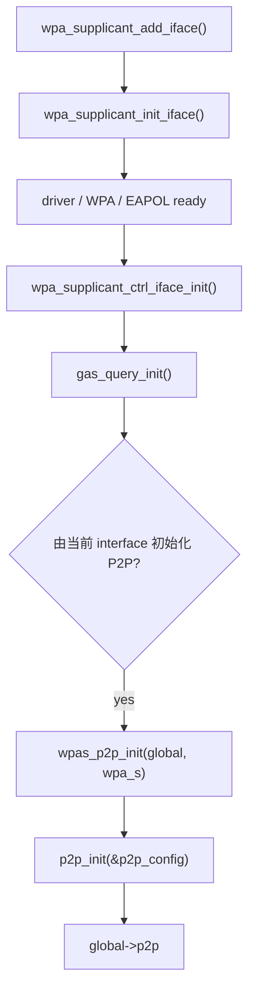
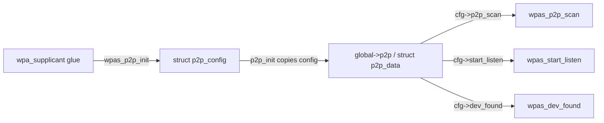

<meta name="referrer" content="no-referrer" />

# Wi-Fi Direct 教程 04：Interface 协议子系统初始化——WPA/EAPOL、WPS、DPP/NAN、GAS 与 P2P callback

> 摘要：继续 wpa_supplicant_init_iface()，解释 WPA/EAPOL、WPS、DPP/NAN、GAS/ANQP 与 P2P Core callback 的初始化。

[TOC]

driver backend 已经选定后，`wpa_supplicant_init_iface()` 还要继续建立真正的协议运行环境。本文集中解释这部分：association/EAPOL 相关状态为什么要准备，L2/TKIP/PMKID 分别承担什么，WPS、DPP、NAN、EAP_PROXY、GAS/ANQP 是什么，以及 `wpas_p2p_init()` 在哪里绑定 P2P Core callbacks。

---

## 1. `wpa_supplicant_init_wpa()`：建立 WPA/RSN 状态机

`wpas_init_driver()` 返回后，调用方进入：

```c
if (wpa_supplicant_init_wpa(wpa_s) < 0)
    return -1;
```

`wpa_supplicant_init_wpa()` 的主任务是建立 `struct wpa_sm_ctx`，把状态切换、deauthenticate、reconnect、set key、PMKID 等 callback 绑定回当前 `wpa_supplicant`，然后调用 `wpa_sm_init(ctx)` 创建 WPA/RSN supplicant state machine。[S3](#source-s3)

```c
ctx->ctx = wpa_s;
ctx->set_state = _wpa_supplicant_set_state;
ctx->deauthenticate = _wpa_supplicant_deauthenticate;
ctx->reconnect = _wpa_supplicant_reconnect;
ctx->set_key = wpa_supplicant_set_key;
ctx->add_pmkid = wpa_supplicant_add_pmkid;
ctx->remove_pmkid = wpa_supplicant_remove_pmkid;

wpa_s->wpa = wpa_sm_init(ctx);
```

函数同时初始化可选的 PTKSA cache 接口，但本文不展开其构建期 stub/存储实现；当前主线只需要确认：后续 association、WPA/RSN 与 EAPOL-Key 处理所依赖的 WPA state machine 已在这里建立。

## 2. `wpa_supplicant_driver_init()` 里的 L2、TKIP countermeasure、PMKID 分别是什么

`wpa_supplicant_init_wpa()` 建好 WPA/RSN state machine 后，源码继续读取硬件能力，然后进入：

```c
if (wpa_supplicant_driver_init(wpa_s) < 0)
    return -1;
```

它首先更新本机 MAC，并把地址告诉 WPA state machine：

```c
if (wpa_supplicant_update_mac_addr(wpa_s) < 0)
    return -1;

os_memcpy(wpa_s->perm_addr, wpa_s->own_addr, ETH_ALEN);
wpa_sm_set_own_addr(wpa_s->wpa, wpa_s->own_addr);
```

随后有一个容易误读的 L2 分支：

```c
if (wpa_s->bridge_ifname[0] && wpas_eapol_needs_l2_packet(wpa_s)) {
    wpa_s->l2_br = l2_packet_init_bridge(
        wpa_s->bridge_ifname, wpa_s->ifname, wpa_s->own_addr,
        ETH_P_EAPOL, wpa_supplicant_rx_eapol_bridge, wpa_s, 1);
    if (wpa_s->l2_br == NULL)
        return -1;
}
```

**L2 packet receive handle** 可以直译为“二层报文接收句柄/上下文”。这里的 `l2_packet_init_bridge()` 会为 bridge 场景准备接收以太网二层报文的对象，并按 `ETH_P_EAPOL` 过滤/接收 EAPOL。当前实验没有设置 `bridge_ifname`，因此这一段本身不会创建 `wpa_s->l2_br`；不能把它写成“当前 wlan0 一定在这里打开 L2 socket”。nl80211 backend 还有自己的 EAPOL/control-port 接收路径。[S3](#source-s3)

接下来三句主要是在清理“上一次运行可能留下的安全状态”：

```c
wpa_clear_keys(wpa_s, NULL);

wpa_drv_set_countermeasures(wpa_s, 0);

wpa_dbg(wpa_s, MSG_DEBUG, "RSN: flushing PMKID list in the driver");
wpa_drv_flush_pmkid(wpa_s);
```

分别理解：

1. `wpa_clear_keys()`：清理旧的 pairwise/group key，避免新会话继承旧密钥状态；
2. `wpa_drv_set_countermeasures(wpa_s, 0)`：关闭 **TKIP Michael MIC countermeasures**。这是旧 TKIP 机制的防护状态；源码注释特别说明，如果进程在 countermeasure 期间被杀掉，driver 可能残留“仍处于防护期”的状态，所以初始化时显式清零；
3. `wpa_drv_flush_pmkid()`：清除 driver 中旧的 PMKID 列表。PMKID 是与 PMKSA 关联的标识，用于标识某个缓存的 PMK 安全上下文；这里清理的是 driver 侧旧条目，不是“删除当前配置文件密码”。

因此这段代码并不是在开始一次新的四次握手，而是在把 interface 的安全运行态恢复到干净起点。

## 3. `wpas_wps_init()`：WPS device attributes 在 interface 初始化阶段建立

`&wpa_s->wps->dev` 并不是临时对象；`wpas_wps_init()` 在 interface 初始化阶段已经把配置文件与硬件能力转成长期 `struct wps_context`。[S1](#source-s1)

```c
wps = os_zalloc(sizeof(*wps));
if (wps == NULL)
    return -1;

wps->cred_cb = wpa_supplicant_wps_cred;
wps->event_cb = wpa_supplicant_wps_event;
wps->rf_band_cb = wpa_supplicant_wps_rf_band;
wps->cb_ctx = wpa_s;

wps->dev.device_name = wpa_s->conf->device_name;
wps->dev.manufacturer = wpa_s->conf->manufacturer;
wps->dev.model_name = wpa_s->conf->model_name;
wps->dev.model_number = wpa_s->conf->model_number;
wps->dev.serial_number = wpa_s->conf->serial_number;
wps->config_methods =
    wps_config_methods_str2bin(wpa_s->conf->config_methods);
wps->dev.config_methods = wps_fix_config_methods(wps->config_methods);
os_memcpy(wps->dev.pri_dev_type, wpa_s->conf->device_type,
          WPS_DEV_TYPE_LEN);
```

它还根据 `wpa_s->hw.modes[]` 形成 `wps->dev.rf_bands`，把本机 MAC 复制到 WPS device data，生成/设置 UUID，并初始化 WPS Registrar。最后：

```c
wpa_s->wps = wps;
```

因此运行时使用 WPS Device Name、Config Methods、Primary Device Type、RF Bands、UUID 等字段时，都能沿初始化链追溯回配置与 hardware capability，而不是后续报文构造函数自己凭空决定。

## 4. `CONFIG_DPP`、`CONFIG_NAN`、`CONFIG_EAP_PROXY`：它们是什么，以及当前构建到底有没有启用

`wpa_supplicant_init_iface()` 中还能看到一批条件编译能力。不能只说“与 P2P_FIND 无关所以跳过”，因为读者第一次看到宏时需要知道它们在系统里处于什么位置。[S4](#source-s4)

当前项目是先复制 hostap 2.12 的 `defconfig`，再显式打开本实验需要的选项。由此得到的关键状态是：

| 宏 | 中文/用途 | 当前构建 |
|---|---|---|
| `CONFIG_DPP` | Device Provisioning Protocol，设备配置协议；Wi-Fi Alliance 名称 Wi-Fi Easy Connect，用于安全引导/配置设备接入网络 | **启用**，因为 2.12 `defconfig` 默认 `CONFIG_DPP=y` |
| `CONFIG_DPP2` | DPP Release 2 支持 | **启用**，`defconfig` 默认开启 |
| `CONFIG_NAN` | Neighbor Awareness Networking，邻居感知网络；Wi-Fi Aware 的底层机制之一 | **未启用** |
| `CONFIG_NAN_USD` | NAN Unsynchronized Service Discovery，NAN 非同步服务发现 | **未启用** |
| `CONFIG_EAP_PROXY` | EAP Proxy，把部分 EAP/SIM/AKA 认证处理交给外部/平台 proxy backend | **未启用** |
| `CONFIG_PASN` | Pre-Association Security Negotiation，关联前安全协商 | **未启用** |

当前 `CONFIG_DPP=y`，所以这段会真实编译并执行：

```c
#ifdef CONFIG_DPP
if (wpas_dpp_init(wpa_s) < 0)
    return -1;
#endif /* CONFIG_DPP */
```

而 `CONFIG_NAN` 未定义，因此完整 NAN capability 分支不会编译。`wpas_nan_de_init()` 之所以在主函数里看起来“无条件调用”，是因为头文件为未启用 `CONFIG_NAN_USD/CONFIG_NAN` 的构建提供了 inline stub：

```c
static inline int wpas_nan_de_init(struct wpa_supplicant *wpa_s)
{
    return 0;
}
```

未启用的可选协议模块通常通过条件编译或 stub 保持上层调用接口稳定。

`CONFIG_EAP_PROXY` 则更直接：宏未定义时，相关代码块根本不参与编译。它主要服务于把 EAP，尤其 SIM/AKA 一类需要平台/SIM 能力的认证处理交给外部 proxy 的场景；当前 Wi-Fi Direct 实验不需要它。[S4](#source-s4)

##### NAN / Wi-Fi Aware 和 Wi-Fi Direct 到底是什么关系

两者都能服务于“附近设备直接发现/通信”，而且都不要求传统无线路由器作为必经中间节点，但它们的核心模型不同：[S4](#source-s4)

| 对比维度 | Wi-Fi Direct / P2P | NAN / Wi-Fi Aware |
|---|---|---|
| 首要目标 | 发现 peer，并组织直接连接关系 | 持续发布/订阅附近的 service |
| 发现视角 | “附近有哪些 P2P device” | “附近谁提供这个 service” |
| 角色模型 | P2P Device，连接建立时可形成 GO / P2P Client 角色 | Publish / Subscribe、NAN peer；不使用 GO 角色 |
| 是否需要传统 AP/路由器 | 不需要 | 不需要 |
| 数据连接思路 | 先建立 P2P 连接关系，再承载上层业务 | 先做低成本服务发现，匹配后再按需建立 NAN Data Link/Data Path |
| 更典型的场景 | 文件传输、投屏、设备直连、需要明显“连接到某设备”语义的业务 | 附近打印机/传感器/游戏玩家/服务持续发现，只有匹配时才建立数据路径 |
| 能否直接互相替换 | 部分业务目标重叠，但协议、角色和建链模型不同，不能机械替换 | 同左 |

可以把两套思路压缩成：

```text
Wi-Fi Direct：先发现“设备”，再建立直接连接关系
NAN          ：先发现“服务”，匹配后再按需建立数据路径
```

所以 `CONFIG_NAN` 出现在同一个 `wpa_supplicant` 工程里，并不代表它是 P2P 的一个扫描模式；它是另一套邻近发现/直接通信能力。

## 5. `gas_query_init()`、GAS、ANQP：为什么 interface 初始化时还要建立“公告查询”上下文

control socket 建好以后，源码紧接着执行：[S1](#source-s1)

```c
wpa_s->gas = gas_query_init(wpa_s);
if (wpa_s->gas == NULL) {
    wpa_printf(MSG_ERROR, "Failed to initialize GAS query");
    return -1;
}
```

**GAS = Generic Advertisement Service，通用公告服务。** hostap 的 `gas_query.c` 就以 “Generic advertisement service (GAS) query” 作为模块说明。它提供一套通过 802.11 Public Action frame 发起 request/response、处理 comeback response 和分片的查询机制。[S3](#source-s3)

**ANQP = Access Network Query Protocol，接入网络查询协议。** 可以把它理解为一种运行在 GAS 这种“公告传输机制”之上的信息查询协议：查询方可以请求网络能力、认证类型、roaming consortium、NAI realm、域名等 advertisement information（网络公告信息）。hostap 在 `ieee802_11_defs.h` 中列出了 `ANQP_QUERY_LIST`、`ANQP_CAPABILITY_LIST`、`ANQP_NETWORK_AUTH_TYPE`、`ANQP_ROAMING_CONSORTIUM`、`ANQP_NAI_REALM` 等 Info ID。[S3](#source-s3)

因此两者关系不是：

```text
GAS == ANQP
```

而更接近：

```text
GAS
    提供“怎么把查询/响应消息送过去”的机制
        ↓
ANQP
    定义“具体查询哪些接入网络信息”
```

`gas_query_init()` 此时建立的是 per-interface GAS 查询运行时上下文，包括 pending query list、当前 query 和 timeout/work 状态；它并不表示进程启动后马上就会发送 ANQP 请求。当前 `P2P_FIND` 控制路径只需要知道这个基础设施已经存在即可。#### 3.1.10 `wpa_bss_init()` 本身很短，但它建立的表和 P2P peer table 完全不是一回事

这个子函数的实现只有两条 list 初始化：[S1](#source-s1)

```c
int wpa_bss_init(struct wpa_supplicant *wpa_s)
{
    dl_list_init(&wpa_s->bss);
    dl_list_init(&wpa_s->bss_id);
    return 0;
}
```

函数虽短，语义不能跳过：

- `wpa_s->bss` 是 `wpa_supplicant` 的通用 BSS cache/list；
- scan completion 后 `wpa_supplicant_get_scan_results()` / `wpa_bss_update_*()` 会更新它；
- P2P Core 的 `p2p->devices` 是另一张 peer table；
- 一个 BSS result 只有经过 P2P/WPS IE 解析、确定 P2P Device Address 后，才可能创建/更新 `struct p2p_device`。

这两张表必须分开理解：BSS cache 属于通用扫描缓存，P2P peer table 属于 P2P Core 的 peer 状态。

## 6. 从 `wpa_supplicant_init_iface()` 到 `wpas_p2p_init()`：调用位置与条件

这里把 P2P callback 的初始化链完整展开。hostap 2.12 在完成 driver/WPA/EAPOL 初始化后，先建立 per-interface control interface 和 GAS query，再进入 P2P 初始化判断：[S1](#source-s1)

```c
wpa_s->ctrl_iface = wpa_supplicant_ctrl_iface_init(wpa_s);
if (wpa_s->ctrl_iface == NULL)
    return -1;

wpa_s->gas = gas_query_init(wpa_s);
if (wpa_s->gas == NULL)
    return -1;

if ((!(wpa_s->drv_flags & WPA_DRIVER_FLAGS_DEDICATED_P2P_DEVICE) ||
     wpa_s->p2p_mgmt) &&
    wpas_p2p_init(wpa_s->global, wpa_s) < 0) {
    wpa_msg(wpa_s, MSG_ERROR, "Failed to init P2P");
    return -1;
}
```

这段条件要拆开理解：

- driver **没有** dedicated P2P Device 时，普通 `wpa_s` 负责初始化全局 P2P Core；
- driver 有 dedicated P2P Device 时，要等对应的 P2P management interface（`p2p_mgmt`）走到这里再初始化；
- `global->p2p` 是设备级共享 P2P Core context，不是每个 interface 都再创建一份。

因此本实验在 `P2P_FIND` 到来之前，初始化关系已经是：



<a id="idx-p2p-init"></a>

## 7. `wpas_p2p_init()`：callback 到底在哪里绑定

`wpas_p2p_init()` 位于 `wpa_supplicant/p2p_supplicant.c`。它首先确认 P2P 没被配置禁用、driver 声明 `WPA_DRIVER_FLAGS_P2P_CAPABLE`，并避免重复初始化 `global->p2p`。随后清零一个局部 `struct p2p_config p2p`，在这里完成 P2P Core 与 `wpa_supplicant` glue 层的函数指针绑定。[S1](#source-s1) [S2](#source-s2)

与 P2P Core 运行直接相关的连续绑定如下：

```c
os_memset(&p2p, 0, sizeof(p2p));
p2p.cb_ctx = wpa_s;
p2p.debug_print = wpas_p2p_debug_print;
p2p.p2p_scan = wpas_p2p_scan;
p2p.send_action = wpas_send_action;
p2p.send_action_done = wpas_send_action_done;
p2p.go_neg_completed = wpas_go_neg_completed;
p2p.dev_found = wpas_dev_found;
p2p.dev_lost = wpas_dev_lost;
p2p.find_stopped = wpas_find_stopped;
p2p.start_listen = wpas_start_listen;
p2p.stop_listen = wpas_stop_listen;
p2p.send_probe_resp = wpas_send_probe_resp;
```

这不是“声明有这些函数”，而是在建立运行期依赖注入关系：

| `p2p_config` 字段 | 实际绑定 | 运行时用途 |
|---|---|---|
| `cb_ctx` | `wpa_s` | Core 回调 glue 层时恢复所属 supplicant interface 上下文 |
| `p2p_scan` | `wpas_p2p_scan()` | Search 要求一次 P2P scan |
| `start_listen` | `wpas_start_listen()` | Device Discovery 的短 Listen / remain-on-channel |
| `stop_listen` | `wpas_stop_listen()` | Search 前停止旧 Listen，或状态切换清理 |
| `dev_found` | `wpas_dev_found()` | peer 信息满足上报条件后产生 `P2P-DEVICE-FOUND` |
| `find_stopped` | `wpas_find_stopped()` | Find 结束向 glue 层回报 |
| `send_probe_resp` | `wpas_send_probe_resp()` | Listen 中响应收到的 P2P Probe Request |

所以以后在 `src/p2p/p2p.c` 看到：

```c
p2p->cfg->p2p_scan(p2p->cfg->cb_ctx, ...);
p2p->cfg->start_listen(p2p->cfg->cb_ctx, ...);
p2p->cfg->dev_found(p2p->cfg->cb_ctx, ...);
```

实际跳转目标已经在这里确定，而不是运行到 `p2p_find()` 时才动态搜索函数。

## 8. `p2p_init(&p2p)` 为什么可以在 `wpas_p2p_init()` 返回后继续使用这些 callback

`struct p2p_config p2p` 是 `wpas_p2p_init()` 的局部变量。如果 Core 只保存 `&p2p` 指针，函数返回后就会悬空。P2P API 的初始化契约明确要求 `p2p_init()` 建立自己的 context 并保存配置副本；实现中会为 `struct p2p_data` 和配置分配持久存储，再把传入配置复制进去。[S2](#source-s2)

当前 glue 层最终执行：

```c
global->p2p = p2p_init(&p2p);
if (global->p2p == NULL)
    return -1;
global->p2p_init_wpa_s = wpa_s;
```

因此初始化完成后的关系是：



这正是 P2P Core 能通过 callback 再调用 supplicant glue 的原因。Hostap 的 P2P 模块文档也把这一层定义为 glue-code callback 接口：Core 请求 scan、Listen 等低层动作，结果再由 glue 层回调 Core。[S2](#source-s2)

另外，从源码顺序上还可以确认一件事：当前 per-interface control interface 和 P2P context 都在 `main()` 最终进入 `wpa_supplicant_run()` 之前建立。换句话说，进程进入长期事件循环之前，socket、callback 注册关系以及可用的 `global->p2p` 已经准备完成。

---

<a id="idx-ctrl-sock"></a>

## 9. 本篇边界：Interface 级协议对象已经就绪

完成这些初始化后，WPA/EAPOL、L2、安全兼容逻辑、WPS、GAS 以及 P2P Core callback 都已经挂到当前 `wpa_s` 上。`CONFIG_DPP`、`CONFIG_NAN`、`CONFIG_EAP_PROXY` 等分支是否存在由当前构建配置决定。到这里，interface 从“有 driver 的对象”变成“具备协议运行上下文的 supplicant interface”；本文不继续进入 control socket 的运行时收包路径。

## 关键源码索引

| 符号 | 作用 | Git |
|---|---|---|
| `wpa_supplicant_init_wpa()` | WPA/EAPOL 状态初始化 | [wpa_supplicant.c](https://chromium.googlesource.com/chromiumos/third_party/hostap/+/refs/tags/hostap_2_12/wpa_supplicant/wpa_supplicant.c) |
| `wpa_supplicant_driver_init()` | L2 / countermeasure / PMKID | [wpa_supplicant.c](https://chromium.googlesource.com/chromiumos/third_party/hostap/+/refs/tags/hostap_2_12/wpa_supplicant/wpa_supplicant.c) |
| `wpas_wps_init()` | WPS context | [wps_supplicant.c](https://chromium.googlesource.com/chromiumos/third_party/hostap/+/refs/tags/hostap_2_12/wpa_supplicant/wps_supplicant.c) |
| `gas_query_init()` | GAS query context | [gas_query.c](https://chromium.googlesource.com/chromiumos/third_party/hostap/+/refs/tags/hostap_2_12/wpa_supplicant/gas_query.c) |
| `wpas_p2p_init()` | P2P callback 绑定 | [p2p_supplicant.c](https://chromium.googlesource.com/chromiumos/third_party/hostap/+/refs/tags/hostap_2_12/wpa_supplicant/p2p_supplicant.c) |

## 资料来源

<a id="source-s1"></a>
### [S1] hostap 2.12 Git：wpa_supplicant server/control/P2P 初始化
- 版本：[`hostap_2_12` / `831364bf02710ad09c2f27d3efa92abeeb5634c0`](https://chromium.googlesource.com/chromiumos/third_party/hostap/+/refs/tags/hostap_2_12)
- 文件：[main.c](https://chromium.googlesource.com/chromiumos/third_party/hostap/+/refs/tags/hostap_2_12/wpa_supplicant/main.c)、[wpa_supplicant.c](https://chromium.googlesource.com/chromiumos/third_party/hostap/+/refs/tags/hostap_2_12/wpa_supplicant/wpa_supplicant.c)、[ctrl_iface_unix.c](https://chromium.googlesource.com/chromiumos/third_party/hostap/+/refs/tags/hostap_2_12/wpa_supplicant/ctrl_iface_unix.c)、[ctrl_iface.c](https://chromium.googlesource.com/chromiumos/third_party/hostap/+/refs/tags/hostap_2_12/wpa_supplicant/ctrl_iface.c)、[p2p_supplicant.c](https://chromium.googlesource.com/chromiumos/third_party/hostap/+/refs/tags/hostap_2_12/wpa_supplicant/p2p_supplicant.c)、[wps_supplicant.c](https://chromium.googlesource.com/chromiumos/third_party/hostap/+/refs/tags/hostap_2_12/wpa_supplicant/wps_supplicant.c)、[p2p.c](https://chromium.googlesource.com/chromiumos/third_party/hostap/+/refs/tags/hostap_2_12/src/p2p/p2p.c)、[eloop.c](https://chromium.googlesource.com/chromiumos/third_party/hostap/+/refs/tags/hostap_2_12/src/utils/eloop.c)
- 使用位置：第 1～16 节，重点为 3.1～3.4
- 支撑内容：server main/init/add-iface/control socket/eloop/parser 主链，以及 `wpa_supplicant_init_iface() -> wpas_p2p_init()` 和 callback 绑定。

<a id="source-s2"></a>
### [S2] hostap P2P module design
- 来源：[hostap Git: doc/p2p.doxygen](https://chromium.googlesource.com/chromiumos/third_party/hostap/+/refs/tags/hostap_2_12/doc/p2p.doxygen)
- 使用位置：第 3.3～3.4 节
- 支撑内容：P2P Core 与 supplicant glue 通过 `struct p2p_config` callback 协作的设计契约。

<a id="source-s3"></a>
### [S3] hostap 2.12 Git：driver、WPA/EAPOL、PTKSA、GAS/ANQP 实现
- 版本：[`hostap_2_12` / `831364bf02710ad09c2f27d3efa92abeeb5634c0`](https://chromium.googlesource.com/chromiumos/third_party/hostap/+/refs/tags/hostap_2_12)
- 文件：[wpa_supplicant.c](https://chromium.googlesource.com/chromiumos/third_party/hostap/+/refs/tags/hostap_2_12/wpa_supplicant/wpa_supplicant.c)、[wpas_glue.c](https://chromium.googlesource.com/chromiumos/third_party/hostap/+/refs/tags/hostap_2_12/wpa_supplicant/wpas_glue.c)、[driver_i.h](https://chromium.googlesource.com/chromiumos/third_party/hostap/+/refs/tags/hostap_2_12/wpa_supplicant/driver_i.h)、[drivers.c](https://chromium.googlesource.com/chromiumos/third_party/hostap/+/refs/tags/hostap_2_12/src/drivers/drivers.c)、[driver_nl80211.c](https://chromium.googlesource.com/chromiumos/third_party/hostap/+/refs/tags/hostap_2_12/src/drivers/driver_nl80211.c)、[ptksa_cache.c](https://chromium.googlesource.com/chromiumos/third_party/hostap/+/refs/tags/hostap_2_12/src/common/ptksa_cache.c)、[gas_query.c](https://chromium.googlesource.com/chromiumos/third_party/hostap/+/refs/tags/hostap_2_12/wpa_supplicant/gas_query.c)、[ieee802_11_defs.h](https://chromium.googlesource.com/chromiumos/third_party/hostap/+/refs/tags/hostap_2_12/src/common/ieee802_11_defs.h)
- 使用位置：第 3.1.2～3.1.6、3.1.9 节
- 支撑内容：association/EAPOL 顺序、`nl80211` backend 选择与函数表、L2/TKIP countermeasure/PMKID 初始化，以及 GAS/ANQP 数据结构。

<a id="source-s4"></a>
### [S4] hostap 2.12 Git：构建选项、DPP 与 NAN
- 版本：[`hostap_2_12` / `831364bf02710ad09c2f27d3efa92abeeb5634c0`](https://chromium.googlesource.com/chromiumos/third_party/hostap/+/refs/tags/hostap_2_12)
- 文件：[defconfig](https://chromium.googlesource.com/chromiumos/third_party/hostap/+/refs/tags/hostap_2_12/wpa_supplicant/defconfig)、[Makefile](https://chromium.googlesource.com/chromiumos/third_party/hostap/+/refs/tags/hostap_2_12/wpa_supplicant/Makefile)、[README-DPP](https://chromium.googlesource.com/chromiumos/third_party/hostap/+/refs/tags/hostap_2_12/wpa_supplicant/README-DPP)、[README-NAN-USD](https://chromium.googlesource.com/chromiumos/third_party/hostap/+/refs/tags/hostap_2_12/wpa_supplicant/README-NAN-USD)、[nan_supplicant.h](https://chromium.googlesource.com/chromiumos/third_party/hostap/+/refs/tags/hostap_2_12/wpa_supplicant/nan_supplicant.h)、[nan_ndl.c](https://chromium.googlesource.com/chromiumos/third_party/hostap/+/refs/tags/hostap_2_12/src/nan/nan_ndl.c)
- 使用位置：开篇构建说明、第 3.1.5、3.1.8 节
- 支撑内容：当前构建中 DPP/DPP2 已启用而 NAN/NAN_USD/EAP_PROXY/PASN 未启用，以及 DPP/Wi-Fi Easy Connect 与 NAN Publish/Subscribe/Data Link 的实现入口。
