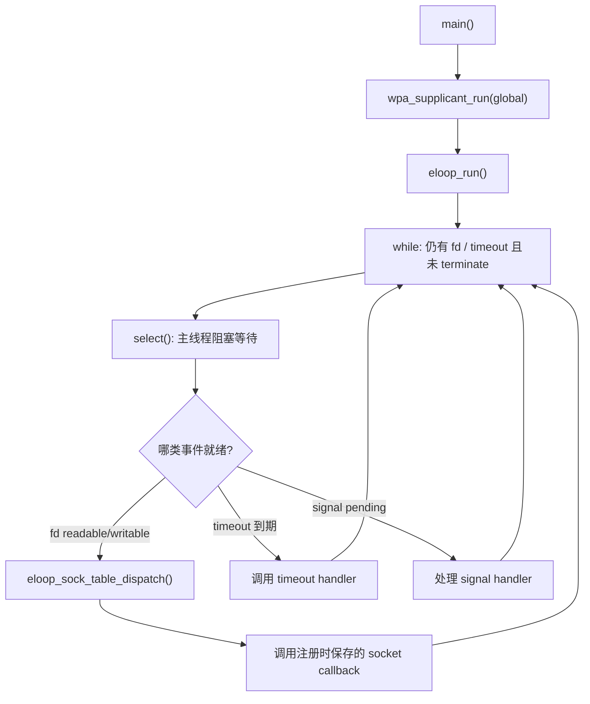
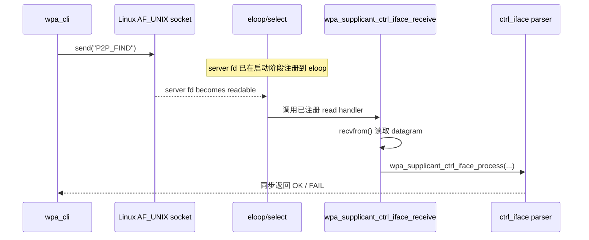

<meta name="referrer" content="no-referrer" />

# Wi-Fi Direct 教程 05：control socket 与 eloop——P2P_FIND 怎样进入 wpa_supplicant 命令解析器

> 摘要：从 interface 初始化后的运行阶段追踪 AF_UNIX control socket、eloop 唤醒、recvfrom() 与 P2P_FIND 命令分发。

[TOC]

`wpa_supplicant` 的 interface 初始化完成后，进程进入事件驱动阶段。本文只追踪 control server：配置中的 `ctrl_interface` 怎样变成 AF_UNIX/SOCK_DGRAM socket，socket fd 怎样注册进 eloop，以及 `wpa_cli` 发出的 `P2P_FIND` datagram 怎样被唤醒、读取并进入 command parser。

`ATTACH` 也属于这个本地 control interface：它只让 control client 订阅异步事件，与空口 Probe Request、WPS IE、P2P IE 的发送无关。

---

## 1. control socket 到底在哪里创建：wpas_ctrl_iface_open_sock()

当前 Linux/UNIX 构建走的是：

```text
wpa_supplicant/ctrl_iface_unix.c
```

`wpa_supplicant_ctrl_iface_init(wpa_s)` 先分配 per-interface private context：

```c
/* 执行路径阅读版。 */
priv = os_zalloc(sizeof(*priv));
priv->wpa_s = wpa_s;
priv->sock = -1;

if (wpa_s->conf->ctrl_interface == NULL)
    return priv;

if (wpas_ctrl_iface_open_sock(wpa_s, priv) < 0)
    return NULL;
```

由于 `p2p-a.conf` 已经配置：

```ini
ctrl_interface=/run/wpa_supplicant-p2p-a
```

所以不会走“没有 control interface”的提前返回，而是继续进入：

```text
wpas_ctrl_iface_open_sock(wpa_s, priv)
```

### 1.1 socket 是 AF_UNIX / SOCK_DGRAM

当前最关键的创建语句是：

```c
priv->sock = socket(PF_UNIX, SOCK_DGRAM, 0);
```

这与上一篇 `wpa_cli` 客户端创建的 socket 属于同一种本机 IPC：

```text
UNIX Domain Socket
SOCK_DGRAM
```

它不是：

```text
802.11 无线 socket
nl80211 socket
IP UDP socket
远端 P2P peer socket
```

它只负责本机：

```text
wpa_cli process
    <->
wpa_supplicant process
```

之间的 control plane 命令与回复。

### 1.2 server socket 的 pathname 是怎样拼出来的

`wpas_ctrl_iface_open_sock()` 会调用：

```text
wpa_supplicant_ctrl_iface_path(wpa_s)
```

该 helper 的核心关系是：

```c
/* 执行路径阅读版。 */
res = os_snprintf(buf, len, "%s/%s", dir, wpa_s->ifname);
```

当前两个输入分别是：

```text
dir            = /run/wpa_supplicant-p2p-a
wpa_s->ifname  = wlan0
```

因此最终 pathname 是：

```text
/run/wpa_supplicant-p2p-a/wlan0
```

如果 `$P2P_A` 不是 `wlan0`，最后一段就换成实际 interface 名。

所以配置里的：

```text
ctrl_interface=/run/wpa_supplicant-p2p-a
```

严格来说是**目录**，不是最终 socket 文件名。

最终 per-interface control socket 是：

```text
ctrl_interface directory + "/" + ifname
```

这正好和上一篇 `wpa_cli` 的连接目标闭合：

```text
wpa_cli -p /run/wpa_supplicant-p2p-a -i wlan0
                         │               │
                         └──────┬────────┘
                                ↓
             /run/wpa_supplicant-p2p-a/wlan0
```

### 1.3 bind() 让这个 pathname 真正属于 server socket

得到 pathname 之后，server 调用：

```c
bind(priv->sock, (struct sockaddr *) &addr, sizeof(addr));
```

从这一刻开始：

```text
/run/wpa_supplicant-p2p-a/wlan0
```

就是当前 `wpa_supplicant` per-interface control socket 的服务端地址。

如果路径已经存在，源码还会区分：

- 另一个进程确实正在使用；
- 上一次异常退出留下了 stale socket；

当前主线只需要知道：成功启动后一定要有一次成功的 `bind()`，否则这个 per-interface control interface 无法建立。

### 1.4 socket 还会被设成 non-blocking

成功 `bind()` 后，`wpas_ctrl_iface_open_sock()` 会读取 fd flags，并加入：

```text
O_NONBLOCK
```

这并不意味着整个 `wpa_supplicant` 在 busy loop 中不断 `recvfrom()`。

恰恰相反，长期等待由 `eloop` 负责。socket 设置为 non-blocking 后，真正的读取只在事件循环判断 fd 已经可读时执行。

接下来就是本篇最关键的一句注册代码。

---

<a id="idx-eloop-register"></a>

## 2. 谁把 socket fd 注册进 eloop：还是 wpas_ctrl_iface_open_sock()

socket 创建和 `bind()` 完成后，`wpas_ctrl_iface_open_sock()` 直接执行：

```c
eloop_register_read_sock(priv->sock,
                         wpa_supplicant_ctrl_iface_receive,
                         wpa_s,
                         priv);
```

这句同时建立了四个运行时关系：

| 注册参数 | 当前含义 |
|---|---|
| `priv->sock` | 刚刚 `bind()` 的 server UNIX datagram fd |
| `wpa_supplicant_ctrl_iface_receive` | fd 可读时要调用的 handler |
| `wpa_s` | handler 的 `eloop_ctx` |
| `priv` | handler 的 `sock_ctx` |

因此以后真正回调时，函数签名：

```c
wpa_supplicant_ctrl_iface_receive(int sock,
                                  void *eloop_ctx,
                                  void *sock_ctx)
```

可以直接还原成：

```text
sock      = priv->sock
eloop_ctx = wpa_s
sock_ctx  = priv
```

这不是“函数名被记住”这么简单，而是在启动阶段就把：

```text
fd
+
callback
+
interface context
+
ctrl_iface private context
```

绑定成一个 eloop reader registration。

### 2.1 eloop_register_read_sock() 最终把什么存起来

`src/utils/eloop.c` 中：

```c
int eloop_register_read_sock(int sock, eloop_sock_handler handler,
                             void *eloop_data, void *user_data)
{
    return eloop_register_sock(sock, EVENT_TYPE_READ, handler,
                               eloop_data, user_data);
}
```

`EVENT_TYPE_READ` 最终对应 `eloop.readers` 表。

也就是说，注册完成之后可以建立这样的心智模型：

```text
eloop.readers
    ↓
[ server ctrl fd ]
    handler    = wpa_supplicant_ctrl_iface_receive
    eloop_data = wpa_s
    user_data  = priv
```

所以以后真正唤醒时不需要重新搜索“这个 fd 应该交给谁”。注册阶段已经把 dispatch 信息保存好了。

### 2.2 同一个函数里注册的 wpa_supplicant_ctrl_iface_msg_cb() 不是接收 handler

`wpas_ctrl_iface_open_sock()` 紧接着还有一句：

```c
wpa_msg_register_cb(wpa_supplicant_ctrl_iface_msg_cb);
```

它和前面的：

```c
eloop_register_read_sock(priv->sock,
                         wpa_supplicant_ctrl_iface_receive,
                         wpa_s,
                         priv);
```

职责完全不同。

可以先把两条方向分开：

| callback | 数据方向 | 什么时候使用 |
|---|---|---|
| `wpa_supplicant_ctrl_iface_receive()` | client -> server | control socket 收到命令 datagram，fd 可读时由 eloop 调用 |
| `wpa_supplicant_ctrl_iface_msg_cb()` | server -> attached monitor | `wpa_msg()` 等产生异步事件，需要发给已经 `ATTACH` 的 control client 时调用 |

`wpa_supplicant_ctrl_iface_msg_cb()` 会查看 global/per-interface 的 `ctrl_dst` 列表；只有存在已经 attach 的 monitor，它才会通过 `wpa_supplicant_ctrl_iface_send()` 把事件发出去。发送缓冲区拥塞时，它还会把事件放入 `msg_queue`，再用 0 秒 timeout 延后发送。

所以当前一次性命令：

```text
wpa_cli p2p_find
```

的同步 `OK/FAIL` **不是**由 `wpa_supplicant_ctrl_iface_msg_cb()` 返回的，而是后面 `wpa_supplicant_ctrl_iface_receive()` 处理完命令后直接 `sendto()` 给请求方。

这个 callback 是异步 scan 完成桥接的一部分，例如：

```text
P2P-DEVICE-FOUND
```

这样的异步事件最终需要沿“事件通知”方向送给 attach 的 control monitor。这里先建立方向即可，不提前展开事件产生链。

---

<a id="idx-run"></a>

## 3. wpa_supplicant_run()：server 终于进入自己的 eloop_run()

`wpa_supplicant_add_iface()` 返回以后，`main()` 最终来到：

```c
exitcode = wpa_supplicant_run(global);
```

先把当前 2.12 与本实验相关的执行路径放在一起。这里裁掉了当前主线不经过的条件编译分支，因此下面是执行路径阅读版：

```c
/* 执行路径阅读版。 */
int wpa_supplicant_run(struct wpa_global *global)
{
    struct wpa_supplicant *wpa_s;

    if (global->params.daemonize &&
        (wpa_supplicant_daemon(global->params.pid_file) ||
         eloop_sock_requeue()))
        return -1;

    if (global->params.wait_for_monitor) {
        for (wpa_s = global->ifaces; wpa_s; wpa_s = wpa_s->next)
            if (wpa_s->ctrl_iface && !wpa_s->p2p_mgmt)
                wpa_supplicant_ctrl_iface_wait(wpa_s->ctrl_iface);
    }

    eloop_register_signal_terminate(wpa_supplicant_terminate, global);
    eloop_register_signal_reconfig(wpa_supplicant_reconfig, global);

    eloop_run();

    return 0;
}
```

当前启动命令没有 `-B`，所以不 daemonize；也没有 `-W`，因此 `wait_for_monitor` 为 0。真正进入长期运行前，当前路径实际执行的是：

```text
注册 SIGINT/SIGTERM
    -> wpa_supplicant_terminate

注册 SIGHUP
    -> wpa_supplicant_reconfig

然后
    -> eloop_run()
```

### 3.1 wpa_supplicant_ctrl_iface_wait() 为什么当前不会执行

`-W` 对应：

```c
case 'W':
    params.wait_for_monitor++;
    break;
```

只有启动时显式带 `-W`，`wpa_supplicant_run()` 才会在进入正常 `eloop_run()` 之前调用：

```text
wpa_supplicant_ctrl_iface_wait()
```

这个函数的用途是**启动同步**：先等待某个 control monitor 发来 `ATTACH`，成功 attach 后才继续启动。内部会调用：

```text
eloop_wait_for_read_sock(priv->sock)
    -> recvfrom()
    -> 只接受 ATTACH
    -> 回复 OK
    -> return
```

因此它不是正常运行期 `P2P_FIND` 的 command receive path，也不会和 `wpa_supplicant_ctrl_iface_receive()` 同时处理当前命令。

当前命令没有 `-W`，所以本实验直接跳过该分支。

### 3.2 两个 signal 注册也是 eloop 的事件入口

```c
eloop_register_signal_terminate(wpa_supplicant_terminate, global);
eloop_register_signal_reconfig(wpa_supplicant_reconfig, global);
```

前者实际注册：

```text
SIGINT
SIGTERM
```

后者在 Linux 上注册：

```text
SIGHUP
```

底层 `eloop_handle_signal()` 不在异步 signal handler 里直接执行复杂 supplicant 逻辑，而是先记录 `signaled` 状态；`eloop_run()` 回到可处理上下文后调用真正的 handler。

高层效果分别是：

```text
SIGINT / SIGTERM
    -> wpa_supplicant_terminate()
    -> wpa_supplicant_terminate_proc()
    -> eloop_terminate()
    -> 主事件循环退出

SIGHUP
    -> wpa_supplicant_reconfig()
    -> 逐 interface 重新加载配置
```

它们与 `P2P_FIND` 的 control socket 数据路径相互独立，但同样解释了为什么 `eloop_run()` 不能被理解成“只负责 socket 的 select 循环”。

完成这些启动分支后，核心动作才是：

```c
eloop_run();
```

这和上一篇一次性 `wpa_cli p2p_find` 的执行方式正好不同。

上一篇 client 侧是：

```text
wpa_cli one-shot command
    -> wpa_ctrl_request()
    -> select()
    -> recv()
```

它虽然也调用过 `eloop_init()`，但同步等待 `P2P_FIND` reply 的地方不是 `eloop_run()`。

本篇 server 侧则是：

```text
wpa_supplicant
    -> wpa_supplicant_run()
    -> eloop_run()
```

并长期停留在事件循环中，等待 socket、timeout、signal 等事件。

### 3.3 一眼记住：`main()` 怎样进入 `eloop_run()`，又怎样分发 callback

这里没有额外的 `eloop thread`。`main()` 在完成全局对象、interface、driver、control socket 等初始化之后，直接调用 `wpa_supplicant_run(global)`；`wpa_supplicant_run()` 再直接调用 `eloop_run()`。这条调用链中没有 `pthread_create()` 或其它“为 eloop 单独创建线程”的动作。[S1](#source-s1)

因此当前进程的主运行模型可以记成下面这张图：



这张图可以直接作为后续所有异步事件的基础心智模型。关键记忆点有三个：

1. `eloop_run()` **没有创建线程**；它就是 `main()` 所在线程进入的长期事件循环；
2. `select()` 阻塞的是 **wpa_supplicant 主线程**，不是某个隐藏 worker thread；
3. callback 不是 Linux kernel 直接调用的。kernel 只改变 fd 的 readiness，`select()` 返回后由 `eloop_run()` 调用 `eloop_sock_table_dispatch()`，再执行注册时保存的 callback。

以 control socket 为例：

```text
control fd readable
    -> select() 返回
    -> eloop_sock_table_dispatch()
    -> wpa_supplicant_ctrl_iface_receive()
```

以后 nl80211 event socket、timeout、signal 等异步来源也复用同一个事件循环模型，所以掌握这里以后，后续看到“注册 fd → 事件到达 → callback”时可以直接套用这张图。

### 3.4 当前构建为什么是 select() backend

`src/utils/eloop.c` 在没有指定其他 backend 时定义：

```c
#if !defined(CONFIG_ELOOP_POLL) && !defined(CONFIG_ELOOP_EPOLL) && \
    !defined(CONFIG_ELOOP_KQUEUE)
#define CONFIG_ELOOP_SELECT
#endif
```

当前项目 Dockerfile 没有启用上述三个 backend，因此这一套 2.12 binary 的服务端等待点实际落到：

```text
select()
```

这里不要把它泛化成“wpa_supplicant 永远使用 select”。

正确表述是：

```text
当前项目构建
    -> 没开 poll/epoll/kqueue backend
    -> eloop.c fallback 到 CONFIG_ELOOP_SELECT
    -> 本实验 wpa_supplicant 的 eloop_run() 使用 select()
```

如果以后更换 `.config`，`eloop` 的外部注册 API 可以保持不变，但内部等待机制可以换成 `poll()`、`epoll_wait()` 或 `kevent()`。

### 3.5 eloop_run() 在等什么

SELECT backend 会把 `eloop.readers` 中的 fd 放进 read fd set，然后阻塞在：

```text
select(max_fd + 1, readfds, writefds, exceptfds, timeout)
```

由于刚才已经执行：

```text
eloop_register_read_sock(server_fd,
                         wpa_supplicant_ctrl_iface_receive,
                         wpa_s,
                         priv)
```

所以当前 control socket fd 已经属于 `select()` 关注的 readable fd 集合。

这时 `wpa_supplicant` 主线程不是在循环执行：

```text
recvfrom()
recvfrom()
recvfrom()
```

而是在：

```text
eloop_run()
    -> select()
    -> sleep/block
```

直到某个已注册事件发生。

---

## 4. wpa_cli send("P2P_FIND") 后，server 为什么会被唤醒

现在可以把上一篇 client 侧的停止点接回来。

上一篇已经确认一次性命令最终执行：

```text
wpa_ctrl_request()
    -> send("P2P_FIND")
```

客户端 socket 已经通过 AF_UNIX datagram control interface 指向：

```text
/run/wpa_supplicant-p2p-a/wlan0
```

服务端则早已：

```text
socket(PF_UNIX, SOCK_DGRAM)
    -> bind("/run/wpa_supplicant-p2p-a/wlan0")
    -> eloop_register_read_sock(server_fd, receive_handler, ...)
    -> eloop_run()
    -> select()
```

两边到此第一次真正接上。



这张图最关键的不是函数数量，而是中间那条**异步桥接**：

```text
client send()
    ↓
Linux kernel 把 datagram 放进 server socket receive queue
    ↓
server fd 变成 readable
    ↓
server 正在阻塞的 select() 返回
    ↓
eloop 根据启动阶段保存的 registration 找到 handler
    ↓
wpa_supplicant_ctrl_iface_receive()
```

所以不能写成：

```text
wpa_cli send()
    -> wpa_supplicant_ctrl_iface_receive()
```

这会把最重要的运行时边界抹掉。

准确关系是：

```text
wpa_cli 进程
    send()
        ↓
Linux kernel AF_UNIX datagram
        ↓
server fd read readiness
        ↓
wpa_supplicant 进程 eloop/select
        ↓
registered handler dispatch
```

### 4.1 Linux kernel 并不会“调用 wpa_supplicant 的 C 函数”

内核负责的是 socket 数据与 readiness：

```text
datagram 到达
    -> receive queue 有数据
    -> fd 可读
    -> select() 返回这个 readiness
```

真正执行：

```c
wpa_supplicant_ctrl_iface_receive(...)
```

的是 `wpa_supplicant` 自己的 eloop dispatch 逻辑。

### 4.2 这里也没有额外创建一个 control thread

当前这条路径里没有：

```text
wpa_cli command
    -> 唤醒 worker thread
    -> worker thread 执行 parser
```

control socket 的 read handler 就是在 `wpa_supplicant` 的 eloop 执行上下文中被调用。

这对后面阅读状态机非常重要：看到一个 ctrl_iface command handler 时，首先应把它理解为**事件循环线程中的同步 command dispatch**，而不是默认假设它已经切换到另一个线程。

---

## 5. eloop 怎样真正调用到 wpa_supplicant_ctrl_iface_receive()

`select()` 返回以后，`eloop_run()` 不会直接硬编码：

```text
if ctrl socket ready then call wpa_supplicant_ctrl_iface_receive
```

它只做通用 dispatch。

SELECT backend 的执行关系可以压缩成：

```c
/* 执行路径阅读版。 */
res = select(eloop.max_sock + 1, rfds, wfds, efds,
             timeout ? &_tv : NULL);

if (res > 0)
    eloop_sock_table_dispatch(&eloop.readers, rfds);
```

reader dispatch 再检查哪个 fd 被 `FD_ISSET()` 标记为 readable，并调用注册时保存的 handler：

```c
/* 执行路径阅读版。 */
if (FD_ISSET(table->table[i].sock, fds)) {
    table->table[i].handler(table->table[i].sock,
                            table->table[i].eloop_data,
                            table->table[i].user_data);
}
```

而第 5 节已经确认，这个 table entry 里保存的是：

```text
sock       = per-interface ctrl fd
handler    = wpa_supplicant_ctrl_iface_receive
eloop_data = wpa_s
user_data  = priv
```

于是运行时等价于：

```text
wpa_supplicant_ctrl_iface_receive(
    server_ctrl_fd,
    wpa_s,
    priv
)
```

到这里，“谁注册 callback”和“为什么最后能进入 callback”已经闭环：

```text
启动阶段：wpas_ctrl_iface_open_sock()
    -> eloop_register_read_sock()
    -> 保存 fd + handler + context

运行阶段：eloop_run()
    -> select() 发现 fd readable
    -> eloop_sock_table_dispatch()
    -> 调用保存的 handler
```

这就是 event loop 程序里最常见的两阶段结构；本篇具体 dispatch 行为以 2.12 `eloop.c` 为准。[S1](#source-s1)

```text
registration phase
    ↓
wait / readiness phase
    ↓
dispatch phase
```

---

<a id="idx-receive"></a>

## 6. wpa_supplicant_ctrl_iface_receive()：recvfrom() 把 datagram 重新变成字符串命令

现在才真正进入：

```text
wpa_supplicant/ctrl_iface_unix.c
wpa_supplicant_ctrl_iface_receive()
```

这个函数的两个 context 参数正是注册时传进来的：

```c
/* 执行路径阅读版。 */
struct wpa_supplicant *wpa_s = eloop_ctx;
struct ctrl_iface_priv *priv = sock_ctx;
```

随后从 server socket 读取 datagram：

```c
/* 执行路径阅读版。 */
res = recvfrom(sock, buf, CTRL_IFACE_MAX_LEN + 1, 0,
               (struct sockaddr *) &from, &fromlen);
buf[res] = '\0';
```

上一篇 client 发送的是：

```text
P2P_FIND
```

因此这次 `recvfrom()` 成功以后，server 侧得到的 `buf` 就是：

```text
"P2P_FIND"
```

注意：

```text
p2p_find
```

已经不存在于这条服务端路径里。

`p2p_find` 是 `wpa_cli` 的 CLI command name；上一篇在 client 侧已经把它转换成 control protocol 的文本命令：

```text
P2P_FIND
```

server parser 只看后者。

### 6.1 ATTACH / DETACH / LEVEL 是 receive 层自己处理的特殊命令

`wpa_supplicant_ctrl_iface_receive()` 会先处理少数 control transport 自身的命令：

```text
ATTACH
DETACH
LEVEL ...
```

它们用于 monitor/event subscription 等 control-interface 行为。

当前 `P2P_FIND` 不属于这些特殊命令，所以会落入普通 command 分支，并调用：

```c
reply_buf = wpa_supplicant_ctrl_iface_process(wpa_s, buf, &reply_len);
```

这就是从 UNIX socket receive 层进入真正 command parser 的桥。

到这里调用链已经变成：

```text
eloop dispatch
    -> wpa_supplicant_ctrl_iface_receive()
    -> recvfrom(): "P2P_FIND"
    -> wpa_supplicant_ctrl_iface_process()
```

---

<a id="idx-process"></a>

## 7. wpa_supplicant_ctrl_iface_process()：真正的 ctrl_iface command parser

parser 位于：

```text
wpa_supplicant/ctrl_iface.c
```

入口是：

```text
wpa_supplicant_ctrl_iface_process(wpa_s, buf, &reply_len)
```

它会先准备一个 reply buffer，并把默认回复初始化为：

```text
OK\n
```

然后进入一条很长的 `if / else if` command dispatch 链，根据 `buf` 的内容决定调用哪个 handler。

这也是为什么这一层应该被理解为：

```text
text command parser / dispatcher
```

而不是 P2P 协议本身。

### 7.1 P2P_FIND 有两个 parser 分支

在 `CONFIG_P2P` 打开的构建里，源码同时处理：

```c
/* 上游连续逻辑的当前命令片段。 */
} else if (os_strncmp(buf, "P2P_FIND ", 9) == 0) {
    if (p2p_ctrl_find(wpa_s, buf + 8))
        reply_len = -1;
} else if (os_strcmp(buf, "P2P_FIND") == 0) {
    if (p2p_ctrl_find(wpa_s, ""))
        reply_len = -1;
```

这两个分支分别对应：

```text
P2P_FIND <arguments>
P2P_FIND
```

上一篇当前实验执行的是：

```bash
sudo wpa_cli-2.12 \
    -p /run/wpa_supplicant-p2p-a \
    -i "$P2P_A" \
    p2p_find
```

没有附加参数，因此 server 收到的是精确字符串：

```text
P2P_FIND
```

命中第二个分支：

```text
p2p_ctrl_find(wpa_s, "")
```

这里有一个很值得注意的接口设计：

```text
control command parser
    ↓
把文本参数区域作为 char *cmd 传给具体 command handler
```

有参数时传：

```text
buf + 8
```

无参数时传：

```text
""
```

所以 `p2p_ctrl_find()` 本身不需要知道 command 是从 `wpa_cli`、脚本还是别的 control-interface client 发来的；它只需要解析 `P2P_FIND` 后面的参数文本。

---

<a id="idx-find-parser"></a>

## 8. client 和 server 两侧的两个 select() 不是同一个东西

连续读完第 02、03 篇以后，最容易混淆的是两个进程都出现了 `select()`。

它们虽然都是系统调用，但执行位置、等待对象、职责完全不同。

| 位置 | 进程 | 谁调用 | 等待什么 | 目的 |
|---|---|---|---|---|
| client | `wpa_cli` | `wpa_ctrl_request()` | client control socket 的 reply/event | 等待当前同步 request 的响应 |
| server | `wpa_supplicant` | `eloop_run()` | 已注册的多种 fd/event | 作为长期事件循环等待新的工作 |

当前一次 `P2P_FIND` 的时序可以写成：

```text
wpa_cli process                         wpa_supplicant process
---------------                         ----------------------

send("P2P_FIND")
       │
       ├──── AF_UNIX datagram ────────> server fd readable
       │                                      │
       │                                      ↓
       │                              eloop select() returns
       │                                      │
       │                                      ↓
client select() waits             ctrl_iface_receive()
       │                                      │
       │                                      ↓
       │                              ctrl_iface_process()
       │                                      │
       │                                      ↓
       │                                p2p_ctrl_find()
       │                                      │
       │                                      ↓
       │                                wpas_p2p_find()
       │                                      │
       │<────────────── OK ─────────── sendto()
       ↓
recv("OK")
```

这条时序里没有“两个 `select()` 互相通信”。

真正负责跨进程传输的是：

```text
AF_UNIX SOCK_DGRAM socket
```

两个 `select()` 只是各自在自己的进程里等待对应 fd 的 readiness。

---

<a id="idx-full"></a>

## 9. 本篇边界：命令已经进入 server parser

到这里，`P2P_FIND` 已经完成了 Linux AF_UNIX datagram → eloop readable event → `wpa_supplicant_ctrl_iface_receive()` → `wpa_supplicant_ctrl_iface_process()` 的服务端控制路径。parser 已经识别这是 P2P 命令；后续参数转换和 P2P 子系统调用不属于 control socket / eloop 本身。

## 关键源码索引

| 关键对象 / 符号 | 作用 | Git 源码 |
|---|---|---|
| `wpas_ctrl_iface_open_sock()` | 创建并绑定 control socket | [ctrl_iface_unix.c](https://chromium.googlesource.com/chromiumos/third_party/hostap/+/refs/tags/hostap_2_12/wpa_supplicant/ctrl_iface_unix.c) |
| `eloop_register_read_sock()` | 注册可读事件 | [eloop.c](https://chromium.googlesource.com/chromiumos/third_party/hostap/+/refs/tags/hostap_2_12/src/utils/eloop.c) |
| `wpa_supplicant_run()` / `eloop_run()` | 进入 server event loop | [wpa_supplicant.c](https://chromium.googlesource.com/chromiumos/third_party/hostap/+/refs/tags/hostap_2_12/wpa_supplicant/wpa_supplicant.c) |
| `wpa_supplicant_ctrl_iface_receive()` | `recvfrom()` 读取 datagram | [ctrl_iface_unix.c](https://chromium.googlesource.com/chromiumos/third_party/hostap/+/refs/tags/hostap_2_12/wpa_supplicant/ctrl_iface_unix.c) |
| `wpa_supplicant_ctrl_iface_process()` | control command parser | [ctrl_iface.c](https://chromium.googlesource.com/chromiumos/third_party/hostap/+/refs/tags/hostap_2_12/wpa_supplicant/ctrl_iface.c) |

## 资料来源

<a id="source-s1"></a>
### [S1] hostap 2.12 Git：wpa_supplicant server/control/P2P 初始化
- 版本：[`hostap_2_12` / `831364bf02710ad09c2f27d3efa92abeeb5634c0`](https://chromium.googlesource.com/chromiumos/third_party/hostap/+/refs/tags/hostap_2_12)
- 文件：[main.c](https://chromium.googlesource.com/chromiumos/third_party/hostap/+/refs/tags/hostap_2_12/wpa_supplicant/main.c)、[wpa_supplicant.c](https://chromium.googlesource.com/chromiumos/third_party/hostap/+/refs/tags/hostap_2_12/wpa_supplicant/wpa_supplicant.c)、[ctrl_iface_unix.c](https://chromium.googlesource.com/chromiumos/third_party/hostap/+/refs/tags/hostap_2_12/wpa_supplicant/ctrl_iface_unix.c)、[ctrl_iface.c](https://chromium.googlesource.com/chromiumos/third_party/hostap/+/refs/tags/hostap_2_12/wpa_supplicant/ctrl_iface.c)、[p2p_supplicant.c](https://chromium.googlesource.com/chromiumos/third_party/hostap/+/refs/tags/hostap_2_12/wpa_supplicant/p2p_supplicant.c)、[wps_supplicant.c](https://chromium.googlesource.com/chromiumos/third_party/hostap/+/refs/tags/hostap_2_12/wpa_supplicant/wps_supplicant.c)、[p2p.c](https://chromium.googlesource.com/chromiumos/third_party/hostap/+/refs/tags/hostap_2_12/src/p2p/p2p.c)、[eloop.c](https://chromium.googlesource.com/chromiumos/third_party/hostap/+/refs/tags/hostap_2_12/src/utils/eloop.c)
- 使用位置：第 1～16 节，重点为 3.1～3.5
- 支撑内容：server main/init/add-iface/control socket/eloop/parser 主链，以及 `wpa_supplicant_init_iface() -> wpas_p2p_init()` 和 callback 绑定。
