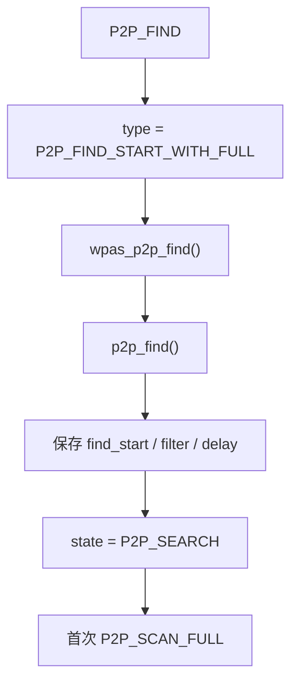
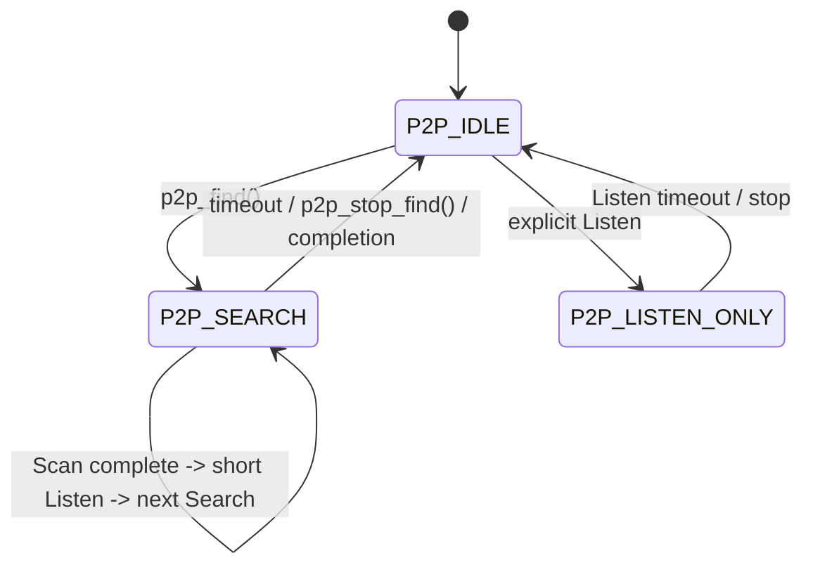
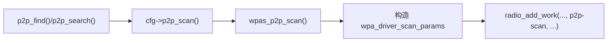

<meta name="referrer" content="no-referrer" />

# Wi-Fi Direct 教程 06：P2P_FIND 进入 P2P Core——Social Channels、P2P_SEARCH 与第一轮扫描决策

> 摘要：从 p2p_ctrl_find() 追踪 P2P_FIND 参数、wpas_p2p_find()、p2p_find()、扫描模式与 P2P_SEARCH，直到 Core 请求第一轮 scan。

[TOC]

control parser 已经识别 `P2P_FIND`。本文从 `p2p_ctrl_find()` 开始：先把文本参数转换为 `wpas_p2p_find()` 的结构化参数，再进入 P2P Core 的 `p2p_find()`，解释 Social Channels、`P2P_FIND_START_WITH_FULL`、`enum p2p_scan_type` 与 `P2P_SEARCH` 状态怎样共同决定第一轮扫描请求。

这里关注的是“P2P Core 为什么决定要 scan”，而不是 driver 如何执行 scan。

---

## 1. p2p_ctrl_find()：把 P2P_FIND 的文本参数变成 wpas_p2p_find() 参数

这段 control parser 与 P2P glue 调用链以 hostap 2.12 `ctrl_iface.c`、`p2p_supplicant.c` 为依据。[S1](#source-s1)

`p2p_ctrl_find()` 仍然位于：

```text
wpa_supplicant/ctrl_iface.c
```

它是 control interface 与 P2P supplicant 层之间的参数适配器。

当前无参数命令：

```text
P2P_FIND
```

进入：

```text
p2p_ctrl_find(wpa_s, "")
```

后，可以按当前分支投影成下面的执行路径阅读版：

```c
/* 执行路径阅读版：当前 cmd == ""。 */
unsigned int timeout = atoi(cmd);
enum p2p_discovery_type type = P2P_FIND_START_WITH_FULL;
unsigned int search_delay;
int freq = 0;
bool include_6ghz = false;

search_delay = wpas_p2p_search_delay(wpa_s);

return wpas_p2p_find(wpa_s,
                     timeout,
                     type,
                     0, NULL,
                     NULL,
                     search_delay,
                     0, NULL,
                     freq,
                     include_6ghz);
```

这里不展开 `wpas_p2p_find()` 内部状态机，只关注参数如何从文本命令变成函数调用。

当前无参数 `P2P_FIND` 可以整理成：

| 参数 | 当前来源/结果 | 当前含义 |
|---|---|---|
| `timeout` | `atoi("")` -> `0` | 没有显式传 timeout |
| `type` | 默认 `P2P_FIND_START_WITH_FULL` | 使用默认 discovery type |
| requested device type | 未指定 | 不加该过滤条件 |
| `dev_id` | 未指定 | 不指定目标 device ID |
| `search_delay` | `wpas_p2p_search_delay(wpa_s)` | 由 supplicant 当前配置/状态 helper 给出 |
| `seek` | 未指定 | 没有 service seek string |
| `freq` | `0` | 没有显式指定频率 |
| `include_6ghz` | `false` | 当前 command 没有 `include_6ghz` 参数 |

如果以后执行：

```text
P2P_FIND 10 type=social freq=2412
```

仍然会先进入同一个 `p2p_ctrl_find()`，只是这一次 `cmd` 不再为空，它会解析 timeout、discovery type、frequency 等参数后，再调用同一个：

```text
wpas_p2p_find()
```

所以从架构职责看：

```text
wpa_supplicant_ctrl_iface_process()
    = command name dispatch

p2p_ctrl_find()
    = P2P_FIND command argument parser / adapter

wpas_p2p_find()
    = wpa_supplicant P2P subsystem entry
```

三层职责不要混在一起。

---

<a id="idx-wpas-find"></a>

## 2. P2P_FIND 最终到达 wpas_p2p_find()

最终进入：

```text
wpa_supplicant/p2p_supplicant.c
wpas_p2p_find()
```

入口函数签名接收的已经不是字符串 command，而是解析后的结构化参数：

```text
wpa_s
 timeout
 discovery type
 requested device type filter
 device ID filter
 search delay
 seek strings
 frequency
 include_6ghz
```

这说明 control interface 文本协议已经在上一层结束。

`wpas_p2p_find()` 开头会先处理 supplicant/P2P 当前状态，例如：

```c
/* 执行路径阅读版：只展示进入 P2P core 前的关键 gate。 */
wpas_p2p_clear_pending_action_tx(wpa_s, false);
wpa_s->global->p2p_long_listen = 0;

if (wpa_s->global->p2p_disabled ||
    wpa_s->global->p2p == NULL ||
    wpa_s->p2p_in_provisioning)
    return -1;

wpa_supplicant_cancel_sched_scan(wpa_s);

return p2p_find(wpa_s->global->p2p, timeout, type,
                num_req_dev_types, req_dev_types, dev_id,
                search_delay, seek_cnt, seek_string, freq,
                include_6ghz);
```

到这里，本篇目标已经完成。

因为研究计划的阶段 1 明确停止在：

```text
wpas_p2p_find()
```

附近。

接下来的：

```text
p2p_find()
    -> src/p2p/p2p.c
    -> Search / Listen / Scan
    -> peer discovery
    -> P2P-DEVICE-FOUND
```

`p2p_find()` 内部属于 P2P Core 运行机制，不在本篇展开。这里的停止点是有意的边界：本文只回答 control command 怎样从另一个进程进入 supplicant 并到达 `wpas_p2p_find()`。

---

## 3. 为什么 wpa_cli 很快收到 OK，但这不代表已经发现 Peer

把 parser 的返回路径再补完整，会看到一个非常重要的语义边界。

`wpa_supplicant_ctrl_iface_process()` 在进入 command dispatch 前，默认准备：

```text
OK\n
```

如果当前：

```text
p2p_ctrl_find()
    -> wpas_p2p_find()
```

同步返回成功，那么 `reply_len` 保持成功状态，`wpa_supplicant_ctrl_iface_receive()` 会把这个 reply 通过：

```text
sendto()
```

发回原来的 client address。

如果 handler 同步返回失败，parser 会把负的 `reply_len` 转成：

```text
FAIL\n
```

所以当前 `wpa_cli` 看到：

```text
OK
```

正确含义是：

> `P2P_FIND` 这个 control command 已经被服务端同步接受，并成功进入了 P2P find 启动路径。

它**不等价于**：

```text
已经发现另一个 P2P Device
已经收到 Probe Response
已经生成 P2P-DEVICE-FOUND
已经建立 P2P Group
```

这些属于 `wpas_p2p_find()` 返回后的异步 P2P 运行过程，不在本篇范围。

于是 client 和 server 两侧可以形成两个不同时间尺度：

```text
同步 control request/reply：
P2P_FIND
    -> wpas_p2p_find() 接受启动请求
    -> OK

异步 P2P discovery：
wpas_p2p_find()
    -> p2p_find()
    -> scan/search/listen
    -> peer discovered
    -> P2P-DEVICE-FOUND event
```

这也解释了为什么上一篇一次性 `wpa_cli` 能在 `wpa_ctrl_request()` 中很快收到 `OK` 并退出，而真正的 Wi-Fi Direct Discovery 仍然由后台运行的 `wpa_supplicant` 继续执行。

---

## 4. 先把“Social Channels”说清楚：它不是“常用 Wi-Fi 信道”的泛称

Wi-Fi Direct 的 Device Discovery 不是每轮都把所有可用信道完整扫描一遍。这里的 **peer** 就是“本机正在发现、准备与之建立 P2P 关系的另一台 P2P Device”；peer 进入 `p2p->devices` 后，才成为本机 P2P Core 持有的 peer entry。P2P 规范定义了一组 **Social Channels**，用于让尚未建立联系的 P2P Device 更容易在有限的公共集合上相遇。经典 2.4 GHz Social Channels 是 **1、6、11**；Hostap 的 P2P API 说明也明确把 `P2P_SCAN_SOCIAL` 定义为扫描这三个 social channels。[S2](#source-s2) [S4](#source-s4)

这里的“Social”可以理解为“双方默认都会去的会合信道集合”，不是：

- RSSI 最好的三个信道；
- 当前国家一定最空闲的三个信道；
- 业务数据最终只能工作的三个信道；
- GO 最终 Operating Channel 必须从 1/6/11 选。

它服务的是 **Device Discovery 的 rendezvous（会合）效率**。

### 4.1 为什么代码里是 2412、2437、2462，而不是 1、6、11

Driver scan API 使用 MHz 频率，而 P2P 规范/Operating Class 更常用 channel number。Hostap 的 channel-to-frequency 辅助函数在 2.4 GHz Operating Class 81 中按：

```text
freq_MHz = 2407 + 5 * channel
```

换算。[S5](#source-s5)

于是：

| Channel | 计算 | 中心频率 |
|---:|---:|---:|
| 1 | `2407 + 5 * 1` | 2412 MHz |
| 6 | `2407 + 5 * 6` | 2437 MHz |
| 11 | `2407 + 5 * 11` | 2462 MHz |

因此在 2.12 glue 层能直接看到：

```c
int social_channels_freq[] = { 2412, 2437, 2462, 60480 };
```

前三个就是 2.4 GHz channel 1/6/11 的 MHz 表示；`60480` 对应 60 GHz P2P social channel 支持路径。当前实验使用 `mac80211_hwsim` 的常规 2.4/5 GHz 能力时，实际最重要的是前三个。[S1](#source-s1)

### 4.2 为什么 1、6、11 经常同时被称为“不重叠信道”，但这里不能混为同一个原因

在 20 MHz 2.4 GHz Wi-Fi 规划中，1/6/11 常被用于减少相邻信道重叠；但 **Wi-Fi Direct 把 1/6/11 设为 Social Channels 是 P2P Device Discovery 的协议会合规则**。两件事最终碰巧使用同一组数字，但解释问题不同。

本篇后面看到：

```c
freq == 2412 || freq == 2437 || freq == 2462
```

时，应优先结合当前 P2P Discovery 上下文理解成“是否位于 2.4 GHz social channel”，不能只解释成普通 WLAN 信道规划。

---

## 5. 已初始化的 callback 怎样成为 P2P Core 的“出口”

`wpas_p2p_init()` 已经在 interface 初始化阶段完成 callback 绑定；Device Discovery 直接使用其中以下几项：[S1](#source-s1) [S2](#source-s2)

```c
p2p.cb_ctx = wpa_s;
p2p.p2p_scan = wpas_p2p_scan;
p2p.dev_found = wpas_dev_found;
p2p.dev_lost = wpas_dev_lost;
p2p.find_stopped = wpas_find_stopped;
p2p.start_listen = wpas_start_listen;
p2p.stop_listen = wpas_stop_listen;
p2p.send_probe_resp = wpas_send_probe_resp;
```

`p2p_init(&p2p)` 把这份配置保存进 P2P Core context，最终由：

```text
wpa_s->global->p2p
```

持有。因此下面这些调用都能确定真实目标：

| P2P Core 中的调用 | 当前 wpa_supplicant 2.12 实际目标 | 本篇职责 |
|---|---|---|
| `p2p->cfg->p2p_scan(...)` | `wpas_p2p_scan()` | 把 Core 的 Scan 请求转换成 driver scan |
| `p2p->cfg->start_listen(...)` | `wpas_start_listen()` | 请求 remain-on-channel / Listen |
| `p2p->cfg->stop_listen(...)` | `wpas_stop_listen()` | 结束 Listen |
| `p2p->cfg->dev_found(...)` | `wpas_dev_found()` | 把完整 peer 信息报告给 supplicant/control layer |

所以本篇会反复跨越同一条边界：


理解这张图以后，后面的“Core 请求扫描 -> glue 触发 driver -> 结果回来 -> glue 再喂给 Core”就不会被误解成一个同步函数调用栈。

---

<a id="idx-find-entry"></a>

## 6. 从 `wpas_p2p_find()` 进入 `p2p_find()`：默认类型必须是 `P2P_FIND_START_WITH_FULL`

control 层传入无参数 `P2P_FIND` 时：

```text
P2P_FIND
```

进入 `p2p_ctrl_find()` 时，默认 discovery type 是：

```c
enum p2p_discovery_type type = P2P_FIND_START_WITH_FULL;
```

所以默认路径不能只写成“Full”或者模糊的“默认扫描模式”，应明确写成：

```text
P2P_FIND_START_WITH_FULL
```

`type=social` 才会改成：

```text
P2P_FIND_ONLY_SOCIAL
```

`type=progressive` 则是：

```text
P2P_FIND_PROGRESSIVE
```

Hostap 的 README-P2P 对这三类控制行为给出了直接说明：默认先做一次 Full Scan，之后主要搜索 Social Channels；`type=social` 跳过首次 Full Scan；`type=progressive` 在后续 Search round 中逐步附加其它信道。[S6](#source-s6)

### 6.1 `p2p_discovery_type` 与 `p2p_scan_type` 是两层枚举

这是很容易混淆的地方。

`p2p_discovery_type` 描述的是 **整次 P2P_FIND 的策略**：

| Discovery type | 谁选择 | 整次 Find 的策略 |
|---|---|---|
| `P2P_FIND_START_WITH_FULL` | 无参数 `P2P_FIND` 默认 | 首次 Full；随后进入 Search/Listen 循环，通常 Social Scan |
| `P2P_FIND_ONLY_SOCIAL` | `type=social` | 从第一轮开始就只扫描 Social Channels |
| `P2P_FIND_PROGRESSIVE` | `type=progressive` | 首次 Full，后续轮次逐步把其它 channel 加进 Search |

而 `p2p_scan_type` 是 **某一次具体 scan request 的扫描范围**。一个 `P2P_FIND_START_WITH_FULL` 生命周期中可以先出现 `P2P_SCAN_FULL`，后面又出现很多次 `P2P_SCAN_SOCIAL`。

---

<a id="idx-p2p-find"></a>

## 7. `p2p_find()` 做了什么：建立本轮 Find 上下文并进入 `P2P_SEARCH`

`wpas_p2p_find()` 在取消可能冲突的 sched scan、检查 `p2p_disabled/global->p2p/p2p_in_provisioning` 后，最终调用：

```text
p2p_find(global->p2p, ...)
```

P2P Core 的 `p2p_find()` 主要完成四类工作。[S3](#source-s3)

### 7.1 保存本轮 Find 的过滤条件和时间基准

Core 会记录：

- `find_type`；
- requested device type；
- 指定 `dev_id`；
- `search_delay`；
- 首次指定 `freq`；
- `find_start` 时间。

`find_start` 后面非常关键，因为 Linux/cfg80211 或 driver 可能保留旧 BSS scan cache。P2P Core 不希望把“本次 P2P_FIND 开始之前就缓存的旧帧”误报为新发现，所以扫描结果进入 Core 后会把每条 result 的接收时间与 `find_start` 比较。

### 7.2 清理上一轮 Discovery 的临时状态

包括停止旧 Listen、取消/覆盖 Find timeout、清掉上一轮 peer 的 `reported` 状态等。这里的目的不是删除 peer table，而是让新的一轮 Find 可以重新报告仍然存在的设备。

### 7.3 状态切到 `P2P_SEARCH`

核心状态变化是：

```text
state = P2P_SEARCH
```

这才是 Device Discovery 的 P2P Core 主状态。

### 7.4 根据 discovery type 发起第一轮 scan

默认 `P2P_FIND_START_WITH_FULL` 且没有指定首个 `freq` 时，第一轮请求：

```text
P2P_SCAN_FULL
```

所以本篇主线开端应准确理解为：



---

<a id="idx-state"></a>

## 8. Device Discovery 相关状态不能只列名字：看 `P2P_IDLE` / `P2P_SEARCH` 与短 Listen 的关系

`enum p2p_state` 中还包含其它 P2P 运行阶段，但本文只解释 Device Discovery 真正经过或直接影响的状态，避免把其它协议阶段提前混入。

对正常 `P2P_FIND` 主线而言，核心状态只有：

| 状态 | 本文中的作用 | 进入条件 | 离开条件 |
|---|---|---|---|
| `P2P_IDLE` | P2P Core 没有正在执行 Find | 初始/Find 结束 | `p2p_find()` 接受新的 Find 请求 |
| `P2P_SEARCH` | Device Discovery 正在运行 | `p2p_find()` 调用 `p2p_set_state(p2p, P2P_SEARCH)` | Find timeout、显式停止或其它终止条件 |
| `P2P_LISTEN_ONLY` | 显式 Listen-only 操作 | 只有单独 Listen 请求才进入 | Listen timeout/停止 |

正常 Find 中的 **短 Listen 并不会把 `p2p->state` 改成 `P2P_LISTEN_ONLY`**。它仍然属于 `P2P_SEARCH` 生命周期，只是 radio 此刻执行 remain-on-channel/Listen 动作。这个区别是理解 Search / Scan / Listen 的关键。[S1](#source-s1) [S2](#source-s2)



这张图只描述本篇 Device Discovery 需要的状态迁移。后文出现的 `pending_listen_freq`、`in_listen`、`drv_in_listen` 等字段用于记录短 Listen 的异步 radio 上下文，而不是创建一个新的 Find state。

### 8.1 Search / Scan / Listen 不是三个同级状态

必须区分三层概念：

- `P2P_SEARCH`：P2P Core 的 **state**；
- `P2P_SCAN_*`：Search 中下一次 scan 的 **scan mode**；
- short Listen：Search 生命周期里的一次 **radio operation**。

因此文章不能画成 `SEARCH -> SCAN -> LISTEN` 三个同级 `enum p2p_state`。真正的关系是 `P2P_SEARCH` 持续存在，内部轮换不同 radio operation。

### 8.2 Search 与短 Listen 的轮转由 callback/timeout 推进

一次 scan 完成后，supplicant glue 逐条提交 scan result，再调用 `p2p_scan_res_handled()`；P2P Core 随后进入 `p2p_continue_find()`，根据当前 Find 状态决定是否安排短 Listen。Listen 完成后，driver/eloop callback 再推进下一轮 Search。本文后面会把这两处异步桥接按真实调用顺序展开。

<a id="idx-scan-type"></a>

## 9. 四种 `p2p_scan_type` 到底有什么区别

2.12 glue 层实际处理四种 scan request：[S1](#source-s1) [S2](#source-s2)

```c
enum p2p_scan_type {
    P2P_SCAN_SOCIAL,
    P2P_SCAN_FULL,
    P2P_SCAN_SPECIFIC,
    P2P_SCAN_SOCIAL_PLUS_ONE
};
```

它们应按“扫描范围、触发原因、收益、代价”理解，而不是只翻译枚举名。

| Scan type | `wpas_p2p_scan()` 的 `freqs` | 典型触发 | 优点 | 代价/限制 | 适合场景 |
|---|---|---|---|---|---|
| `P2P_SCAN_FULL` | `NULL`，交给 driver 扫支持范围 | 默认 Find 的首次扫描 | 覆盖广，能发现不在 social channel 上运行的 GO/BSS | 扫描时间和 radio 占用更高 | `P2P_FIND_START_WITH_FULL` 首轮 |
| `P2P_SCAN_SOCIAL` | 2412/2437/2462 + 平台支持的 social freq | Find 的常规 Search round | 快，双方容易在公共集合相遇 | 只看 social channels，可能暂时漏掉其它工作信道上的 GO | Discovery 循环的主要 Search |
| `P2P_SCAN_SPECIFIC` | `[freq, 0]` | 用户/上层明确指定首个频率 | 最快验证一个已知 channel | 覆盖最窄，频率猜错会漏设备 | `P2P_FIND ... freq=<MHz>` 的首轮等 |
| `P2P_SCAN_SOCIAL_PLUS_ONE` | social channels + 一个额外 `freq` | progressive search 或已知额外候选频率 | 保留 social rendezvous，同时逐步扩展覆盖 | 每轮比 pure social 多一个 channel | progressive Find / 指定额外 channel |

因此默认 Find 的典型扫描序列不是：

```text
FULL -> FULL -> FULL -> FULL
```

而更接近：

```text
首次：FULL
后续：SOCIAL
progressive 时：SOCIAL_PLUS_ONE（逐轮换额外信道）
```

这正是“为什么既有 `P2P_FIND_START_WITH_FULL`，又有 `P2P_SCAN_FULL`”的答案：前者控制整个 Find 策略，后者只是某一轮 scan 的实际范围。

---

<a id="idx-scan"></a>

## 10. P2P Core 请求 scan 后，怎样真正进入 `wpas_p2p_scan()`

Core 不直接调用 driver。它执行的是初始化时绑定的：

```text
p2p->cfg->p2p_scan(...)
```

初始化阶段已把该函数指针绑定为：

```text
wpas_p2p_scan()
```

所以真实跨层调用是：



这里还**没有立即调用 `wpa_drv_scan()`**。`wpas_p2p_scan()` 先构造本轮主动扫描需要的 SSID、WPS IE、P2P IE、频率表，然后把真正的 driver scan 放进 radio work scheduler。

---

## 11. 本篇边界：P2P Core 已经决定“需要扫描”

到这里，文本命令参数已经转换为 `wpas_p2p_find()` 参数，P2P Core 已建立本轮 Find 上下文、进入 `P2P_SEARCH`，并通过已绑定的 `p2p_scan` callback 请求 supplicant 发起第一轮 scan。本文停在这个 callback 边界：扫描帧内容怎样构造、radio work 怎样排队以及 driver 何时真正收到 scan request，属于下一层运行机制，不在本篇展开。

## 关键源码索引

| 关键对象 / 符号 | 作用 | Git 源码 |
|---|---|---|
| `p2p_ctrl_find()` | 解析 `P2P_FIND` 参数 | [ctrl_iface.c](https://chromium.googlesource.com/chromiumos/third_party/hostap/+/refs/tags/hostap_2_12/wpa_supplicant/ctrl_iface.c) |
| `wpas_p2p_find()` | supplicant P2P Find 入口 | [p2p_supplicant.c](https://chromium.googlesource.com/chromiumos/third_party/hostap/+/refs/tags/hostap_2_12/wpa_supplicant/p2p_supplicant.c) |
| `p2p_find()` | P2P Core Find 状态初始化 | [p2p.c](https://chromium.googlesource.com/chromiumos/third_party/hostap/+/refs/tags/hostap_2_12/src/p2p/p2p.c) |
| `enum p2p_scan_type` | 扫描策略 | [p2p.h](https://chromium.googlesource.com/chromiumos/third_party/hostap/+/refs/tags/hostap_2_12/src/p2p/p2p.h) |
| `wpas_p2p_scan()` callback | Core 请求 supplicant scan 的桥接 | [p2p_supplicant.c](https://chromium.googlesource.com/chromiumos/third_party/hostap/+/refs/tags/hostap_2_12/wpa_supplicant/p2p_supplicant.c) |

## 资料来源

<a id="source-s1"></a>
### [S1] hostap 2.12 Git：P2P_FIND parser、supplicant glue 与 scan callback
- 版本：[`hostap_2_12` / `831364bf02710ad09c2f27d3efa92abeeb5634c0`](https://chromium.googlesource.com/chromiumos/third_party/hostap/+/refs/tags/hostap_2_12)
- 文件：[ctrl_iface.c](https://chromium.googlesource.com/chromiumos/third_party/hostap/+/refs/tags/hostap_2_12/wpa_supplicant/ctrl_iface.c)、[p2p_supplicant.c](https://chromium.googlesource.com/chromiumos/third_party/hostap/+/refs/tags/hostap_2_12/wpa_supplicant/p2p_supplicant.c)、[wpa_supplicant.c](https://chromium.googlesource.com/chromiumos/third_party/hostap/+/refs/tags/hostap_2_12/wpa_supplicant/wpa_supplicant.c)
- 使用位置：命令参数转换、`wpas_p2p_find()` 与 scan callback 边界
- 支撑内容：`P2P_FIND` 参数如何进入 supplicant/P2P Core，以及 Core 怎样通过 callback 请求扫描。

<a id="source-s2"></a>
### [S2] hostap 2.12 Git：P2P module design
- 来源：[doc/p2p.doxygen](https://chromium.googlesource.com/chromiumos/third_party/hostap/+/refs/tags/hostap_2_12/doc/p2p.doxygen)
- 使用位置：第 2、5、7、25～29 节
- 支撑内容：P2P Core 与 glue callback 契约、scan results 提交与 `p2p_scan_res_handled()` 结束通知的设计。

<a id="source-s3"></a>
### [S3] hostap 2.12 Git：P2P Core / WPS implementation
- 文件：[p2p.c](https://chromium.googlesource.com/chromiumos/third_party/hostap/+/refs/tags/hostap_2_12/src/p2p/p2p.c)、[p2p.h](https://chromium.googlesource.com/chromiumos/third_party/hostap/+/refs/tags/hostap_2_12/src/p2p/p2p.h#360)、[p2p_i.h](https://chromium.googlesource.com/chromiumos/third_party/hostap/+/refs/tags/hostap_2_12/src/p2p/p2p_i.h)、[p2p_utils.c](https://chromium.googlesource.com/chromiumos/third_party/hostap/+/refs/tags/hostap_2_12/src/p2p/p2p_utils.c)、[wps.c](https://chromium.googlesource.com/chromiumos/third_party/hostap/+/refs/tags/hostap_2_12/src/wps/wps.c)、[wps_attr_build.c](https://chromium.googlesource.com/chromiumos/third_party/hostap/+/refs/tags/hostap_2_12/src/wps/wps_attr_build.c)
- 使用位置：第 3～12、18～30 节
- 支撑内容：`p2p_find()`、scan modes、peer table、`p2p_add_device()`、Find Continue/Listen 以及 WPS IE builder 的真实 2.12 实现。

<a id="source-s4"></a>
### [S4] Wi-Fi Alliance Wi-Fi Direct Specification v1.9
- URL/文档：[Wi-Fi Direct Specification v1.9](https://tools.barco.com/kb-downloads/4814/Wi-Fi_Direct_Specification_v1.pdf)
- 版本：2021-10-25 Final Public release
- 使用位置：第 1、5、27～29 节
- 支撑内容：In-band Device Discovery 的 Search/Listen 概念、2.4 GHz Social Channels 1/6/11 与 Listen Channel 规则。

<a id="source-s5"></a>
### [S5] Linux Wireless channel/cfg80211 + hostap channel helper
- URL/文档：[Linux Wireless Channel List](https://wireless.docs.kernel.org/en/latest/en/developers/documentation/channellist.html)、[cfg80211](https://docs.kernel.org/driver-api/80211/cfg80211.html)
- 来源：[hostap p2p_utils.c](https://chromium.googlesource.com/chromiumos/third_party/hostap/+/refs/tags/hostap_2_12/src/p2p/p2p_utils.c)
- 使用位置：第 1.1、10、22.4 节
- 支撑内容：Channel 1/6/11 到 2412/2437/2462 MHz 的对应及 hostap operating class/channel-to-frequency helper。

<a id="source-s6"></a>
### [S6] hostap 2.12 README-P2P
- 来源：[wpa_supplicant/README-P2P](https://chromium.googlesource.com/chromiumos/third_party/hostap/+/refs/tags/hostap_2_12/wpa_supplicant/README-P2P)
- 使用位置：第 3、6、29 节
- 支撑内容：`p2p_find` 默认、`type=social`、`type=progressive` 的对外命令语义。
