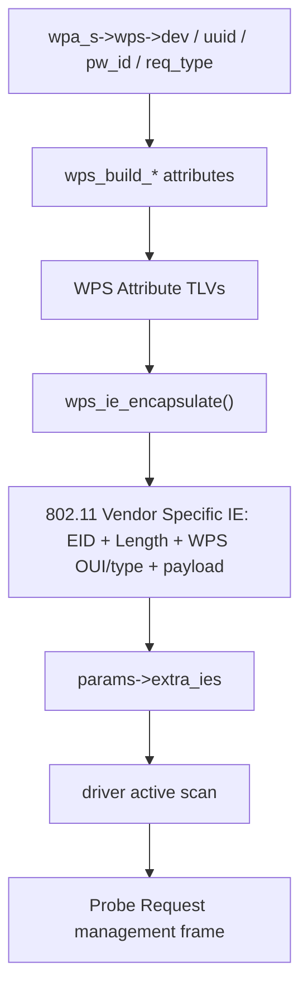
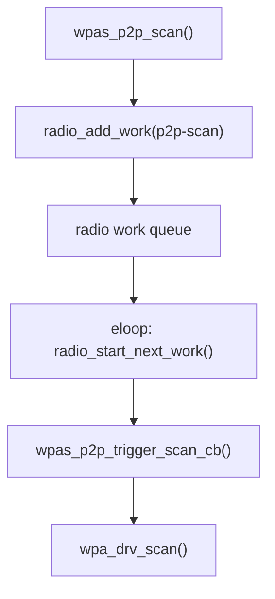
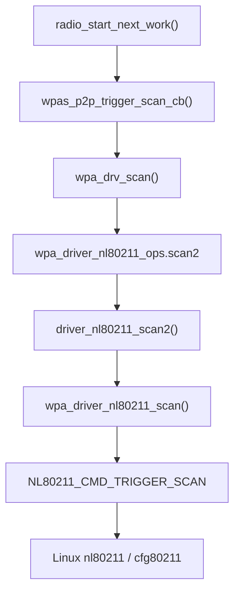
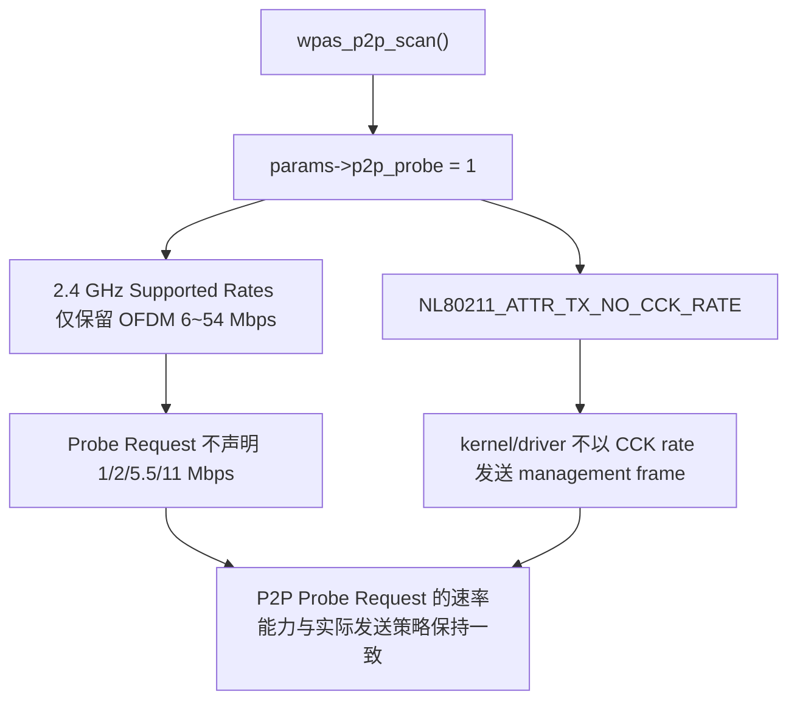
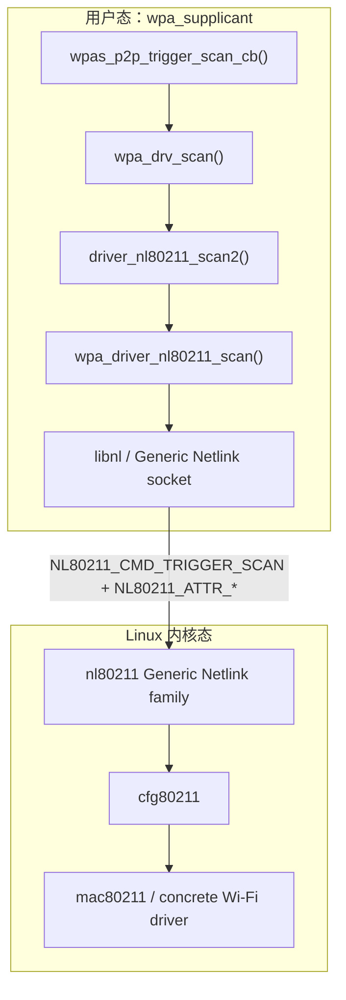
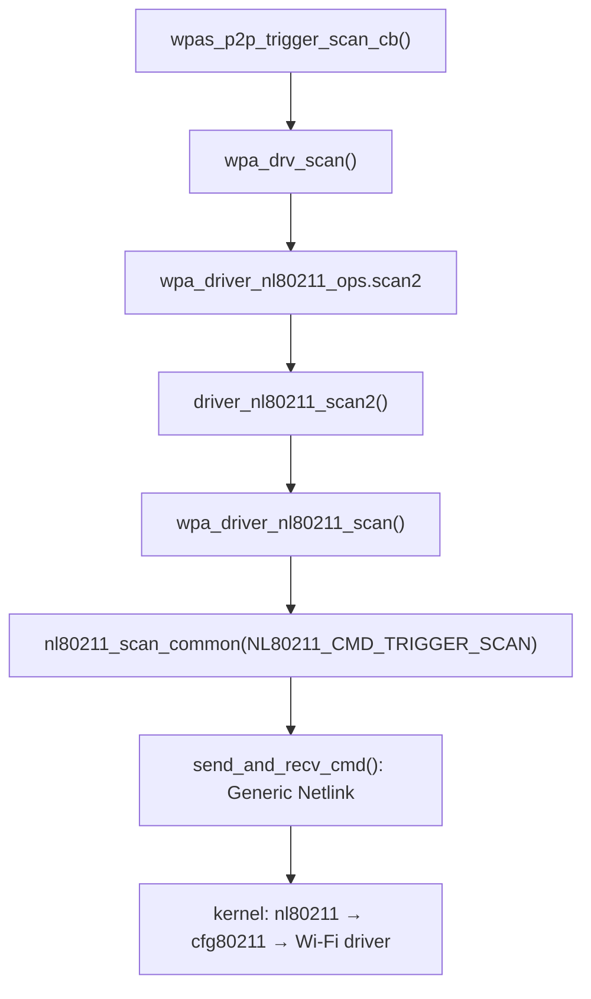

<meta name="referrer" content="no-referrer" />

# Wi-Fi Direct 教程 07：第一次 P2P Scan 如何真正发出——WPS/P2P IE、radio work 与 driver request

> 摘要：追踪 P2P Probe Request、radio work 与 nl80211 扫描提交，解释 no-CCK 速率约束及 Generic Netlink 的用户态/内核态边界。

[TOC]

P2P Core 已经请求第一轮 scan。本文从 `wpas_p2p_scan()` 开始，解释 P2P Wildcard SSID、WPS IE、P2P IE、频段分类与 radio work queue，并继续沿 `wpa_drv_scan()`、`driver_nl80211_scan2()`、`wpa_driver_nl80211_scan()` 追到 `NL80211_CMD_TRIGGER_SCAN` 被提交给 Linux kernel。进入 nl80211 backend 后，还需要回答两个直接影响调用链理解的问题：`p2p_probe` 为什么会禁用 2.4 GHz 的 802.11b legacy rates，以及 Generic Netlink 在用户态与内核无线栈之间究竟承担什么角色。

这也是 `radio_add_work("p2p-scan") → radio work queue → radio_start_next_work()` 的主讲位置。

---

## 1. `wpas_p2p_scan()` 第一步：Probe Request 为什么使用 P2P Wildcard SSID

2.12 中首先构造：

```c
params->num_ssids = 1;
params->ssids[0].ssid = ... P2P_WILDCARD_SSID ...;
params->ssids[0].ssid_len = P2P_WILDCARD_SSID_LEN;
```

这里是在为 **主动扫描的 Probe Request** 准备 SSID。P2P Device Discovery 的 Probe Request 不是普通“只寻找某个已知家庭 WLAN SSID”的扫描，而要寻找具备 P2P 能力的设备/GO，因此使用 P2P wildcard SSID，并同时携带 WPS/P2P Information Elements。[S1](#source-s1) [S2](#source-s2)

下一句：

```c
wpa_s->wps->dev.p2p = 1;
```

告诉 WPS device data：当前构建的是 P2P 场景需要的 WPS 信息。

接下来进入用户特别关心的：

```text
wps_build_probe_req_ie()
```

---

<a id="idx-wps-ie"></a>

## 2. `wps_build_probe_req_ie()` 到底构造什么：它在 Probe Request 中放入 WPS Vendor Specific IE

### 2.1 IE 是什么

IE 是 **Information Element**。IEEE 802.11 management frame 的很多可变信息不是固定写死在 frame header 中，而是以一串 IE 携带。Linux Wireless 文档将 IE 描述为 management frame 中传递描述信息的 TLV 类结构，基本形式是：

```text
Element ID | Length | Data
```

Vendor Specific IE 还会在 Data 开头携带 OUI / vendor type，用于区分 WPS、P2P、WFD 等扩展。[S7](#source-s7)

因此本篇出现：

```text
P2P IE
WPS IE
Beacon IE
Probe Response IE
```

时，“IE”不是一个单独协议，而是 **802.11 management frame 内的可扩展信息容器**。

### 2.2 `wps_build_probe_req_ie()` 构造的是 WPS IE，不是完整 Probe Request frame

`wpas_p2p_scan()` 调用：

```c
wps_ie = wps_build_probe_req_ie(
    pw_id,
    &wpa_s->wps->dev,
    wpa_s->wps->uuid,
    WPS_REQ_ENROLLEE,
    num_req_dev_types,
    req_dev_types);
```

Hostap 的 WPS API 对这个函数的定义就是“Build WPS IE for Probe Request”。它返回的是一个 `wpabuf`，后面会被拼进 scan request 的 `extra_ies`，再由 driver 放进真正发出的 Probe Request frame。[S8](#source-s8)

概念层次是：

```text
wps_build_probe_req_ie()
    ↓
WPS Vendor Specific IE bytes
    ↓
params->extra_ies
    ↓
driver active scan
    ↓
802.11 Probe Request frame
        ├─ SSID IE = P2P wildcard
        ├─ WPS Vendor Specific IE
        └─ P2P Vendor Specific IE
```

### 2.3 `wps_build_probe_req_ie()` 内部怎么构造：先写 WPS Attribute TLV，再封装成 802.11 Vendor Specific IE

2.12 的 `src/wps/wps.c` 中，这个函数不是“调用一个黑盒把 IE 变出来”，而是顺序调用一组 attribute builder。[S1](#source-s1) [S8](#source-s8)

下面是上游连续源码片段：

```c
struct wpabuf * wps_build_probe_req_ie(u16 pw_id, struct wps_device_data *dev,
                                       const u8 *uuid,
                                       enum wps_request_type req_type,
                                       unsigned int num_req_dev_types,
                                       const u8 *req_dev_types)
{
    struct wpabuf *ie;

    wpa_printf(MSG_DEBUG, "WPS: Building WPS IE for Probe Request");

    ie = wpabuf_alloc(500);
    if (ie == NULL)
        return NULL;

    if (wps_build_version(ie) ||
        wps_build_req_type(ie, req_type) ||
        wps_build_config_methods(ie, dev->config_methods) ||
        wps_build_uuid_e(ie, uuid) ||
        wps_build_primary_dev_type(dev, ie) ||
        wps_build_rf_bands(dev, ie, 0) ||
        wps_build_assoc_state(NULL, ie) ||
        wps_build_config_error(ie, WPS_CFG_NO_ERROR) ||
        wps_build_dev_password_id(ie, pw_id) ||
        wps_build_manufacturer(dev, ie) ||
        wps_build_model_name(dev, ie) ||
        wps_build_model_number(dev, ie) ||
        wps_build_dev_name(dev, ie) ||
        wps_build_wfa_ext(ie, req_type == WPS_REQ_ENROLLEE, NULL, 0, 0) ||
        wps_build_req_dev_type(dev, ie, num_req_dev_types, req_dev_types) ||
        wps_build_secondary_dev_type(dev, ie)) {
        wpabuf_free(ie);
        return NULL;
    }

    return wps_ie_encapsulate(ie);
}
```

这里有两层编码，不能混成一层：

1. `wps_build_*()` 先向 `wpabuf` 追加 **WPS Attribute**；WPS attribute 自己采用 `Attribute Type(2B) + Length(2B) + Value` 的 TLV 格式。[S8](#source-s8)
2. `wps_ie_encapsulate()` 再把整串 WPS attributes 包进一个或多个 **IEEE 802.11 Vendor Specific IE**。实现写入 `WLAN_EID_VENDOR_SPECIFIC`、IE 长度和 `WPS_DEV_OUI_WFA`，当 payload 太长时按最多 251 字节分片。[S1](#source-s1) [S8](#source-s8)

例如本地源码中的两个 builder 非常直观：

```c
int wps_build_config_methods(struct wpabuf *msg, u16 methods)
{
    wpa_printf(MSG_DEBUG, "WPS:  * Config Methods (%x)", methods);
    wpabuf_put_be16(msg, ATTR_CONFIG_METHODS);
    wpabuf_put_be16(msg, 2);
    wpabuf_put_be16(msg, methods);
    return 0;
}

int wps_build_uuid_e(struct wpabuf *msg, const u8 *uuid)
{
    if (wpabuf_tailroom(msg) < 4 + WPS_UUID_LEN)
        return -1;
    wpa_printf(MSG_DEBUG, "WPS:  * UUID-E");
    wpabuf_put_be16(msg, ATTR_UUID_E);
    wpabuf_put_be16(msg, WPS_UUID_LEN);
    wpabuf_put_data(msg, uuid, WPS_UUID_LEN);
    return 0;
}
```

因此 `wps_build_probe_req_ie()` 的真实作用可以拆成下面这条协议数据构造链：



各 builder 在本次 Probe Request 中承担的语义如下：

| builder | 写入的 WPS 信息 | 本次 Discovery 为什么需要 |
|---|---|---|
| `wps_build_version()` | WPS Version | 兼容性标识；2.12 代码仍按兼容规则写 legacy Version |
| `wps_build_req_type()` | Request Type | 表明本机以哪类 WPS requester 发起探测 |
| `wps_build_config_methods()` | Configuration Methods bitmask | 告诉对端支持的 PBC/Display/Keypad 等配置方式 |
| `wps_build_uuid_e()` | UUID-E | WPS 设备唯一标识之一 |
| `wps_build_primary_dev_type()` | Primary Device Type | 供设备类型匹配与 UI 展示 |
| `wps_build_rf_bands()` | RF Bands | 声明设备 RF band 能力 |
| `wps_build_dev_password_id()` | Device Password ID | 与后续采用的 WPS provisioning method 对应 |
| manufacturer/model/name builders | 人类可识别设备信息 | 让 Probe Response/上层发现结果能呈现设备身份 |
| `wps_build_wfa_ext()` | WFA Vendor Extension/Version2 等 | 承载 WPS 2.x 扩展信息 |
| requested/secondary device type builders | Requested/Secondary Device Type | 支持发现过滤和设备类型描述 |

所以答案非常明确：**是的，它在构造协议内容；更准确地说，它先构造 WPS 协议 Attribute TLV，再把这些 TLV 封装成 Probe Request 要携带的 802.11 Vendor Specific IE。它本身不构造完整的 802.11 MAC header。**[S8](#source-s8)

### 2.4 WPS Probe Request IE 里为什么要有这些属性

按当前 Hostap WPS 实现，Probe Request WPS IE 会根据配置构造一组 WPS attributes，例如：[S8](#source-s8)

- WPS Version；
- Request Type（这里是 `WPS_REQ_ENROLLEE`）；
- Configuration Methods；
- UUID-E；
- Primary Device Type；
- RF Bands；
- Association State；
- Configuration Error；
- Device Password ID；
- Manufacturer / Model / Device Name；
- Requested Device Type；
- WFA Vendor Extension。

这些信息的作用是：对端收到 Probe Request 时不仅知道“有人在扫描”，还能判断扫描者的 WPS/P2P device identity、支持的配置方法和设备类型过滤条件。

`pw_id` 则和后续 WPS provisioning method 相关。普通 Find 通常使用 `DEV_PW_DEFAULT`；如果搜索与特定 WPS 场景关联，Core 可以传入其它 Device Password ID。

### 2.5 P2P IE 又在哪里构造

WPS IE 构造完成后，`wpas_p2p_scan()` 再调用 Core：

```text
p2p_scan_ie(global->p2p, ies, dev_id, bands)
```

P2P Core 会追加 P2P Vendor Specific IE，其中至少可能包含：

- P2P Capability；
- 指定搜索目标时的 Device ID；
- Listen Channel；
- Extended Listen Timing；
- 部分条件下的 Device Info / Service Hash 等。[S3](#source-s3)

所以一次 P2P active scan 的 Probe Request 同时携带 WPS 与 P2P 两套信息。WPS 主要描述设备身份/配置能力，P2P IE 描述 Wi-Fi Direct 协议能力与发现信息。

这里必须和 control interface 的 `ATTACH` 区分开：`ATTACH` 只是本机 `wpa_cli`/monitor 通过 AF_UNIX control socket 订阅事件，不会向对端发送任何 WPS IE 或 P2P IE。WPS IE 与 P2P IE 是在本轮 active scan request 构造阶段写入 `extra_ies`，随后由 scan driver path 放进真正发出的 802.11 Probe Request；对端接收的是空口 management frame，而不是 control socket 的 `ATTACH`。

---

<a id="idx-band"></a>

## 3. `wpas_freq_to_band()` / `wpas_get_bands()` 为什么这样写：这是 radio work 调度分类，不是 P2P 协议规定

相关实现如下：

```c
enum wpa_radio_work_band wpas_freq_to_band(int freq)
{
    if (freq < 3000)
        return BAND_2_4_GHZ;
    if (freq > 50000)
        return BAND_60_GHZ;
    return BAND_5_GHZ;
}
```

以及 `wpas_get_bands()` 对显式 `freqs[]` 或 `wpa_s->hw.modes[]` 取 band bitmap。[S1](#source-s1)

这里必须先给结论：

> **这不是 Wi-Fi Direct 空口协议规定“频率必须这样判断”，而是 wpa_supplicant radio work scheduler 为判断不同 work 能否并发/冲突而使用的工程分类。**

### 3.1 为什么 explicit `freqs` 时逐项 OR

如果当前 work 已经知道会访问哪些频率，例如：

```text
2412, 2437, 2462
```

那么 scheduler 可以得到：

```text
BAND_2_4_GHZ
```

如果列表跨多个 bucket，就把对应 bit OR 起来。这使 scheduler 在多 interface / 多 radio work 条件下能粗粒度判断“这次工作会占用哪些无线频段资源”。

### 3.2 为什么 `freqs == NULL` 时按 hardware mode 推断

`P2P_SCAN_FULL` 在 glue 层把：

```text
params->freqs = NULL
```

留给 driver 扫描硬件支持范围。此时 `radio_add_work()` 不能从显式频率表得出 band，只能根据 `wpa_s->hw.modes[]` 推断该硬件可能覆盖哪些 band。

### 3.3 `<3000 / >50000 / else` 不是精确 regulatory classifier

这些阈值用于当前 `enum wpa_radio_work_band` 的调度 bucket。这个 enum 本身只有三个 bit：[S1](#source-s1)

```c
enum wpa_radio_work_band {
    BAND_2_4_GHZ = BIT(0),
    BAND_5_GHZ = BIT(1),
    BAND_60_GHZ = BIT(2),
};
```

因此这里还有一个很容易被名字误导的细节：**当前 radio-work enum 没有单独的 `BAND_6_GHZ`。** 例如 5955 MHz、6115 MHz 这类 6 GHz 频率既不 `<3000`，也不 `>50000`，会返回名为 `BAND_5_GHZ` 的 scheduler bucket。`wpas_get_bands(NULL)` 对 `HOSTAPD_MODE_IEEE80211A` 也同样映射到这个 bucket。

这不表示源码认为“6 GHz 在物理上属于 5 GHz”，而是说明：**radio work scheduler 在这里采用的是自己的粗粒度资源分组，bucket 名称沿用了旧的 2.4/5/60 GHz 三分类。** 与之相对，另一个 `enum set_band` 已经存在独立的 `WPA_SETBAND_6G`，两者用途不同。[S1](#source-s1)

所以 `wpas_freq_to_band()` 不是完整的 IEEE operating class / regulatory database，也不应该用它来回答“这个频率属于哪个正式 Wi-Fi band”或“在某国家是否合法”。

精确的 channel-to-frequency、Operating Class 合法性由 P2P channel helpers、driver/cfg80211 regulatory information 等其它模块处理。[S5](#source-s5)

所以要区分：

| 问题 | 应看哪里 |
|---|---|
| radio work 之间是否可能冲突 | `wpas_freq_to_band()` / `wpas_get_bands()` |
| channel 1 对应多少 MHz | `p2p_channel_to_freq()` / IEEE Operating Class 映射 |
| 当前国家/PHY 能不能使用某频率 | driver/cfg80211 regulatory + hardware channel list |
| Wi-Fi Direct Social Channel 是什么 | P2P 规范 / Hostap P2P API |

---

<a id="idx-radio-work"></a>

## 4. `radio_add_work()` 机制：为什么 P2P Scan 不直接 `wpa_drv_scan()`

`wpas_p2p_scan()` 构造完 `wpa_driver_scan_params` 后，执行：

```c
radio_remove_works(wpa_s, "p2p-scan", 0);
radio_add_work(wpa_s, 0, "p2p-scan", 0,
               wpas_p2p_trigger_scan_cb, params);
```

`radio_add_work()` 所在源码注释直接说明：它用于请求一次需要 **exclusive radio control** 的工作时段，真正获得 radio 时调用 callback；callback 完成后必须 `radio_work_done()` 释放 work。[S1](#source-s1)

### 4.1 为什么需要 radio work queue

同一块物理 radio 上可能同时存在：

- 普通 STA scan；
- P2P scan；
- off-channel Action frame；
- remain-on-channel Listen；
- 其它 interface 的 radio operation。

这些动作不能假设可以任意同时开始，否则会出现 channel 冲突、scan 相互覆盖或者 callback 生命周期混乱。

所以 `radio_add_work()` 先创建 `struct wpa_radio_work`，记录：

```text
wpa_s
freq / bands
type = "p2p-scan"
callback = wpas_p2p_trigger_scan_cb
ctx = scan params
```

再把它挂进：

```text
wpa_s->radio->work
```

`work->bands` 随后参与 `radio_work_get_next_work()` 的调度判断。没有 `WPA_DRIVER_FLAGS_OFFCHANNEL_SIMULTANEOUS` 能力时，队头 active work 未完成前不会再启动下一项；有该能力时，scheduler 才会尝试从队列寻找可以并行的 work。当前实现还会额外避免同一 interface 上的两个 scan/P2P scan 同时运行，并对 connect work 保持更严格的串行化。[S1](#source-s1)

因此 radio work 的目的不是“单纯延迟调用”，而是把**无线资源占用、异步 callback 生命周期以及跨 interface 的并发策略**集中管理起来。

### 4.2 `freq=0` 为什么不是“在 0 MHz 扫描”

这里传给 `radio_add_work()` 的 `freq=0` 表示这项工作不是一个只占单一固定频点的 operation。P2P scan 可能访问一个频率列表甚至 Full Scan，所以实际 band bitmap 由：

```text
wpas_get_bands(wpa_s, params->freqs)
```

计算。

### 4.3 work 什么时候真正启动

队列可运行时，scheduler 通过 eloop 安排 `radio_start_next_work()`。它检查当前 active work、scan 状态、band 冲突等条件，选中该 work 后把 `started` 置位并调用：

```text
work->cb(work, 0)
```

于是才进入：

```text
wpas_p2p_trigger_scan_cb()
```

因此调用关系不是：

```text
wpas_p2p_scan()
    -> wpa_drv_scan()
```

而是：



这就是文章以前缺失的第一个重要异步调度边界。

---

## 5. `wpas_p2p_trigger_scan_cb()`：真正把 scan request 交给 driver

先记住这一条完整提交链。这里的终点只是 **kernel 接受扫描请求**，不是扫描已经完成：[S1](#source-s1) [S9](#source-s9)



这张图同时标出了两个容易混淆的边界：`wpa_drv_scan()` 是通用 wrapper；`wpa_driver_nl80211_scan()` 仍属于 hostap userspace backend。真正进入内核是在 Generic Netlink 的 `NL80211_CMD_TRIGGER_SCAN` 被发送之后。

当 radio scheduler 允许该 work 执行后，callback 得到先前保存的 `params`，最终调用：

```text
wpa_drv_scan(wpa_s, params)
```

如果 driver 拒绝/失败：

```text
radio_work_done(work)
    -> 释放当前 radio work
p2p_notify_scan_trigger_status(..., failure)
    -> Core 决定怎样继续 Find
```

如果 driver 成功接受 scan request，glue 层做三件非常关键的事：[S1](#source-s1)

```c
wpa_s->scan_res_handler = wpas_p2p_scan_res_handler;
wpa_s->scan_res_fail_handler = wpas_p2p_scan_res_failed;
wpa_s->p2p_scan_work = work;
```

并设置 own-scan 标志、记录 scan start time，再通知 Core：

```text
p2p_notify_scan_trigger_status(p2p, 0)
```

Core 随即标记：

```text
p2p_scan_running = 1
```

并注册 scan timeout，防止底层永远不回 scan-complete event。[S3](#source-s3)

### 5.1 `wpa_drv_scan()` 不是具体驱动实现：它通过 driver ops 调 `.scan2`

`wpa_drv_scan()` 定义在 `wpa_supplicant/driver_i.h`。它本身几乎不执行扫描，只完成 wrapper/dispatch：[S1](#source-s1)

```c
static inline int wpa_drv_scan(struct wpa_supplicant *wpa_s,
                               struct wpa_driver_scan_params *params)
{
    params->link_id = -1;
    if (wpa_s->driver->scan2)
        return wpa_s->driver->scan2(wpa_s->drv_priv, params);
    return -1;
}
```

第 03 篇已经确认当前 interface 选择的是 `nl80211` backend，因此这里的函数指针实际对应：

```text
wpa_s->driver
    = &wpa_driver_nl80211_ops

wpa_s->driver->scan2
    = driver_nl80211_scan2
```

于是本实验的 scan 调用继续进入：

```text
driver_nl80211_scan2(wpa_s->drv_priv, params)
```

`drv_priv` 在 nl80211 backend 中对应 `struct i802_bss *` 私有对象。默认非 QCA vendor-scan 路径随后直接调用：

```c
return wpa_driver_nl80211_scan(bss, params);
```

因此“交给 driver”并不是调用链终点；这里才刚从 wpa_supplicant 通用 driver API 进入 `driver_nl80211` backend。

### 5.2 `wpa_driver_nl80211_scan()`：把 P2P scan 参数编码成 `NL80211_CMD_TRIGGER_SCAN`

`wpa_driver_nl80211_scan()` 位于：

```text
src/drivers/driver_nl80211_scan.c
```

入口先执行：[S1](#source-s1)

```c
msg = nl80211_scan_common(bss, NL80211_CMD_TRIGGER_SCAN, params);
```

这里的第二个参数已经给出本次 Generic Netlink command：

```text
NL80211_CMD_TRIGGER_SCAN
```

`nl80211_scan_common()` 把 `wpa_driver_scan_params` 中的 SSID、频率、`extra_ies` 等字段编码为 nl80211 attributes。前面生成的 WPS IE/P2P IE 因此并不是由 `wps_build_probe_req_ie()` 直接“发到空口”，而是在这里作为 scan request 的 IE 数据进入 nl80211 command。[S1](#source-s1) [S9](#source-s9)

`wpas_p2p_scan()` 在把 WPS IE/P2P IE 放入 `params->extra_ies` 后，还明确设置：

```c
params->p2p_probe = 1;
```

这个 bit 不只是一个“这是 P2P 扫描”的标签。`struct wpa_driver_scan_params` 对它的契约写得很直接：设置后，driver 应从 Probe Request 的 Supported Rates 中移除 1、2、5.5、11 Mbps，并且不要用这些速率发送 Probe Request。[S1](#source-s1)

进入 `wpa_driver_nl80211_scan()` 后，这个契约会被具体编码成 nl80211 attributes：

```c
if (params->p2p_probe) {
    struct nlattr *rates;

    rates = nla_nest_start(msg, NL80211_ATTR_SCAN_SUPP_RATES);
    if (rates == NULL)
        goto fail;

    if (nla_put(msg, NL80211_BAND_2GHZ, 8,
                "\x0c\x12\x18\x24\x30\x48\x60\x6c"))
        goto fail;
    nla_nest_end(msg, rates);

    if (nla_put_flag(msg, NL80211_ATTR_TX_NO_CCK_RATE))
        goto fail;
}
```

这段代码实际做了两件相互配套的事：[S1](#source-s1) [S9](#source-s9)

1. `NL80211_ATTR_SCAN_SUPP_RATES`：2.4 GHz 下只保留 OFDM 6、9、12、18、24、36、48、54 Mbps，排除传统 802.11b 的 1、2、5.5、11 Mbps；5 GHz rate 不在这里被裁掉。
2. `NL80211_ATTR_TX_NO_CCK_RATE`：要求内核/driver 在 2 GHz band 发送 management frame 时不要选择 CCK rate。Linux nl80211 UAPI 对这个 attribute 的用途说明也直接点名 P2P probe/action frame。[S9](#source-s9)

### 5.2.1 “避免 2.4 GHz Probe Request 使用 CCK rate”到底是什么意思

CCK 是 **Complementary Code Keying（互补码键控）**，属于 802.11b 时代的 2.4 GHz 物理层调制方式，典型用于 5.5/11 Mbps。1/2 Mbps 同样属于 802.11b legacy rate，但严格说主要使用 DSSS/DBPSK/DQPSK，而不是 CCK。因此源码和 nl80211 里的 `no_cck` 名称可以理解为对 P2P 场景“不要走传统 802.11b 低速率路径”的工程简称；Hostap 自己的 `p2p_probe` 契约实际明确排除的是完整的 1/2/5.5/11 Mbps 四档 legacy rate。[S1](#source-s1) [S9](#source-s9)

因此这不是“为了让扫描更快”这么简单，而是 **P2P Probe Request 的发送速率约束**：



Linux UAPI 的表述很明确：userspace 使用 `NL80211_ATTR_TX_NO_CCK_RATE`，就是为了避免 P2P probe/action frame 在 2 GHz band 以 CCK rate 发送。[S9](#source-s9) 这说明这里首先是 **P2P management frame 行为/兼容性约束**，而不是普通的性能优化开关。

### 5.2.2 Generic Netlink 是什么：这里真正跨越了用户态/内核态边界

`driver_nl80211_scan.c` 仍然运行在 `wpa_supplicant` 进程中。即使函数名叫 `wpa_driver_nl80211_scan()`，此时还没有“直接调用 Linux Wi-Fi 驱动中的某个 C 函数”。真正跨越用户态/内核态边界依赖的是 **Netlink socket**。[S10](#source-s10)

Linux Netlink 是用户态进程与内核之间的双向消息通信机制；Generic Netlink 则在 Netlink 基础上增加了可扩展的 **Family + Command + Attribute(TLV)** 组织方式。Linux 内核文档给出的典型 socket 就是：`socket(AF_NETLINK, SOCK_RAW, NETLINK_GENERIC)`。[S10](#source-s10)

在无线子系统里：

- **Generic Netlink**：通用消息运输/扩展框架；
- **nl80211**：注册在 Generic Netlink 上的 802.11 family，定义 `NL80211_CMD_TRIGGER_SCAN`、`NL80211_ATTR_*` 等无线命令与属性；
- **cfg80211**：内核中的 802.11 配置/driver API 层；
- **mac80211 / 具体 driver**：继续完成实际无线操作。当前实验使用 `mac80211_hwsim`，所以内核路径还会经过 mac80211/hwsim；fullmac 设备则可能由 cfg80211 更直接地下发给具体驱动。[S10](#source-s10)

因此第 03 篇里 `-Dnl80211` 所选择的 **userspace backend** 和 Linux kernel 中真正执行扫描的无线 driver 之间，可以按下面的层次理解：



Linux Wireless 文档也明确把 nl80211 描述为 cfg80211 设备的 userspace API，并列出 `wpa_supplicant (with -Dnl80211)` 作为使用者。[S10](#source-s10)

这也解释了 `send_and_recv_cmd()` 的名字。Hostap 2.12 中它最终使用 `drv->global->nl` 这个 nl80211 command socket 发送 Generic Netlink message，并等待内核对“命令是否被接受”的 ACK/错误；它不是在这里同步等完整无线扫描结束。[S1](#source-s1)

最终调用：

```c
ret = send_and_recv_cmd(drv, msg);
```

把 `NL80211_CMD_TRIGGER_SCAN` request 经 Generic Netlink 发送给 kernel 的 `nl80211` family。

把本轮提交链压缩成一张速查图：



这里的“driver”要继续区分两层：

| 层次 | 当前实验中的对象 | 作用 |
|---|---|---|
| wpa_supplicant driver backend | `driver_nl80211*.c` | 把 supplicant 的通用 scan 参数转换成 nl80211 command |
| Linux kernel Wi-Fi stack / driver | `nl80211` + `cfg80211/mac80211` + `mac80211_hwsim` | 真正调度无线扫描并在完成后产生 scan-complete notification |

因此 `wpa_driver_nl80211_scan()` 虽然名字里有 `driver`，它仍然是 **userspace 的 hostap driver backend**，不是 `mac80211_hwsim` 内核模块本身。

### 5.3 `send_and_recv_cmd()` 返回 0 不等于“扫描已经完成”

这是理解后续异步链最关键的一点。

`send_and_recv_cmd()` 成功，只表示 kernel 已接受这条 `NL80211_CMD_TRIGGER_SCAN` 请求；实际扫描还在 kernel/firmware/driver 一侧继续。nl80211 ABI 明确把 `NL80211_CMD_TRIGGER_SCAN` 定义为“触发扫描”，扫描结果通过后续 `NL80211_CMD_NEW_SCAN_RESULTS` 通知，而失败/中止则通过 `NL80211_CMD_SCAN_ABORTED` 通知。[S9](#source-s9)

所以时序不是：

```text
wpa_driver_nl80211_scan()
    -> 等硬件扫描所有信道
    -> 扫描完成
    -> return 0
```

而是：

```text
wpa_driver_nl80211_scan()
    -> NL80211_CMD_TRIGGER_SCAN
    -> kernel 接受请求
    -> return 0

                    [异步扫描继续]

kernel/driver 扫描完成
    -> NL80211_CMD_NEW_SCAN_RESULTS
```

`wpa_driver_nl80211_scan()` 在请求成功后把：

```c
drv->scan_state = SCAN_REQUESTED;
drv->last_scan_cmd = NL80211_CMD_TRIGGER_SCAN;
```

保存下来，并注册 `wpa_driver_nl80211_scan_timeout()`。这个 timeout 是兜底机制：源码注释明确指出并非所有 driver 都保证产生 scan-completed event，因此不能把正常完成完全押在 event 上。[S1](#source-s1)

Linux kernel 侧的通用完成契约是：无线 driver 在扫描完成后通过 `cfg80211_scan_done()` 向 cfg80211 报告状态；cfg80211/nl80211 再向 userspace 发布对应 scan notification。具体到 `mac80211_hwsim` 的内部扫描执行细节会随 host kernel 版本变化，所以本文在稳定的 nl80211/cfg80211 ABI 边界停止，不把某一版内核内部实现误写成 hostap 2.12 固定行为。[S9](#source-s9)

### 5.4 为什么 `scan_res_handler` 这个函数指针很重要

后面 driver 报告 `EVENT_SCAN_RESULTS` 时，通用 scan event handler 并不知道这轮 scan 是：

```text
普通 STA 扫描？
P2P 扫描？
其它内部扫描？
```

`wpas_p2p_trigger_scan_cb()` 在发起 scan 时把：

```text
wpa_s->scan_res_handler = wpas_p2p_scan_res_handler
```

保存下来，相当于给这轮 own scan 注册了“完成后应把结果交给谁”。

这也是下一节从 driver event 返回 P2P 的关键桥。

---

<a id="idx-scan-result"></a>

## 6. 本篇边界：`NL80211_CMD_TRIGGER_SCAN` 已提交给 kernel

到这里，本轮主动扫描已经走完：

```text
P2P Core / glue
    -> radio work
    -> wpa_drv_scan()
    -> nl80211 userspace backend
    -> NL80211_CMD_TRIGGER_SCAN
    -> Linux kernel
```

本文的终点不是“扫描完成”，而是 **scan request 已被 kernel 接受并进入异步执行阶段**。扫描完成通知属于另一条由 kernel 主动上报的异步事件链，不在本篇继续展开。

## 关键源码索引

| 关键对象 / 符号 | 作用 | Git 源码 |
|---|---|---|
| `wpas_p2p_scan()` | 构造 P2P scan request | [p2p_supplicant.c](https://chromium.googlesource.com/chromiumos/third_party/hostap/+/refs/tags/hostap_2_12/wpa_supplicant/p2p_supplicant.c) |
| `wps_build_probe_req_ie()` | 构造 WPS Probe Request IE | [wps.c](https://chromium.googlesource.com/chromiumos/third_party/hostap/+/refs/tags/hostap_2_12/src/wps/wps.c) |
| `p2p_scan_ie()` | 构造 P2P IE | [p2p.c](https://chromium.googlesource.com/chromiumos/third_party/hostap/+/refs/tags/hostap_2_12/src/p2p/p2p.c) |
| `wpas_get_bands()` | radio work 频段分类 | [p2p_supplicant.c](https://chromium.googlesource.com/chromiumos/third_party/hostap/+/refs/tags/hostap_2_12/wpa_supplicant/p2p_supplicant.c) |
| `radio_add_work()` | radio work 排队 | [wpa_supplicant.c](https://chromium.googlesource.com/chromiumos/third_party/hostap/+/refs/tags/hostap_2_12/wpa_supplicant/wpa_supplicant.c) |
| `wpas_p2p_trigger_scan_cb()` | 从 radio work 发起 scan | [p2p_supplicant.c](https://chromium.googlesource.com/chromiumos/third_party/hostap/+/refs/tags/hostap_2_12/wpa_supplicant/p2p_supplicant.c) |
| `wpa_drv_scan()` | 通用 driver wrapper，调用 `scan2` | [driver_i.h](https://chromium.googlesource.com/chromiumos/third_party/hostap/+/refs/tags/hostap_2_12/wpa_supplicant/driver_i.h) |
| `driver_nl80211_scan2()` | nl80211 `.scan2` backend | [driver_nl80211.c](https://chromium.googlesource.com/chromiumos/third_party/hostap/+/refs/tags/hostap_2_12/src/drivers/driver_nl80211.c) |
| `wpa_driver_nl80211_scan()` | 构造 `NL80211_CMD_TRIGGER_SCAN`、P2P rate mask 与 `TX_NO_CCK_RATE` | [driver_nl80211_scan.c](https://chromium.googlesource.com/chromiumos/third_party/hostap/+/refs/tags/hostap_2_12/src/drivers/driver_nl80211_scan.c) |
| `struct wpa_driver_scan_params::p2p_probe` | 定义 P2P Probe Request 去除 1/2/5.5/11 Mbps 的 driver 契约 | [driver.h](https://chromium.googlesource.com/chromiumos/third_party/hostap/+/refs/tags/hostap_2_12/src/drivers/driver.h) |
| Generic Netlink / nl80211 | userspace 与 Linux 无线内核栈之间的消息接口 | [Linux Netlink](https://docs.kernel.org/userspace-api/netlink/intro.html) / [nl80211](https://wireless.docs.kernel.org/en/latest/en/developers/documentation/nl80211.html) |

## 资料来源

<a id="source-s1"></a>
### [S1] hostap 2.12 Git：supplicant glue / scan / event / radio work
- 版本：[`hostap_2_12` / `831364bf02710ad09c2f27d3efa92abeeb5634c0`](https://chromium.googlesource.com/chromiumos/third_party/hostap/+/refs/tags/hostap_2_12)
- 文件：[p2p_supplicant.c](https://chromium.googlesource.com/chromiumos/third_party/hostap/+/refs/tags/hostap_2_12/wpa_supplicant/p2p_supplicant.c)、[driver_i.h](https://chromium.googlesource.com/chromiumos/third_party/hostap/+/refs/tags/hostap_2_12/wpa_supplicant/driver_i.h)、[driver_nl80211.c](https://chromium.googlesource.com/chromiumos/third_party/hostap/+/refs/tags/hostap_2_12/src/drivers/driver_nl80211.c)、[driver_nl80211_scan.c](https://chromium.googlesource.com/chromiumos/third_party/hostap/+/refs/tags/hostap_2_12/src/drivers/driver_nl80211_scan.c)、[events.c](https://chromium.googlesource.com/chromiumos/third_party/hostap/+/refs/tags/hostap_2_12/wpa_supplicant/events.c)、[scan.c](https://chromium.googlesource.com/chromiumos/third_party/hostap/+/refs/tags/hostap_2_12/wpa_supplicant/scan.c)、[wpa_supplicant.c](https://chromium.googlesource.com/chromiumos/third_party/hostap/+/refs/tags/hostap_2_12/wpa_supplicant/wpa_supplicant.c)
- 使用位置：第 2～18、24～29 节
- 支撑内容：P2P scan 参数、radio work、`wpa_drv_scan()` driver-ops 分发、nl80211 `.scan2` backend、`NL80211_CMD_TRIGGER_SCAN` 构造与异步 scan request 提交。

<a id="source-s2"></a>
### [S2] hostap 2.12 Git：P2P module design
- 来源：[doc/p2p.doxygen](https://chromium.googlesource.com/chromiumos/third_party/hostap/+/refs/tags/hostap_2_12/doc/p2p.doxygen)
- 使用位置：第 2、5、7、25～29 节
- 支撑内容：P2P Core 与 glue callback 契约、scan results 提交与 `p2p_scan_res_handled()` 结束通知的设计。

<a id="source-s3"></a>
### [S3] hostap 2.12 Git：P2P Core / WPS implementation
- 文件：[p2p.c](https://chromium.googlesource.com/chromiumos/third_party/hostap/+/refs/tags/hostap_2_12/src/p2p/p2p.c)、[p2p.h](https://chromium.googlesource.com/chromiumos/third_party/hostap/+/refs/tags/hostap_2_12/src/p2p/p2p.h#360)、[p2p_i.h](https://chromium.googlesource.com/chromiumos/third_party/hostap/+/refs/tags/hostap_2_12/src/p2p/p2p_i.h)、[p2p_utils.c](https://chromium.googlesource.com/chromiumos/third_party/hostap/+/refs/tags/hostap_2_12/src/p2p/p2p_utils.c)、[wps.c](https://chromium.googlesource.com/chromiumos/third_party/hostap/+/refs/tags/hostap_2_12/src/wps/wps.c)、[wps_attr_build.c](https://chromium.googlesource.com/chromiumos/third_party/hostap/+/refs/tags/hostap_2_12/src/wps/wps_attr_build.c)
- 使用位置：第 3～12、18～30 节
- 支撑内容：`p2p_find()`、scan modes、peer table、`p2p_add_device()`、Find Continue/Listen 以及 WPS IE builder 的真实 2.12 实现。

<a id="source-s5"></a>
### [S5] Linux Wireless channel/cfg80211 + hostap channel helper
- URL/文档：[Linux Wireless Channel List](https://wireless.docs.kernel.org/en/latest/en/developers/documentation/channellist.html)、[cfg80211](https://docs.kernel.org/driver-api/80211/cfg80211.html)
- 来源：[hostap p2p_utils.c](https://chromium.googlesource.com/chromiumos/third_party/hostap/+/refs/tags/hostap_2_12/src/p2p/p2p_utils.c)
- 使用位置：第 1.1、10、22.4 节
- 支撑内容：Channel 1/6/11 到 2412/2437/2462 MHz 的对应及 hostap operating class/channel-to-frequency helper。

<a id="source-s7"></a>
### [S7] Linux Wireless：Information Element
- URL/文档：[Linux Wireless Glossary](https://wireless.docs.kernel.org/en/latest/en/developers/documentation/glossary.html)
- 使用位置：第 9.1、16～17 节
- 支撑内容：IE 在 IEEE 802.11 management frame 中的作用与术语层次。

<a id="source-s8"></a>
### [S8] WPS specification semantics + hostap 2.12 WPS builders
- URL/文档：[Wi-Fi Protected Setup Specification v2.0.8](https://www.wi-fi.org/downloads-registered-guest/Wi-Fi_Protected_Setup_Specification_v2.0.8.pdf)
- 来源：[wps.c](https://chromium.googlesource.com/chromiumos/third_party/hostap/+/refs/tags/hostap_2_12/src/wps/wps.c)、[wps_attr_build.c](https://chromium.googlesource.com/chromiumos/third_party/hostap/+/refs/tags/hostap_2_12/src/wps/wps_attr_build.c)、[wps_defs.h](https://chromium.googlesource.com/chromiumos/third_party/hostap/+/refs/tags/hostap_2_12/src/wps/wps_defs.h)
- 使用位置：第 9.2～9.5、23 节
- 支撑内容：WPS Attribute TLV 与 Probe Request WSC Vendor Specific IE 的字段和封装方式。


<a id="source-s9"></a>
### [S9] Linux kernel：nl80211/cfg80211 Scan 与 no-CCK 接口契约
- 来源：[nl80211 UAPI](https://github.com/torvalds/linux/blob/master/include/uapi/linux/nl80211.h)、[cfg80211 scanning documentation](https://docs.kernel.org/driver-api/80211/cfg80211.html)
- 使用位置：第 5.2～5.3 节
- 支撑内容：`NL80211_CMD_TRIGGER_SCAN` 的异步语义、`NL80211_ATTR_TX_NO_CCK_RATE` 对 2 GHz management frame/P2P probe-action frame 的用途、`NL80211_CMD_NEW_SCAN_RESULTS` / `NL80211_CMD_SCAN_ABORTED` 完成通知，以及 driver 通过 `cfg80211_scan_done()` 报告扫描完成的内核接口契约。

<a id="source-s10"></a>
### [S10] Linux kernel / Linux Wireless：Netlink、Generic Netlink、nl80211 与 cfg80211
- 来源：[Introduction to Netlink](https://docs.kernel.org/userspace-api/netlink/intro.html)、[About nl80211](https://wireless.docs.kernel.org/en/latest/en/developers/documentation/nl80211.html)、[About cfg80211](https://wireless.docs.kernel.org/en/latest/en/developers/documentation/cfg80211.html)
- 使用位置：第 5.2.2 节
- 支撑内容：Netlink socket 的用户态↔内核态双向通信模型、Generic Netlink 的 Family/Command/Attribute 结构、nl80211 作为 802.11 userspace API 以及 cfg80211 作为内核无线配置/driver API 的层次关系。
