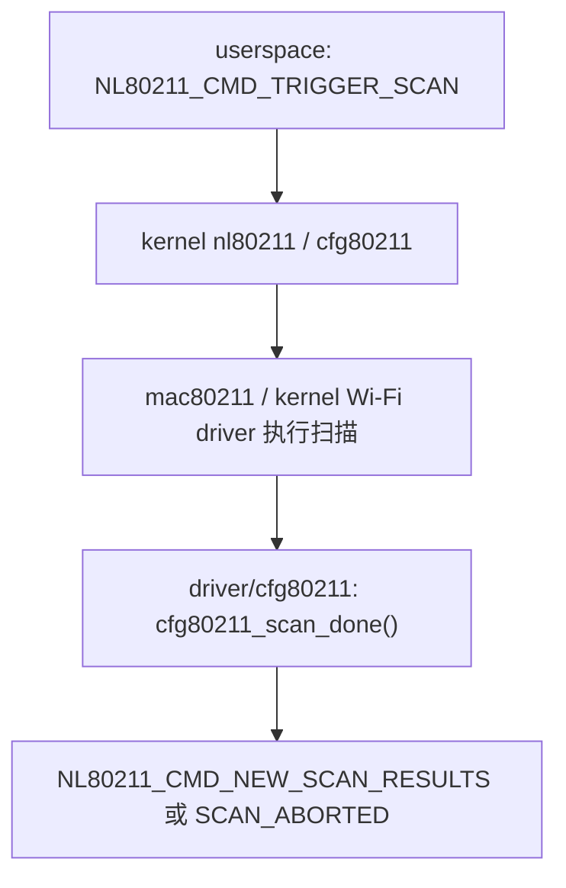
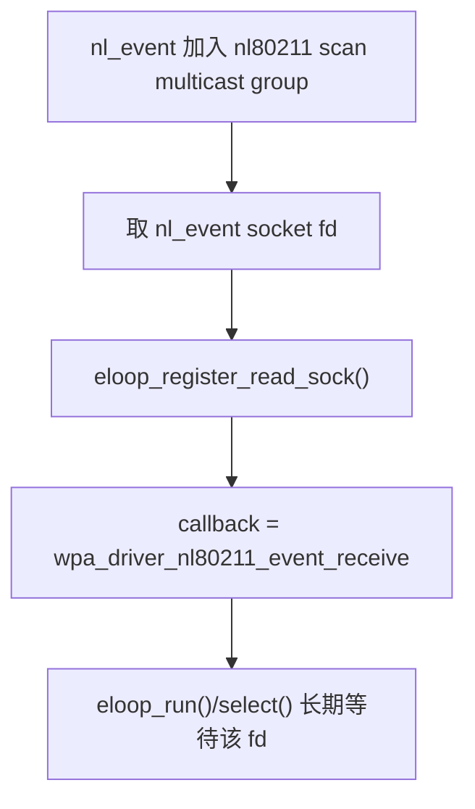
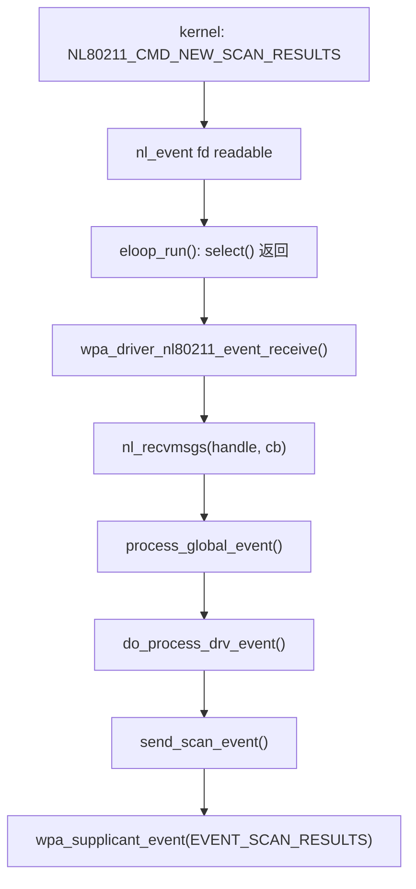
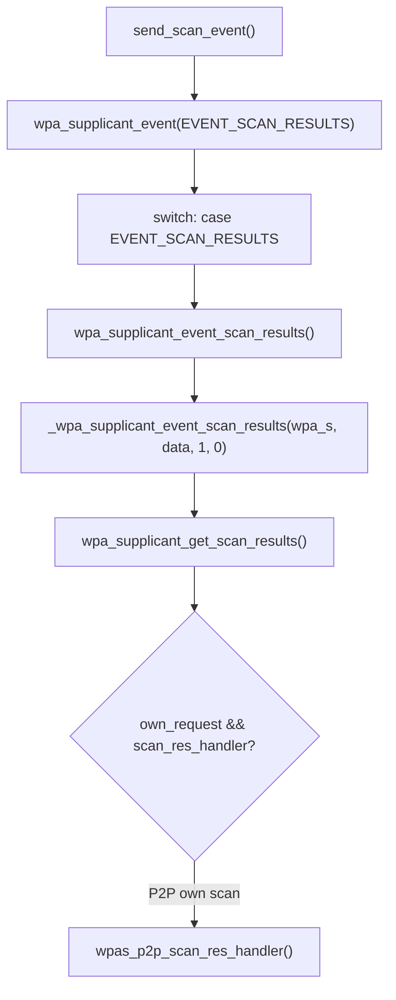
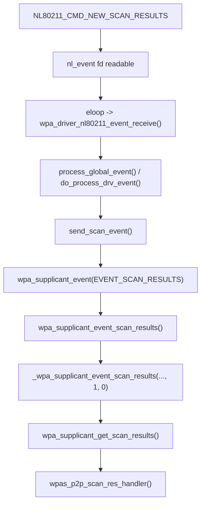
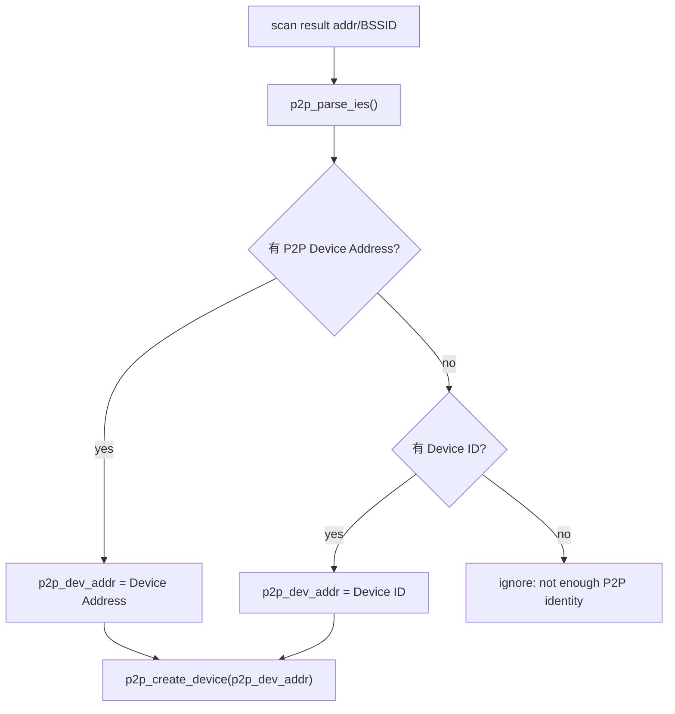
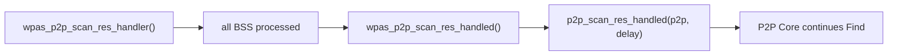
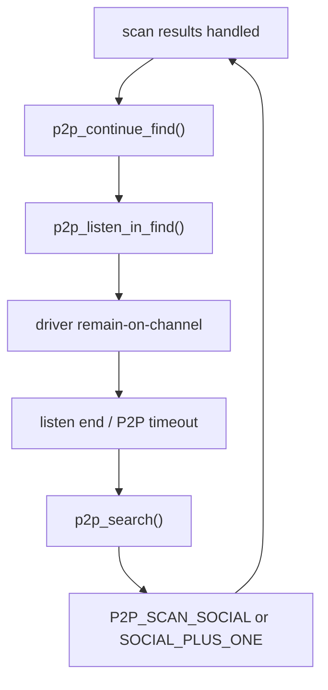
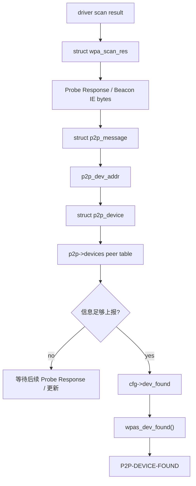

<meta name="referrer" content="no-referrer" />

# Wi-Fi Direct 教程 08：Scan Result 如何变成 P2P Peer——BSS、P2P/WPS IE、peer table 与 P2P-DEVICE-FOUND

> 摘要：从 NL80211_CMD_NEW_SCAN_RESULTS 进入 eloop 与 EVENT_SCAN_RESULTS，再追踪 BSS/IE、peer table、P2P-DEVICE-FOUND 和 Find 回环。

[TOC]

上一阶段已经把 `NL80211_CMD_TRIGGER_SCAN` 提交给 kernel。本文从 kernel/driver 宣告扫描完成开始，先补齐 `NL80211_CMD_NEW_SCAN_RESULTS` 如何经 nl80211 event socket、eloop 与 `driver_nl80211` 变成 `EVENT_SCAN_RESULTS`，再追踪 BSS table、Probe Response/Beacon IE、peer table 与 `P2P-DEVICE-FOUND`。

重点是解释“扫描到一个 BSS”为什么不等于“已经形成一个可报告的 P2P peer”。

---

<a id="idx-scan-event"></a>
## 1. “扫描完成”到底是谁告诉 wpa_supplicant：kernel event，不是 `wpa_driver_nl80211_scan()` 的返回值

第 07 篇的终点是：

```text
wpa_driver_nl80211_scan()
    -> NL80211_CMD_TRIGGER_SCAN
    -> kernel 接受 request
    -> userspace 调用栈返回
```

`return 0` 只表示请求提交成功。真正扫描信道、发送 Probe Request、收集 Beacon/Probe Response 的阶段在 kernel/firmware/driver 一侧异步执行。Linux cfg80211 的通用接口要求底层扫描结束后通过 `cfg80211_scan_done()` 报告完成状态；nl80211 随后向 userspace 发布 `NL80211_CMD_NEW_SCAN_RESULTS`，扫描被中止时则使用 `NL80211_CMD_SCAN_ABORTED`。[S11](#source-s11)

因此第一条需要记住的异步边界是：



当前实验使用 `mac80211_hwsim` 作为 kernel Wi-Fi driver，但具体“每个 channel 怎样扫描”的内核内部调用细节取决于 host kernel 版本；本文固定在稳定的 cfg80211/nl80211 完成接口上，不把某一版 kernel 内部实现写成 hostap 2.12 的固定逻辑。

### 1.1 wpa_supplicant 为什么能收到 `NL80211_CMD_NEW_SCAN_RESULTS`：初始化时已经订阅 `scan` multicast group

`driver_nl80211` 初始化全局 event socket 时，会取得：

```c
nl_get_multicast_id(global, "nl80211", "scan");
```

并执行：

```c
nl_socket_add_membership(global->nl_event, ret);
```

这一步表示 `global->nl_event` 订阅 nl80211 的 **scan multicast group**。[S1](#source-s1)

随后同一个初始化路径调用：

```c
nl80211_register_eloop_read(&global->nl_event,
                            wpa_driver_nl80211_event_receive,
                            global->nl_cb, 0);
```

`nl80211_register_eloop_read()` 最终把 netlink socket fd 注册到前面已经掌握的 eloop：

```c
eloop_register_read_sock(nl_socket_get_fd(*handle),
                         handler,
                         eloop_data,
                         *handle);
```

所以这里完全复用了第 05 篇的事件循环模型：



没有为 nl80211 再创建一个独立“scan event thread”。正常情况下，netlink fd 变为 readable 后，仍由 wpa_supplicant 主线程里的 `eloop_run()` 分发 callback。

### 1.2 runtime 完整桥接：netlink fd readable 怎样变成 `EVENT_SCAN_RESULTS`

当 kernel 发布 `NL80211_CMD_NEW_SCAN_RESULTS` 后，`global->nl_event` 上出现可读数据。第 05 篇的通用 dispatch 模型在这里具体化为：[S1](#source-s1)



这条链中各函数承担的职责不同：

| 函数 | 当前职责 |
|---|---|
| `wpa_driver_nl80211_event_receive()` | eloop fd callback，只负责调用 libnl `nl_recvmsgs()` 消费 event socket |
| `process_global_event()` | 解析 Generic Netlink message，按 ifindex/wdev/wiphy 找到对应 `i802_bss` |
| `do_process_drv_event()` | 根据 `gnlh->cmd` 分发不同 nl80211 command |
| `send_scan_event()` | 把 nl80211 scan attributes 转成 `union wpa_event_data.scan_info` |
| `wpa_supplicant_event()` | 把 driver event 提升到 supplicant 通用事件层 |

因此“driver scan completes → `EVENT_SCAN_RESULTS`”不能压成一步；中间至少跨过 **kernel nl80211 notification、netlink fd、eloop、libnl callback、driver event dispatcher** 五个语义边界。

### 1.3 `do_process_drv_event()` 怎样处理正常完成与中止

`driver_nl80211_event.c` 对两个 command 分别处理：[S1](#source-s1)

```text
NL80211_CMD_NEW_SCAN_RESULTS
    -> drv->scan_state = SCAN_COMPLETED
    -> 取消 wpa_driver_nl80211_scan_timeout()
    -> send_scan_event(..., aborted=0, ...)

NL80211_CMD_SCAN_ABORTED
    -> drv->scan_state = SCAN_ABORTED
    -> 取消 scan timeout
    -> send_scan_event(..., aborted=1, ...)
```

`send_scan_event()` 会填充：

```text
event.scan_info.aborted
event.scan_info.external_scan
event.scan_info.nl_scan_event
以及本轮 SSID / frequency 等 scan metadata
```

最后统一调用：

```c
wpa_supplicant_event(ctx, EVENT_SCAN_RESULTS, &event);
```

因此 `EVENT_SCAN_RESULTS` 这个名字并不保证“扫描一定正常成功”；调用方还必须检查 `event.scan_info.aborted` 等状态。

### 1.4 `wpa_supplicant_event()` 怎样调用到 `_wpa_supplicant_event_scan_results()`

`send_scan_event()` 并不会直接调用 `_wpa_supplicant_event_scan_results()`。它先把 nl80211 属性整理成 `union wpa_event_data event`，然后通过下面这个统一事件入口把事件交给 supplicant：[S1](#source-s1)

```c
wpa_supplicant_event(ctx, EVENT_SCAN_RESULTS, &event);
```

正常单 interface 路径中，`ctx` 来自 `bss->ctx`，对应当前 `struct wpa_supplicant *`。因此调用进入 `wpa_supplicant/events.c` 的：

```c
void wpa_supplicant_event(void *ctx, enum wpa_event_type event,
                          union wpa_event_data *data)
```

它先把 `ctx` 解释成当前 interface：

```c
struct wpa_supplicant *wpa_s = ctx;
```

随后在统一 `switch (event)` 中命中 `EVENT_SCAN_RESULTS`。当前构建未启用 `CONFIG_NO_SCAN_PROCESSING`，因此这个 case 会执行。完成扫描耗时等状态更新后，关键分发语句是：[S1](#source-s1)

```c
if (wpa_supplicant_event_scan_results(wpa_s, data))
    break;
```

因此 `_wpa_supplicant_event_scan_results()` 的直接调用者并不是 driver backend，而是中间 wrapper：

```text
wpa_supplicant_event_scan_results()
```

这个 wrapper 进入当前 interface 时首先执行：[S1](#source-s1)

```c
res = _wpa_supplicant_event_scan_results(wpa_s, data, 1, 0);
```

这里两个参数不能跳过：

| 参数 | 当前调用值 | 含义 |
|---|---:|---|
| `own_request` | `1` | 这次结果先按“当前 interface 自己请求的 scan”处理，因此允许消费本 interface 保存的 `scan_res_handler` |
| `update_only` | `0` | 不只是更新共享 BSS 信息，还允许继续触发当前 interface 的后续 scan-result 行为 |

wrapper 后面还会检查同一 radio 上的 sibling interface。如果它们共享相同频率列表，可以再次调用 `_wpa_supplicant_event_scan_results()`，但那时 `own_request=0`，不能把另一个 interface 的结果误当成本 interface 自己发起的 scan。这个设计解释了为什么真正的处理函数前面带下划线：它是可被 wrapper 以不同上下文参数复用的内部实现，而不是 driver event 的直接入口。[S1](#source-s1)

这一段完整调用关系可以直接记成：



### 1.5 `_wpa_supplicant_event_scan_results()` 怎样回到这轮 P2P scan 保存的 handler

进入内部实现后，第一件与结果数据直接相关的动作是：

```text
wpa_supplicant_get_scan_results()
```

它通过 driver wrapper 读取本轮 scan result，并同步整理 `wpa_supplicant` 的 BSS table。也就是说，`EVENT_SCAN_RESULTS` 只是“扫描完成事件”；真正的 BSS 数据是在这里重新从 driver/kernel 结果接口读取并组织起来。[S1](#source-s1)

随后当前 P2P own-scan 命中这段条件：

```c
if (own_request && wpa_s->scan_res_handler &&
    !(data && data->scan_info.external_scan)) {
```

第 07 篇发起扫描时已经保存：

```c
wpa_s->scan_res_handler = wpas_p2p_scan_res_handler;
```

因此内部实现会先把函数指针取出并清空，再执行它。源码这样做可以避免同一批结果被重复消费：[S1](#source-s1)

```c
scan_res_handler = wpa_s->scan_res_handler;
wpa_s->scan_res_handler = NULL;
scan_res_handler(wpa_s, scan_res);
```

在当前 P2P 路径中，上面的间接调用等价于：

```text
wpas_p2p_scan_res_handler(wpa_s, scan_res)
```

至此才真正从 **通用 supplicant scan event path** 返回 **P2P 专用 scan-result path**。

从 kernel scan-complete 到 P2P handler 的完整桥接如下：



`wpas_p2p_scan_res_handler()` 返回以后，调用栈继续回到 `_wpa_supplicant_event_scan_results()`、wrapper 和 `wpa_supplicant_event()`；后者再更新 `own_scan_running` 等状态并调用 `radio_work_check_next(wpa_s)`。因此 scan-complete event 不只是“通知一下”，它同时完成了结果读取、P2P handler 分发和 radio work 后续调度之间的衔接。[S1](#source-s1)

---

<a id="idx-bss-loop"></a>

## 2. `wpas_p2p_scan_res_handler()` 第一件事：释放 radio work，再逐条处理 BSS

函数进入后，如果：

```text
wpa_s->p2p_scan_work != NULL
```

会先把保存的 work 取出并清空指针，再执行：

```text
radio_work_done(work)
```

这一步与第 07 篇建立的 radio work 生命周期闭环：

```text
radio_add_work()
    -> work started
    -> driver scan
    -> scan complete event
    -> wpas_p2p_scan_res_handler()
    -> radio_work_done()
```

radio scheduler 从此可以考虑调度下一项 radio work。

随后才开始：

```c
for (i = 0; i < scan_res->num; i++) {
    struct wpa_scan_res *bss = scan_res->res[i];
    ...
}
```

`scan_res->num` 是这轮扫描返回的 BSS/result 数量。循环里的每个 `bss` 首先仍然只是 **802.11 scan result**，还不是 `struct p2p_device`。

---

## 3. `bss->age` 与 `fetch_time`：为什么要重建每条帧的接收时间

循环先执行：

```c
time_tmp_age.sec = bss->age / 1000;
time_tmp_age.usec = (bss->age % 1000) * 1000;
os_reltime_sub(&scan_res->fetch_time, &time_tmp_age, &entry_ts);
```

这里的关系是：

```text
scan_res->fetch_time
    = 当前从 driver 获取整批 scan result 的时间

bss->age
    = 这条 BSS result 相对当前 fetch 时已经“老了”多少 ms

entry_ts
    = fetch_time - age
    ≈ 这条 Beacon/Probe Response 实际被接收的时间
```

为什么不能只用 `fetch_time`？

因为 driver/cfg80211 可能返回缓存了一段时间的 BSS。整批数据“现在被读取”不代表其中每一条帧“刚刚才收到”。P2P Core 后面会把 `entry_ts` 与本轮：

```text
p2p->find_start
```

比较，过滤本次 `P2P_FIND` 之前的旧缓存结果。[S3](#source-s3)

这正是 `age` 在 Device Discovery 中承担的语义，而不是为了显示日志时间。

---

## 4. `ies = (u8 *)(bss + 1)` 是什么：`wpa_scan_res` 后面紧跟着 IE 字节区

接下来：

```c
ies = (const u8 *) (bss + 1);
ies_len = bss->ie_len;
```

如果不熟悉 C 的 packed allocation，这两句很突兀。

`bss` 指向一个 `struct wpa_scan_res`。当前实现把 scan result 的可变长度 IE bytes 紧跟在结构体内存之后，所以：

```text
bss
 │
 ▼
+-------------------------+
| struct wpa_scan_res     |
+-------------------------+  <- (bss + 1)
| Probe Response / IE buf |
| length = bss->ie_len    |
+-------------------------+
| Beacon IE buf           |  <- 如果 beacon_ie_len > 0
| length = beacon_ie_len  |
+-------------------------+
```

因此：

```c
(const u8 *)(bss + 1)
```

不是“取下一个 BSS”，而是把指针移动一个 `struct wpa_scan_res` 的大小，落到紧随其后的可变长度 IE 数据起点。

---

## 5. 为什么优先 Probe Response IE，缺 P2P IE 时才回退到 Beacon IE

原代码判断：

```c
if (bss->beacon_ie_len > 0 &&
    !wpa_scan_get_vendor_ie(bss, P2P_IE_VENDOR_TYPE) &&
    wpa_scan_get_vendor_ie_beacon(bss, P2P_IE_VENDOR_TYPE)) {
    ies = ies + ies_len;
    ies_len = bss->beacon_ie_len;
}
```

要逐条件解释。

### 5.1 `bss->beacon_ie_len > 0`

当前 result 里确实保存了单独的 Beacon IE 数据，否则没有备用来源。

### 5.2 `!wpa_scan_get_vendor_ie(bss, P2P_IE_VENDOR_TYPE)`

默认的 scan result IE（通常优先 Probe Response 信息）里 **没有** P2P Vendor Specific IE。

### 5.3 `wpa_scan_get_vendor_ie_beacon(..., P2P_IE_VENDOR_TYPE)`

但 Beacon IE 区中 **有** P2P IE。

三个条件同时满足时，代码才把解析输入切到 Beacon IE。

这并不是说“Beacon 比 Probe Response 更完整”，恰恰相反：实现默认优先使用 Probe Response 信息；只有 Probe Response 没有 P2P IE 而 Beacon 有时，才用 Beacon 避免完全丢失这个 P2P peer。

Linux cfg80211 文档本身也区分 BSS 的 `beacon_ies` 与 `proberesp_ies`，并指出 BSS 信息可以来自 Beacon 或 Probe Response management frame。[S9](#source-s9)

---

## 6. 每个 BSS 怎样进入 P2P Core：`p2p_scan_res_handler()` 先过滤“旧结果”

选好 `ies/ies_len` 后，glue 层对每个 result 调用 Core：

```text
p2p_scan_res_handler(
    p2p,
    bss->bssid,
    bss->freq,
    &entry_ts,
    bss->level,
    ies,
    ies_len)
```

注意传入的第一个地址仍然是：

```text
BSSID / source address
```

它还不保证等于最终的 P2P Device Address。

P2P Core 首先比较：

```text
entry_ts < p2p->find_start ?
```

如果 result 对应的帧比本轮 Find 还旧，就忽略。源码注释明确指出这样做是为了避免 cfg80211/driver 长时间缓存 BSS 后把 stale information 当成本轮新发现。[S3](#source-s3)

只有时间有效的 result 才继续：

```text
p2p_add_device(...)
```

---

<a id="idx-add-device"></a>

## 7. `p2p_add_device()` 不是“简单插入链表”：第一步先解析 P2P/WPS IE

`p2p_add_device()` 的输入是 Beacon/Probe Response 的原始 IE buffer。它先创建：

```text
struct p2p_message msg
```

然后调用：

```text
p2p_parse_ies(ies, ies_len, &msg)
```

这个 parser 会在一串 802.11 IEs 中找出 P2P/WPS/WFD 等相关信息，把不同 attribute 的指针/长度整理进 `msg`。只有解析成功后，后面才有资格建立/更新 peer。[S3](#source-s3)

因此数据转换层次是：

```text
802.11 scan result
    ↓
raw IE bytes
    ↓
p2p_parse_ies()
    ↓
struct p2p_message
    ↓
struct p2p_device
```


先看 `p2p_add_device()` 的第一段连续源码。这里同时完成“解析 -> 找真正 Device Address -> peer filter -> 创建/取得对象”，不能把它压缩成一句“加入 peer table”：[S1](#source-s1) [S3](#source-s3)

```c
os_memset(&msg, 0, sizeof(msg));
if (p2p_parse_ies(ies, ies_len, &msg)) {
    p2p_dbg(p2p, "Failed to parse P2P IE for a device entry");
    p2p_parse_free(&msg);
    return -1;
}

if (msg.p2p_device_addr)
    p2p_dev_addr = msg.p2p_device_addr;
else if (msg.device_id)
    p2p_dev_addr = msg.device_id;
else {
    p2p_dbg(p2p, "Ignore scan data without P2P Device Info or P2P Device Id");
    p2p_parse_free(&msg);
    return -1;
}

if (!is_zero_ether_addr(p2p->peer_filter) &&
    !ether_addr_equal(p2p_dev_addr, p2p->peer_filter)) {
    p2p_dbg(p2p, "Do not add peer filter for " MACSTR
            " due to peer filter", MAC2STR(p2p_dev_addr));
    p2p_parse_free(&msg);
    return 0;
}

dev = p2p_create_device(p2p, p2p_dev_addr);
if (dev == NULL) {
    p2p_parse_free(&msg);
    return -1;
}
```

这里的 `struct p2p_message` 不是 peer table entry，而是**对当前一帧 IE 的临时解析视图**；其中成员多数只是指向 `ies` buffer 中某个 attribute 的指针。`struct p2p_device` 才是跨多次 Scan/Beacon/Probe Response 生命周期持续存在的 peer 状态。因此一个 peer 的完整信息通常是多帧逐步合并出来的，而不是 `p2p_parse_ies()` 一次就永久定型。

这四层不能直接跳成“扫描到 BSS -> peer 入表”。

---

## 8. 为什么 `addr/BSSID` 不一定就是 P2P Device Address

`p2p_add_device()` 的 API 注释明确说：传入 `addr` 是 Beacon/Probe Response 的 source address，它可能是 **P2P Device Address**，也可能是 **P2P Interface Address**。[S3](#source-s3)

Core 会从解析后的 P2P attributes 中优先取：

```text
P2P Device Address
```

如果没有，再尝试：

```text
Device ID
```

只有二者至少存在一个时，才得到真正作为 peer table key 使用的：

```text
p2p_dev_addr
```

执行路径可以写成：



这也是为什么对外报告 peer identity 时必须使用 P2P Device Address，而不能把扫描结果 BSSID 当成同一个地址概念。

---

<a id="idx-peer-table"></a>

## 9. `p2p_create_device()` 到底做什么：查找/分配 peer container，不负责把所有能力一次填满

`p2p_create_device()` 的职责非常明确：[S3](#source-s3)

1. 先用 P2P Device Address 调 `p2p_get_device()` 查已有 peer；
2. 已存在则直接返回原对象；
3. 不存在则统计 `p2p->devices` 数量；
4. 如果超过 `max_peers`，选择 `last_seen` 最老的 peer 淘汰；
5. `os_zalloc(sizeof(*dev))` 分配空对象；
6. `dl_list_add(&p2p->devices, &dev->list)` 把它挂入 peer table；
7. 只先复制 `dev->info.p2p_device_addr`。

所以：

> **`p2p_create_device()` 返回成功只说明“已经有一个以 P2P Device Address 为 key 的 `struct p2p_device` container”，不代表 Device Name、Config Methods、Capability、Listen Channel 等都完整。**

这一点非常关键，因为真正的大量字段更新仍在 `p2p_add_device()` 后半段进行。

### 9.1 `p2p->devices` 就是 peer table

它本质是一个 `dl_list` 链表头：

```text
p2p->devices
    ├─ struct p2p_device #1
    ├─ struct p2p_device #2
    └─ ...
```

因此 Device Discovery 建表并不是为了“方便打印事件”，而是为了在 P2P Core 中保留一个可持续更新、可被后续 P2P 操作按 Device Address 定位的 peer object。

---

## 10. 回到 `p2p_add_device()`：一个 peer 到底被更新了哪些信息

`p2p_create_device()` 返回后，`p2p_add_device()` 继续对当前帧和已经存在的 peer 做合并更新。这里不能只列字段，需要看每类数据从哪里来、为什么需要。


第一段连续源码先处理“这一帧是否比已有数据新”、interface address、operating SSID、频率与 WPS 信息：[S1](#source-s1) [S3](#source-s3)

```c
os_memcpy(&dev->last_seen, rx_time, sizeof(struct os_reltime));

dev->flags &= ~(P2P_DEV_PROBE_REQ_ONLY | P2P_DEV_GROUP_CLIENT_ONLY |
                P2P_DEV_LAST_SEEN_AS_GROUP_CLIENT);

if (!ether_addr_equal(addr, p2p_dev_addr))
    os_memcpy(dev->interface_addr, addr, ETH_ALEN);
if (msg.ssid &&
    msg.ssid[1] <= sizeof(dev->oper_ssid) &&
    (msg.ssid[1] != P2P_WILDCARD_SSID_LEN ||
     os_memcmp(msg.ssid + 2, P2P_WILDCARD_SSID, P2P_WILDCARD_SSID_LEN)
     != 0)) {
    os_memcpy(dev->oper_ssid, msg.ssid + 2, msg.ssid[1]);
    dev->oper_ssid_len = msg.ssid[1];
}

wpabuf_free(dev->info.p2ps_instance);
dev->info.p2ps_instance = NULL;
if (msg.adv_service_instance && msg.adv_service_instance_len)
    dev->info.p2ps_instance = wpabuf_alloc_copy(
        msg.adv_service_instance, msg.adv_service_instance_len);

if (freq >= 2412 && freq <= 2484 && msg.ds_params &&
    *msg.ds_params >= 1 && *msg.ds_params <= 14) {
    int ds_freq;
    if (*msg.ds_params == 14)
        ds_freq = 2484;
    else
        ds_freq = 2407 + *msg.ds_params * 5;
    if (freq != ds_freq)
        freq = ds_freq;
}

if (scan_res) {
    dev->listen_freq = freq;
    if (msg.group_info)
        dev->oper_freq = freq;
}
dev->info.level = level;

dev_name_changed = os_strncmp(dev->info.device_name, msg.device_name,
                              WPS_DEV_NAME_MAX_LEN) != 0;

p2p_copy_wps_info(p2p, dev, 0, &msg);
```

接着处理 WPS vendor extension、Wi-Fi Display、GO 的 Group Client Info，并在临时 `p2p_message` 释放后把其它 vendor elements 持久化到 peer：[S1](#source-s1) [S3](#source-s3)

```c
for (i = 0; i < P2P_MAX_WPS_VENDOR_EXT; i++) {
    wpabuf_free(dev->info.wps_vendor_ext[i]);
    dev->info.wps_vendor_ext[i] = NULL;
}

for (i = 0; i < P2P_MAX_WPS_VENDOR_EXT; i++) {
    if (msg.wps_vendor_ext[i] == NULL)
        break;
    dev->info.wps_vendor_ext[i] = wpabuf_alloc_copy(
        msg.wps_vendor_ext[i], msg.wps_vendor_ext_len[i]);
    if (dev->info.wps_vendor_ext[i] == NULL)
        break;
}

wfd_changed = p2p_compare_wfd_info(dev, &msg);

if (wfd_changed) {
    wpabuf_free(dev->info.wfd_subelems);
    if (msg.wfd_subelems)
        dev->info.wfd_subelems = wpabuf_dup(msg.wfd_subelems);
    else
        dev->info.wfd_subelems = NULL;
}

if (scan_res) {
    p2p_add_group_clients(p2p, p2p_dev_addr, addr, freq,
                          msg.group_info, msg.group_info_len,
                          rx_time);
}

p2p_parse_free(&msg);

p2p_update_peer_vendor_elems(dev, ies, ies_len);
```

下面各小节再逐字段解释这些赋值为什么存在。

### 10.1 时间与来源新旧判断

如果已有 `dev->last_seen` 比当前 `rx_time` 更新，而且又不满足 group-client 特殊更新条件，实现会拒绝用旧帧覆盖新 peer 信息。

成功接受当前帧后：

```text
dev->last_seen = rx_time
```

并清理“只从 Probe Request 看过”“只作为 Group Client 看过”等临时 flags。

### 10.2 Interface Address

如果 scan result 的 `addr` 与真正的 `p2p_dev_addr` 不相同：

```text
dev->interface_addr = addr
```

这保留了“设备身份地址”和“当前 P2P interface 地址”两种地址语义。

### 10.3 Group/Operating SSID

如果当前消息携带的 SSID 不是 P2P wildcard SSID，就保存为 peer 的 operating SSID。这通常对识别正在作为 GO 运行的 Group 有意义。

### 10.4 Listen Frequency 与 Operating Frequency

scan result 自己提供 `freq`；在 2.4 GHz 下如果 IE 里还有 DS Parameter Set channel，Core 会把 channel 再换算成 MHz，用它修正 listen frequency。

对于普通 P2P scan result：

```text
dev->listen_freq = freq
```

如果消息包含 Group Info，说明当前 peer 作为 GO 被观察到，还会记录：

```text
dev->oper_freq = freq
```

### 10.5 RSSI / level

```text
dev->info.level = level
```

保存扫描得到的 signal level，供上层显示或后续策略参考。

### 10.6 WPS Device 信息

`p2p_copy_wps_info()` 从解析后的 WPS IE 更新一批上层很关心的属性，包括：

- Device Name；
- Primary Device Type；
- Secondary Device Types；
- Config Methods；
- Manufacturer / Model 等 WPS device attributes（取决于当前帧包含情况）。

### 10.7 P2P Capability

从 P2P IE 更新：

```text
Device Capability
group capability
```

这些 bit 描述 peer 的 P2P 能力以及当前 Group 状态相关能力。本文只解释 Device Discovery 当前需要读取的能力信息，不展开其它协议阶段。

### 10.8 WFD / vendor extension

若编译启用 Wi-Fi Display 或扫描结果带其它 vendor elements，peer object 也会保存对应 subelements/vendor IEs，以便后续发现事件和上层能力判断使用。

### 10.9 如果扫描到的是 GO，还会处理 Group Client Info

当 P2P IE 中存在 Group Info attribute 时：

```text
p2p_add_group_clients(...)
```

会把 GO 宣告的 client descriptors 解析出来，必要时为这些 P2P Client 建立/更新 peer entry。

因此 `p2p_add_device()` 实际承担的是：

```text
解析一帧中可获得的 P2P/WPS 信息
    +
找到稳定的 P2P Device identity
    +
创建/获取 peer container
    +
以“只用更新数据覆盖旧数据”的方式合并状态
    +
决定是否已经足以上报给上层
```

---

## 11. “GO 的 Beacon 已经发现 peer，但为什么还不立即报告”：关键在 `config_methods`

先拆两个概念。

### 11.1 GO Beacon 是什么

Group Owner 运行起来以后，本质上还承担类似 AP 的 BSS 广播职责，会周期性发送 802.11 Beacon。Beacon 可以携带 P2P IE，所以扫描器即使没有收到 Probe Response，也可能仅靠被动接收 Beacon 就知道：

```text
这里有一个 P2P GO
它的 P2P Device Address / capability / Group Info 是什么
```

所以 Beacon **可能足以创建或更新一个 `p2p_device`**。

### 11.2 `config_methods` 是什么

`config_methods` 来自 **WPS Configuration Methods attribute**，本质是一个 bitmask，表示设备支持哪些配置/认证交互方式，例如 Push Button、Display、Keypad 等。它不是“GO 的工作信道配置”。

`config_methods` 会告诉上层 peer 支持哪些 WPS configuration method，因此它是 `P2P-DEVICE-FOUND` 中有实际意义的能力信息。

### 11.3 为什么仅有 Beacon 时可能还是 0

P2P Core 的报告 gate 本身就把这个意图写得很清楚。下面是上游连续源码片段：[S1](#source-s1) [S3](#source-s3)

```c
if (dev->info.config_methods == 0 &&
    (freq == 2412 || freq == 2437 || freq == 2462)) {
    /*
     * If we have only seen a Beacon frame from a GO, we do not yet
     * know what WPS config methods it supports. Since some
     * applications use config_methods value from P2P-DEVICE-FOUND
     * events, postpone reporting this peer until we've fully
     * discovered its capabilities.
     *
     * At least for now, do this only if the peer was detected on
     * one of the social channels since that peer can be easily be
     * found again and there are no limitations of having to use
     * passive scan on this channels, so this can be done through
     * Probe Response frame that includes the config_methods
     * information.
     */
    p2p_dbg(p2p, "Do not report peer " MACSTR
            " with unknown config methods", MAC2STR(addr));
    return 0;
}

p2p->cfg->dev_found(p2p->cfg->cb_ctx, addr, &dev->info,
                    !(dev->flags & P2P_DEV_REPORTED_ONCE));
dev->flags |= P2P_DEV_REPORTED | P2P_DEV_REPORTED_ONCE;
```

也就是说判断不是作者推断，而是实现自己明确表达：`config_methods == 0` 时先让 peer 留在 table 中，等更完整的主动发现结果后再向应用层报告。

原判断可以压缩为：

```text
peer.config_methods == 0
AND
freq is 2412/2437/2462
```

注释解释：如果目前只看到 GO 的 Beacon，可能还不知道它支持哪些 WPS config methods；而部分应用会直接消费 `P2P-DEVICE-FOUND` 里的 `config_methods`，所以在 social channel 上先不报告，等待下一次主动 Probe Request 得到更完整的 Probe Response。

这里的设计逻辑是：

```text
Beacon
    -> 已足以知道“这是 P2P GO”
    -> peer 可以先进入/更新 peer table
    -> 但 WPS config_methods 可能仍未知

下一轮 active scan / Probe Request
    -> GO 返回 Probe Response
    -> 带更完整 WPS IE
    -> config_methods 得到补全
    -> 再产生 P2P-DEVICE-FOUND
```

因此：

> **peer 已经存在于 `p2p->devices` 与 peer 已经向 control/application 报告，是两个不同阶段。**

---

<a id="idx-dev-found"></a>

## 12. `dev_found` callback 怎样变成 `P2P-DEVICE-FOUND`

当 peer 已满足报告条件，P2P Core 执行：

```text
p2p->cfg->dev_found(cb_ctx, addr, &dev->info, new_device)
```

初始化阶段已经建立：

```text
cfg->dev_found = wpas_dev_found
```

所以运行时进入：

```text
wpa_supplicant/p2p_supplicant.c
wpas_dev_found()
```

`wpas_dev_found()` 会从 `struct p2p_peer_info` 整理上层事件字段，例如：

- P2P Device Address；
- `p2p_dev_addr=`；
- `pri_dev_type=`；
- Device Name；
- `config_methods=`；
- Device Capability；
- Group Capability；
- WFD information（若启用）。

随后通过：

```text
wpa_msg_global(..., P2P_EVENT_DEVICE_FOUND ...)
```

形成 control event 前缀：

```text
P2P-DEVICE-FOUND
```

同时 `wpas_notify_p2p_device_found()` 还会进入其它通知后端。当前源码中要注意 `CONFIG_NO_STDOUT_DEBUG` 对文本消息代码的条件编译影响；这属于具体构建差异，不能把“函数被调用”简单等价成所有构建都一定产生同样的 stdout/control 文本路径。[S1](#source-s1)

### 12.1 为什么一次性 `wpa_cli p2p_find` 看不到这个事件也很正常

一次性 control request 只等待同步：

```text
OK / FAIL
```

真正 `P2P-DEVICE-FOUND` 是后续异步事件。要持续观察它，需要：

- interactive `wpa_cli` 的 attached monitor connection；或
- `wpa_cli -a` action script；或
- 其它注册了 event monitor 的 control client。

这与第 02/05 篇中 `ATTACH` 的 control event 方向完全一致。

---

<a id="idx-scan-handled"></a>

## 13. 一批 BSS 全处理完以后，`wpas_p2p_scan_res_handled()` 到底怎样“回到 P2P Core”

循环处理完：

```text
scan_res->res[0 ... num-1]
```

以后，glue 层不会直接调用“下一次扫描”。它先进入：

```text
wpas_p2p_scan_res_handled(wpa_s)
```

这个 helper 先计算是否需要额外 delay，例如其它 external scan 仍在运行时避免立刻抢 radio；最终明确调用 Core API：

```text
p2p_scan_res_handled(global->p2p, delay)
```

所以“回到 Core”不是魔法，也不是通过函数指针；这里就是一个明确的反向 API 调用：[S1](#source-s1) [S3](#source-s3)



P2P Core 收到“本批 scan result 已全部 indicated”以后才把：

```text
p2p_scan_running = 0
```

取消 scan timeout，并处理 `p2p_run_after_scan()`。如果没有更高优先级的 after-scan operation，且当前仍是 `P2P_SEARCH`，就进入：

```text
p2p_continue_find()
```

---

## 14. `p2p_continue_find()`：为什么下一步不是马上再 Scan，而是先处理 pre-find operation 和短 Listen

`p2p_continue_find()` 首先重新确认高层状态：

```text
P2P_SEARCH
```

然后遍历已经知道的 peer，检查是否存在需要优先执行的 pending P2P operation。只有这些 operation 没有抢占流程时，才继续正常 Device Discovery。[S3](#source-s3)

这解释了为什么状态枚举里会有：

```text
P2P_SD_DURING_FIND
P2P_PD_DURING_FIND
```

它们不是本篇主要目标，但它们可以暂时插入 Find 循环，完成后再回 `P2P_SEARCH`。

普通路径最后进入：

```text
p2p_listen_in_find()
```

---

<a id="idx-listen"></a>

## 15. `p2p_listen_in_find()` 详细解析：Find 中的短 Listen 到底做什么

`p2p_listen_in_find()` 的目标是让本机在自己的 P2P Listen Channel 上短时间可被其它 P2P Device 主动发现。[S3](#source-s3)

### 15.1 先把 Listen Channel 转成实际频率

Core 初始化时已经为本机选定/配置：

```text
reg_class + channel
```

函数调用：

```text
p2p_channel_to_freq(reg_class, channel)
```

得到 MHz `freq`。2.4 GHz 常见情况下，这个 listen channel 本身也从 Social Channels 中选择。

### 15.2 为什么 Listen 时长是随机区间

Core 根据：

```text
min_disc_int
max_disc_int
max_disc_tu
```

和随机数选择短 Listen 时长。目的不是随机“等待一下”，而是让多个 P2P Device 的 Search/Listen 节奏不要长期锁相错开，提高互相撞见的概率。

源码使用 TU（Time Unit，1024 µs）表达部分 Discoverable Interval，再换算给 glue/driver。

### 15.3 Listen 前为什么构造 Probe Response IEs

函数会：

```text
p2p_build_probe_resp_ies()
```

因为进入 Listen 后，本机可能收到其它设备发来的 P2P Probe Request。要成为“可被发现者”，不仅要停在该 channel，还需要有能力用包含 P2P/WPS 信息的 Probe Response 回答。

### 15.4 `pending_listen_freq` / `pending_listen_*` 保存异步上下文

在真正调用 driver 前，Core记录：

```text
pending_listen_freq
pending_listen_sec
pending_listen_usec
```

然后调用初始化时绑定的：

```text
cfg->start_listen(cb_ctx, freq, duration, ies)
    -> wpas_start_listen()
```

这里再次跨到 `wpa_supplicant` glue 层，并最终使用 remain-on-channel 类 driver 能力。Linux Wireless 的 P2P 文档明确指出 `NL80211_CMD_REMAIN_ON_CHANNEL`/cancel ROC 正是 P2P Listen phase 所依赖的低层机制之一。[S10](#source-s10)

### 15.5 为什么这时 state 仍然是 `P2P_SEARCH`

`p2p_listen_in_find()` 本身没有把状态改成 `P2P_LISTEN_ONLY`。Find 生命周期仍是：

```text
P2P_SEARCH
```

而 driver Listen 的“已请求/已经真正进入/内部 timeout 是否到期”分别由：

```text
pending_listen_freq
in_listen
drv_in_listen
```

等状态配合管理。

这就是“高层协议状态”和“底层 radio activity”必须分层看的典型例子。

---

## 16. Listen 结束以后怎样进入下一轮 Search

Listen 是异步 remain-on-channel operation。driver 真正开始/结束 ROC 后，会通过对应 driver event 回到 glue 层，再由 glue 层通知 P2P Core。

Core 的：

```text
p2p_listen_end(p2p, freq)
```

会清：

```text
drv_in_listen = 0
```

如果内部 discoverable interval 还没有到，则继续等内部 timeout；当 P2P state timeout 在 `P2P_SEARCH` 下触发后，最终调用：

```text
p2p_search()
```

`p2p_search()` 会：

1. 确保 driver 已不在 Listen；
2. 调 `cfg->stop_listen()` 做必要收尾；
3. 根据 `find_type` 决定本轮 Scan 类型；
4. 再调用 `cfg->p2p_scan()`。

于是正常循环变成：



这才是 Search / Listen / Scan 为什么会循环切换的完整机制。

---

<a id="idx-full"></a>

## 17. 默认 `P2P_FIND_START_WITH_FULL` 的一次完整运行节奏

现在可以把“默认 Find”从头串起来：

```text
P2P_FIND
    ↓
p2p_ctrl_find()
    type = P2P_FIND_START_WITH_FULL
    ↓
wpas_p2p_find()
    ↓
p2p_find()
    state = P2P_SEARCH
    ↓
首次 P2P_SCAN_FULL
    ↓
radio_add_work("p2p-scan")
    ↓
wpas_p2p_trigger_scan_cb()
    ↓
wpa_drv_scan()
    ↓
[异步]
EVENT_SCAN_RESULTS
    ↓
通用 scan/BSS table 更新
    ↓
wpas_p2p_scan_res_handler()
    ↓
逐 BSS -> p2p_scan_res_handler()
    ↓
p2p_add_device()
    ↓
peer table 更新 / 必要时 dev_found
    ↓
wpas_p2p_scan_res_handled()
    ↓
p2p_scan_res_handled()
    ↓
p2p_continue_find()
    ↓
short Listen
    ↓
p2p_search()
    ↓
后续 P2P_SCAN_SOCIAL
    ↓
重复
```

默认模式之所以“Start With Full”，就是第一轮尽量广覆盖；随后不断在 short Listen 与更轻量的 social-channel Search 之间轮转，提高既能找到别人又能被别人找到的概率。[S2](#source-s2) [S6](#source-s6)

---

## 18. 从 scan result 到 `P2P-DEVICE-FOUND` 的数据对象变化

这一条链最好再从“数据类型”视角复盘一次：



因此“发现 peer”至少有三个不同语义层次：

| 层次 | 含义 |
|---|---|
| BSS 被 scan 到 | 收到一个 Beacon/Probe Response，尚未确认 P2P identity 是否完整 |
| `p2p_device` 入表 | 已确定 P2P Device Address，有可维护的 peer object |
| `P2P-DEVICE-FOUND` | peer information 已满足上层报告条件，control/application 收到事件 |

这三者不能合成一句“扫描到设备后发出 DEVICE-FOUND”。

---

<a id="idx-boundary"></a>

## 19. 本篇边界：扫描结果已经变成可维护的 P2P Peer

本文从 `NL80211_CMD_NEW_SCAN_RESULTS` 经 nl80211 event socket、eloop 与 `EVENT_SCAN_RESULTS` 的异步桥接开始，再经过通用 scan/BSS 更新、P2P/WPS IE 解析、`p2p->devices` peer table 更新与 `dev_found` callback，最终形成 `P2P-DEVICE-FOUND`，并说明一轮结果处理结束后 Find 如何重新进入短 Listen/Search 节奏。到这里，Device Discovery 的“发现并维护 peer”闭环完成。

## 关键源码索引

| 关键对象 / 符号 | 作用 | Git 源码 |
|---|---|---|
| `wpa_driver_nl80211_event_receive()` | eloop 中消费 nl80211 event socket | [driver_nl80211.c](https://chromium.googlesource.com/chromiumos/third_party/hostap/+/refs/tags/hostap_2_12/src/drivers/driver_nl80211.c) |
| `process_global_event()` / `do_process_drv_event()` | nl80211 event 解析与 command 分发 | [driver_nl80211_event.c](https://chromium.googlesource.com/chromiumos/third_party/hostap/+/refs/tags/hostap_2_12/src/drivers/driver_nl80211_event.c) |
| `send_scan_event()` | nl80211 scan event 转成 `EVENT_SCAN_RESULTS` | [driver_nl80211_event.c](https://chromium.googlesource.com/chromiumos/third_party/hostap/+/refs/tags/hostap_2_12/src/drivers/driver_nl80211_event.c) |
| `wpa_supplicant_event()` | 统一 supplicant event dispatcher，处理 `EVENT_SCAN_RESULTS` | [events.c](https://chromium.googlesource.com/chromiumos/third_party/hostap/+/refs/tags/hostap_2_12/wpa_supplicant/events.c) |
| `wpa_supplicant_event_scan_results()` / `_wpa_supplicant_event_scan_results()` | 从通用 scan event 读取结果并分发到本轮 `scan_res_handler` | [events.c](https://chromium.googlesource.com/chromiumos/third_party/hostap/+/refs/tags/hostap_2_12/wpa_supplicant/events.c) |
| `wpas_p2p_scan_res_handler()` | P2P scan result glue | [p2p_supplicant.c](https://chromium.googlesource.com/chromiumos/third_party/hostap/+/refs/tags/hostap_2_12/wpa_supplicant/p2p_supplicant.c) |
| `p2p_scan_res_handler()` | 把每条结果提交 P2P Core | [p2p.c](https://chromium.googlesource.com/chromiumos/third_party/hostap/+/refs/tags/hostap_2_12/src/p2p/p2p.c) |
| `p2p_add_device()` | 解析并更新 peer | [p2p.c](https://chromium.googlesource.com/chromiumos/third_party/hostap/+/refs/tags/hostap_2_12/src/p2p/p2p.c) |
| `p2p_create_device()` | peer table lookup/create | [p2p.c](https://chromium.googlesource.com/chromiumos/third_party/hostap/+/refs/tags/hostap_2_12/src/p2p/p2p.c) |
| `wpas_dev_found()` | 生成 `P2P-DEVICE-FOUND` | [p2p_supplicant.c](https://chromium.googlesource.com/chromiumos/third_party/hostap/+/refs/tags/hostap_2_12/wpa_supplicant/p2p_supplicant.c) |
| `p2p_scan_res_handled()` | scan batch 完成通知 | [p2p.c](https://chromium.googlesource.com/chromiumos/third_party/hostap/+/refs/tags/hostap_2_12/src/p2p/p2p.c) |
| `p2p_listen_in_find()` | Find 中短 Listen | [p2p.c](https://chromium.googlesource.com/chromiumos/third_party/hostap/+/refs/tags/hostap_2_12/src/p2p/p2p.c) |

## 资料来源

<a id="source-s1"></a>
### [S1] hostap 2.12 Git：supplicant glue / scan / event / radio work
- 版本：[`hostap_2_12` / `831364bf02710ad09c2f27d3efa92abeeb5634c0`](https://chromium.googlesource.com/chromiumos/third_party/hostap/+/refs/tags/hostap_2_12)
- 文件：[driver_nl80211.c](https://chromium.googlesource.com/chromiumos/third_party/hostap/+/refs/tags/hostap_2_12/src/drivers/driver_nl80211.c)、[driver_nl80211_event.c](https://chromium.googlesource.com/chromiumos/third_party/hostap/+/refs/tags/hostap_2_12/src/drivers/driver_nl80211_event.c)、[p2p_supplicant.c](https://chromium.googlesource.com/chromiumos/third_party/hostap/+/refs/tags/hostap_2_12/wpa_supplicant/p2p_supplicant.c)、[events.c](https://chromium.googlesource.com/chromiumos/third_party/hostap/+/refs/tags/hostap_2_12/wpa_supplicant/events.c)、[scan.c](https://chromium.googlesource.com/chromiumos/third_party/hostap/+/refs/tags/hostap_2_12/wpa_supplicant/scan.c)、[wpa_supplicant.c](https://chromium.googlesource.com/chromiumos/third_party/hostap/+/refs/tags/hostap_2_12/wpa_supplicant/wpa_supplicant.c)、[eloop.c](https://chromium.googlesource.com/chromiumos/third_party/hostap/+/refs/tags/hostap_2_12/src/utils/eloop.c)
- 使用位置：第 1～18 节
- 支撑内容：nl80211 scan multicast 订阅、event socket 注册到 eloop、`NL80211_CMD_NEW_SCAN_RESULTS`/`SCAN_ABORTED` 分发、`send_scan_event()` → `wpa_supplicant_event()` → `wpa_supplicant_event_scan_results()` → `_wpa_supplicant_event_scan_results()`，以及 `scan_res_handler` 返回 P2P 结果处理的完整桥接。

<a id="source-s2"></a>
### [S2] hostap 2.12 Git：P2P module design
- 来源：[doc/p2p.doxygen](https://chromium.googlesource.com/chromiumos/third_party/hostap/+/refs/tags/hostap_2_12/doc/p2p.doxygen)
- 使用位置：第 2、5、7、25～29 节
- 支撑内容：P2P Core 与 glue callback 契约、scan results 提交与 `p2p_scan_res_handled()` 结束通知的设计。

<a id="source-s3"></a>
### [S3] hostap 2.12 Git：P2P Core / WPS implementation
- 文件：[p2p.c](https://chromium.googlesource.com/chromiumos/third_party/hostap/+/refs/tags/hostap_2_12/src/p2p/p2p.c)、[p2p.h](https://chromium.googlesource.com/chromiumos/third_party/hostap/+/refs/tags/hostap_2_12/src/p2p/p2p.h#360)、[p2p_i.h](https://chromium.googlesource.com/chromiumos/third_party/hostap/+/refs/tags/hostap_2_12/src/p2p/p2p_i.h)、[p2p_utils.c](https://chromium.googlesource.com/chromiumos/third_party/hostap/+/refs/tags/hostap_2_12/src/p2p/p2p_utils.c)、[wps.c](https://chromium.googlesource.com/chromiumos/third_party/hostap/+/refs/tags/hostap_2_12/src/wps/wps.c)、[wps_attr_build.c](https://chromium.googlesource.com/chromiumos/third_party/hostap/+/refs/tags/hostap_2_12/src/wps/wps_attr_build.c)
- 使用位置：第 3～12、18～30 节
- 支撑内容：`p2p_find()`、scan modes、peer table、`p2p_add_device()`、Find Continue/Listen 以及 WPS IE builder 的真实 2.12 实现。

<a id="source-s6"></a>
### [S6] hostap 2.12 README-P2P
- 来源：[wpa_supplicant/README-P2P](https://chromium.googlesource.com/chromiumos/third_party/hostap/+/refs/tags/hostap_2_12/wpa_supplicant/README-P2P)
- 使用位置：第 3、6、29 节
- 支撑内容：`p2p_find` 默认、`type=social`、`type=progressive` 的对外命令语义。

<a id="source-s9"></a>
### [S9] Linux cfg80211 scan/BSS model
- URL/文档：[cfg80211 subsystem](https://docs.kernel.org/driver-api/80211/cfg80211.html)
- 使用位置：第 13～17 节
- 支撑内容：scan/BSS 信息、Beacon/Probe Response IE 与 userspace scan result 的数据模型。

<a id="source-s10"></a>
### [S10] Linux Wireless P2P / nl80211 overview
- URL/文档：[Linux Wireless P2P overview](https://wireless.docs.kernel.org/en/latest/en/developers/p2p/overview.html)
- 使用位置：第 27～28 节
- 支撑内容：P2P Listen/remain-on-channel 与 management frame TX/RX 的底层能力边界。


<a id="source-s11"></a>
### [S11] Linux kernel：cfg80211/nl80211 Scan 完成接口
- 来源：[nl80211 UAPI](https://github.com/torvalds/linux/blob/master/include/uapi/linux/nl80211.h)、[cfg80211 scanning documentation](https://docs.kernel.org/driver-api/80211/cfg80211.html)
- 使用位置：第 1 节
- 支撑内容：`NL80211_CMD_TRIGGER_SCAN` 与 `NL80211_CMD_NEW_SCAN_RESULTS`/`NL80211_CMD_SCAN_ABORTED` 的异步接口关系，以及无线 driver 通过 `cfg80211_scan_done()` 向 cfg80211 报告扫描完成的通用契约。
