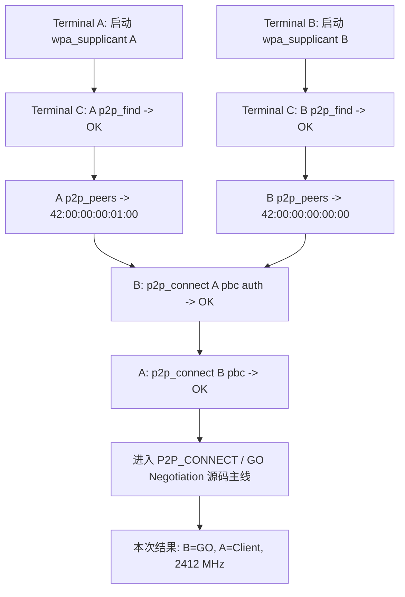
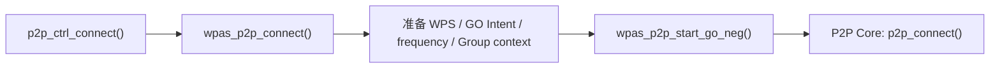
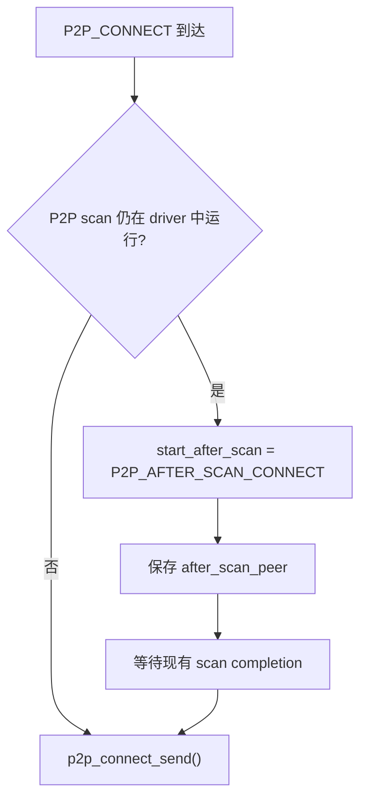
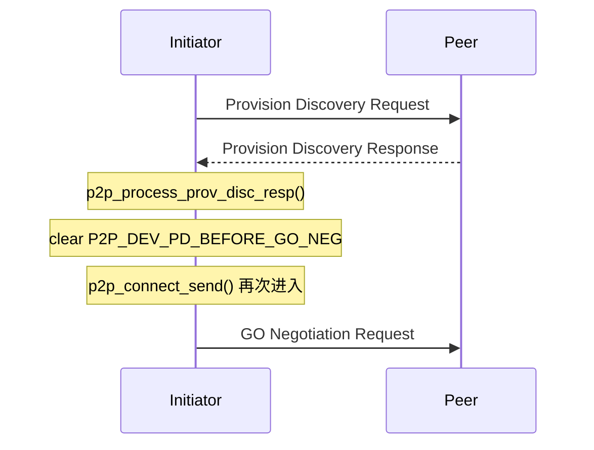
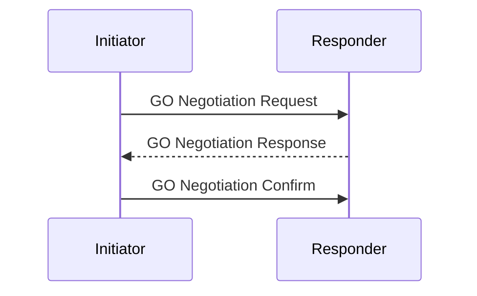
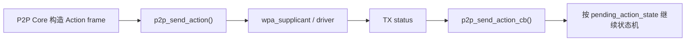
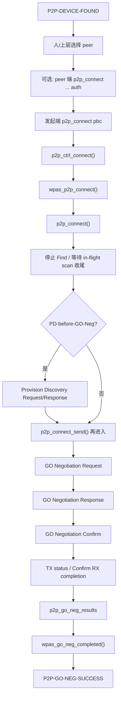

<meta name="referrer" content="no-referrer" />

# Wi-Fi Direct 源码分析（09）：从 P2P_CONNECT 到 GO Negotiation 完成

> 摘要：从 CLI 显式执行 P2P_CONNECT 开始，追踪 Find 停止、可选 Provision Discovery、GO Intent、Action frame 与 GO Negotiation 完成回调。

[TOC]

第 08 篇已经把 Device Discovery 追到 `P2P-DEVICE-FOUND`，并确认 peer 已进入 P2P Core 的 `p2p->devices`。这一步只表示“已经发现对端”，**不会自动进入 Group Formation**。

真正的连接阶段需要上层再次做一个明确动作：选择一个已经发现的 P2P Device Address，然后发送第二条 control command：

```text
P2P_CONNECT <peer_device_addr> ...
```

hostap 2.12 的 `README-P2P` 也把 `p2p_connect` 定义为“与已发现的 P2P peer 开始 Group Formation”的独立命令。[S3](#source-s3)

本文只追踪 classic/legacy P2P 新建 Group 的 GO Negotiation 主线，停止在 `wpas_go_neg_completed()` 收到协商结果的位置。WPS provisioning、关联、4-Way Handshake 和最终 `P2P-GROUP-STARTED` 不在本文展开。

源码基线统一为 hostap 2.12 release tag `hostap_2_12`。[S1](#source-s1)

---

<a id="idx-cli"></a>
## 1. 先用三个终端把 P2P_CONNECT 完整跑通

在进入 `P2P_CONNECT` 源码之前，先把本文后续要追踪的真实实验完整执行一遍。实验固定使用三个终端：Terminal A 只运行 A 的 `wpa_supplicant`，Terminal B 只运行 B 的 `wpa_supplicant`，Terminal C 专门使用 `wpa_cli` 发送 control command。这样 A/B 两侧的 `-dd -t` 日志不会与控制命令混在一起。

### 1.1 Terminal A：启动 A 端 wpa_supplicant

```bash
sudo wpa_supplicant-2.12 \
    -Dnl80211 \
    -i "$P2P_A" \
    -c /workspace/config/p2p-a.conf \
    -dd \
    -t
```

Terminal A 保持前台运行，用于观察 A 端 Device Discovery、GO Negotiation 以及后续 group interface 的日志。

### 1.2 Terminal B：启动 B 端 wpa_supplicant

```bash
sudo wpa_supplicant-2.12 \
    -Dnl80211 \
    -i "$P2P_B" \
    -c /workspace/config/p2p-b.conf \
    -dd \
    -t
```

Terminal B 同样保持前台运行。

### 1.3 Terminal C：双方先执行 P2P_FIND

先让 A 进入 Device Discovery：

```bash
sudo wpa_cli-2.12 \
    -p /run/wpa_supplicant-p2p-a \
    -i "$P2P_A" \
    p2p_find
```

本次实测返回：

```text
OK
```

再让 B 也进入 Device Discovery：

```bash
sudo wpa_cli-2.12 \
    -p /run/wpa_supplicant-p2p-b \
    -i "$P2P_B" \
    p2p_find
```

本次实测同样返回：

```text
OK
```

这里让两侧都执行 `p2p_find` 的原因是：后续不仅 A 要根据 peer table 找到 B，B 还要对已经发现的 A 执行 `p2p_connect ... auth`。`OK` 只表示 `P2P_FIND` control command 已被接受，不表示已经发现 peer。

### 1.4 Terminal C：确认双方 peer table

查看 A 当前发现到的 peer：

```bash
sudo wpa_cli-2.12 \
    -p /run/wpa_supplicant-p2p-a \
    -i "$P2P_A" \
    p2p_peers
```

本次实测得到：

```text
42:00:00:00:01:00
```

因此 B 的 P2P Device Address 为：

```text
42:00:00:00:01:00
```

再查看 B 的 peer table：

```bash
sudo wpa_cli-2.12 \
    -p /run/wpa_supplicant-p2p-b \
    -i "$P2P_B" \
    p2p_peers
```

本次实测得到：

```text
42:00:00:00:00:00
```

因此 A 的 P2P Device Address 为：

```text
42:00:00:00:00:00
```

`p2p_peers` 返回的是当前 P2P Core peer table 中的 Device Address。后续 `P2P_CONNECT` 使用的就是这里的 **P2P Device Address**，不能把文章中的 `<A_P2P_DEVICE_ADDR>`、`<B_P2P_DEVICE_ADDR>` 占位符原样输入 shell；尖括号在 Bash 中还具有重定向语义。

### 1.5 Terminal C：B 先授权 A 使用 PBC

B 对 A 执行：

```bash
sudo wpa_cli-2.12 \
    -p /run/wpa_supplicant-p2p-b \
    -i "$P2P_B" \
    p2p_connect 42:00:00:00:00:00 pbc auth
```

本次实测返回：

```text
OK
```

这里的 `auth` 不是“B 主动开始 GO Negotiation”。它的含义是：B 为指定 peer 记录本轮允许使用的 WPS/PBC 授权参数，然后等待该 peer 主动发起 GO Negotiation。[S3](#source-s3)

因此这一步之后，B 是被授权的等待方；真正的主动发起动作还没有发生。

### 1.6 Terminal C：A 显式执行真正的 P2P_CONNECT

A 使用刚才从 `p2p_peers` 得到的 B Device Address：

```bash
sudo wpa_cli-2.12 \
    -p /run/wpa_supplicant-p2p-a \
    -i "$P2P_A" \
    p2p_connect 42:00:00:00:01:00 pbc
```

本次实测返回：

```text
OK
```

这条命令才是本文源码主线真正的起点。它会进入：

```text
P2P_CONNECT
    -> p2p_ctrl_connect()
    -> wpas_p2p_connect()
    -> p2p_connect()
    -> Provision Discovery（条件满足时）
    -> GO Negotiation
```

这里的 `OK` 仍然只表示 control command 已被接受，**不表示 GO Negotiation、WPS 或 4-Way Handshake 已经同步完成**。后续阶段通过 eloop、Action frame RX/TX status、driver event 等异步事件继续推进。

### 1.7 本次实验的重要结果摘要

本轮真实执行结果如下。[S5](#source-s5)

| 项目 | 实测结果 |
|---|---|
| A P2P Device Address | `42:00:00:00:00:00` |
| B P2P Device Address | `42:00:00:00:01:00` |
| 主动发起 `P2P_CONNECT` | A |
| `auth` 等待方 | B |
| 最终 GO | B |
| 最终 Client | A |
| GO Device Address | `42:00:00:00:01:00` |
| Group SSID | `DIRECT-fM` |
| Operating Frequency | `2412 MHz`（2.4 GHz Channel 1） |
| A group interface | `p2p-wlan0-0`，角色 `client` |
| B group interface | `p2p-wlan1-0`，角色 `GO` |

需要特别区分两件事：**谁主动发送 `P2P_CONNECT`，并不等于谁最终成为 GO。** 本次是 A 主动发起，但 GO Negotiation 的结果是 B 成为 GO、A 成为 Client。角色由后面要分析的 GO Intent、tie breaker 与协商参数共同决定，而不是由 initiator/responder 身份直接决定。[S1](#source-s1)[S2](#source-s2)

最终日志已经进入 `P2P-GROUP-STARTED`，说明整套实验确实成功建立了 Group；这里只把该结果作为实验闭环，不在本节提前展开 WPS、关联和 4-Way Handshake 的实现细节。[S5](#source-s5)

### 1.8 把三个终端的动作压缩成一张图



因此实验链不是“启动后自动连接”，而是明确的两阶段控制过程：先用 `P2P_FIND` 建立 peer 信息，再由上层显式发送 `P2P_CONNECT`。`pbc` 指的是 WPS 的 **Push Button Configuration** 方法，不存在独立的“PBC Negotiation”协议阶段；它是 Group Formation 选择的 WPS provisioning method，而 GO/Client 角色由 GO Negotiation 决定。[S2](#source-s2)[S4](#source-s4)

---

<a id="idx-command"></a>
## 2. P2P_CONNECT 是第二条独立的 control command

第 02～05 篇已经建立了 control interface 的通用路径，所以这里不重新解释 UNIX control socket。`wpa_supplicant_ctrl_iface_process()` 收到文本命令后直接匹配：

```c
} else if (os_strncmp(buf, "P2P_CONNECT ", 12) == 0) {
        reply_len = p2p_ctrl_connect(wpa_s, buf + 12, reply,
                                     reply_size);
}
```

这说明 `P2P_FIND` 与 `P2P_CONNECT` 是两个独立命令：

```text
P2P_FIND
  目标：发现 peer

P2P_CONNECT
  目标：对一个已经发现的 peer 发起 Group Formation
```

`p2p_ctrl_connect()` 负责解析：

- peer device address；
- `pbc` / PIN / P2PS 等 provisioning method；
- `go_intent=<0..15>`；
- `persistent`；
- `freq=`；
- `provdisc`；
- `auth`、`join`、`auto`、`p2p2` 等其它模式参数。[S1](#source-s1)[S3](#source-s3)

当前经典新建 Group 主线是：

```text
P2P_CONNECT <peer> pbc [go_intent=N] [provdisc]
```

如果使用 `auth`，control 层最终进入 `p2p_authorize()`；如果没有 `auth`，则沿本文主线进入真正的连接发起路径。

---

<a id="idx-wpas-connect"></a>
## 3. p2p_ctrl_connect() 如何进入 wpas_p2p_connect() 和 P2P Core

`p2p_ctrl_connect()` 完成参数解析后，将结果交给 `wpas_p2p_connect()`。这一层仍属于 `wpa_supplicant` glue，负责把 control 参数、Group interface 需求、频率偏好、persistent 标志等整理成持续存在的 Group Formation 上下文。[S1](#source-s1)

经典主线可以压缩成：



真正与 `struct p2p_device`、P2P state、Public Action frame 和 GO Negotiation 状态机打交道的是 `src/p2p/` 中的 `p2p_connect()`。

---

<a id="idx-p2p-connect"></a>
## 4. p2p_connect()：找回 peer、准备参数并停止 Find

`p2p_connect()` 的第一步不是重新扫描，而是直接使用第 08 篇已经建立的 peer table：

```c
dev = p2p_get_device(p2p, peer_addr);
if (dev == NULL || (dev->flags & P2P_DEV_PROBE_REQ_ONLY)) {
        p2p_dbg(p2p, "Cannot connect to unknown P2P Device " MACSTR,
                MAC2STR(peer_addr));
        return -1;
}
```

这解释了为什么 Device Discovery 需要建立 `struct p2p_device`，而不能只打印 `P2P-DEVICE-FOUND`。`P2P_CONNECT` 会根据 peer address 重新取回完整的 peer 对象。[S1](#source-s1)

接下来 `p2p_connect()` 调用 `p2p_prepare_channel()`，准备本端允许用于 GO Negotiation 的 Channel List、preferred/forced operating channel 等，然后保存本轮组建参数：

```c
p2p_set_dev_persistent(dev, persistent_group);
p2p->go_intent = go_intent;
os_memcpy(p2p->intended_addr, own_interface_addr, ETH_ALEN);
```

如果启用 `pd_before_go_neg`，给 peer 设置 `P2P_DEV_PD_BEFORE_GO_NEG`；否则为本轮 GO Negotiation 分配 dialog token 和 tie breaker：

```c
if (pd_before_go_neg)
        dev->flags |= P2P_DEV_PD_BEFORE_GO_NEG;
else {
        dev->flags &= ~P2P_DEV_PD_BEFORE_GO_NEG;
        dev->dialog_token++;
        if (dev->dialog_token == 0)
                dev->dialog_token = 1;
        dev->tie_breaker = p2p->next_tie_breaker;
        p2p->next_tie_breaker = !p2p->next_tie_breaker;
}
```

### 4.1 Find 是怎样被停止的

如果此时仍处于第 08 篇的 Find/Search：

```c
if (p2p->state != P2P_IDLE)
        p2p_stop_find(p2p);
```

这里不是异常退出，也不是简单修改一个全局布尔变量。`p2p_stop_find()` 继续进入：

```c
void p2p_stop_find(struct p2p_data *p2p)
{
        p2p->pending_listen_freq = 0;
        p2p_stop_find_for_freq(p2p, 0);
}
```

`p2p_stop_find_for_freq()` 做的是一整套 Find 生命周期收尾：[S1](#source-s1)

```text
取消 p2p_find_timeout
    ↓
清除 P2P Core 当前 timeout
    ↓
若处于 P2P_SEARCH / P2P_SD_DURING_FIND，通知 find_stopped callback
    ↓
state -> P2P_IDLE
    ↓
释放本轮 requested device type
    ↓
清理 go_neg_peer / sd_peer / invite_peer 等 Find 上下文
    ↓
停止 Listen
    ↓
清除 send_action_in_progress
```

所以“停止 Find”的本质是：**终止 Device Discovery 状态机及其 timeout/listen 上下文，把 P2P Core 重新切到可以开始 Group Formation 的状态。**

### 4.2 正在 driver 中执行的 Scan 为什么不会硬取消

`p2p_stop_find()` 清理的是 P2P Find 状态机；如果已经有一轮 P2P scan 提交给 driver，并且 `p2p->p2p_scan_running` 仍为真，`p2p_connect()` 不会假装这次异步 scan 已经不存在，而是记录：

```c
if (p2p->p2p_scan_running) {
        p2p_dbg(p2p, "p2p_scan running - delay connect send");
        p2p->start_after_scan = P2P_AFTER_SCAN_CONNECT;
        os_memcpy(p2p->after_scan_peer, peer_addr, ETH_ALEN);
        return 0;
}
```

也就是：



这里延续了第 07/08 篇建立的异步模型：已经交给内核/driver 的操作不会因为上层状态机切换就同步消失。

---

<a id="idx-pd"></a>
## 5. Provision Discovery 是什么，为什么是可选的

Provision Discovery（PD）是一段 **P2P Public Action frame** 交换，用来确认双方在后续 Group Formation 中准备采用什么 provisioning/WPS method，例如 PBC、Display PIN、Keypad PIN。[S2](#source-s2)

它解决的是：

```text
“双方准备用什么 provisioning method？”
```

而不是：

```text
“谁成为 GO？”
```

后者由 GO Negotiation 解决。

hostap 2.12 的 `README-P2P` 说明，`provdisc` 参数用于在 GO Negotiation 之前主动插入 Provision Discovery，主要作为与某些实现互操作时的兼容路径。因此它不是每次 `P2P_CONNECT` 的强制步骤。[S3](#source-s3)

当 `P2P_DEV_PD_BEFORE_GO_NEG` 存在时，第一次进入 `p2p_connect_send()`：

```c
if (dev->flags & P2P_DEV_PD_BEFORE_GO_NEG) {
        u16 config_method;
        ...
        return p2p_prov_disc_req(p2p, dev->info.p2p_device_addr,
                                 NULL, config_method, 0, 0, 1);
}
```

PBC 在这里会映射到：

```text
WPS_CONFIG_PUSHBUTTON
```

随后发送 Provision Discovery Request，并从当前调用栈返回。

---

<a id="idx-pd-response"></a>
## 6. Provision Discovery Response 为什么又回到 p2p_connect_send()

PD 是异步空口交换。Request 发送后不会同步调用 Response handler；对端的 Provision Discovery Response 作为后续收到的 P2P Public Action frame 再进入 P2P Core。

接收侧不是直接跳进 `p2p_process_prov_disc_resp()`。Public Action frame 会先沿 P2P Core 的统一 RX 分发链进入对应 subtype handler：[S1](#source-s1)

```text
p2p_rx_action()
    ↓ category == WLAN_ACTION_PUBLIC
p2p_rx_action_public()
    ↓ vendor specific / P2P OUI
p2p_rx_p2p_action()
    ↓ subtype == P2P_PROV_DISC_RESP
p2p_handle_prov_disc_resp()
    ↓ parse P2P/WPS attributes
p2p_process_prov_disc_resp()
```

`p2p_process_prov_disc_resp()` 在 PD-before-GO-Neg 成功后做的关键动作是：[S1](#source-s1)

```text
清除 P2P_DEV_PD_BEFORE_GO_NEG
    ↓
结束当前 send-action 上下文
    ↓
再次调用 p2p_connect_send(p2p, dev)
```

第二次进入 `p2p_connect_send()` 时，PD 标志已经被清掉，因此不会形成死循环，而是继续进入 GO Negotiation Request 构造路径。



因此“PD Response 回来后又回到 `p2p_connect_send()`”不是绕路，而是 hostap 对这条可选前置交换使用的明确异步续接点。

---

<a id="idx-go-neg"></a>
## 7. GO Negotiation 的三帧主线与 Action frame 异步发送

当不再需要 PD 时，`p2p_connect_send()` 构造 GO Negotiation Request：

```c
req = p2p_build_go_neg_req(p2p, dev);
...
p2p_set_state(p2p, P2P_CONNECT);
p2p->pending_action_state = P2P_PENDING_GO_NEG_REQUEST;
p2p->go_neg_peer = dev;
...
p2p_send_action(...);
```

经典 GO Negotiation 是三帧 P2P Public Action 交换：[S2](#source-s2)



### 7.1 Request 发出去以后为什么不能直接“等待函数返回”

`p2p_send_action()` 最终通过初始化时绑定的 `cfg->send_action = wpas_send_action` 回到 supplicant。`wpas_send_action()` 如果当前频率没有可复用的 radio work，会先创建 `p2p-send-action` work；work 真正启动后进入 `wpas_send_action_cb()`，再调用 `offchannel_send_action()` 把 Action frame 交给 driver。[S1](#source-s1)

发送完成或失败后，driver 上报 `EVENT_TX_STATUS`，supplicant 的 off-channel 层把 ACK/NO_ACK/FAILED 转换成 `wpas_p2p_send_action_tx_status()`，随后重新进入 P2P Core：

```text
p2p_send_action()
    ↓ cfg->send_action
wpas_send_action()
    ↓ radio_add_work("p2p-send-action")
wpas_send_action_cb()
    ↓
offchannel_send_action()
    ↓ driver TX
EVENT_TX_STATUS
    ↓
offchannel_send_action_tx_status()
    ↓
wpas_p2p_send_action_tx_status()
    ↓
p2p_send_action_cb()
```

`p2p_send_action_cb()` 根据 `pending_action_state` 分发：[S1](#source-s1)

```text
P2P_PENDING_GO_NEG_REQUEST
    -> p2p_go_neg_req_cb()

P2P_PENDING_GO_NEG_RESPONSE
    -> p2p_go_neg_resp_cb()

P2P_PENDING_GO_NEG_CONFIRM
    -> p2p_go_neg_conf_cb()
```

所以 Action frame 发送与“协议下一步”之间存在明确异步边界：



这也是为什么只画 `p2p_process_go_neg_req() -> Confirm` 会漏掉真实运行机制。

---

<a id="idx-go-intent"></a>
## 8. GO Intent、tie breaker 与 p2p_go_det() 到底解决什么

GO Intent 的作用是表达“本设备希望成为 Group Owner 的倾向”，范围是 `0..15`。它不是优先级越高就无条件成为 GO；真正结果由双方 Intent、tie breaker 以及后续参数合法性共同决定。[S1](#source-s1)[S2](#source-s2)

hostap 2.12 的角色决定函数非常直接：

```c
static int p2p_go_det(u8 own_intent, u8 peer_value)
{
        u8 peer_intent = peer_value >> 1;
        if (own_intent == peer_intent) {
                if (own_intent == P2P_MAX_GO_INTENT)
                        return -1;

                return (peer_value & 0x01) ? 0 : 1;
        }

        return own_intent > peer_intent;
}
```

其中 peer 的 GO Intent Attribute 把两类信息编码在一起：

```text
高位：peer GO Intent
最低位：tie breaker
```

因此规则是：

| 情况 | 结果 |
|---|---|
| 本端 Intent > 对端 | 本端成为 GO |
| 本端 Intent < 对端 | 对端成为 GO |
| 两端 Intent 相同且不是 15 | tie breaker 决定唯一 GO |
| 两端都是 15 | 不能得到唯一 GO，协商失败 |

`go_intent=0` 也不是“禁止成为 GO”。如果双方都是 0，仍会由 tie breaker 决出一个 GO。

### 8.1 角色决定并不是 GO Negotiation 的全部

`p2p_process_go_neg_req()` / `p2p_process_go_neg_resp()` 还会验证和处理：[S1](#source-s1)

- Capability；
- Listen Channel；
- Operating Channel；
- Channel List；
- Intended P2P Interface Address；
- Configuration Timeout；
- WPS Device Password ID / provisioning method；
- Group ID；
- 双方共同可用信道。

例如收到 Response 后会明确检查：

```text
是否有 GO Intent
    ↓
p2p_go_det()
    ↓
是否有 Group ID（本端为 Client 时）
    ↓
是否有 Channel List
    ↓
p2p_peer_channels()
    ↓
是否存在 common channels
    ↓
WPS method 是否兼容
    ↓
必要时选择最终 operating channel
```

所以 GO Negotiation 的产物不是一个单独的 `role_go`，而是一整套后续 Group Formation 依赖的协商参数。

---

<a id="idx-rx"></a>
## 9. Request、Response、Confirm 是怎样被接收和处理的

收到 P2P Public Action frame 后，P2P Core 会根据 subtype 分发。GO Negotiation 三类消息分别落到 Request、Response、Confirm 处理路径。[S1](#source-s1)

### 9.1 Responder：收到 Request

Responder 进入：

```text
p2p_process_go_neg_req()
```

如果 peer 没有预授权 WPS method，经典路径会返回 `P2P_SC_FAIL_INFO_CURRENTLY_UNAVAILABLE`，同时调用 `go_neg_req_rx` callback 通知上层“有 peer 请求 GO Negotiation”。这正是实验里先用：

```text
p2p_connect <peer> pbc auth
```

进行预授权的原因之一。

peer 已授权后，`p2p_process_go_neg_req()` 会：

```text
解析 Request
    ↓
检查必需 P2P attributes
    ↓
p2p_go_det() 决定角色
    ↓
检查/求交 Channel List
    ↓
验证 WPS method
    ↓
构造 GO Negotiation Response
    ↓
设置 P2P_GO_NEG / WAIT_GO_NEG_CONFIRM 等状态
```

### 9.2 Initiator：收到 Response

Initiator 的核心处理函数是：

```text
p2p_process_go_neg_resp()
```

成功后构造 Confirm，再由：

```text
p2p_handle_go_neg_resp()
    ↓
p2p_send_action(... GO Negotiation Confirm ...)
```

把 Confirm 发送出去。

### 9.3 Confirm 接收函数 p2p_handle_go_neg_conf

它会检查：

- 当前 `go_neg_peer` 是否匹配；
- 是否确实在等待 Confirm；
- dialog token；
- Status；
- Remote GO 时的 Group ID；
- 其它协商结果。

然后继续完成 GO Negotiation。

---

<a id="idx-go-complete"></a>
## 10. TX status 与 Confirm 如何最终进入 p2p_go_complete()

发起端发送 Confirm 后，不能在当前调用栈里立即认为协议完成。`pending_action_state` 会被设成：

```text
P2P_PENDING_GO_NEG_CONFIRM
```

后续 Action frame TX status 回来后：

```text
p2p_send_action_cb()
    ↓
p2p_go_neg_conf_cb()
```

`p2p_go_neg_conf_cb()` 会处理 ACK、发送失败以及必要的 Confirm 重试。满足完成条件后，P2P Core 才进入 GO Negotiation 完成路径。[S1](#source-s1)

Responder 则在真正收到 Confirm 时通过：

```text
p2p_handle_go_neg_conf()
```

完成对应处理。

两端最后都会汇合到 GO Negotiation completion：

```text
整理协商结果
    ↓
struct p2p_go_neg_results
    ↓
P2P state -> P2P_PROVISIONING
    ↓
cfg->go_neg_completed(...)
```

P2P 初始化时，supplicant 已经绑定：

```c
p2p.go_neg_completed = wpas_go_neg_completed;
```

因此 P2P Core 的结果通过 callback 返回：


`wpas_go_neg_completed()` 能拿到的关键结果包括：

```text
role_go
peer_device_addr
peer_interface_addr
freq
SSID / Group ID
WPS method
persistent flag
P2P2 related result
```

到这里才完成本文的核心问题：**本轮 GO Negotiation 已经产生角色和 Group Formation 所需的协商结果。**

`P2P-GO-NEG-SUCCESS` 仍不等于 `P2P-GROUP-STARTED`。此时还没有完成后续 WPS provisioning 与最终安全数据连接。

---

<a id="idx-p2p2"></a>
## 11. classic P2P 与 hostap 2.12 的 P2P2 分支有什么区别

hostap 2.12 在多个 P2P 数据结构和流程中增加了 `p2p2` 标志，并出现 P2P2 IE、PASN、PMK/PMKID、SAE 等新路径。[S1](#source-s1)

这里需要避免把源码里的一个 `p2p2` 布尔值简单等同于“所有 Wi-Fi Direct Release 2 功能”。更准确的说法是：**本文的 classic 路径使用传统 P2P GO Negotiation + WPS provisioning；hostap 2.12 的 P2P2 路径则引入了新的 P2P2/PASN 安全与 provisioning 机制。**

| 对比维度 | classic/legacy P2P | hostap P2P2 路径 |
|---|---|---|
| 本文 CLI 主线 | `p2p_connect <peer> pbc` | `p2p_connect ... p2p2 ...` 等扩展参数 |
| GO Negotiation | 经典 P2P Public Action 交换 | P2P2 相关信息可结合 PASN 等新机制 |
| provisioning | WPS PBC/PIN 是核心路径 | 可使用 P2P2 pairing / PASN 派生安全材料 |
| Group security setup | 后续通过 WPS credential 再进入 WPA/RSN | 可携带/派生 PMK、PMKID、SAE/PASN 相关结果 |
| 代码复杂度 | 依赖 classic P2P + WPS 主线，组件边界较少 | 需要额外理解 PASN、P2P2 IE、pairing/security result |
| 工程优势 | 与只实现 classic P2P/WPS 的 peer 对接时路径直接；hostap 中长期存在，调试资料多 | 能使用 hostap 2.12 新增的 P2P2/PASN 安全能力，并把部分安全材料放到新的 pairing 流程中形成 |
| 工程限制 | provisioning 依赖 WPS PBC/PIN，后续还需要正常 WPA/RSN 连接 | 依赖双方都支持对应 P2P2/PASN 能力及构建配置，代码路径和互操作前提更多 |
| 更适合的学习/测试场景 | 建立 Wi-Fi Direct 基础心智模型、验证传统设备互通 | 专门验证 P2P2/PASN、新 pairing/security 能力时单独展开 |

这些“优势/限制”是从 hostap 2.12 的实现依赖和控制流得出的工程比较，不应理解成协议层面对所有设备的绝对优劣。当前实验与源码学习主线继续使用 classic PBC 路径，这样可以把 Device Discovery、GO Negotiation、WPS 和 WPA 4-Way Handshake 的边界逐层看清。P2P2 分支保留为版本差异，不混入本文主调用链。

---

## 12. 本篇主线回看

本篇现在可以压缩成下面这条完整运行链：



这个终点故意停在 GO Negotiation 结果。WPS provisioning、GO/AP 启动、Client association、Credential、4-Way Handshake 与 `P2P-GROUP-STARTED` 属于另一条完整状态机，不在本文展开。

---

## 关键源码索引

| 符号 | 本文位置 | hostap 2.12 |
|---|---|---|
| `P2P_CONNECT` command | [CLI 与 command](#idx-command) | [ctrl_iface.c](https://chromium.googlesource.com/chromiumos/third_party/hostap/+/refs/tags/hostap_2_12/wpa_supplicant/ctrl_iface.c) |
| `wpas_p2p_connect()` | [supplicant glue](#idx-wpas-connect) | [p2p_supplicant.c](https://chromium.googlesource.com/chromiumos/third_party/hostap/+/refs/tags/hostap_2_12/wpa_supplicant/p2p_supplicant.c) |
| `p2p_connect()` | [Core connect](#idx-p2p-connect) | [p2p.c](https://chromium.googlesource.com/chromiumos/third_party/hostap/+/refs/tags/hostap_2_12/src/p2p/p2p.c) |
| `p2p_stop_find()` | [停止 Find](#idx-p2p-connect) | [p2p.c](https://chromium.googlesource.com/chromiumos/third_party/hostap/+/refs/tags/hostap_2_12/src/p2p/p2p.c) |
| `p2p_connect_send()` | [PD / GO Neg 发送](#idx-pd) | [p2p_go_neg.c](https://chromium.googlesource.com/chromiumos/third_party/hostap/+/refs/tags/hostap_2_12/src/p2p/p2p_go_neg.c) |
| `p2p_process_prov_disc_resp()` | [PD Response](#idx-pd-response) | [p2p_pd.c](https://chromium.googlesource.com/chromiumos/third_party/hostap/+/refs/tags/hostap_2_12/src/p2p/p2p_pd.c) |
| `p2p_go_det()` | [GO Intent](#idx-go-intent) | [p2p_go_neg.c](https://chromium.googlesource.com/chromiumos/third_party/hostap/+/refs/tags/hostap_2_12/src/p2p/p2p_go_neg.c) |
| `p2p_process_go_neg_req()` | [Request](#idx-rx) | [p2p_go_neg.c](https://chromium.googlesource.com/chromiumos/third_party/hostap/+/refs/tags/hostap_2_12/src/p2p/p2p_go_neg.c) |
| `p2p_process_go_neg_resp()` | [Response](#idx-rx) | [p2p_go_neg.c](https://chromium.googlesource.com/chromiumos/third_party/hostap/+/refs/tags/hostap_2_12/src/p2p/p2p_go_neg.c) |
| `p2p_handle_go_neg_conf()` | [Confirm](#idx-rx) | [p2p_go_neg.c](https://chromium.googlesource.com/chromiumos/third_party/hostap/+/refs/tags/hostap_2_12/src/p2p/p2p_go_neg.c) |
| `p2p_send_action_cb()` | [TX status](#idx-go-neg) | [p2p.c](https://chromium.googlesource.com/chromiumos/third_party/hostap/+/refs/tags/hostap_2_12/src/p2p/p2p.c) |
| `wpas_go_neg_completed()` | [GO Negotiation completion](#idx-go-complete) | [p2p_supplicant.c](https://chromium.googlesource.com/chromiumos/third_party/hostap/+/refs/tags/hostap_2_12/wpa_supplicant/p2p_supplicant.c) |

## 资料来源

<a id="source-s1"></a>
### [S1] hostap 2.12 Git：P2P_CONNECT 与 GO Negotiation 实现
- 版本：[`hostap_2_12`](https://chromium.googlesource.com/chromiumos/third_party/hostap/+/refs/tags/hostap_2_12)
- 文件：[ctrl_iface.c](https://chromium.googlesource.com/chromiumos/third_party/hostap/+/refs/tags/hostap_2_12/wpa_supplicant/ctrl_iface.c)、[p2p_supplicant.c](https://chromium.googlesource.com/chromiumos/third_party/hostap/+/refs/tags/hostap_2_12/wpa_supplicant/p2p_supplicant.c)、[p2p.c](https://chromium.googlesource.com/chromiumos/third_party/hostap/+/refs/tags/hostap_2_12/src/p2p/p2p.c)、[p2p_go_neg.c](https://chromium.googlesource.com/chromiumos/third_party/hostap/+/refs/tags/hostap_2_12/src/p2p/p2p_go_neg.c)、[p2p_pd.c](https://chromium.googlesource.com/chromiumos/third_party/hostap/+/refs/tags/hostap_2_12/src/p2p/p2p_pd.c)
- 使用位置：第 2～12 节
- 支撑内容：`P2P_CONNECT` 参数处理、Find 停止、in-flight scan 延后 connect、PD-before-GO-Neg、GO Intent、Request/Response/Confirm、TX status 与 GO Negotiation callback。

<a id="source-s2"></a>
### [S2] Wi-Fi Direct Specification v1.9
- 版本：v1.9
- URL/文档：[Wi-Fi Direct Specification v1.9](https://tools.barco.com/kb-downloads/4814/Wi-Fi_Direct_Specification_v1.pdf)
- 使用位置：第 1、5、7、8 节
- 支撑内容：Provision Discovery、GO Negotiation、GO Intent/tie breaker、Group Formation 阶段语义。

<a id="source-s3"></a>
### [S3] hostap 2.12 README-P2P
- 来源：[wpa_supplicant/README-P2P](https://chromium.googlesource.com/chromiumos/third_party/hostap/+/refs/tags/hostap_2_12/wpa_supplicant/README-P2P)
- 使用位置：第 1、2、5 节
- 支撑内容：`p2p_connect` 命令语义、`auth`、`provdisc`、`go_intent` 等 CLI 参数。

<a id="source-s4"></a>
### [S4] Wi-Fi Protected Setup / hostap WPS implementation
- 版本：v2.0.8
- URL/文档：[Wi-Fi Protected Setup Specification v2.0.8](https://www.wi-fi.org/downloads-registered-guest/Wi-Fi_Protected_Setup_Specification_v2.0.8.pdf)
- 来源：[wps_supplicant.c](https://chromium.googlesource.com/chromiumos/third_party/hostap/+/refs/tags/hostap_2_12/wpa_supplicant/wps_supplicant.c)
- 使用位置：第 1 节
- 支撑内容：PBC 是 WPS Push Button Configuration provisioning method，而不是独立 GO Negotiation 阶段。

<a id="source-s5"></a>
### [S5] 双 mac80211_hwsim 实验记录
- 版本：hostap 2.12 `hostap_2_12`，Linux `mac80211_hwsim` 双 P2P Device 实验，2026-09-29
- 定位：本文第 1 节所列 A/B/C 三终端命令及对应 `-dd -t` 运行日志
- 使用位置：第 1 节
- 支撑内容：双方 `p2p_peers` 得到的 Device Address、`p2p_connect ... auth` 与主动 `p2p_connect` 的实际执行结果，以及本轮最终角色 B=GO、A=Client、SSID=`DIRECT-fM`、频率 2412 MHz、group interface 名称。

