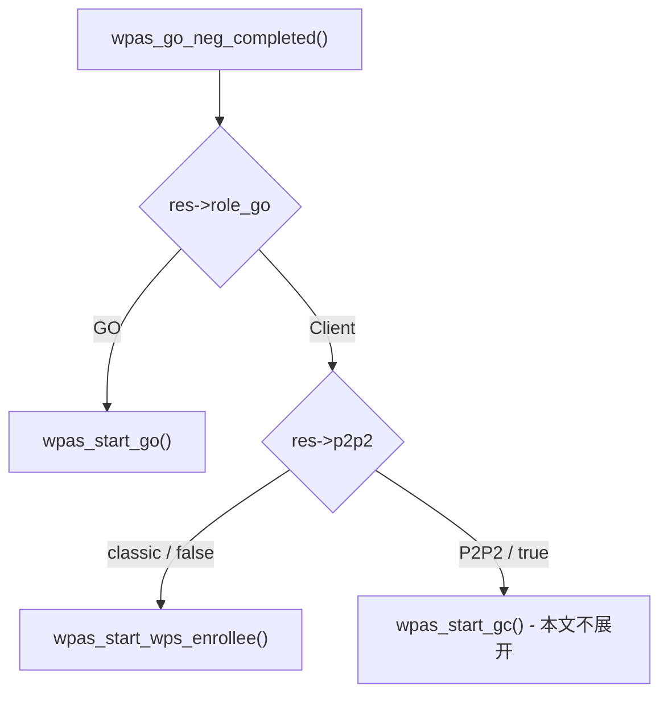
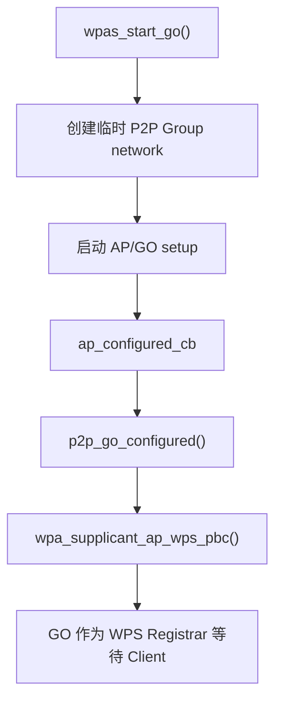
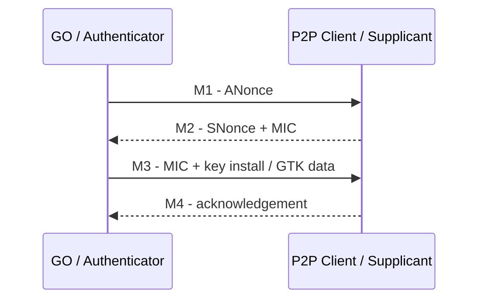
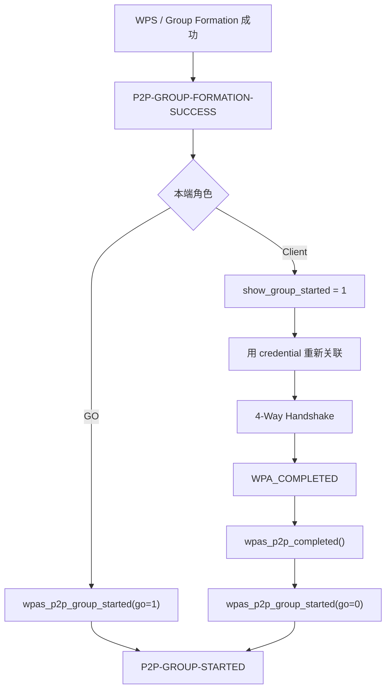
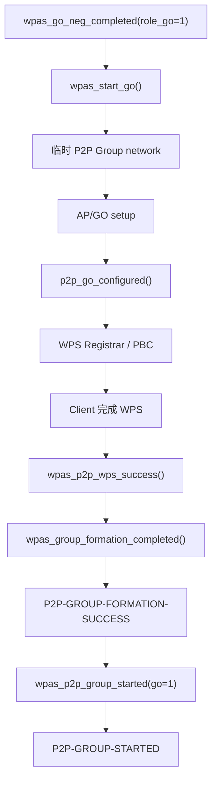
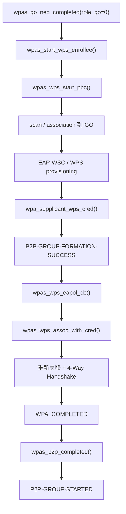

<meta name="referrer" content="no-referrer" />

# Wi-Fi Direct 源码分析（10）：从 GO Negotiation 结果到 P2P-GROUP-STARTED

> 摘要：从 wpas_go_neg_completed() 的 GO/Client 分叉继续，追踪 WPS provisioning、关联、4-Way Handshake 与 P2P-GROUP-STARTED。

[TOC]

第 09 篇停止在一个明确边界：P2P Core 已经完成 GO Negotiation，并通过：

```text
cfg->go_neg_completed
    ↓
wpas_go_neg_completed()
```

把 `struct p2p_go_neg_results` 交回 `wpa_supplicant`。此时已经知道：

- 哪一端成为 GO；
- 哪一端成为 Client；
- Group 使用的频率/信道；
- peer device/interface address；
- classic 路径使用的 WPS method；
- Group ID/SSID 等后续 formation 参数。[S1](#source-s1)

但此时仍未完成真正可用的数据连接。本篇只解决 GO Negotiation 之后的 Group Formation 与安全建立过程，直到 `P2P-GROUP-STARTED`。

---

## 1. 先把五个容易混在一起的术语固定下来

### PBC

PBC = **Push Button Configuration**，属于 WPS provisioning method。`p2p_connect <peer> pbc` 表示经典 Group Formation 后续使用 WPS PBC，不表示存在一个名为“PBC Negotiation”的独立协议阶段。[S3](#source-s3)

### Provision Discovery

Provision Discovery 是第 09 篇已经分析的可选 P2P Public Action exchange，用于在 GO Negotiation 前确认 provisioning/config method。它不是 WPS credential exchange 本身。

### GO Negotiation

GO Negotiation 解决 GO/Client 角色、Channel List、Operating Channel、Interface Address、Configuration Timeout 等 Group Formation 参数。它结束时产生 `p2p_go_neg_results`，但并不直接建立最终 WPA 数据链路。[S2](#source-s2)

### WPS provisioning

经典 Wi-Fi Direct Group Formation 中，GO 作为 WPS Registrar，Client 作为 WPS Enrollee。双方通过 EAP-WSC/WPS exchange，把 Client 真正加入 Group 所需的 SSID 和安全 credential 交付下来。[S3](#source-s3)

### 4-Way Handshake

WPS 得到 credential 后，Client 还要使用正常 WPA/RSN 安全流程重新建立数据连接。4-Way Handshake 使用 EAPOL-Key M1/M2/M3/M4 派生、确认和安装 PTK，并完成 GTK 等组密钥分发；成功后 supplicant 进入 `WPA_COMPLETED`。这一步才代表 Client 的加密数据端口真正具备正常工作条件。[S4](#source-s4)

所以 classic 主线是：


---

<a id="idx-role"></a>
## 2. wpas_go_neg_completed()：GO Negotiation 与 Group Formation 的真正分界

P2P 初始化时：

```c
p2p.go_neg_completed = wpas_go_neg_completed;
```

所以第 09 篇 Core 的完成事件最终回到：

```text
wpas_go_neg_completed()
```

该函数先处理成功/失败、Group interface、协商结果，然后出现最关键的角色分叉：[S1](#source-s1)

```c
if (res->role_go) {
        wpas_start_go(group_wpa_s, res, 1, group_wpa_s->p2p_mode);
} else {
        os_get_reltime(&group_wpa_s->scan_min_time);
        if (res->p2p2)
                wpas_start_gc(group_wpa_s, res);
        else
                wpas_start_wps_enrollee(group_wpa_s, res);
}
```

本文跟踪 classic 路径，因此：



这也是第 09 与第 10 篇的拆分点：前者结束“协商”，后者开始“真正创建/加入 Group”。

---

<a id="idx-go"></a>
## 3. 本端成为 GO：wpas_start_go() 先创建临时 Group network

当 `res->role_go == 1` 时进入：

```text
wpas_start_go()
```

它先复制 GO Negotiation 结果，再创建一个临时 `struct wpa_ssid` network，并把 Group Formation 所需参数写进去：[S1](#source-s1)

```c
ssid = wpa_config_add_network(wpa_s->conf);
...
wpa_config_set_network_defaults(ssid);
ssid->temporary = 1;
ssid->p2p_group = 1;
ssid->p2p_persistent_group = !!params->persistent_group;
ssid->mode = group_formation ? WPAS_MODE_P2P_GROUP_FORMATION :
        WPAS_MODE_P2P_GO;
ssid->frequency = params->freq;
ssid->proto = WPA_PROTO_RSN;
ssid->pairwise_cipher = WPA_CIPHER_CCMP;
ssid->group_cipher = WPA_CIPHER_CCMP;
```

当前从 GO Negotiation 进入时：

```text
group_formation = 1
```

所以 network 首先处于：

```text
WPAS_MODE_P2P_GROUP_FORMATION
```

而不是最终的 `WPAS_MODE_P2P_GO`。这个 mode 本身就是一个生命周期标志：GO 角色已经确定，但 WPS Group Formation 尚未完成。

---

<a id="idx-go-config"></a>
## 4. wpas_start_go() 为什么注册 p2p_go_configured() callback

`wpas_start_go()` 不会在一个同步调用栈里直接把 AP/GO 完全启动。它配置好 network 后，建立后续回调：

```c
wpa_s->ap_configured_cb = p2p_go_configured;
wpa_s->ap_configured_cb_ctx = wpa_s;
wpa_s->ap_configured_cb_data = wpa_s->go_params;
...
wpa_supplicant_req_scan(wpa_s, 0, 0);
```

这里重新使用 `wpa_supplicant` 正常的网络选择/AP setup 状态机；GO/AP 配置真正完成后，回调：

```text
p2p_go_configured()
```

被调用。[S1](#source-s1)

经典 PBC 路径中，`p2p_go_configured()` 最终启动 GO 侧 WPS Registrar：

```text
p2p_go_configured()
    ↓
wpa_supplicant_ap_wps_pbc()
    ↓
GO 等待 Client 的 WPS Enrollee
```

所以 GO 主线不是：

```text
wpas_start_go() -> Group 完成
```

而是：



---

<a id="idx-client"></a>
## 5. 本端成为 Client：wpas_start_wps_enrollee() 进入 WPS 加组

当 `res->role_go == 0` 且不是 P2P2 时：

```text
wpas_start_wps_enrollee()
```

该函数保存 GO Negotiation 结果，并按 WPS method 分流。PBC 路径直接调用：[S1](#source-s1)

```c
if (res->wps_method == WPS_PBC) {
        wpas_wps_start_pbc(wpa_s, res->peer_interface_addr, 1, 0);
```

`wpas_wps_start_pbc()` 位于 `wpa_supplicant/wps_supplicant.c`，其内部创建一个临时 WPS network：

```text
wpas_wps_start_pbc()
    ↓
wpas_wps_add_network()
    ↓
建立临时 WPA_KEY_MGMT_WPS network
    ↓
wpas_wps_reassoc()
    ↓
wpa_supplicant_req_scan()
```

这里出现的 scan 和第 07/08 篇 Device Discovery scan 目的完全不同：

```text
Device Discovery scan
    目标：发现附近 P2P Device

Group Formation scan
    目标：找到 GO Negotiation 已经确定的 GO BSS / SSID，准备关联
```

---

<a id="idx-wps"></a>
## 6. Client 如何从 scan 走到 association，再进入 EAP-WSC / WPS

WPS 临时 network 进入正常 supplicant 网络选择流程后，Client 会：

```text
扫描 GO BSS
    ↓
选择匹配的 WPS network
    ↓
802.11 Authentication / Association
    ↓
进入 WPA_KEY_MGMT_WPS
    ↓
EAPOL / EAP-WSC
```

这里 WPS 的作用不是完成最终 WPA 4-Way Handshake，而是安全地把后续连接需要的 credential 交给 Enrollee。[S3](#source-s3)

WPS Core 收到 Credential 后，通过 callback 进入：

```text
wpa_supplicant_wps_cred()
```

它把 WPS 临时 network 转换/替换为真正的 WPA/RSN network 配置，关键内容包括：

```text
SSID
WPA2/RSN security parameters
PSK / passphrase
cipher / key management
```

因此 WPS 的输出是“后续正常安全连接所需要的配置”，不是“业务数据连接已经完成”。

---

<a id="idx-wps-success"></a>
## 7. WPS success 怎样进入 P2P-GROUP-FORMATION-SUCCESS

WPS 成功事件最终进入：

```text
wpas_p2p_wps_success()
```

Client 与 GO 都会借此向 P2P Group Formation 汇总。hostap 2.12 中该路径最终调用：[S1](#source-s1)

```text
wpas_group_formation_completed()
```

成功时上报：

```text
P2P-GROUP-FORMATION-SUCCESS
```

这个事件的含义是：**classic P2P Group Formation / WPS provisioning 已经成功。**

它与：

```text
P2P-GROUP-STARTED
```

不是同一个时机，尤其 Client 侧还必须完成后续正常 WPA/RSN 数据连接。

---

<a id="idx-client-reconnect"></a>
## 8. 为什么 Client WPS 成功以后还要断开并重新连接

WPS 阶段使用的是：

```text
WPA_KEY_MGMT_WPS
```

而 `wpa_supplicant_wps_cred()` 已经得到真正的 WPA/RSN credential。WPS session 结束以后，Client 必须切回正常网络安全配置。

`wpas_wps_eapol_cb()` 识别到这一转换条件后执行：[S1](#source-s1)

```text
wpas_wps_eapol_cb()
    ↓
wpa_supplicant_deauthenticate()
    ↓
reassociate = 1
    ↓
eloop_register_timeout(..., wpas_wps_assoc_with_cred, ...)
```

随后 `wpas_wps_assoc_with_cred()` 使用新 credential 重新寻找/关联 GO。

这一步非常关键，因为它解释了为什么：

```text
WPS 成功
```

并不等于：

```text
WPA_COMPLETED
```

WPS 是“拿到钥匙和网络参数”；重新关联 + WPA/RSN handshake 才是“使用这些安全材料真正把数据链路建立起来”。

---

<a id="idx-4way"></a>
## 9. 4-Way Handshake 在这条链上处于什么位置

Client 使用 credential 重新关联 GO 后，进入正常 WPA2/RSN Personal 数据连接流程。这里会出现 EAPOL-Key 4-Way Handshake。[S4](#source-s4)

概念链可以固定为：



其核心作用是：

- 双方基于已经持有的 PMK/PSK 与 nonce/address 派生并确认 PTK；
- Client 安装用于单播保护的 PTK；
- 获取并安装组播/广播所需 GTK；
- 完成受保护数据端口建立所需的安全状态。

因此完整的 Client path 是：

```text
WPS provisioning
    ↓
获得 SSID + PSK/passphrase 等 credential
    ↓
重新关联 GO
    ↓
4-Way Handshake
    ↓
WPA_COMPLETED
```

---

<a id="idx-completed"></a>
## 10. WPA_COMPLETED 怎么走到 wpas_p2p_completed()

正常 supplicant 状态机进入：

```text
WPA_COMPLETED
```

时，`wpa_supplicant.c` 的状态切换逻辑会执行：

```c
wpa_s->after_wps = 0;
wpa_s->known_wps_freq = 0;
wpas_p2p_completed(wpa_s);
```

这就是 Client 的最终安全连接与 P2P Group 生命周期重新汇合的位置。[S1](#source-s1)

`wpas_p2p_completed()` 首先检查：

```c
if (!wpa_s->show_group_started || !ssid)
        return;
```

而第 7 节的 `wpas_group_formation_completed()` 在 Client 路径已经设置：

```text
show_group_started = 1
```

所以当 4-Way Handshake 成功、状态进入 `WPA_COMPLETED` 后：

```text
wpas_p2p_completed()
    ↓
wpas_p2p_group_started(..., go = 0, ...)
    ↓
P2P-GROUP-STARTED ... client ...
```

这解释了 Client 为什么必须等到 4-Way Handshake 之后才上报 Group Started。

---

<a id="idx-go-client-timing"></a>
## 11. GO 和 Client 为什么上报 P2P-GROUP-STARTED 的时机不同

`wpas_group_formation_completed()` 成功后会区分本端角色：[S1](#source-s1)

### GO 侧

GO/AP 已经创建，WPS Group Formation 成功后可以直接调用：

```text
wpas_p2p_group_started(go=1)
    ↓
P2P-GROUP-STARTED ... GO ...
```

### Client 侧

Client 不能在 WPS success 时立即报告数据连接已经可用，只先设置：

```text
show_group_started = 1
```

随后必须等待：

```text
WPS credential
    ↓
重新关联
    ↓
4-Way Handshake
    ↓
WPA_COMPLETED
    ↓
wpas_p2p_completed()
```

最终才调用：

```text
wpas_p2p_group_started(go=0)
```

完整差异可以记成：



---

<a id="idx-group-started"></a>
## 12. P2P-GROUP-STARTED 最终在哪里构造

最终 control event 由：

```text
wpas_p2p_group_started()
```

构造，而不是由 driver、P2P Core 或 GO Negotiation Confirm 直接上报。[S1](#source-s1)

事件会包含：

```text
interface name
GO / client role
SSID
frequency
GO device address
persistent flag
必要的 credential / IP related extension
```

典型形态：

```text
P2P-GROUP-STARTED <ifname> GO ssid="DIRECT-xx" freq=<freq> ...
```

或：

```text
P2P-GROUP-STARTED <ifname> client ssid="DIRECT-xx" freq=<freq> ...
```

到这里，P2P Group 在 supplicant 生命周期上已经“Started”。IP 地址、DHCP、route 和真正的 TCP/UDP/ICMP 数据面不在本文展开。

---

## 13. 两条完整角色主线

### GO 路径



### Client 路径



这两条图正好解释了旧文章中最容易被一条箭头链跳过的内容：**GO Negotiation、WPS provisioning、association、WPA 4-Way Handshake 和 Group Started 属于不同机制，靠 callback 与状态机逐段连接。**

---

## 关键源码索引

| 符号 | 本文位置 | hostap 2.12 |
|---|---|---|
| `wpas_go_neg_completed()` | [角色分叉](#idx-role) | [p2p_supplicant.c](https://chromium.googlesource.com/chromiumos/third_party/hostap/+/refs/tags/hostap_2_12/wpa_supplicant/p2p_supplicant.c) |
| `wpas_start_go()` | [GO network](#idx-go) | [p2p_supplicant.c](https://chromium.googlesource.com/chromiumos/third_party/hostap/+/refs/tags/hostap_2_12/wpa_supplicant/p2p_supplicant.c) |
| `p2p_go_configured()` | [GO callback](#idx-go-config) | [p2p_supplicant.c](https://chromium.googlesource.com/chromiumos/third_party/hostap/+/refs/tags/hostap_2_12/wpa_supplicant/p2p_supplicant.c) |
| `wpas_start_wps_enrollee()` | [Client WPS](#idx-client) | [p2p_supplicant.c](https://chromium.googlesource.com/chromiumos/third_party/hostap/+/refs/tags/hostap_2_12/wpa_supplicant/p2p_supplicant.c) |
| `wpas_wps_start_pbc()` | [WPS start](#idx-client) | [wps_supplicant.c](https://chromium.googlesource.com/chromiumos/third_party/hostap/+/refs/tags/hostap_2_12/wpa_supplicant/wps_supplicant.c) |
| `wpa_supplicant_wps_cred()` | [Credential](#idx-wps) | [wps_supplicant.c](https://chromium.googlesource.com/chromiumos/third_party/hostap/+/refs/tags/hostap_2_12/wpa_supplicant/wps_supplicant.c) |
| `wpas_wps_eapol_cb()` | [WPS 后重连](#idx-client-reconnect) | [wps_supplicant.c](https://chromium.googlesource.com/chromiumos/third_party/hostap/+/refs/tags/hostap_2_12/wpa_supplicant/wps_supplicant.c) |
| `wpas_wps_assoc_with_cred()` | [用 credential 重连](#idx-client-reconnect) | [wps_supplicant.c](https://chromium.googlesource.com/chromiumos/third_party/hostap/+/refs/tags/hostap_2_12/wpa_supplicant/wps_supplicant.c) |
| `wpas_group_formation_completed()` | [Formation success](#idx-wps-success) | [p2p_supplicant.c](https://chromium.googlesource.com/chromiumos/third_party/hostap/+/refs/tags/hostap_2_12/wpa_supplicant/p2p_supplicant.c) |
| `wpas_p2p_completed()` | [WPA_COMPLETED bridge](#idx-completed) | [p2p_supplicant.c](https://chromium.googlesource.com/chromiumos/third_party/hostap/+/refs/tags/hostap_2_12/wpa_supplicant/p2p_supplicant.c) |
| `wpas_p2p_group_started()` | [最终事件](#idx-group-started) | [p2p_supplicant.c](https://chromium.googlesource.com/chromiumos/third_party/hostap/+/refs/tags/hostap_2_12/wpa_supplicant/p2p_supplicant.c) |

## 资料来源

<a id="source-s1"></a>
### [S1] hostap 2.12 Git：Group Formation / WPS integration
- 版本：[`hostap_2_12`](https://chromium.googlesource.com/chromiumos/third_party/hostap/+/refs/tags/hostap_2_12)
- 文件：[p2p_supplicant.c](https://chromium.googlesource.com/chromiumos/third_party/hostap/+/refs/tags/hostap_2_12/wpa_supplicant/p2p_supplicant.c)、[wps_supplicant.c](https://chromium.googlesource.com/chromiumos/third_party/hostap/+/refs/tags/hostap_2_12/wpa_supplicant/wps_supplicant.c)、[wpa_supplicant.c](https://chromium.googlesource.com/chromiumos/third_party/hostap/+/refs/tags/hostap_2_12/wpa_supplicant/wpa_supplicant.c)
- 使用位置：第 2～13 节
- 支撑内容：GO/Client 分支、临时 Group network、WPS Registrar/Enrollee、Credential、WPS 后重连、`WPA_COMPLETED -> wpas_p2p_completed()`、`P2P-GROUP-STARTED`。

<a id="source-s2"></a>
### [S2] Wi-Fi Direct Specification v1.9
- 版本：v1.9
- URL/文档：[Wi-Fi Direct Specification v1.9](https://tools.barco.com/kb-downloads/4814/Wi-Fi_Direct_Specification_v1.pdf)
- 使用位置：第 1、2 节
- 支撑内容：GO Negotiation 与 Group Formation 的阶段边界和 P2P Group 角色。

<a id="source-s3"></a>
### [S3] WPS specification / hostap WPS implementation
- 版本：v2.0.8
- URL/文档：[Wi-Fi Protected Setup Specification v2.0.8](https://www.wi-fi.org/downloads-registered-guest/Wi-Fi_Protected_Setup_Specification_v2.0.8.pdf)
- 来源：[wps_supplicant.c](https://chromium.googlesource.com/chromiumos/third_party/hostap/+/refs/tags/hostap_2_12/wpa_supplicant/wps_supplicant.c)、[src/wps](https://chromium.googlesource.com/chromiumos/third_party/hostap/+/refs/tags/hostap_2_12/src/wps/)
- 使用位置：第 1、4～8 节
- 支撑内容：PBC、WPS Registrar/Enrollee、EAP-WSC、Credential 与 WPS completion。

<a id="source-s4"></a>
### [S4] hostap WPA/RSN supplicant implementation
- 版本：hostap 2.12
- 来源：[src/rsn_supp](https://chromium.googlesource.com/chromiumos/third_party/hostap/+/refs/tags/hostap_2_12/src/rsn_supp/)、[wpa_supplicant.c](https://chromium.googlesource.com/chromiumos/third_party/hostap/+/refs/tags/hostap_2_12/wpa_supplicant/wpa_supplicant.c)
- 使用位置：第 1、9、10 节
- 支撑内容：EAPOL-Key 4-Way Handshake、`WPA_COMPLETED` 与 P2P completion bridge。
