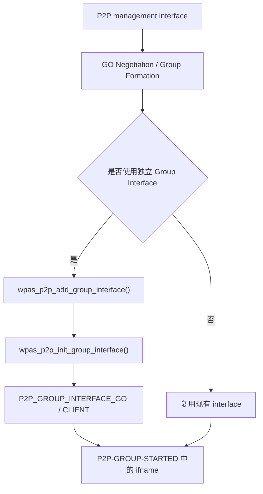
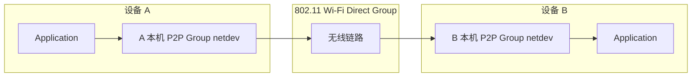
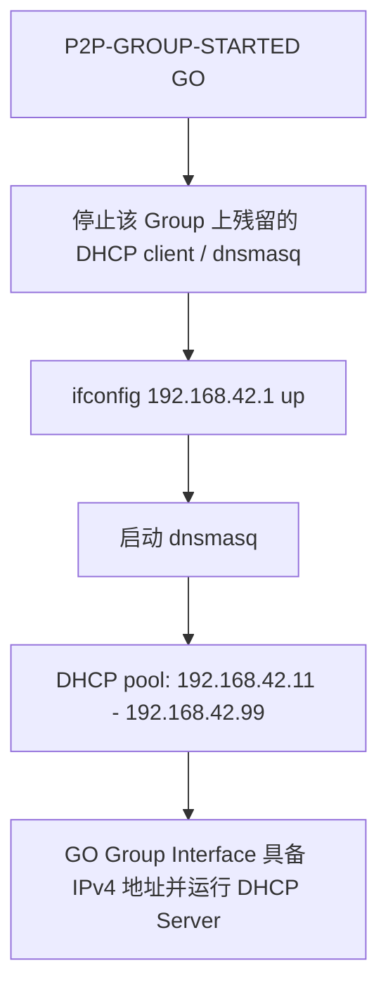
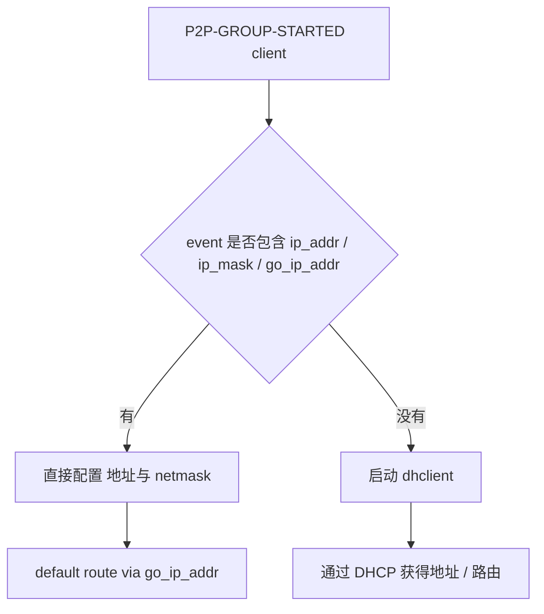
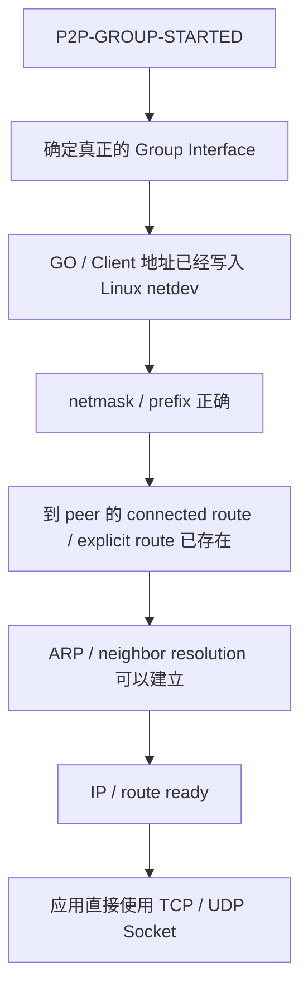
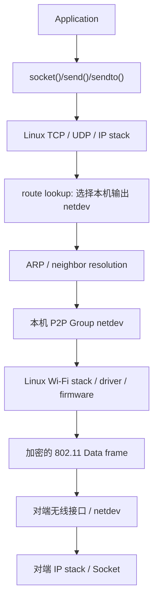
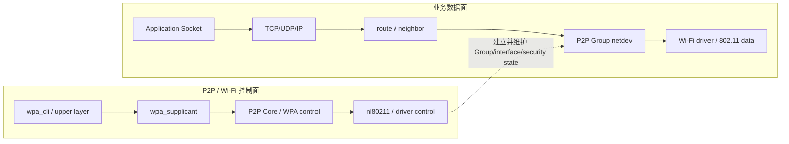
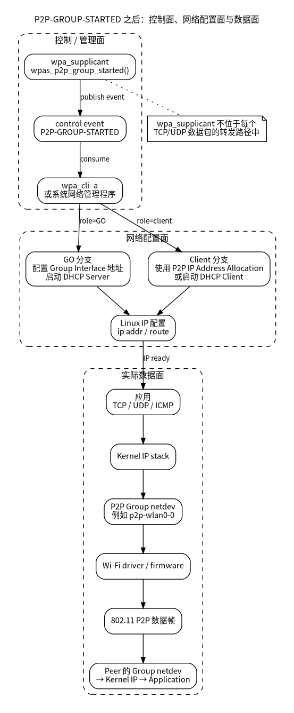
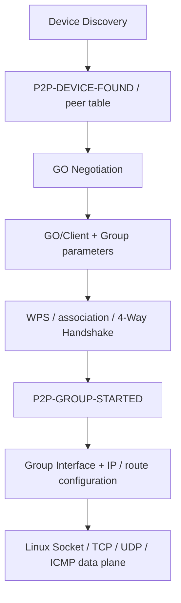

<meta name="referrer" content="no-referrer" />

# Wi-Fi Direct 源码分析（11）：P2P-GROUP-STARTED 之后——Group Interface、IP 配置与真实数据通路

> 摘要：从 P2P-GROUP-STARTED 追踪本机 Group netdev、IP/route 配置，并区分 P2P 控制面与 Linux Socket 数据面。

[TOC]

第 10 篇已经把一次经典 Wi-Fi Direct Group Formation 追到最终事件：

```text
P2P_CONNECT
    ↓
GO Negotiation
    ↓
WPS Group Formation
    ↓
P2P-GROUP-FORMATION-SUCCESS
    ↓
P2P-GROUP-STARTED
```

到这里最容易出现一个新的误解：既然已经收到 `P2P-GROUP-STARTED`，是否意味着两台设备已经拥有 IP 地址，可以直接 `ping`、建立 TCP 连接或发送 UDP 数据？

答案不能简单写成“是”。

`P2P-GROUP-STARTED` 首先说明 **P2P Group 已经进入可运行阶段**：如果本端是 GO，GO/AP 已经启动；如果本端是 Client，则安全关联已经完成到数据口可用。真正的 IP 通信还需要确认 Group Interface、IP 地址、掩码和路由。经典 Linux 集成通常还会在这个事件之后启动 DHCP Server / DHCP Client；较新的实现还可能通过 P2P IP Address Allocation 在 4-Way Handshake 中得到地址信息。

本篇因此只解决一条新的主线：

```text
P2P-GROUP-STARTED
    ↓
当前真正承载 Group 的 interface 是谁
    ↓
GO / Client 分别还缺什么网络配置
    ↓
IP 地址怎样得到
    ↓
应用数据最终怎样经过 Group Interface 收发
```

本文继续使用 hostap 2.12 release tag `hostap_2_12` 作为源码基线。Group Interface、`P2P-GROUP-STARTED`、P2P IP Address Allocation、`wpa_cli` action mode 与示例 DHCP 脚本均以该版本公开 Git 源码为依据。[S1](#source-s1) [S2](#source-s2)

---

## 1. 第 10 篇的终点，其实正好是系统网络配置的起点

第 10 篇已经追过 `wpas_p2p_group_started()`。第 11 篇从这里继续，不再回头重讲 GO Negotiation、WPS 和 4-Way Handshake。

hostap 2.12 中该函数位于：

```text
wpa_supplicant/p2p_supplicant.c
```

核心代码如下：

```c
static void wpas_p2p_group_started(struct wpa_supplicant *wpa_s,
                                   int go, struct wpa_ssid *ssid, int freq,
                                   const u8 *psk, const char *passphrase,
                                   const u8 *go_dev_addr, int persistent,
                                   const char *extra)
{
        const char *ssid_txt;
        char psk_txt[65];

        if (psk)
                wpa_snprintf_hex(psk_txt, sizeof(psk_txt), psk, 32);
        else
                psk_txt[0] = '\0';

        if (ssid)
                ssid_txt = wpa_ssid_txt(ssid->ssid, ssid->ssid_len);
        else
                ssid_txt = "";

        if (passphrase && passphrase[0] == '\0')
                passphrase = NULL;

        wpa_msg_global_ctrl(wpa_s->p2pdev, MSG_INFO,
                            P2P_EVENT_GROUP_STARTED
                            "%s %s ssid=\"%s\" freq=%d%s%s%s%s%s go_dev_addr="
                            MACSTR "%s%s",
                            wpa_s->ifname, go ? "GO" : "client", ssid_txt, freq,
                            psk ? " psk=" : "", psk_txt,
                            passphrase ? " passphrase=\"" : "",
                            passphrase ? passphrase : "",
                            passphrase ? "\"" : "",
                            MAC2STR(go_dev_addr),
                            persistent ? " [PERSISTENT]" : "", extra);
        wpa_printf(MSG_INFO, P2P_EVENT_GROUP_STARTED
                   "%s %s ssid=\"%s\" freq=%d go_dev_addr=" MACSTR "%s%s",
                   wpa_s->ifname, go ? "GO" : "client", ssid_txt, freq,
                   MAC2STR(go_dev_addr), persistent ? " [PERSISTENT]" : "",
                   extra);

        if (go && is_zero_ether_addr(wpa_s->go_dev_addr))
                os_memcpy(wpa_s->go_dev_addr, go_dev_addr, ETH_ALEN);
}
```

这里首先能确认 `P2P-GROUP-STARTED` 至少携带四类运行信息：

- `wpa_s->ifname`：实际承载当前 Group 的 interface 名称；
- `GO` / `client`：本端在这个 Group 中的角色；
- `ssid`、`freq`、`go_dev_addr`：Group 的基本属性；
- control interface 事件中还可以包含 PSK / passphrase、Persistent 标志以及 `extra` 附加字段。

所以这一事件并不只是“建组成功”的文字提示。对系统集成层来说，它还是一个非常重要的交接点：**从 P2P/WPA 控制面拿到真正的 Group Interface 和角色，然后开始配置三层网络。**[S1](#source-s1)

注意函数本身在发完事件以后，并没有紧接着调用：

```text
dhclient()
dnsmasq()
ifconfig()
ip route
```

也不存在：

```text
wpas_p2p_group_started()
    ↓
某个内部 DHCP 状态机
```

这就是本篇最重要的边界之一：**标准的 `wpa_supplicant` P2P 组建流程与操作系统 IP 网络配置并不是同一条内部调用链。**

---

## 2. 事件中的第一个参数为什么可能是 p2p-wlan0-0

继续追 IP 之前，必须先解决“到底应该给哪个 interface 配地址”。

很多运行日志中会看到：

```text
wlan0
p2p-dev-wlan0
p2p-wlan0-0
```

这三个名字不能简单理解为同一张网卡的三个别名。

### 2.1 P2P Device interface 负责管理，不等于 Group 的数据接口

hostap 2.12 创建 P2P Device interface 时使用：

```c
ret = os_snprintf(ifname, sizeof(ifname), P2P_MGMT_DEVICE_PREFIX "%s",
                  wpa_s->ifname);
```

之后以：

```c
wpa_drv_if_add(wpa_s, WPA_IF_P2P_DEVICE, ifname, if_addr, NULL,
               force_name, wpa_s->pending_interface_addr, NULL);
```

加入 driver，并为它创建新的 `struct wpa_supplicant` 实例：

```c
iface.p2p_mgmt = 1;
iface.ifname = wpa_s->pending_interface_name;

p2pdev_wpa_s = wpa_supplicant_add_iface(wpa_s->global, &iface, wpa_s);
```

源码注释还明确指出，该 P2P Device 并不一定是普通意义上的 netdev：

```c
/* Cut length at the maximum size. Note that we don't need to ensure
 * collision free names here as the created interface is not a netdev.
 */
```

因此像：

```text
p2p-dev-wlan0
```

这样的 P2P management interface 主要用于 P2P Device / discovery / negotiation 相关管理流程，不能看到名字就默认把业务 IP 配在这里。

### 2.2 Group Interface 才是 Group 建立后需要关注的接口

如果 driver 和配置允许独立 Group Interface，`wpas_p2p_get_group_ifname()` 会先生成一个候选名称：

```c
static void wpas_p2p_get_group_ifname(struct wpa_supplicant *wpa_s,
                                      char *ifname, size_t len)
{
        char *ifname_ptr = wpa_s->ifname;

        if (os_strncmp(wpa_s->ifname, P2P_MGMT_DEVICE_PREFIX,
                       os_strlen(P2P_MGMT_DEVICE_PREFIX)) == 0) {
                ifname_ptr = os_strrchr(wpa_s->ifname, '-') + 1;
        }

        os_snprintf(ifname, len, "p2p-%s-%d", ifname_ptr, wpa_s->p2p_group_idx);
        if (os_strlen(ifname) >= IFNAMSIZ &&
            os_strlen(wpa_s->ifname) < IFNAMSIZ) {
                int res;

                res = os_snprintf(ifname, len, "p2p-%d", wpa_s->p2p_group_idx);
                if (os_snprintf_error(len, res) && len)
                        ifname[len - 1] = '\0';
        }
}
```

所以常见结果会类似：

```text
p2p-wlan0-0
p2p-wlan0-1
```

随后 `wpas_p2p_add_group_interface()` 真正请求 driver 创建 Group Interface：

```c
wpa_s->pending_interface_type = type;
if (wpa_drv_if_add(wpa_s, type, ifname, NULL, NULL, force_ifname,
                   wpa_s->pending_interface_addr, NULL) < 0) {
        wpa_printf(MSG_ERROR, "P2P: Failed to create new group "
                   "interface");
        return -1;
}
```

创建成功以后，`wpas_p2p_init_group_interface()` 再把该 interface 加入 `wpa_supplicant` 自身的 interface 列表，并记录它在当前 Group 中的身份：

```c
group_wpa_s = wpa_supplicant_add_iface(wpa_s->global, &iface, wpa_s);
if (group_wpa_s == NULL) {
        wpa_printf(MSG_ERROR, "P2P: Failed to create new "
                   "wpa_supplicant interface");
        return NULL;
}
wpa_s->pending_interface_name[0] = '\0';
group_wpa_s->p2p_group_interface = go ? P2P_GROUP_INTERFACE_GO :
        P2P_GROUP_INTERFACE_CLIENT;
wpa_s->global->p2p_group_formation = group_wpa_s;
```

这里建立了一个很重要的对应关系：



因此 `P2P-GROUP-STARTED` 中打印的：

```c
wpa_s->ifname
```

才是后续系统网络配置真正应该关注的 interface。

### 2.3 `p2p-wlan0-0` 在 Linux 里到底算什么设备

`p2p-wlan0-0` 最准确的称呼是：**本机的 P2P Group 网络接口（network interface / netdev）**。它属于当前 Linux 主机，不是“对端设备在本机创建出来的一张网卡”。Linux 网络栈通过统一的 `struct net_device` 抽象各种网络接口，`ip link`、`ip addr`、路由表以及 Socket 数据发送最终都以这种本机 netdev 为出口。[S4](#source-s4)

因此下面两种理解要严格区分：

```text
错误理解：
本机 p2p-wlan0-0 = 对端设备在本机的虚拟以太网口

正确理解：
本机 p2p-wlan0-0 = 本机进入当前 Wi-Fi Direct Group 的网络接口
```

如果 A 与 B 建立一个 Group，两端各自拥有自己的本地网络接口：



例如可能出现：

```text
设备 A：p2p-wlan0-0   192.168.42.1/24
设备 B：p2p-wlan1-0   192.168.42.11/24
```

A 访问 `192.168.42.11` 时，A 的 Linux 内核只会把 packet 从 **A 自己的** `p2p-wlan0-0` 发出去；空口到达 B 后，再由 **B 自己的** Group interface 接收。A 并不会在本机创建一个“代表 B”的 `p2p-*` interface。

它也不应称为“以太网接口”。`eth0` 的链路技术通常是 Ethernet/IEEE 802.3，而 P2P Group interface 的无线数据链路仍然是 IEEE 802.11。二者之所以在 `ip addr`、`ip route` 和 Socket API 中使用方式很相似，是因为 Linux IP 层把它们统一抽象成网络接口；这并不意味着底层帧格式变成了 Ethernet。[S4](#source-s4)

在支持并发虚拟 interface 的无线设备上，`p2p-wlan0-0` 还经常与 `wlan0` 共享同一块物理 Wi-Fi radio / `wiphy`。因此它更接近“同一个无线硬件上的一个本地逻辑无线接口”，而不是新增了一块物理网卡。具体是否创建独立 Group interface，则由下一节的 driver capability 与 `p2p_no_group_iface` 等条件决定。[S1](#source-s1) [S4](#source-s4)

---

## 3. Group Interface 并不是任何平台都一定单独创建

看到 `p2p-wlan0-0` 很容易进一步形成另一个错误认识：Wi-Fi Direct Group 必然会创建一个新的虚拟 netdev。

hostap 2.12 的 `wpas_p2p_create_iface()` 明确说明这件事是有条件的：[S1](#source-s1)

```c
static int wpas_p2p_create_iface(struct wpa_supplicant *wpa_s)
{
        if (wpa_s->conf->p2p_no_group_iface)
                return 0; /* separate interface disabled per configuration */
        if (wpa_s->drv_flags &
            (WPA_DRIVER_FLAGS_P2P_DEDICATED_INTERFACE |
             WPA_DRIVER_FLAGS_P2P_MGMT_AND_NON_P2P))
                return 1; /* P2P group requires a new interface in every case
                           */
        if (!(wpa_s->drv_flags & WPA_DRIVER_FLAGS_P2P_CONCURRENT))
                return 0; /* driver does not support concurrent operations */
        if (wpa_s->global->ifaces->next)
                return 1; /* more that one interface already in use */
        if (wpa_s->wpa_state >= WPA_AUTHENTICATING)
                return 1; /* this interface is already in use */
        return 0;
}
```

配置结构中的注释也给出了同样的契约：

```c
/**
 * p2p_no_group_iface - Whether group interfaces can be used
 *
 * By default, wpa_supplicant will create a separate interface for P2P
 * group operations if the driver supports this. This functionality can
 * be disabled by setting this parameter to 1. In that case, the same
 * interface that was used for the P2P management operations is used
 * also for the group operation.
 */
int p2p_no_group_iface;
```

所以后续脚本绝不能硬编码：

```text
p2p-wlan0-0
```

更可靠的做法是直接消费 `P2P-GROUP-STARTED` 事件中的 interface 名称。[S1](#source-s1)

这一层可以总结为：

| 对象 | 主要职责 | 是否一定是业务数据 netdev |
|---|---|---|
| `wlan0` | 主 WLAN interface；在部分配置下也可能被复用为 P2P Group | 可能 |
| `p2p-dev-wlan0` | P2P management / Device interface | 不应默认认为是业务 IP interface |
| `p2p-wlan0-0` | 常见的独立 P2P Group Interface 名称 | 通常是 |
| `P2P-GROUP-STARTED` 中的 `ifname` | 当前 Group 实际使用的 interface | **后续配置应以它为准** |

---

## 4. P2P-GROUP-STARTED 之后为什么会重新看到 wpa_cli

第 02、03 篇已经从 `wpa_cli` 正向追过命令进入 `wpa_supplicant`：

```text
wpa_cli
    ↓
control request
    ↓
wpa_supplicant
```

现在会再次看到 `wpa_cli`，但方向已经完全相反。

这里不是“发送新的 P2P command”，而是：

```text
wpa_supplicant
    ↓
control event
    ↓
wpa_cli action mode
    ↓
外部脚本 / 网络管理程序
```

`wpa_cli` 的帮助文本中对 `-a` 的说明是：

```text
-a = run in daemon mode executing the action file based on events from
     wpa_supplicant
```

其 README 也明确把 action mode 用于：

```text
update network configuration and/or trigger DHCP client to update IP addresses
```

真正处理 `P2P-GROUP-STARTED` 的 action-mode 代码位于 `wpa_cli.c`，随后可以把事件参数交给外部 action script。[S2](#source-s2)

```c
} else if (str_starts(pos, P2P_EVENT_GROUP_STARTED)) {
        wpa_cli_exec(action_file, ifname, pos);
} else if (str_starts(pos, P2P_EVENT_GROUP_REMOVED)) {
        wpa_cli_exec(action_file, ifname, pos);
} else if (str_starts(pos, P2P_EVENT_CROSS_CONNECT_ENABLE)) {
        wpa_cli_exec(action_file, ifname, pos);
} else if (str_starts(pos, P2P_EVENT_CROSS_CONNECT_DISABLE)) {
        wpa_cli_exec(action_file, ifname, pos);
}
```

`wpa_cli_exec()` 再把 interface 和完整 event 拼给 action 程序：

```c
static int wpa_cli_exec(const char *program, const char *arg1,
                        const char *arg2)
{
        char *arg;
        size_t len;
        int res;

        if (!arg1)
                arg1 = "global";

        len = os_strlen(arg1) + os_strlen(arg2) + 2;
        arg = os_malloc(len);
        if (arg == NULL)
                return -1;
        os_snprintf(arg, len, "%s %s", arg1, arg2);
        res = os_exec(program, arg, 1);
        os_free(arg);

        return res;
}
```

因此 `examples/p2p-action.sh` 的参数布局才会是：

```sh
IFNAME=$1
CMD=$2
```

当事件类似：

```text
P2P-GROUP-STARTED p2p-wlan0-0 GO ssid="DIRECT-xx" freq=2412 ...
```

脚本看到的关键参数就是：

```text
$1 = 事件来源 interface
$2 = P2P-GROUP-STARTED
$3 = p2p-wlan0-0
$4 = GO
```

其中 `$3` 才是脚本后面命名为 `GIFNAME` 的 Group Interface。

这一步把第 10 篇的 P2P/WPA 状态机正式桥接到了操作系统网络配置。

---

## 5. GO 分支：Group 已经建立，但 GO 自己仍需要三层地址

hostap 2.12 源码自带的 `examples/p2p-action.sh` 给出了一个最直观的 Linux 集成示例。

进入 `P2P-GROUP-STARTED` 后先拿到 Group Interface：

```sh
if [ "$CMD" = "P2P-GROUP-STARTED" ]; then
    GIFNAME=$3
    if [ "$4" = "GO" ]; then
        kill_daemon dhclient /var/run/dhclient-$GIFNAME.pid
        rm /var/run/dhclient.leases-$GIFNAME
        kill_daemon dnsmasq /var/run/dnsmasq.pid-$GIFNAME
        ifconfig $GIFNAME 192.168.42.1 up
        if ! dnsmasq -x /var/run/dnsmasq.pid-$GIFNAME \
            -i $GIFNAME \
            -F192.168.42.11,192.168.42.99; then
            dnsmasq -x /var/run/dnsmasq.pid-$GIFNAME \
                -i $GIFNAME \
                -F192.168.42.11,192.168.42.99 --listen-address 192.168.42.1 -z -p 0
        fi
    fi
```

从执行顺序看，GO 侧做的是：



这里必须区分“示例实现”和“Wi-Fi Direct 协议要求”。

`192.168.42.1`、`192.168.42.11`～`192.168.42.99` 是这个示例脚本选择的地址规划，**不是 Wi-Fi Direct 规范强制规定的固定网段**。[S2](#source-s2)实际产品完全可以由 NetworkManager、Android Framework、ConnMan、自研网络管理进程或其他 DHCP 服务完成同样的系统集成。

hostap 2.12 还提供 `p2p-action-udhcp.sh`。它做的是同一类系统集成，只是把 DHCP 实现替换成：[S2](#source-s2)

```text
GO     -> udhcpd
client -> udhcpc
```

这进一步说明：`wpa_supplicant` 负责 P2P/WPA Group，本机具体使用哪一个 DHCP daemon 是系统集成选择，而不是 P2P Core 固定的一部分。[S2](#source-s2)

---

## 6. Client 分支不一定总是直接跑 DHCP

经典理解通常是：

```text
GO     -> DHCP Server
Client -> DHCP Client
```

这在大量 Linux 集成中仍然成立，但hostap 2.12 源码已经包含另一条值得单独说明的路径：**P2P IP Address Allocation**。

先看 `p2p-action.sh` 的 Client 分支：

```sh
if [ "$4" = "client" ]; then
    kill_daemon dhclient /var/run/dhclient-$GIFNAME.pid
    rm /var/run/dhclient.leases-$GIFNAME
    kill_daemon dnsmasq /var/run/dnsmasq.pid-$GIFNAME
    ipaddr=`echo "$*" | sed 's/.* ip_addr=\([^ ]*\).*/\1/'`
    ipmask=`echo "$*" | sed 's/.* ip_mask=\([^ ]*\).*/\1/'`
    goipaddr=`echo "$*" | sed 's/.* go_ip_addr=\([^ ]*\).*/\1/'`
    if echo "$ipaddr$ipmask$goipaddr" | grep -q ' '; then
        ipaddr=""
        ipmask=""
        goipaddr=""
    fi
    if [ -n "$ipaddr" ]; then
        sudo ifconfig $GIFNAME "$ipaddr" netmask "$ipmask"
        sudo ip ro re default via "$goipaddr"
        exit 0
    fi
    dhclient -pf /var/run/dhclient-$GIFNAME.pid \
        -lf /var/run/dhclient.leases-$GIFNAME \
        -nw \
        $GIFNAME
fi
```

这段代码实际上有两条分支：



因此不能把当前版本简单总结成“Client 收到 GROUP-STARTED 以后一定启动 DHCP”。

更准确的说法是：

> Client 在进入 IP 可用状态前需要获得三层参数；这些参数可以来自 P2P IP Address Allocation，也可以由外部 DHCP Client 获取。

---

## 7. ip_addr、ip_mask、go_ip_addr 是从哪里塞进事件的

继续顺着 Client 路径回看第 10 篇已经出现过的 `wpas_p2p_completed()`。

第 10 篇解释过：Client 不会在 WPS 成功的瞬间立即上报 `P2P-GROUP-STARTED`，而是等 WPA/RSN 数据连接真正进入 `WPA_COMPLETED`。

`wpa_supplicant.c` 中状态进入 `WPA_COMPLETED` 后，会调用：

```c
wpa_drv_set_operstate(wpa_s, 1);
#ifndef IEEE8021X_EAPOL
        wpa_drv_set_supp_port(wpa_s, 1);
#endif /* IEEE8021X_EAPOL */
wpa_s->after_wps = 0;
wpa_s->known_wps_freq = 0;
wpas_p2p_completed(wpa_s);
```

进入 `wpas_p2p_completed()` 后，hostap 2.12 源码会尝试从 WPA state machine 读取 P2P IP Address Allocation 结果：

```c
ip_addr[0] = '\0';
if (wpa_sm_get_p2p_ip_addr(wpa_s->wpa, ip) == 0) {
        int res;

        res = os_snprintf(ip_addr, sizeof(ip_addr),
                          " ip_addr=%u.%u.%u.%u "
                          "ip_mask=%u.%u.%u.%u go_ip_addr=%u.%u.%u.%u",
                          ip[0], ip[1], ip[2], ip[3],
                          ip[4], ip[5], ip[6], ip[7],
                          ip[8], ip[9], ip[10], ip[11]);
        if (os_snprintf_error(sizeof(ip_addr), res))
                ip_addr[0] = '\0';
        ip_ptr = ip;
}
```

之后这个字符串作为 `extra` 参数进入：

```c
wpas_p2p_group_started(wpa_s, 0, ssid, freq,
                       ssid->passphrase == NULL && ssid->psk_set ?
                       ssid->psk : NULL,
                       ssid->passphrase, go_dev_addr, persistent,
                       ip_addr);
```

于是 Client 的 control event 才可能变成：

```text
P2P-GROUP-STARTED <ifname> client ...
    ip_addr=<client-ip>
    ip_mask=<mask>
    go_ip_addr=<go-ip>
```

这就和上一节 `p2p-action.sh` 中的解析代码完整接上了。

---

## 8. 什么条件下才会请求 P2P IP Address Allocation

hostap 2.12 源码还能继续追到 WPA state machine 配置入口。

`wpas_glue.c` 的 `wpa_supplicant_rsn_supp_set_config()` 中有：

```c
#ifdef CONFIG_P2P
        if (ssid->p2p_group && wpa_s->current_bss &&
            !wpa_s->p2p_disable_ip_addr_req) {
                struct wpabuf *p2p;
                p2p = wpa_bss_get_vendor_ie_multi(wpa_s->current_bss,
                                                  P2P_IE_VENDOR_TYPE);
                if (p2p) {
                        u8 group_capab;
                        group_capab = p2p_get_group_capab(p2p);
                        if (group_capab &
                            P2P_GROUP_CAPAB_IP_ADDR_ALLOCATION)
                                conf.p2p = 1;
                        wpabuf_free(p2p);
                }
        }
#endif /* CONFIG_P2P */
```

这里至少能得到三个明确条件：

1. 当前 network 是 P2P Group；
2. 没有通过 `p2p_disable_ip_addr_req` 禁止请求；
3. 对端 Group Capability 宣告支持 `P2P_GROUP_CAPAB_IP_ADDR_ALLOCATION`。

满足这些条件时，RSN supplicant 才会启用相应的 P2P IP address request 路径。

GO 侧是否宣告地址分配能力又来自另一组配置。hostap 2.12 源码在初始化 P2P Group 时使用：

```c
cfg->ip_addr_alloc = WPA_GET_BE32(wpa_s->p2pdev->conf->ip_addr_start)
        != 0;
```

而 GO/AP 配置会从 P2P Device 配置中复制：

```c
if (ssid->p2p_group) {
        os_memcpy(bss->ip_addr_go, wpa_s->p2pdev->conf->ip_addr_go, 4);
        os_memcpy(bss->ip_addr_mask, wpa_s->p2pdev->conf->ip_addr_mask,
                  4);
        os_memcpy(bss->ip_addr_start,
                  wpa_s->p2pdev->conf->ip_addr_start, 4);
        os_memcpy(bss->ip_addr_end, wpa_s->p2pdev->conf->ip_addr_end,
                  4);
}
```

对应配置结构中存在：

```c
u8 ip_addr_go[4];
u8 ip_addr_mask[4];
u8 ip_addr_start[4];
u8 ip_addr_end[4];
```

所以当前版本的 IP 获取模型不能只画成一条 DHCP 线，而应该理解为：

```text
P2P Group 二层建立
        ↓
Client 是否拿到了 P2P IP Address Allocation 信息？
        ├── 是：event 携带 ip_addr / ip_mask / go_ip_addr
        │       ↓
        │     系统直接应用这些参数
        │
        └── 否：外部网络管理层继续运行 DHCP
```

这里仍然要注意一个边界：即使地址参数通过 P2P/WPA 协议交换得到了，**把这些地址真正写入 Linux netdev 和 routing table 仍然属于系统网络配置动作**。hostap 示例依然是在 action script 中执行 `ifconfig` 和 `ip route`。[S1](#source-s1) [S2](#source-s2)

---

## 9. 为什么 P2P-GROUP-STARTED 不应直接等价为“IP 已经 ready”

现在可以更精确地区分 GO 和 Client 的事件语义。

### GO 侧

第 10 篇已经看到，GO 在 Group Formation 成功并进入可运行 GO 状态后会调用：

```text
wpas_p2p_group_started(..., go=1, ...)
```

此时 GO/AP 二层 Group 已经建立，但 Linux Group Interface 是否已经有 IPv4 地址，取决于后续系统集成。示例脚本正是在事件之后才执行：

```text
ifconfig <group-iface> 192.168.42.1 up
```

所以：

```text
GO 收到 P2P-GROUP-STARTED
```

不能自动推出：

```text
ip addr show <group-iface>
```

已经存在期望的业务 IPv4 地址。

### Client 侧

Client 的语义更接近“二层数据口已经 ready”。源码在 Group Formation 完成阶段专门留下：

```c
/*
 * Indicate event only after successfully completed 4-way
 * handshake, i.e., when the interface is ready for data
 * packets.
 */
wpa_s->show_group_started = 1;
```

之后只有进入 `WPA_COMPLETED` 才会调用 `wpas_p2p_completed()` 并最终发出 `P2P-GROUP-STARTED`。

因此 Client 侧的事件已经晚于安全 4-Way Handshake，driver 数据口也已经进入可以发送加密数据帧的阶段；但三层仍然有两种可能：

- event 已带 `ip_addr/ip_mask/go_ip_addr`：上层可以直接应用；
- event 没有这些字段：仍需 DHCP 或其他 IP 配置机制。

这几个层次最好明确区分：

| 层次 | GO 收到 `P2P-GROUP-STARTED` | Client 收到 `P2P-GROUP-STARTED` |
|---|---|---|
| P2P Group 角色 | 已确定 | 已确定 |
| 802.11 / P2P 二层关系 | GO 已运行 | 已关联 GO |
| WPA/RSN 数据口 | GO 侧可提供 Group 服务 | 已完成 4-Way Handshake，数据口 ready |
| Linux Group Interface | 已知 | 已知 |
| IPv4 地址 | 不保证已写入 netdev | 可能随 event 得到参数，也可能仍无地址 |
| DHCP | 常见实现会在事件后启动 Server | event 无 IP 参数时常见实现启动 Client |
| TCP/UDP 可用 | 还需三层配置完成 | 还需三层配置完成 |

---

<a id="idx-socket"></a>
## 10. IP / route ready 以后，可以直接使用 Linux Socket API

当 GO 与 Client 的三层配置完成以后，Wi-Fi Direct 对应用程序暴露出来的就是一个普通的 Linux IP 网络。应用层**不需要再调用某套“Wi-Fi Direct 专用数据发送 API”**；TCP/UDP 等业务通信可以直接使用标准 BSD Socket 接口。[S3](#source-s3)

这里的关键前提不是单独看到：

```text
P2P-GROUP-STARTED
```

而是确认当前 Group 已经达到：



因此可以把“Socket 可用”的边界定义得更精确：

| 条件 | 为什么需要 |
|---|---|
| Group Interface 已知并处于可用状态 | Socket 最终要通过该 netdev 发送 IP packet |
| 本端已经有 IP 地址 | 内核需要合法的源地址 |
| peer 地址已知或能通过业务协议获得 | `connect()` / `sendto()` 需要目标 IP |
| 子网/route 正确 | Linux routing table 决定 packet 从哪个 interface 发出 |
| 本机 firewall 允许对应流量 | 二层/三层已经连通也可能被 nftables/iptables 拦截 |

`P2P-GROUP-STARTED` 只保证前面的 P2P/WPA 生命周期已经走到 Group Started；GO 侧尤其可能还需要在事件之后配置 IP 并启动 DHCP Server。因此不能把这个 event 本身当作“应用现在一定可以 `connect()`”的唯一 ready 信号。[S1](#source-s1) [S2](#source-s2)

### 10.1 GO 和 Client 都可以做 Socket Server 或 Client

Wi-Fi Direct 中的 **GO / P2P Client 是无线 Group 角色**，并不等于 TCP 的 server/client 角色。

例如完成 IP 配置后：

```text
GO
192.168.42.1
        ↕
P2P Group
        ↕
Client
192.168.42.11
```

完全可以让 GO 监听 TCP：

```c
int fd = socket(AF_INET, SOCK_STREAM, 0);
bind(fd, ...);
listen(fd, 4);
accept(fd, ...);
```

Client 直接连接 GO：

```c
int fd = socket(AF_INET, SOCK_STREAM, 0);
connect(fd, ... /* 192.168.42.1 */);
```

也可以反过来让 Client `bind()/listen()`，GO 主动 `connect()` Client。P2P 的 GO/Client 角色不会限制应用层 TCP 连接由哪一端发起。[S3](#source-s3)

UDP 同样没有额外 P2P API：

```c
socket(AF_INET, SOCK_DGRAM, 0);
sendto(...);
recvfrom(...);
```

应用也可以继续运行 HTTP、WebSocket、MQTT、自定义 TCP/UDP 协议等普通 IP 协议。是否能够直接使用某个域名还取决于 DNS/name-resolution 配置；如果直接使用 peer IP，则不需要先具备 DNS。

### 10.2 `routing decision -> P2P Group netdev` 不代表又进入 P2P 协议栈

这条路径最容易产生新的误解：

```text
Application
    ↓
Socket
    ↓
Linux TCP / UDP / IP
    ↓
routing decision
    ↓
P2P Group netdev
```

其中 `routing decision` 的含义只是：**Linux IP 层根据目标地址查路由表，决定这个 packet 应该从本机哪个网络接口发出。** 它不是“重新选择一次 Wi-Fi Direct 协议流程”。[S3](#source-s3) [S4](#source-s4)

例如 Group 中存在：

```text
GO      192.168.42.1/24
Client  192.168.42.11/24
```

Client 的路由表可能包含类似的 connected route：

```text
192.168.42.0/24 dev p2p-wlan0-0 scope link src 192.168.42.11
```

应用执行：

```c
send(fd, buf, len, 0);
```

目标 IP 是 `192.168.42.1` 时，Linux route lookup 命中 `192.168.42.0/24`，因此选择：

```text
outgoing netdev = p2p-wlan0-0
```

这个选择只回答“从本机哪个口出去”。它不会再触发：

```text
P2P_FIND
Provision Discovery
GO Negotiation
WPS provisioning
p2p_connect()
p2p_go_det()
```

这些属于 **P2P 控制面**，其职责是在此前建立并维护 Group。正常业务 packet 进入的是 Linux **数据面**。[S1](#source-s1)

### 10.3 Socket packet 的真实数据面：netdev 后面仍然是 802.11，但不经过 P2P Core

route 选定 `p2p-wlan0-0` 后，Linux 网络栈继续完成同一子网的 neighbor/ARP 解析，把目标 IP 映射到对应链路层地址，然后把 packet 作为内核网络数据交给这个 netdev 对应的无线发送路径。最终由 Wi-Fi stack / driver / firmware 发送受 WPA/RSN 保护的 802.11 Data frame。[S4](#source-s4)

因此更准确的数据路径是：



所以：

> **P2P 协议负责把路建起来；Linux IP/Socket 数据面负责在已经建好的路上发送业务 packet。**

`wpa_supplicant` 并没有因此“退出系统”。它仍然保留控制职责，例如处理 Group 生命周期、断连、重新协商以及必要的无线安全/管理事件。但正常 TCP/UDP payload 不会逐包经过：

```text
wpa_supplicant P2P Core
```

也不会变成：

```text
Socket -> P2P_CONNECT -> Peer
```

### 10.4 控制面与数据面共享同一个 Group，但走的是两条不同路径

把两条路径并排看最容易建立正确心智模型：



二者会共享同一块无线硬件、同一个 Group interface 以及已经建立的安全状态，但承担的工作不同：

| 层面 | 主要对象 | 典型工作 | TCP/UDP payload 是否逐包经过 |
|---|---|---|---|
| P2P 控制面 | `wpa_supplicant`、P2P Core | Find、GO Negotiation、Group lifecycle | 否 |
| 网络配置面 | DHCP/IP/route 管理 | 给 Group netdev 配地址和路由 | 否 |
| IP 数据面 | Socket、TCP/UDP/IP、netdev | 真实业务数据收发 | 是 |
| Wi-Fi 数据链路 | driver/firmware/802.11 | 将 IP packet 封装并传输为空口数据帧 | 是 |

下面这张图把控制面、网络配置面和真实数据面放在一起：



这也是为什么出现：

```text
P2P-GROUP-STARTED 已经出现
但 ping / TCP 仍然不通
```

时，排查重点应转向当前 Group Interface 的地址、route、ARP/neighbor、防火墙、DHCP 和应用监听地址，而不是继续只检查 `P2P_FIND` / `P2P_CONNECT` control command。

---

## 11. GO 与 Client 之间本地通信不需要 NAT

`examples/p2p-action.sh` 后面还能看到：

```sh
if [ "$CMD" = "P2P-CROSS-CONNECT-ENABLE" ]; then
    GIFNAME=$3
    UPLINK=$4
    iptables -P FORWARD DROP
    iptables -t nat -A POSTROUTING -o $UPLINK -j MASQUERADE
    iptables -A FORWARD -i $UPLINK -o $GIFNAME -m state --state RELATED,ESTABLISHED -j ACCEPT
    iptables -A FORWARD -i $GIFNAME -o $UPLINK -j ACCEPT
    sysctl net.ipv4.ip_forward=1
fi
```

这里出现 NAT、FORWARD 和 `ip_forward`，但它解决的不是最基本的 GO ↔ Client 通信。[S2](#source-s2)

它解决的是：

```text
P2P Client
    ↓
P2P Group Interface
    ↓
GO
    ↓
另一个 uplink interface
    ↓
外部网络
```

也就是 cross-connection / Internet sharing 一类场景。

纯粹在 Group 内：

```text
GO <-> Client
```

两端只要处于同一可达 IP 子网并且本机防火墙允许，就不需要为了彼此通信额外做 SNAT/MASQUERADE。

因此需要把三件事严格分开：

```text
建立 P2P Group
!=
给 Group Interface 配 IP
!=
把 P2P Group 转发到外部 uplink
```

前者由前几篇追踪的 P2P/WPA 流程完成；第二件事属于本篇；第三件事只有需要跨接口转发时才出现。

---

## 12. 从 P2P-GROUP-STARTED 到第一条 Socket 数据的完整回看

到这里可以把第 11 篇重新压缩成一条完整执行主线。

### 第一阶段：第 10 篇交付一个已经成立的 Group

```text
Group Formation
    ↓
GO / Client 安全连接达到各自的 Group Started 条件
    ↓
wpas_p2p_group_started()
    ↓
P2P-GROUP-STARTED
```

事件里最值得上层消费的是：

```text
Group Interface
角色：GO / client
SSID / frequency / GO Device Address
可选的 client IP allocation 信息
```

### 第二阶段：找到真正的数据 interface

如果平台支持并允许独立 Group Interface：

```text
wpas_p2p_add_group_interface()
    ↓
wpas_p2p_init_group_interface()
    ↓
p2p_group_interface = GO / CLIENT
```

最终 interface 名称被放进：

```text
P2P-GROUP-STARTED <ifname> ...
```

如果平台不使用独立 Group Interface，则可能复用现有 interface，所以不能依赖固定命名规则。

### 第三阶段：control event 离开 wpa_supplicant

Linux 示例路径是：

```text
wpa_supplicant
    ↓
P2P-GROUP-STARTED
    ↓
wpa_cli -a <action-script>
    ↓
examples/p2p-action.sh
```

这是一条 **event → 系统网络配置** 的反向控制路径，不是第 02、03 篇的 command ingress。

### 第四阶段：GO / Client 分别建立三层配置

GO 的经典示例：

```text
Group Interface
    ↓
配置 192.168.42.1
    ↓
启动 dnsmasq / udhcpd
    ↓
向 Client 分配地址
```

Client 有两条可能路径：

```text
P2P IP Address Allocation 可用
    ↓
P2P-GROUP-STARTED 携带
ip_addr / ip_mask / go_ip_addr
    ↓
直接应用地址和默认路由
```

或者：

```text
没有 IP allocation 信息
    ↓
启动 dhclient / udhcpc
    ↓
从 GO 的 DHCP Server 获取地址
```

### 第五阶段：数据面脱离 control socket

IP 配置完成以后：

```text
Application
    ↓
TCP / UDP / ICMP
    ↓
Kernel IP stack
    ↓
route lookup + neighbor/ARP
    ↓
本机 P2P Group netdev
    ↓
Wi-Fi driver / firmware
    ↓
802.11 protected data frame
    ↓
Peer 的本地 Group netdev / IP stack
```

这里的 Group netdev 是**本机** Linux 网络接口，不是对端映射到本机的一张虚拟网卡。到这一阶段，普通业务数据不再经过 `wpa_cli` 的 control socket，也不会逐包进入 `wpa_supplicant` 用户态 P2P Core。

---

## 13. 从 Device Discovery 到 Socket 数据面的分层回看

整个系列到这里形成四个清晰边界：



第一，**Device Discovery 解决“对端是谁”**，结果是 peer table 和 `P2P-DEVICE-FOUND`。

第二，**GO Negotiation 解决“双方如何决定角色和 Group 参数”**，但此时还没有得到最终可用的数据连接。

第三，**Group Formation / Security 解决“如何真正创建或加入安全 Group”**，结果是 `P2P-GROUP-STARTED`。

第四，**Group Runtime 解决“这个已经建立的 Group 如何成为操作系统可直接使用的 IP 网络”**。Group netdev 是本机网络接口；route lookup 只是选择这个本机出口，不会重新进入 P2P Find/GO Negotiation/WPS 等协议状态机。当 Group netdev、IP 和 route 就绪以后，业务程序直接进入 Linux Socket 数据面。

因此 `P2P-GROUP-STARTED` 是控制面和系统网络配置面的交接点，而 **`IP / route ready` 才是普通应用开始 TCP/UDP 通信的直接边界**。P2P 控制面负责“建路和维护路”，Socket/IP 数据面负责“在已经建好的路上发送业务数据”。

---

## 资料来源

<a id="source-s1"></a>
### [S1] hostap 2.12：P2P Group Interface、Group Started 与 IP Allocation
- 版本：hostap 2.12 / tag `hostap_2_12`
- URL/文档：[hostap_2_12](https://chromium.googlesource.com/chromiumos/third_party/hostap/+/refs/tags/hostap_2_12)
- 定位：[wpa_supplicant/p2p_supplicant.c](https://chromium.googlesource.com/chromiumos/third_party/hostap/+/refs/tags/hostap_2_12/wpa_supplicant/p2p_supplicant.c)、[wpa_supplicant/config.h](https://chromium.googlesource.com/chromiumos/third_party/hostap/+/refs/tags/hostap_2_12/wpa_supplicant/config.h)
- 使用位置：第 1～3、6～10、12～13 节
- 支撑内容：`P2P-GROUP-STARTED`、Group Interface 创建/复用、Client IP allocation 字段以及 Group 生命周期与 Linux 网络配置的边界。

<a id="source-s2"></a>
### [S2] hostap 2.12：wpa_cli action mode 与 P2P 网络配置示例
- 版本：hostap 2.12 / tag `hostap_2_12`
- URL/文档：[wpa_cli.c](https://chromium.googlesource.com/chromiumos/third_party/hostap/+/refs/tags/hostap_2_12/wpa_supplicant/wpa_cli.c)、[examples/p2p-action.sh](https://chromium.googlesource.com/chromiumos/third_party/hostap/+/refs/tags/hostap_2_12/wpa_supplicant/examples/p2p-action.sh)、[examples/p2p-action-udhcp.sh](https://chromium.googlesource.com/chromiumos/third_party/hostap/+/refs/tags/hostap_2_12/wpa_supplicant/examples/p2p-action-udhcp.sh)
- 定位：`P2P-GROUP-STARTED` action、GO 地址配置、dnsmasq/udhcpd、Client DHCP 与 cross-connect/NAT 示例
- 使用位置：第 4～6、9～11 节
- 支撑内容：`wpa_supplicant` 产生 Group event 后由外部系统层完成 IP/DHCP/route 配置，以及本地 Group 通信与外部 uplink NAT 的区别。

<a id="source-s3"></a>
### [S3] Linux man-pages：BSD Socket、IP、TCP 与 UDP 用户态接口
- 版本：Linux man-pages 在线文档
- URL/文档：[socket(2)](https://man7.org/linux/man-pages/man2/socket.2.html)、[ip(7)](https://man7.org/linux/man-pages/man7/ip.7.html)、[tcp(7)](https://man7.org/linux/man-pages/man7/tcp.7.html)、[udp(7)](https://man7.org/linux/man-pages/man7/udp.7.html)
- 定位：`socket()`、`bind()`、`listen()`、`accept()`、`connect()`、`send()`/`recv()`、`sendto()`/`recvfrom()`
- 使用位置：第 10、12、13 节
- 支撑内容：IP 网络 ready 后应用直接使用标准 Linux Socket API；GO/P2P Client 无需映射为固定的 TCP server/client 角色。


<a id="source-s4"></a>
### [S4] Linux Kernel / Linux Wireless：net_device 与 P2P 无线接口
- 版本：Linux Kernel Documentation（在线文档）
- URL/文档：[Network Devices, the Kernel, and You!](https://docs.kernel.org/networking/netdevices.html)、[Linux Wireless P2P overview](https://wireless.docs.kernel.org/en/latest/en/developers/p2p/overview.html)、[cfg80211 subsystem](https://docs.kernel.org/driver-api/80211/cfg80211.html)
- 定位：`struct net_device`、P2P interface types / interface combinations、wireless interface 与 driver 的关系
- 使用位置：第 2.3、10.2～10.4、12～13 节
- 支撑内容：`p2p-wlan0-0` 属于本机 Linux 网络接口抽象；无线 Group interface 可以与其它无线 interface 共享同一物理 radio；route/netdev 属于 Linux 数据面接口选择，不等价于重新进入 P2P 控制协议。
