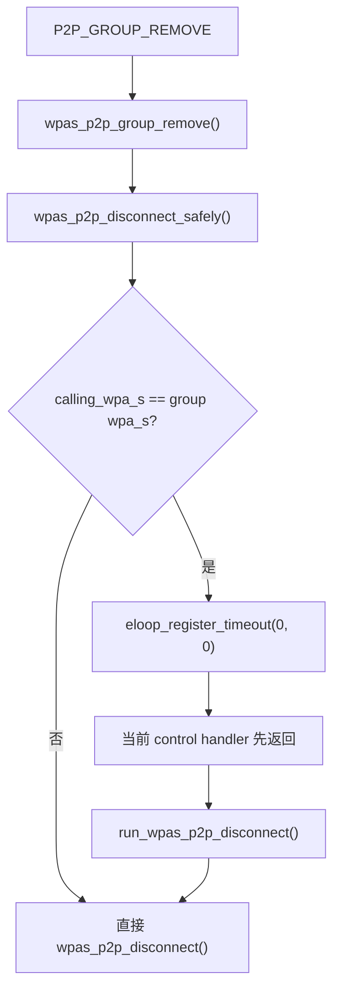
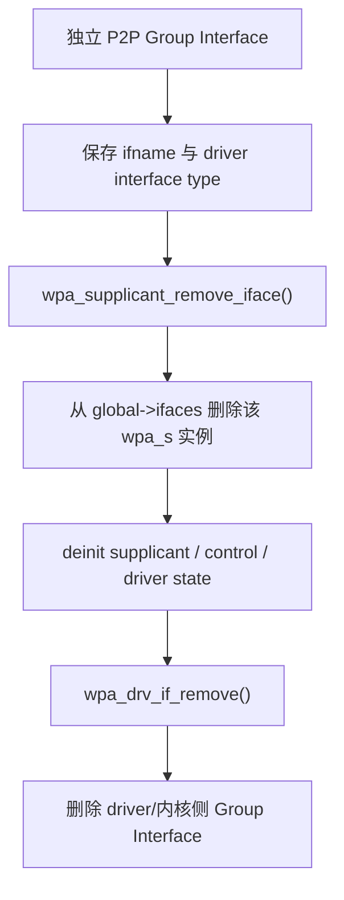
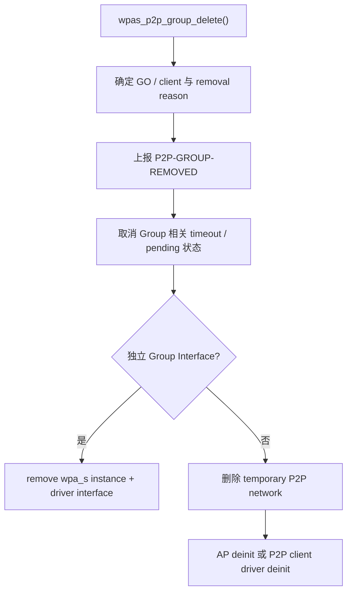
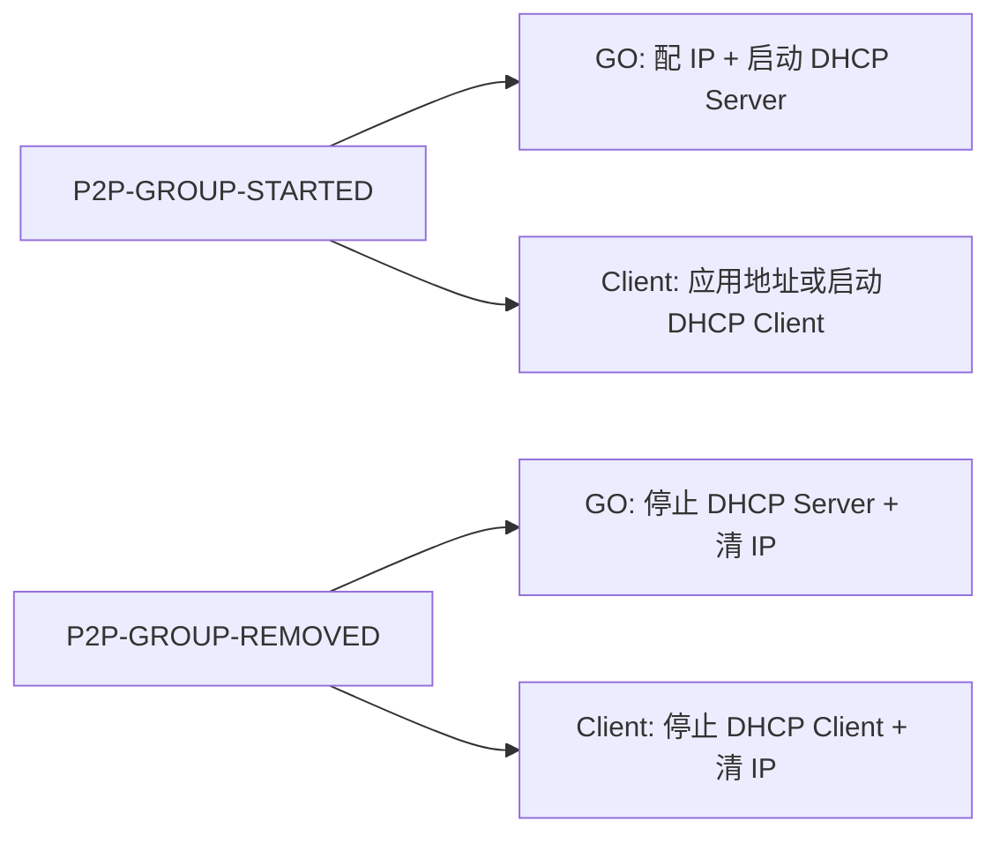

<meta name="referrer" content="no-referrer" />

# Wi-Fi Direct 源码分析（12）：P2P Group 如何结束——P2P_GROUP_REMOVE、资源释放与 P2P-GROUP-REMOVED

> 摘要：沿 P2P_GROUP_REMOVE 追踪 Group teardown：定位目标接口、安全延迟删除、P2P-GROUP-REMOVED、Group 资源与 IP/DHCP 清理，并说明自动移除原因和 P2P Device 保留边界。

[TOC]

第 11 篇已经把一次已建立的 P2P Group 追到真正可用的数据通路：

```text
P2P-GROUP-STARTED
    ↓
Group Interface
    ↓
GO / Client
    ↓
IP Address Allocation 或 DHCP
    ↓
TCP / UDP / ICMP
```

但 Group 不会永久存在。用户可以主动结束 Group，GO 也可能因为空闲超时、频率冲突、驱动资源变化等原因被系统自动终止；Client 还可能因为 GO 宣告 session 结束而退出。

第 12 篇只解决这一条新的生命周期主线：

```text
P2P_GROUP_REMOVE
    ↓
找到正在运行的 Group Interface
    ↓
安全退出 GO / Client
    ↓
P2P-GROUP-REMOVED
    ↓
释放 Group 专属状态与 interface
    ↓
清理 IP / DHCP 等系统网络配置
    ↓
P2P Device 仍然存在，可重新进入 Discovery
```

本文只处理当前 active Group 的 teardown；不扩展其它持久化或重建机制。

本文源码基线统一为 hostap 2.12 release tag `hostap_2_12`（commit `831364bf02710ad09c2f27d3efa92abeeb5634c0`）。control entry、`wpas_p2p_group_delete()`、interface 生命周期与 action script 都按同一 Git tag 核对。[S1](#source-s1) [S3](#source-s3)

---

<a id="idx-entry"></a>
## 1. 从第 11 篇的 Group Interface 开始结束 Group

第 11 篇已经确认，`P2P-GROUP-STARTED` 事件中的第一个参数是当前 Group 实际使用的 interface。例如独立 Group Interface 场景可能看到：

```text
P2P-GROUP-STARTED p2p-wlan0-0 GO ...
```

或者：

```text
P2P-GROUP-STARTED p2p-wlan0-0 client ...
```

因此结束这个 Group 时，`wpa_cli` 对外暴露的命令也是以 Group Interface 为目标：

```text
p2p_group_remove <group interface>
```

`README-P2P` 对它的定义很直接：[S2](#source-s2) 终止一个 P2P Group；如果这个 Group 使用了新建的虚拟网络 interface，该 interface 也会被删除。

例如：

```sh
wpa_cli p2p_group_remove p2p-wlan0-0
```

第 02、03 篇已经解释过 `wpa_cli → ctrl_iface` 的 Unix control socket 路径，因此这里不重复整个 control path，只保留本篇入口所需的最短桥接。

`wpa_cli.c` 中：

```c
static int wpa_cli_cmd_p2p_group_remove(struct wpa_ctrl *ctrl, int argc,
                                        char *argv[])
{
        return wpa_cli_cmd(ctrl, "P2P_GROUP_REMOVE", 1, argc, argv);
}
```

命令进入 `ctrl_iface.c` 后直接分发到：

```c
} else if (os_strncmp(buf, "P2P_GROUP_REMOVE ", 17) == 0) {
        if (wpas_p2p_group_remove(wpa_s, buf + 17))
                reply_len = -1;
```

所以第 12 篇真正需要继续阅读的模块入口是：

```text
wpas_p2p_group_remove()
```

这里的关键参数 `ifname` 并不是 peer Device Address，而是 **Group Interface 名称**。

---

<a id="idx-remove"></a>
## 2. `wpas_p2p_group_remove()` 先解决的不是“删除”，而是“找到哪个 Group”

函数位于：

```text
wpa_supplicant/p2p_supplicant.c
```

源码如下：

```c
int wpas_p2p_group_remove(struct wpa_supplicant *wpa_s, const char *ifname)
{
        struct wpa_global *global = wpa_s->global;
        struct wpa_supplicant *calling_wpa_s = wpa_s;

        if (os_strcmp(ifname, "*") == 0) {
                struct wpa_supplicant *prev;
                bool calling_wpa_s_group_removed = false;

                wpa_s = global->ifaces;
                while (wpa_s) {
                        prev = wpa_s;
                        wpa_s = wpa_s->next;
                        if (prev->p2p_group_interface !=
                            NOT_P2P_GROUP_INTERFACE ||
                            (prev->current_ssid &&
                             prev->current_ssid->p2p_group)) {
                                wpas_p2p_disconnect_safely(prev, calling_wpa_s);
                                if (prev == calling_wpa_s)
                                        calling_wpa_s_group_removed = true;
                        }
                }

                if (!calling_wpa_s_group_removed &&
                    (calling_wpa_s->p2p_group_interface !=
                     NOT_P2P_GROUP_INTERFACE ||
                     (calling_wpa_s->current_ssid &&
                      calling_wpa_s->current_ssid->p2p_group))) {
                        wpa_printf(MSG_DEBUG, "Remove calling_wpa_s P2P group");
                        wpas_p2p_disconnect_safely(calling_wpa_s,
                                                   calling_wpa_s);
                }

                return 0;
        }

        for (wpa_s = global->ifaces; wpa_s; wpa_s = wpa_s->next) {
                if (os_strcmp(wpa_s->ifname, ifname) == 0)
                        break;
        }

        return wpas_p2p_disconnect_safely(wpa_s, calling_wpa_s);
}
```

这个函数本身没有立即释放 driver interface。它先在：

```text
global->ifaces
```

链表中找到 `ifname` 对应的 `struct wpa_supplicant` 实例，然后把真正的退出动作交给：

```text
wpas_p2p_disconnect_safely()
```

此外，源码还支持：

```text
ifname == "*"
```

此时会遍历 `global->ifaces`，把当前进程内识别出的 P2P Group 全部送入安全断开流程。`wpa_cli` 帮助文本主要描述 `<ifname>` 用法，而 `"*"` 是这里从实现中能够看到的额外能力。

这一层有两个对象必须区分：

| 对象 | 含义 |
|---|---|
| `calling_wpa_s` | 接收到当前 control command 的 interface 实例 |
| 找到的 `wpa_s` | 真正承载目标 P2P Group、即将被移除的 interface 实例 |

为什么要保留这两个对象，下一层就会体现出来。

---

<a id="idx-safe"></a>
## 3. 为什么还需要一个 `wpas_p2p_disconnect_safely()`

如果 `P2P_GROUP_REMOVE` 是通过目标 Group Interface 自己的 control socket 发出的，那么命令处理函数还没有返回时，这个 `struct wpa_supplicant` 就仍然是当前调用上下文的一部分。

如果此时直接把这个 interface 实例释放掉，control command 的返回路径可能继续访问已经被删除的对象。

源码因此专门增加了一层安全桥接：

```c
static void run_wpas_p2p_disconnect(void *eloop_ctx, void *timeout_ctx)
{
        struct wpa_supplicant *wpa_s = eloop_ctx;
        wpa_printf(MSG_DEBUG,
                   "P2P: Complete previously requested removal of %s",
                   wpa_s->ifname);
        wpas_p2p_disconnect(wpa_s);
}


static int wpas_p2p_disconnect_safely(struct wpa_supplicant *wpa_s,
                                      struct wpa_supplicant *calling_wpa_s)
{
        if (calling_wpa_s == wpa_s && wpa_s &&
            wpa_s->p2p_group_interface != NOT_P2P_GROUP_INTERFACE) {
                /*
                 * The calling wpa_s instance is going to be removed. Do that
                 * from an eloop callback to keep the instance available until
                 * the caller has returned. This may be needed, e.g., to provide
                 * control interface responses on the per-interface socket.
                 */
                if (eloop_register_timeout(0, 0, run_wpas_p2p_disconnect,
                                           wpa_s, NULL) < 0)
                        return -1;
                return 0;
        }

        return wpas_p2p_disconnect(wpa_s);
}
```

这里出现了本篇最重要的异步边界。



因此：

- 如果从其他 interface 的 control socket 请求删除目标 Group，可以直接向下执行；
- 如果当前 control socket 就属于将要被删除的 Group Interface，则先注册一个 0 秒 eloop timeout；
- 当前命令处理完成并返回后，event loop 再调用 `run_wpas_p2p_disconnect()`；
- 最终才进入真正的 Group teardown。

这里的 `0` 秒 timeout 不是为了“等待网络稳定”，而是为了 **跨过当前调用栈的生命周期边界**。

---

<a id="idx-delete"></a>
## 4. 所有显式删除最终汇入 `wpas_p2p_group_delete()`

`wpas_p2p_disconnect()` 本身非常短：

```c
int wpas_p2p_disconnect(struct wpa_supplicant *wpa_s)
{

        if (wpa_s == NULL)
                return -1;

        return wpas_p2p_group_delete(wpa_s, P2P_GROUP_REMOVAL_REQUESTED) < 0 ?
                -1 : 0;
}
```

这一步把用户显式执行：

```text
P2P_GROUP_REMOVE
```

转换成内部统一原因：

```text
P2P_GROUP_REMOVAL_REQUESTED
```

然后进入本篇真正的 teardown 核心：

```text
wpas_p2p_group_delete()
```

至此主调用链可以压缩为：

```text
P2P_GROUP_REMOVE
    ↓
wpas_p2p_group_remove()
    ↓
wpas_p2p_disconnect_safely()
    ↓
wpas_p2p_disconnect()
    ↓
wpas_p2p_group_delete(...REQUESTED)
```

真正的资源释放、事件上报、角色差异和 interface 生命周期都发生在最后这个函数里。

---

<a id="idx-role"></a>
## 5. `wpas_p2p_group_delete()` 第一件事：确认这是 GO 还是 Client

函数开始时先寻找当前 Group 对应的 `ssid`，然后根据 Group Interface 类型和 network mode 确定当前角色：

```c
ssid = wpa_s->current_ssid;
if (ssid == NULL) {
        /*
         * The current SSID was not known, but there may still be a
         * pending P2P group interface waiting for provisioning or a
         * P2P group that is trying to reconnect.
         */
        ssid = wpa_s->conf->ssid;
        while (ssid) {
                if (ssid->p2p_group && ssid->disabled != 2)
                        break;
                ssid = ssid->next;
        }
        if (ssid == NULL &&
                wpa_s->p2p_group_interface == NOT_P2P_GROUP_INTERFACE)
        {
                wpa_printf(MSG_ERROR, "P2P: P2P group interface "
                           "not found");
                return -1;
        }
}
if (wpa_s->p2p_group_interface == P2P_GROUP_INTERFACE_GO)
        gtype = "GO";
else if (wpa_s->p2p_group_interface == P2P_GROUP_INTERFACE_CLIENT ||
         (ssid && ssid->mode == WPAS_MODE_INFRA)) {
        wpa_s->reassociate = 0;
        wpa_s->disconnected = 1;
        gtype = "client";
} else
        gtype = "GO";
```

这里的 `gtype` 最终会直接进入：

```text
P2P-GROUP-REMOVED <ifname> GO
```

或者：

```text
P2P-GROUP-REMOVED <ifname> client
```

Client 路径还会提前修改：

```text
reassociate = 0
disconnected = 1
```

表示这个 P2P Client 不应该在普通 STA 重关联逻辑中又自动连回当前 Group。

接着，如果不是静默删除并且当前有可识别的 `ssid`，还会先通知 D-Bus 层：

```c
if (removal_reason != P2P_GROUP_REMOVAL_SILENT && ssid)
        wpas_notify_p2p_group_removed(wpa_s, ssid, gtype);
```

所以同一个 Group removal 在 `wpa_supplicant` 中不仅有文本 control event，还存在 D-Bus 对象/信号生命周期；本篇继续以 `wpa_cli`/control event 主线为主，不再展开 D-Bus。

---

## 6. Client 退出与 GO 结束 Group，并不是完全相同的无线动作

角色确认以后，Client 路径会主动执行：

```c
if (os_strcmp(gtype, "client") == 0) {
        wpa_supplicant_deauthenticate(wpa_s, WLAN_REASON_DEAUTH_LEAVING);
        if (eloop_is_timeout_registered(wpas_p2p_psk_failure_removal,
                                        wpa_s, NULL)) {
                wpa_printf(MSG_DEBUG,
                           "P2P: PSK failure removal was scheduled, so use PSK failure as reason for group removal");
                removal_reason = P2P_GROUP_REMOVAL_PSK_FAILURE;
                eloop_cancel_timeout(wpas_p2p_psk_failure_removal,
                                     wpa_s, NULL);
        }
}
```

也就是说，本端作为 Client 时，会通过普通 deauthentication 退出与 GO 的关联。

GO 端则不是在这一段调用 `wpa_supplicant_deauthenticate()` 去“断开自己”。GO 本质上正在运行 AP-like BSS，后面会通过 AP/interface teardown 停止 Group。

因此同一个 `P2P_GROUP_REMOVE` 在无线角色上的含义是：

| 本端角色 | 实际含义 |
|---|---|
| Client | 本端离开当前 GO，结束 Client association |
| GO | 本端终止整个 Group，后续停止 GO/AP 运行状态 |

这也与 `wpa_cli` 帮助文本中的描述一致：`terminate group if GO`。

---

<a id="idx-event"></a>
## 7. `P2P-GROUP-REMOVED` 在哪里产生

`wpas_p2p_group_delete()` 接下来先把内部 removal reason 转换成 control event 中可见的文本：

```c
switch (removal_reason) {
case P2P_GROUP_REMOVAL_REQUESTED:
        reason = " reason=REQUESTED";
        break;
case P2P_GROUP_REMOVAL_FORMATION_FAILED:
        reason = " reason=FORMATION_FAILED";
        break;
case P2P_GROUP_REMOVAL_IDLE_TIMEOUT:
        reason = " reason=IDLE";
        break;
case P2P_GROUP_REMOVAL_UNAVAILABLE:
        reason = " reason=UNAVAILABLE";
        break;
case P2P_GROUP_REMOVAL_GO_ENDING_SESSION:
        reason = " reason=GO_ENDING_SESSION";
        break;
case P2P_GROUP_REMOVAL_PSK_FAILURE:
        reason = " reason=PSK_FAILURE";
        break;
case P2P_GROUP_REMOVAL_FREQ_CONFLICT:
        reason = " reason=FREQ_CONFLICT";
        break;
default:
        reason = "";
        break;
}
if (removal_reason != P2P_GROUP_REMOVAL_SILENT) {
        wpa_msg_global(wpa_s->p2pdev, MSG_INFO,
                       P2P_EVENT_GROUP_REMOVED "%s %s%s",
                       wpa_s->ifname, gtype, reason);
}
```

用户主动执行 `P2P_GROUP_REMOVE` 时，对应：

```text
P2P_GROUP_REMOVAL_REQUESTED
```

因此常见事件形态是：

```text
P2P-GROUP-REMOVED p2p-wlan0-0 GO reason=REQUESTED
```

或：

```text
P2P-GROUP-REMOVED p2p-wlan0-0 client reason=REQUESTED
```

当前源码中可以直接得到如下映射：

| 内部 removal reason | control event 文本 |
|---|---|
| `P2P_GROUP_REMOVAL_REQUESTED` | `reason=REQUESTED` |
| `P2P_GROUP_REMOVAL_FORMATION_FAILED` | `reason=FORMATION_FAILED` |
| `P2P_GROUP_REMOVAL_IDLE_TIMEOUT` | `reason=IDLE` |
| `P2P_GROUP_REMOVAL_UNAVAILABLE` | `reason=UNAVAILABLE` |
| `P2P_GROUP_REMOVAL_GO_ENDING_SESSION` | `reason=GO_ENDING_SESSION` |
| `P2P_GROUP_REMOVAL_PSK_FAILURE` | `reason=PSK_FAILURE` |
| `P2P_GROUP_REMOVAL_FREQ_CONFLICT` | `reason=FREQ_CONFLICT` |
| `P2P_GROUP_REMOVAL_SILENT` | 不发送 `P2P-GROUP-REMOVED` |
| 其他未显式映射值 | 事件可发送，但没有 `reason=...` 后缀 |

需要特别注意源码顺序：**`P2P-GROUP-REMOVED` 的 `wpa_msg_global()` 调用发生在后面的 timer 取消、Group Interface 删除和临时 network 清理之前。**

因此这个事件应该理解为：

> `wpa_supplicant` 已经决定当前 Group 进入 removed/teardown 生命周期，并把这个事实通知给上层。

它不是一个“所有内核 netdev、driver 状态、DHCP 进程和 IP 地址都已经完成清理”的同步屏障。

---

<a id="idx-cleanup"></a>
## 8. 发出事件以后，真正的 teardown 才继续清理内部状态

事件之后首先清理与当前 Group 生命周期绑定的 timeout 和状态：

```c
if (eloop_cancel_timeout(wpas_p2p_group_freq_conflict, wpa_s, NULL) > 0)
        wpa_printf(MSG_DEBUG, "P2P: Cancelled P2P group freq_conflict timeout");
if (eloop_cancel_timeout(wpas_p2p_group_idle_timeout, wpa_s, NULL) > 0)
        wpa_printf(MSG_DEBUG, "P2P: Cancelled P2P group idle timeout");
if (eloop_cancel_timeout(wpas_p2p_group_formation_timeout,
                         wpa_s->p2pdev, NULL) > 0) {
        wpa_printf(MSG_DEBUG, "P2P: Cancelled P2P group formation "
                   "timeout");
        wpa_s->p2p_in_provisioning = 0;
        wpas_p2p_group_formation_failed(wpa_s, 1, reason);
}

wpa_s->p2p_in_invitation = 0;
wpa_s->p2p_retry_limit = 0;
eloop_cancel_timeout(wpas_p2p_move_go, wpa_s, NULL);
eloop_cancel_timeout(wpas_p2p_reconsider_moving_go, wpa_s, NULL);

/*
 * Make sure wait for the first client does not remain active after the
 * group has been removed.
 */
wpa_s->global->p2p_go_wait_client.sec = 0;
```

这说明 Group teardown 不只是“删除一个 netdev”。它同时结束了一组只对当前 Group 有意义的异步任务，例如：

- idle timeout；
- frequency conflict timeout；
- group formation timeout；
- GO move / reconsider move；
- invitation / retry 状态；
- GO 等待首个 Client 的计时状态。

如果这些异步任务不取消，已经结束的 Group 仍可能在后续 event loop 中收到旧 callback，造成生命周期交叉。

---

<a id="idx-interface"></a>
## 9. 最关键的分支：独立 Group Interface 与复用主 interface 的清理完全不同

第 11 篇已经解释过，P2P Group 不一定总是创建 `p2p-wlan0-0` 这样的独立 netdev。

这一区别在 teardown 阶段会直接改变资源释放方式。

### 9.1 独立 Group Interface：整个 `struct wpa_supplicant` 实例都要删除

源码：

```c
if (wpa_s->p2p_group_interface != NOT_P2P_GROUP_INTERFACE) {
        struct wpa_global *global;
        char *ifname;
        enum wpa_driver_if_type type;
        wpa_printf(MSG_DEBUG, "P2P: Remove group interface %s",
                wpa_s->ifname);
        global = wpa_s->global;
        ifname = os_strdup(wpa_s->ifname);
        type = wpas_p2p_if_type(wpa_s->p2p_group_interface);
        eloop_cancel_timeout(run_wpas_p2p_disconnect, wpa_s, NULL);
        wpa_supplicant_remove_iface(wpa_s->global, wpa_s, 0);
        wpa_s = global->ifaces;
        if (wpa_s && ifname)
                wpa_drv_if_remove(wpa_s, type, ifname);
        os_free(ifname);
        return 1;
}
```

这条路径做的是两级删除：



这里需要注意顺序：

1. 先保存 `ifname` 和 interface type；
2. `wpa_supplicant_remove_iface()` 会让原来的 `wpa_s` 实例失效；
3. 因此源码随后重新从 `global->ifaces` 取得一个仍然有效的 interface 实例；
4. 再通过 `wpa_drv_if_remove()` 删除 driver 创建的 P2P Group interface。

这正是前面必须使用 `wpas_p2p_disconnect_safely()` 的原因：如果 control handler 正在这个即将删除的 `wpa_s` 上运行，就不能在调用栈中间直接把它销毁。

### 9.2 复用主 interface：不能删除 interface，只清掉 P2P Group 状态

如果：

```text
p2p_group_interface == NOT_P2P_GROUP_INTERFACE
```

说明当前 P2P Group 运行在已有 interface 上。此时不能调用 `wpa_drv_if_remove()` 把主 interface 直接删除。

源码转而恢复父 P2P Device 关系并清理当前 Group 的临时状态：

```c
/*
 * The primary interface was used for P2P group operations, so
 * need to reset its p2pdev.
 */
wpa_s->p2pdev = wpa_s->parent;

if (!wpa_s->p2p_go_group_formation_completed) {
        wpa_s->global->p2p_group_formation = NULL;
        wpa_s->p2p_in_provisioning = 0;
}

wpa_s->show_group_started = 0;
os_free(wpa_s->go_params);
wpa_s->go_params = NULL;

os_free(wpa_s->p2p_group_common_freqs);
wpa_s->p2p_group_common_freqs = NULL;
wpa_s->p2p_group_common_freqs_num = 0;
wpa_s->p2p_go_do_acs = 0;
wpa_s->p2p_go_allow_dfs = 0;
wpa_s->p2p_neg_go_setup = false;

wpa_s->waiting_presence_resp = 0;
```

所以“Group 被删除”与“network interface 被删除”不是同义词。

只有独立 Group Interface 路径才真正销毁对应虚拟 interface；复用主 interface 时，保留 interface 本身，只把它从当前 P2P Group 的运行状态中恢复出来。

---

<a id="idx-network"></a>
## 10. 临时 P2P network 也要被移除

复用主 interface 的路径随后继续处理当前 Group 创建的临时 network：

```c
wpa_printf(MSG_DEBUG, "P2P: Remove temporary group network");
if (ssid && (ssid->p2p_group ||
             ssid->mode == WPAS_MODE_P2P_GROUP_FORMATION ||
             (ssid->key_mgmt & WPA_KEY_MGMT_WPS))) {
        int id = ssid->id;
        if (ssid == wpa_s->current_ssid) {
                wpa_sm_set_config(wpa_s->wpa, NULL);
                eapol_sm_notify_config(wpa_s->eapol, NULL, NULL);
                wpa_s->current_ssid = NULL;
        }
        /*
         * Networks objects created during any P2P activities are not
         * exposed out as they might/will confuse certain non-P2P aware
         * applications since these network objects won't behave like
         * regular ones.
         *
         * Likewise, we don't send out network removed signals for such
         * network objects.
         */
        wpas_notify_network_removed(wpa_s, ssid);
        wpa_config_remove_network(wpa_s->conf, id);
        wpa_supplicant_clear_status(wpa_s);
        wpa_supplicant_cancel_sched_scan(wpa_s);
} else {
        wpa_printf(MSG_DEBUG, "P2P: Temporary group network not "
                   "found");
}
```

这块代码说明 P2P Group 在 `wpa_supplicant` 配置层也有自己的临时 `struct wpa_ssid` / network object。

Group 结束以后，当前安全连接使用的 WPA/EAPOL 配置会解绑，对应临时 network 会从配置链表删除，并清理 supplicant status。

这里需要明确边界：

> **结束一个正在运行的 Group，只处理 active Group 生命周期；配置中其它长期 network entry 不会因为这条 teardown 路径自动等价删除。**

`wpas_p2p_group_delete()` 在本文只按当前运行 Group 的临时 network 与运行态资源来解释。

---

## 11. GO 与 Client 最后的底层退出动作再次分开

临时 network 清理完成以后：

```c
if (wpa_s->ap_iface)
        wpa_supplicant_ap_deinit(wpa_s);
else
        wpa_drv_deinit_p2p_cli(wpa_s);

os_memset(wpa_s->go_dev_addr, 0, ETH_ALEN);

wpa_s->p2p_go_no_pri_sec_switch = 0;

return 0;
```

这里再次体现 GO / Client 的实现差异：

- 如果当前 interface 有 `ap_iface`，说明本端运行的是 GO/AP 侧功能，调用 `wpa_supplicant_ap_deinit()` 停止 AP 运行状态；
- 否则走 `wpa_drv_deinit_p2p_cli()`，让 driver 退出 P2P Client 专属状态；
- 最后清掉当前 Group Owner Device Address 和 GO 相关运行标志。

所以从内部资源角度看，Group teardown 可以概括成：



这张图强调的不是“事件最后才发送”，恰恰相反：源码先通知 removed，再继续完成后续资源释放。

---

<a id="idx-ip"></a>
## 12. 第 11 篇启动的 DHCP/IP，谁负责在 Group Remove 后清理

第 11 篇已经确认，经典 Linux 集成中的 DHCP Server、DHCP Client 和 IP 地址配置并不是 `wpa_supplicant` 内部网络层状态机负责的，而是通过 `wpa_cli -a` action script 或平台网络管理程序接管。

同样，Group 被移除以后，`wpa_supplicant` 发出：

```text
P2P-GROUP-REMOVED
```

`wpa_cli` 的 action handler 会把这一事件交给 action file：

```c
} else if (str_starts(pos, P2P_EVENT_GROUP_STARTED)) {
        wpa_cli_exec(action_file, ifname, pos);
} else if (str_starts(pos, P2P_EVENT_GROUP_REMOVED)) {
        wpa_cli_exec(action_file, ifname, pos);
} else if (str_starts(pos, P2P_EVENT_CROSS_CONNECT_ENABLE)) {
        wpa_cli_exec(action_file, ifname, pos);
```

源码自带的 `examples/p2p-action.sh` 对 removal 的处理如下：

```sh
if [ "$CMD" = "P2P-GROUP-REMOVED" ]; then
    GIFNAME=$3
    if [ "$4" = "GO" ]; then
        kill_daemon dnsmasq /var/run/dnsmasq.pid-$GIFNAME
        ifconfig $GIFNAME 0.0.0.0
    fi
    if [ "$4" = "client" ]; then
        kill_daemon dhclient /var/run/dhclient-$GIFNAME.pid
        rm /var/run/dhclient.leases-$GIFNAME
        ifconfig $GIFNAME 0.0.0.0
    fi
fi
```

这里与第 11 篇正好形成对称关系：



但还要注意一个执行上下文问题：

- `wpa_msg_global(...P2P_EVENT_GROUP_REMOVED...)` 在 `wpa_supplicant` 的 teardown 调用栈中发送事件；
- `wpa_cli -a` 是独立用户态进程，通过 control monitor 收到事件后再执行脚本；
- 因此 action script 的清理不是 `wpas_p2p_group_delete()` 的同步子调用。

这也是为什么平台集成不能把“收到 P2P-GROUP-REMOVED”机械理解为“所有操作系统侧网络资源都已经由 `wpa_supplicant` 清好了”。IP、DHCP、NAT 等属于上层集成责任。

---

<a id="idx-auto"></a>
## 13. Group 也可能不是用户主动删除的

`wpas_p2p_group_delete()` 的第二个参数不是布尔值，而是一组明确的 removal reason：

```c
enum p2p_group_removal_reason {
        P2P_GROUP_REMOVAL_UNKNOWN,
        P2P_GROUP_REMOVAL_SILENT,
        P2P_GROUP_REMOVAL_FORMATION_FAILED,
        P2P_GROUP_REMOVAL_REQUESTED,
        P2P_GROUP_REMOVAL_IDLE_TIMEOUT,
        P2P_GROUP_REMOVAL_UNAVAILABLE,
        P2P_GROUP_REMOVAL_GO_ENDING_SESSION,
        P2P_GROUP_REMOVAL_PSK_FAILURE,
        P2P_GROUP_REMOVAL_FREQ_CONFLICT,
        P2P_GROUP_REMOVAL_GO_LEAVE_CHANNEL
};
```

因此 `P2P_GROUP_REMOVE` 只是进入 teardown 的一种入口。

例如 Group idle timeout 到期时：

```c
static void wpas_p2p_group_idle_timeout(void *eloop_ctx, void *timeout_ctx)
{
        struct wpa_supplicant *wpa_s = eloop_ctx;

        if (wpa_s->conf->p2p_group_idle == 0 && !wpas_p2p_is_client(wpa_s)) {
                wpa_printf(MSG_DEBUG, "P2P: Ignore group idle timeout - "
                           "disabled");
                return;
        }

        wpa_printf(MSG_DEBUG, "P2P: Group idle timeout reached - terminate "
                   "group");
        wpas_p2p_group_delete(wpa_s, P2P_GROUP_REMOVAL_IDLE_TIMEOUT);
}
```

如果 Client 收到 GO 使用 `WLAN_REASON_DEAUTH_LEAVING` 表示 Group session 结束：

```c
if (reason_code == WLAN_REASON_DEAUTH_LEAVING && !locally_generated &&
    wpa_s->current_ssid &&
    wpa_s->current_ssid->p2p_group &&
    wpa_s->current_ssid->mode == WPAS_MODE_INFRA) {
        wpa_printf(MSG_DEBUG, "P2P: GO indicated that the P2P Group "
                   "session is ending");
        if (wpas_p2p_group_delete(wpa_s,
                                  P2P_GROUP_REMOVAL_GO_ENDING_SESSION)
            > 0)
                return 1;
}
```

除此之外，当前源码还可以看到：

```text
驱动资源不可用
    → P2P_GROUP_REMOVAL_UNAVAILABLE

PSK failure 延迟处理
    → P2P_GROUP_REMOVAL_PSK_FAILURE

频率冲突
    → P2P_GROUP_REMOVAL_FREQ_CONFLICT
```

这些路径最终都汇入同一个：

```text
wpas_p2p_group_delete()
```

所以 `P2P-GROUP-REMOVED reason=...` 不只是日志装饰。它直接告诉上层：**这次 teardown 是用户请求、空闲超时、GO 结束 session，还是运行条件发生了变化。**

---

<a id="idx-p2pdev"></a>
## 14. Group 被删除后，P2P Device 为什么还能继续发现设备

到这里还需要把“Group 生命周期”和“P2P Device 生命周期”分开。

`wpas_p2p_group_delete()` 会释放：

- 当前 Group Interface 或当前 interface 上的 Group 状态；
- 当前 Group 的临时 network；
- GO/AP 或 Client driver 运行态；
- Group 相关 timeout、provisioning、invitation 和临时参数。

但它并没有执行：

```text
p2p_deinit(global->p2p)
```

也没有把整个 P2P management subsystem 销毁。

全局 `p2p_data` 的彻底释放发生在更高层的 P2P/global deinit 路径，而不是一次普通 Group removal 中。

这意味着 Group teardown 以后：

```text
P2P Device
    仍然存在
        ↓
P2P Core
    仍然存在
        ↓
可以再次 P2P_FIND
        ↓
重新发现 peer
        ↓
再次 P2P_CONNECT / 建组
```

同理，一次 Group removal 也不是“立即清空整个 peer table”的接口。peer 的发现记录仍由全局 P2P core 自己的更新与 expiration 机制管理。

这就是为什么 Wi-Fi Direct 的运行模型不能画成：

```text
Group 删除
    ↓
P2P 功能结束
```

更准确的关系是：

```text
P2P Device 生命周期
┌──────────────────────────────────────────────┐
│ Discovery → Formation → Group Runtime        │
│                    ↓                         │
│               Group Teardown                 │
│                    ↓                         │
│              可再次 Discovery                │
└──────────────────────────────────────────────┘
```

Group 是 P2P Device 生命周期中可以反复创建和销毁的运行对象，而不是 P2P 功能本身。

---

<a id="idx-full"></a>
## 15. 从 `P2P_GROUP_REMOVE` 到资源释放，完整流程回看

现在把已经出现过的对象重新串起来。

### 第一阶段：control command 指定目标 Group

```text
wpa_cli p2p_group_remove p2p-wlan0-0
    ↓
P2P_GROUP_REMOVE p2p-wlan0-0
    ↓
ctrl_iface.c
    ↓
wpas_p2p_group_remove()
```

这一阶段只负责把 Group Interface 名称带到 P2P supplicant 层，不重新展开第 02、03 篇已经讲过的 control socket 传输机制。

### 第二阶段：找到目标 interface，并跨过安全删除边界

```text
global->ifaces
    ↓
找到目标 struct wpa_supplicant
    ↓
wpas_p2p_disconnect_safely()
    ↓
如果正在删除当前 control interface
    → 延迟到 eloop callback
否则
    → 直接继续
```

这一阶段保证将要被释放的 `wpa_s` 不会在当前 control handler 还没返回时提前失效。

### 第三阶段：进入统一 Group teardown

```text
wpas_p2p_disconnect()
    ↓
P2P_GROUP_REMOVAL_REQUESTED
    ↓
wpas_p2p_group_delete()
```

自动退出路径虽然入口不同，也最终汇入同一个 `wpas_p2p_group_delete()`。

### 第四阶段：确定角色和 removal reason

```text
Group Interface / SSID
    ↓
GO 或 client
    ↓
REQUESTED / IDLE / UNAVAILABLE / ...
```

Client 在这里还会主动 deauthenticate；GO 则等待后面的 AP teardown。

### 第五阶段：通知上层 Group 已进入 removed 生命周期

```text
wpas_notify_p2p_group_removed()  → D-Bus 路径

wpa_msg_global()
    ↓
P2P-GROUP-REMOVED <ifname> <GO|client> [reason=...]
```

文本 event 位于后续资源释放之前，所以它是 lifecycle notification，不是全部资源已同步消失的 barrier。

### 第六阶段：释放 `wpa_supplicant` 内部 Group 资源

```text
取消 Group timeout / pending state
    ↓
独立 Group Interface？
    ├── 是 → remove wpa_s instance → driver if_remove
    └── 否 → 删除 temporary network
                ↓
              AP deinit / P2P client deinit
```

### 第七阶段：系统集成层清理三层网络

```text
wpa_cli -a
    ↓
收到 P2P-GROUP-REMOVED
    ↓
GO: 停 DHCP Server / 清 IP
Client: 停 DHCP Client / 清 IP
```

这个阶段由 action script 或平台网络管理程序完成，不是 `wpas_p2p_group_delete()` 的同步内部调用。

---

<a id="idx-boundary"></a>
## 16. 本篇边界：active Group teardown 完成到哪里

本篇的主线可以收敛为：

```text
P2P_GROUP_REMOVE 或内部 removal reason
    -> wpas_p2p_group_remove()
    -> wpas_p2p_disconnect_safely()
    -> wpas_p2p_group_delete()
    -> P2P-GROUP-REMOVED
    -> Group Interface / temporary network 清理
    -> GO / Client 底层退出
    -> 上层网络管理清理 DHCP / IP
```

需要固定三个边界：

1. `P2P-GROUP-REMOVED` 是 lifecycle notification，不是“所有系统资源已经同步释放完”的 barrier；
2. 独立 Group Interface 与复用主 interface 的 teardown 路径不同；
3. active Group 退出后，P2P Device 本身仍保留，P2P subsystem 并未整体销毁。

本文到 active Group 资源释放和外部 IP/DHCP 清理边界为止。

## 关键源码索引

| 关键对象 / 符号 | 本文位置 | Git 源码 |
|---|---|---|
| `P2P_GROUP_REMOVE` | [control command](#idx-entry) | [hostap 2.12](https://chromium.googlesource.com/chromiumos/third_party/hostap/+/refs/tags/hostap_2_12/wpa_supplicant/ctrl_iface.c#13797) |
| `wpas_p2p_group_remove()` | [Group lookup/remove entry](#idx-remove) | [hostap 2.12](https://chromium.googlesource.com/chromiumos/third_party/hostap/+/refs/tags/hostap_2_12/wpa_supplicant/p2p_supplicant.c#7419) |
| `wpas_p2p_disconnect_safely()` | [safe delete bridge](#idx-safe) | [hostap 2.12](https://chromium.googlesource.com/chromiumos/third_party/hostap/+/refs/tags/hostap_2_12/wpa_supplicant/p2p_supplicant.c#601) |
| `wpas_p2p_group_delete()` | [unified teardown](#idx-delete) | [hostap 2.12](https://chromium.googlesource.com/chromiumos/third_party/hostap/+/refs/tags/hostap_2_12/wpa_supplicant/p2p_supplicant.c#919) |
| `P2P-GROUP-REMOVED` | [removal event](#idx-event) | [hostap 2.12](https://chromium.googlesource.com/chromiumos/third_party/hostap/+/refs/tags/hostap_2_12/wpa_supplicant/p2p_supplicant.c#1006) |
| `p2p-action.sh` | [IP/DHCP external cleanup](#idx-ip) | [hostap 2.12](https://chromium.googlesource.com/chromiumos/third_party/hostap/+/refs/tags/hostap_2_12/wpa_supplicant/examples/p2p-action.sh) |

## 资料来源

<a id="source-s1"></a>
### [S1] hostap 2.12 Git：Group remove / teardown implementation
- 版本：[`hostap_2_12` / `831364bf02710ad09c2f27d3efa92abeeb5634c0`](https://chromium.googlesource.com/chromiumos/third_party/hostap/+/refs/tags/hostap_2_12)
- 文件：[ctrl_iface.c](https://chromium.googlesource.com/chromiumos/third_party/hostap/+/refs/tags/hostap_2_12/wpa_supplicant/ctrl_iface.c#13797)、[p2p_supplicant.c](https://chromium.googlesource.com/chromiumos/third_party/hostap/+/refs/tags/hostap_2_12/wpa_supplicant/p2p_supplicant.c)、[wpa_supplicant.c](https://chromium.googlesource.com/chromiumos/third_party/hostap/+/refs/tags/hostap_2_12/wpa_supplicant/wpa_supplicant.c)
- 使用位置：第 1～15 节
- 支撑内容：`P2P_GROUP_REMOVE`、safe disconnect、`wpas_p2p_group_delete()`、removal reasons、interface/network cleanup 与 P2P Device 保留。

<a id="source-s2"></a>
### [S2] hostap 2.12 README-P2P
- 来源：[wpa_supplicant/README-P2P](https://chromium.googlesource.com/chromiumos/third_party/hostap/+/refs/tags/hostap_2_12/wpa_supplicant/README-P2P)
- 使用位置：第 1～2 节
- 支撑内容：`p2p_group_remove <ifname>` 的对外命令语义。

<a id="source-s3"></a>
### [S3] hostap 2.12 Git：action-script network cleanup
- 文件：[p2p-action.sh](https://chromium.googlesource.com/chromiumos/third_party/hostap/+/refs/tags/hostap_2_12/wpa_supplicant/examples/p2p-action.sh)、[p2p-action-udhcp.sh](https://chromium.googlesource.com/chromiumos/third_party/hostap/+/refs/tags/hostap_2_12/wpa_supplicant/examples/p2p-action-udhcp.sh)
- 使用位置：第 12、15～16 节
- 支撑内容：`P2P-GROUP-REMOVED` 后由外部集成层停止 DHCP/清理地址的示例。
