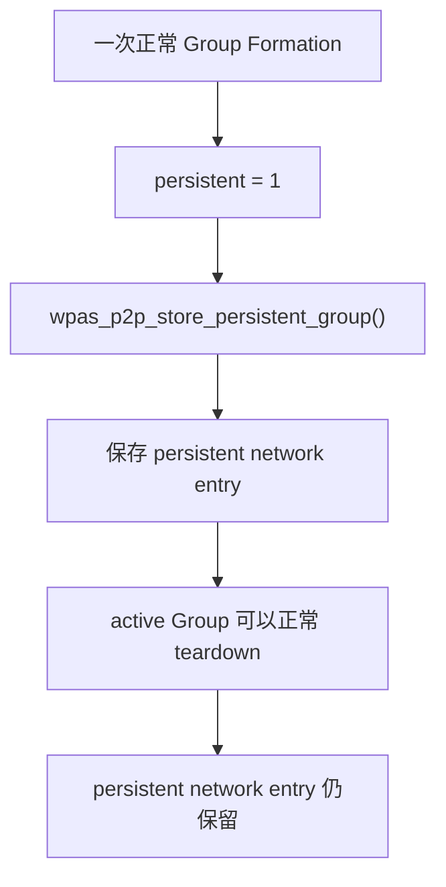
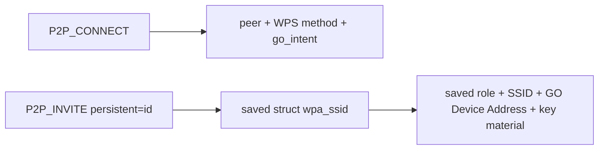
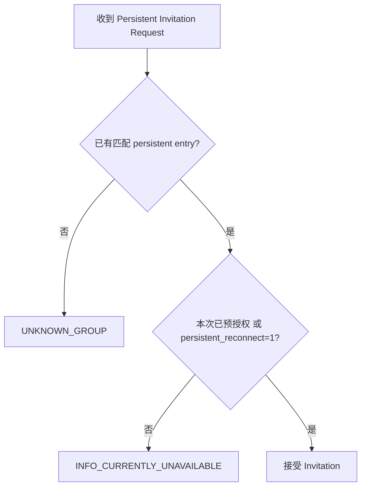
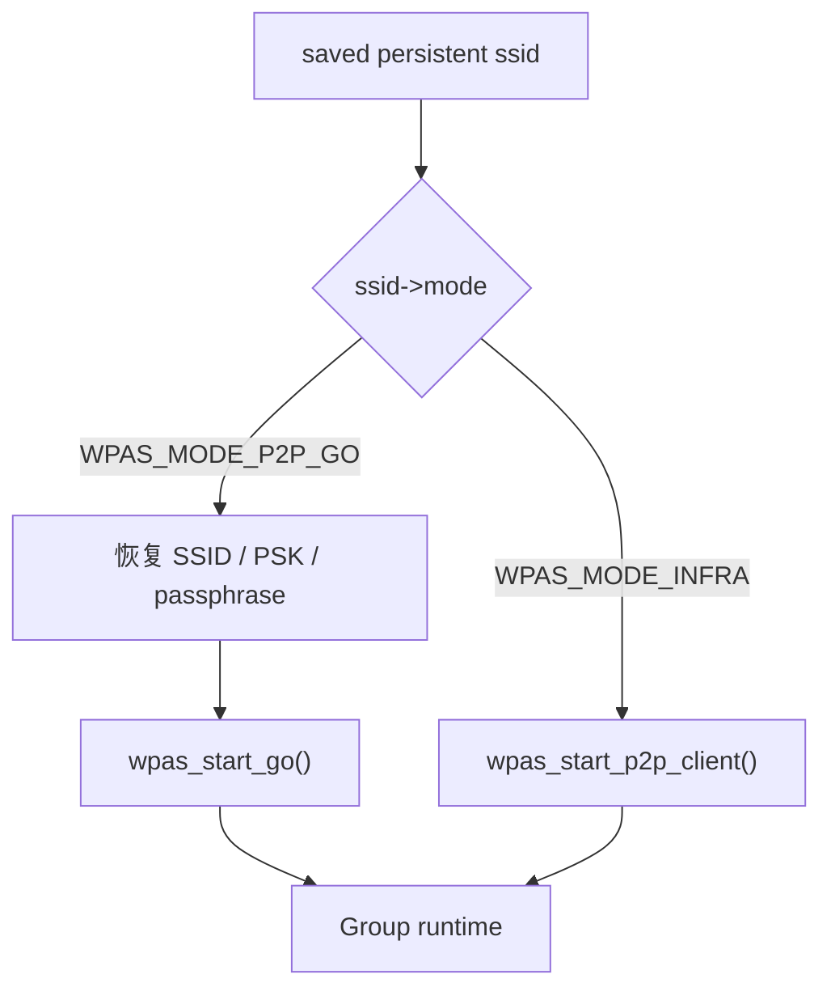
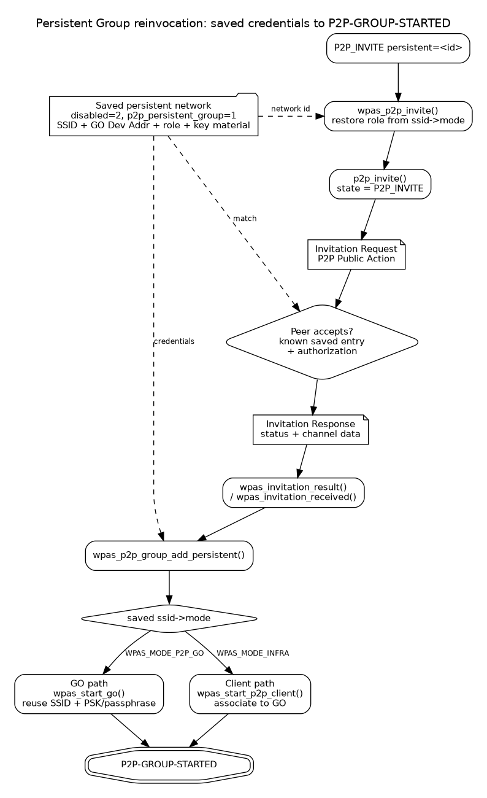

<meta name="referrer" content="no-referrer" />

# Wi-Fi Direct 源码分析（13）：Persistent Group 如何再次建立——P2P_INVITE、Invitation 与 Reinvocation

> 摘要：追踪 Persistent Group 凭据保存、P2P_INVITE、Invitation Request/Response 与重新建组，说明 teardown 后如何复用原角色和密钥再次到达 P2P-GROUP-STARTED。

[TOC]

第 12 篇结束在一个很关键的生命周期边界：

```text
active P2P Group
    ↓
P2P_GROUP_REMOVE / internal removal
    ↓
P2P-GROUP-REMOVED
    ↓
Group Interface 与运行态资源被释放
```

但第 12 篇同时保留了一个没有继续展开的问题：

> 当前 Group 被删除以后，为什么同一对设备下一次还能“恢复”原来的 Group，而不必重新完成一次完整的 GO Negotiation？

答案就是 **Persistent Group**。[S3](#source-s3)

它并不是一个一直运行、不被删除的 Group，也不是一个后台常驻的虚拟 interface。Persistent Group 真正持久化的是一组能够描述“原 Group 身份与安全关系”的配置数据。当前 active Group 可以退出，Group Interface 可以消失，但这组配置仍然保存在 `wpa_supplicant` 的 network 配置中。下一次通过 Invitation 重新唤起时，双方可以直接复用已经保存的角色、SSID 和密钥材料，再进入 GO 或 Client 的启动路径。

因此第 13 篇只解决这一条主线：

```text
第一次形成 persistent Group
    ↓
保存 persistent network
    ↓
active Group teardown
    ↓
P2P_INVITE persistent=<id>
    ↓
Invitation Request / Response
    ↓
匹配双方保存的 persistent entry
    ↓
wpas_p2p_group_add_persistent()
    ↓
按原角色恢复 GO / Client
    ↓
P2P-GROUP-STARTED
```

本文只追踪保存的 Persistent Group 如何通过 `P2P_INVITE persistent=<id>` 被重新建立；相邻但不同语义的命令只在必要的对比处说明。

本文源码基线统一为 hostap 2.12 release tag `hostap_2_12`（commit `831364bf02710ad09c2f27d3efa92abeeb5634c0`）。Persistent network 保存、`P2P_INVITE`、Invitation Request/Response 与 `wpas_p2p_group_add_persistent()` 都按同一 Git tag 的 `wpa_supplicant/` 与 `src/p2p/` 源码核对。[S1](#source-s1)

---

<a id="idx-persistent"></a>
## 1. Persistent Group 持久化的不是“正在运行的 Group”

第 09 篇中，`P2P_CONNECT ... persistent` 可以要求本次形成 Persistent Group；第 10 篇的 WPS / Group Formation 成功以后，`wpa_supplicant` 才会把当前 Group 的关键信息复制到一个特殊的 `struct wpa_ssid` network entry 中。

在 `wpas_group_formation_completed()` 中可以直接看到这个动作：

```c
if (persistent)
        wpas_p2p_store_persistent_group(wpa_s->p2pdev,
                                        ssid, go_dev_addr, 0);
else {
        os_free(wpa_s->global->add_psk);
        wpa_s->global->add_psk = NULL;
}
```

GO 在不需要 provisioning、直接完成 Group 配置的路径中也会保存：

```c
if (params->persistent_group) {
        wpas_p2p_store_persistent_group(
                wpa_s->p2pdev, ssid,
                wpa_s->global->p2p_dev_addr, 0);
        wpas_p2p_add_psk_list(wpa_s, ssid);
}
```

所以 Persistent Group 的生命周期不是：

```text
Group 一直保持运行
```

而是：



第 12 篇删除的是 `active Group`；第 13 篇要使用的是留下来的 `persistent network entry`。这两个对象必须从一开始就分开理解。

---

<a id="idx-store"></a>
## 2. `wpas_p2p_store_persistent_group()` 到底保存了什么

核心函数位于：

```text
wpa_supplicant/p2p_supplicant.c
```

它首先尝试寻找已有的 Persistent Group 条目：

```c
for (s = wpa_s->conf->ssid; s; s = s->next) {
        if (s->disabled == 2 &&
            ether_addr_equal(go_dev_addr, s->bssid) &&
            s->ssid_len == ssid->ssid_len &&
            os_memcmp(ssid->ssid, s->ssid, ssid->ssid_len) == 0)
                break;

        if (dik_id && s->go_dik_id == dik_id)
                break;
}
```

经典 P2P 路径主要使用：

```text
disabled == 2
GO Device Address
SSID
```

来识别已有条目。如果没有找到，就新建 network，并马上把它标记为 Persistent Group：

```c
s->p2p_group = 1;
s->p2p_persistent_group = 1;
wpas_notify_persistent_group_added(wpa_s, s);
wpa_config_set_network_defaults(s);
```

随后填入真正需要长期保留的数据：

```c
s->p2p_group = 1;
s->p2p_persistent_group = 1;
s->disabled = 2;
s->bssid_set = 1;
os_memcpy(s->bssid, go_dev_addr, ETH_ALEN);
s->mode = ssid->mode;
s->auth_alg = ssid->auth_alg;
s->key_mgmt = ssid->key_mgmt;
s->proto = ssid->proto;
s->pbss = ssid->pbss;
s->pmk_valid = ssid->pmk_valid;
s->pairwise_cipher = ssid->pbss ? WPA_CIPHER_GCMP : WPA_CIPHER_CCMP;
s->export_keys = 1;
s->go_dik_id = dik_id;
```

密钥材料也会被复制：

```c
if (ssid->passphrase) {
        os_free(s->passphrase);
        s->passphrase = os_strdup(ssid->passphrase);
}
if (ssid->psk_set) {
        s->psk_set = 1;
        os_memcpy(s->psk, ssid->psk, 32);
}
if (s->passphrase && !s->psk_set)
        wpa_config_update_psk(s);
```

SSID 同样被复制到保存条目中：

```c
if (s->ssid == NULL || s->ssid_len < ssid->ssid_len) {
        os_free(s->ssid);
        s->ssid = os_malloc(ssid->ssid_len);
}
if (s->ssid) {
        s->ssid_len = ssid->ssid_len;
        os_memcpy(s->ssid, ssid->ssid, s->ssid_len);
}
```

如果配置允许写回：

```c
if (changed && wpa_s->conf->update_config &&
    wpa_config_write(wpa_s->confname, wpa_s->conf)) {
        wpa_printf(MSG_DEBUG, "P2P: Failed to update configuration");
}
```

这就解释了 Persistent Group 为什么能够跨越一次 active Group 的 teardown：真正需要复用的数据已经进入普通配置对象，而不是只保存在已经被释放的 Group Interface 中。

### `disabled == 2` 不是普通的“禁用网络”

hostap 2.12 release tag在 `config_file.c` 中还有一条非常直接的恢复规则：

```c
if (ssid->disabled == 2)
        ssid->p2p_persistent_group = 1;
```

`wpa_supplicant_i.h` 也把 Persistent Group 判定封装成：

```c
static inline int network_is_persistent_group(struct wpa_ssid *ssid)
{
        return ssid->disabled == 2 && ssid->p2p_persistent_group;
}
```

因此这里的 `disabled == 2` 是一个特殊状态：它表示这条 network 不是普通 STA 自动连接项，而是用于 Persistent Group storage。

`config_ssid.h` 对 `bssid` 字段也特别注明：当 `disabled == 2` 时，`bssid` 保存的是 **GO Device Address**。

所以一个 persistent entry 至少建立了这样的映射：

| 字段 | 在 Persistent Group 中的含义 |
|---|---|
| `disabled == 2` | Persistent Group storage entry |
| `p2p_persistent_group` | 明确标记为持久化 P2P Group |
| `ssid` | 原 Group SSID |
| `bssid` | GO Device Address |
| `mode` | 本端在该 Group 中保存的角色 |
| `passphrase` / `psk` | 重新建立安全连接所需的密钥材料 |
| cipher / key management | 原安全配置 |

其中 `mode` 对下一阶段尤其重要，因为 Reinvocation 不会再通过一次 GO Negotiation 来重新决定角色。

---

<a id="idx-list"></a>
## 3. 为什么 `list_networks` 能看到 `[P2P-PERSISTENT]`

`README-P2P` 明确说明，`list_networks` 会同时列出 Persistent Group 的保存信息；[S2](#source-s2)后续 `p2p_group_add` 和 `p2p_invite` 使用这里的 network id 来选择需要恢复的 Group。

源码在生成 `LIST_NETWORKS` 输出时直接根据 `disabled == 2` 增加标记：

```c
ret = os_snprintf(pos, end - pos, "\t%s%s%s%s",
                  ssid == wpa_s->current_ssid ?
                  "[CURRENT]" : "",
                  ssid->disabled ? "[DISABLED]" : "",
                  ssid->disabled_until.sec ?
                  "[TEMP-DISABLED]" : "",
                  ssid->disabled == 2 ? "[P2P-PERSISTENT]" :
                  "");
```

因此可能看到类似：

```text
network id / ssid / bssid / flags
4    DIRECT-xy    02:11:22:33:44:55    [DISABLED][P2P-PERSISTENT]
```

这里的 `4` 就是后续命令：

```text
P2P_INVITE persistent=4
```

中的 `<network id>`。

这个 id 指向保存的 persistent configuration，不指向第 12 篇已经删除的 Group Interface。

---

<a id="idx-invite-entry"></a>
## 4. Reinvocation 的真正用户态入口：`P2P_INVITE persistent=<id>`

`README-P2P` 对 Invitation 给出的接口是：

```text
p2p_invite [persistent=<network id>|group=<group ifname>] [peer=address]
```

其中两种形式解决的是两个不同问题：

| 命令形式 | 目标 |
|---|---|
| `persistent=<id>` | 重新唤起以前保存过的 Persistent Group |
| `group=<ifname>` | 邀请 peer 加入一个当前已经运行的 Group |

第 13 篇只沿第一条路径继续。

命令进入 `ctrl_iface.c` 后，`p2p_ctrl_invite()` 先按前缀分流：

```c
static int p2p_ctrl_invite(struct wpa_supplicant *wpa_s, char *cmd)
{
        if (os_strncmp(cmd, "persistent", 10) == 0)
                return p2p_ctrl_invite_persistent(wpa_s, cmd);
        if (os_strncmp(cmd, "group=", 6) == 0)
                return p2p_ctrl_invite_group(wpa_s, cmd + 6);

        return -1;
}
```

`p2p_ctrl_invite_persistent()` 对 `persistent=<id>` 做的第一件关键事情，就是重新取得刚才分析过的 persistent network：

```c
if (os_strncmp(cmd, "persistent=", 11) == 0) {
        id = atoi(cmd + 11);
        ssid = wpa_config_get_network(wpa_s->conf, id);
        if (!ssid || ssid->disabled != 2) {
                wpa_printf(MSG_DEBUG,
                           "CTRL_IFACE: Could not find SSID id=%d for persistent P2P group",
                           id);
                return -1;
        }
}
```

然后把这个 `struct wpa_ssid *ssid` 传入：

```c
return wpas_p2p_invite(wpa_s, _peer, ssid, NULL, freq, freq2, ht40, vht,
                       max_oper_chwidth, pref_freq, he, edmg,
                       allow_6ghz, p2p2);
```

到这里已经出现了和第一次 `P2P_CONNECT` 完全不同的参数来源：



第 09 篇首次 GO Negotiation 时需要协商“谁做 GO”；第 13 篇 reinvocation 的核心前提则是双方已经保存过这段关系。

---

<a id="idx-wpas-invite"></a>
## 5. `wpas_p2p_invite()` 先从保存配置恢复角色

`wpas_p2p_invite()` 的源码注释已经直接写明用途：

```c
/* Invite to reinvoke a persistent group */
int wpas_p2p_invite(struct wpa_supplicant *wpa_s, const u8 *peer_addr,
                    struct wpa_ssid *ssid, const u8 *go_dev_addr, int freq,
                    int vht_center_freq2, int ht40, int vht, int max_chwidth,
                    int pref_freq, int he, int edmg, bool allow_6ghz, bool p2p2)
```

进入函数后，如果没有可用的 persistent entry，会立即失败：

```c
if (!ssid)
        return -1;
```

接下来最关键的是角色恢复。

### 保存条目表明本端原来是 GO

```c
if (ssid->mode == WPAS_MODE_P2P_GO) {
        role = P2P_INVITE_ROLE_GO;
        if (peer_addr == NULL) {
                wpa_printf(MSG_DEBUG, "P2P: Missing peer "
                           "address in invitation command");
                return -1;
        }
        if (wpas_p2p_create_iface(wpa_s)) {
                if (wpas_p2p_add_group_interface(wpa_s,
                                                 WPA_IF_P2P_GO) < 0) {
                        wpa_printf(MSG_ERROR, "P2P: Failed to "
                                   "allocate a new interface for the "
                                   "group");
                        return -1;
                }
                bssid = wpa_s->pending_interface_addr;
        } else if (wpa_s->p2p_mgmt)
                bssid = wpa_s->parent->own_addr;
        else
                bssid = wpa_s->own_addr;
}
```

这里没有 `go_intent` 比较。保存配置已经说明本端在这个 Persistent Group 中承担 GO 角色。

如果平台需要独立 Group Interface，还会在 Invitation 发出前预留新的 GO interface 地址。

### 保存条目表明本端原来是 Client

紧接着是另一条分支：

```c
else {
        role = P2P_INVITE_ROLE_CLIENT;
        if (!wpa_s->p2p2)
                peer_addr = ssid->bssid;
}
wpa_s->pending_invite_ssid_id = ssid->id;
```

经典 P2P Client 路径会把保存条目中的：

```text
ssid->bssid
```

直接当作需要联系的 GO Device Address。前面已经确认 Persistent Group entry 中的 `bssid` 字段正是用于保存 GO Device Address。

这里形成了一个非常重要的闭环：

```text
第一次保存时
GO Device Address → persistent ssid->bssid

下一次 Client reinvocation 时
persistent ssid->bssid → peer_addr
```

这也是为什么 `README-P2P` 说明：如果 peer 本身就是该 Persistent Group 的 GO，某些调用场景中不必再单独提供 `peer` 参数。

---

## 6. Invitation 开始前会停止 Find，并把流程交给 P2P Core

`wpas_p2p_invite()` 在真正发 Invitation 前先停止当前 Find/Listen：

```c
/*
 * Stop any find/listen operations before invitation and possibly
 * connection establishment.
 */
wpas_p2p_stop_find_oper(wpa_s);
```

经典非 P2P2 路径最后进入：

```c
return p2p_invite(wpa_s->global->p2p, peer_addr, role, bssid,
                  ssid->ssid, ssid->ssid_len, force_freq, go_dev_addr,
                  1, pref_freq, -1, false);
```

这里传给 P2P Core 的几个关键值已经全部来自 Persistent Group 上下文：

```text
peer_addr
role
Group BSSID（如果本端为 GO）
SSID
persistent = 1
frequency preference
```

hostap 2.12 同一 Git tag 中的 `src/p2p/p2p_invitation.c` 可以直接继续追踪：`p2p_invite()` 进入 Invitation 流程并发送 **Invitation Request Public Action frame**；收到对端 Invitation Response 后，再通过 `struct p2p_config` callback 返回 `wpa_supplicant` glue 层。[S1](#source-s1)

这条路径的关键不是底层函数名本身，而是它建立了一个新的异步边界：

```text
wpas_p2p_invite()
    ↓ 同步调用
p2p_invite()
    ↓
发送 Invitation Request
    ↓ 无线异步交互
等待对端 Invitation Response
    ↓
invitation_result callback
    ↓
重新进入 wpa_supplicant/p2p_supplicant.c
```

因此不能把 `wpas_p2p_invite()` 和 `wpas_p2p_group_add_persistent()` 画成一个直接同步调用。

---

<a id="idx-core"></a>
## 7. 为什么 P2P Core 能回到 `wpas_invitation_process()` 和 `wpas_invitation_result()`

这条 callback 关系在 P2P 初始化时已经绑定。

`wpas_p2p_init()` 中：

```c
p2p.invitation_process = wpas_invitation_process;
p2p.invitation_received = wpas_invitation_received;
p2p.invitation_result = wpas_invitation_result;
```

三个 callback 的职责不同：

| callback | 发生在哪一侧 | 主要职责 |
|---|---|---|
| `wpas_invitation_process()` | 收到 Invitation Request 的设备 | 判断是否认识该 Group、是否允许接受、恢复哪个角色 |
| `wpas_invitation_received()` | Request 接收端发送完 Invitation Response 后 | 把结果通知上层；成功时启动本端 persistent Group |
| `wpas_invitation_result()` | 主动发起 Invitation 的设备收到 Response 后 | 上报 `P2P-INVITATION-RESULT`；成功时启动本端 persistent Group |

这三个函数正好把 P2P Core 的无线 Action frame 交互桥接回 `wpa_supplicant` 的配置和 Group 生命周期。

---

<a id="idx-receive"></a>
## 8. 接收端收到 Invitation Request 后，先判断“这个 Group 我认不认识”

接收端真正做策略判断的是：

```text
wpas_invitation_process()
```

对于 Persistent Group，它先检查是否已经有同 SSID、同角色的 active Group：

```c
grp = wpas_get_p2p_group(wpa_s, ssid, ssid_len, go);
if (grp) {
        wpa_printf(MSG_DEBUG, "P2P: Accept invitation to already "
                   "running persistent group");
        if (*go)
                os_memcpy(group_bssid, grp->own_addr, ETH_ALEN);
        goto accept_inv;
}
```

如果当前没有运行，则继续检查这次 Invitation 是否已经被本端预先授权，或者配置是否允许自动 persistent reconnect：

```c
if (!is_zero_ether_addr(wpa_s->p2p_auth_invite) &&
    ether_addr_equal(sa, wpa_s->p2p_auth_invite)) {
        wpa_printf(MSG_DEBUG, "P2P: Accept previously initiated "
                   "invitation to re-invoke a persistent group");
        os_memset(wpa_s->p2p_auth_invite, 0, ETH_ALEN);
} else if (!wpa_s->conf->persistent_reconnect)
        return P2P_SC_FAIL_INFO_CURRENTLY_UNAVAILABLE;
```

然后寻找本机保存的 Persistent Group entry：

```c
for (s = wpa_s->conf->ssid; s; s = s->next) {
        if (s->disabled == 2 &&
            (p2p2 || ether_addr_equal(s->bssid, go_dev_addr)) &&
            s->ssid_len == ssid_len &&
            os_memcmp(ssid, s->ssid, ssid_len) == 0)
                break;
}
```

经典 P2P 路径下，接收端要求保存条目能够匹配：

```text
disabled == 2
GO Device Address
SSID
```

如果不存在，就直接返回：

```c
else if (!s) {
        wpa_printf(MSG_DEBUG, "P2P: Invitation from " MACSTR
                   " requested reinvocation of an unknown group",
                   MAC2STR(sa));
        return P2P_SC_FAIL_UNKNOWN_GROUP;
}
```

所以 Persistent Group Reinvocation 不是“对端说有这个 Group，本端就相信”。双方本地都需要有能够匹配的持久化上下文；至少在经典路径中，接收端会用自己的 saved entry 做确认。

---

<a id="idx-reconnect"></a>
## 9. `persistent_reconnect` 控制的是“是否自动接受”，不是“有没有保存配置”

`README-P2P` 对这个开关的定义是：

```text
set persistent_reconnect <0/1>
```

启用后，对 Persistent Group reinvocation 的 Invitation 可以不经过单独的上层授权直接接受。

源码刚才已经给出了准确条件：

```c
else if (!wpa_s->conf->persistent_reconnect)
        return P2P_SC_FAIL_INFO_CURRENTLY_UNAVAILABLE;
```

因此两种行为可以画成：



注意，这个配置不决定 Persistent Group 是否保存，也不等于跳过无线安全认证。它只影响收到 reinvocation Invitation 后，`wpa_supplicant` 是否允许自动进入恢复流程。

---

## 10. 接收端为什么会产生 `P2P-INVITATION-RECEIVED` 或 `P2P-INVITATION-ACCEPTED`

P2P Core 处理完 Request、发送 Invitation Response 后，会通过初始化时注册的：

```text
invitation_received
```

callback 回到：

```text
wpas_invitation_received()
```

这个函数先按 SSID 在本地找 Persistent Group entry：

```c
for (s = wpa_s->conf->ssid; s; s = s->next) {
        if (s->disabled == 2 &&
            s->ssid_len == ssid_len &&
            os_memcmp(ssid, s->ssid, ssid_len) == 0)
                break;
}
```

### 已经接受 Invitation

当 `status == P2P_SC_SUCCESS` 且找到了保存条目时，它会先上报接受事件，再直接进入 persistent Group restart：

```c
if (s) {
        const char *ssid_txt;

        ssid_txt = wpa_ssid_txt(s->ssid, s->ssid_len);
        int go = s->mode == WPAS_MODE_P2P_GO;
        if (go) {
                wpa_msg_global(wpa_s, MSG_INFO,
                               P2P_EVENT_INVITATION_ACCEPTED
                               "sa=" MACSTR
                               " persistent=%d freq=%d ssid=\"%s\" go_dev_addr="
                               MACSTR, MAC2STR(sa), s->id,
                               op_freq, ssid_txt,
                               MAC2STR(go_dev_addr));
        } else {
                wpa_msg_global(wpa_s, MSG_INFO,
                               P2P_EVENT_INVITATION_ACCEPTED
                               "sa=" MACSTR
                               " persistent=%d ssid=\"%s\" go_dev_addr=" MACSTR,
                               MAC2STR(sa), s->id, ssid_txt,
                               MAC2STR(go_dev_addr));
        }
        wpas_p2p_group_add_persistent(
                wpa_s, s, go, 0, op_freq, 0,
                wpa_s->conf->p2p_go_ht40,
                wpa_s->conf->p2p_go_vht,
                0,
                wpa_s->conf->p2p_go_he,
                wpa_s->conf->p2p_go_edmg, NULL,
                go ? P2P_MAX_INITIAL_CONN_WAIT_GO_REINVOKE : 0,
                1, is_p2p_allow_6ghz(wpa_s->global->p2p), 0,
                bssid, sa, pmkid, pmk, pmk_len, false, true);
}
```

这里出现了第 13 篇最关键的跳转：

```text
Invitation 接受
    ↓
不是 p2p_connect()
不是 GO Negotiation
    ↓
wpas_p2p_group_add_persistent()
```

### 当前不能自动接受

如果前面的策略返回：

```text
P2P_SC_FAIL_INFO_CURRENTLY_UNAVAILABLE
```

`wpas_invitation_received()` 不会立刻重建 Group，而是上报 `P2P-INVITATION-RECEIVED`，让上层知道有一个 Persistent Group reinvocation 请求等待处理。

有匹配条目时：

```c
if (s->mode == WPAS_MODE_P2P_GO && op_freq) {
        wpa_msg_global(wpa_s, MSG_INFO, P2P_EVENT_INVITATION_RECEIVED
                       "sa=" MACSTR " persistent=%d freq=%d",
                       MAC2STR(sa), s->id, op_freq);
} else {
        wpa_msg_global(wpa_s, MSG_INFO, P2P_EVENT_INVITATION_RECEIVED
                       "sa=" MACSTR " persistent=%d",
                       MAC2STR(sa), s->id);
}
```

这就是 `persistent_reconnect=0` 时应用层可能看到“Invitation 到达，但 Group 还没有自动恢复”的原因。

---

<a id="idx-result"></a>
## 11. 发起端收到 Invitation Response 后怎样继续

主动执行：

```text
P2P_INVITE persistent=<id>
```

的一侧，在收到对端 Invitation Response 后，会从 P2P Core 通过：

```text
invitation_result
```

callback 进入：

```text
wpas_invitation_result()
```

函数一开始就生成：

```text
P2P-INVITATION-RESULT
```

事件：

```c
wpas_msg_p2p_invitation_result(wpa_s, status, new_ssid, new_ssid_len,
                               bssid, go_dev_addr);
wpas_notify_p2p_invitation_result(wpa_s, status, bssid);
```

如果 `pending_invite_ssid_id != -1`，说明当前是 Persistent Group reinvocation，而不是“邀请 peer 加入当前 active Group”。

失败时会停在 Invitation 阶段；例如 `UNKNOWN_GROUP` 还会清理本机保存的对应 peer 信息。

成功后重新取出发起命令时保存的 network id：

```c
ssid = wpa_config_get_network(wpa_s->conf,
                              wpa_s->pending_invite_ssid_id);
if (ssid == NULL) {
        wpa_printf(MSG_ERROR, "P2P: Could not find persistent group "
                   "data matching with invitation");
        return;
}
```

随后根据 Response 中的 channel 信息确定重新建组频率，并最终进入：

```c
wpas_p2p_group_add_persistent(wpa_s, ssid,
                              ssid->mode == WPAS_MODE_P2P_GO,
                              wpa_s->p2p_persistent_go_freq,
                              freq,
                              wpa_s->p2p_go_vht_center_freq2,
                              wpa_s->p2p_go_ht40, wpa_s->p2p_go_vht,
                              wpa_s->p2p_go_max_oper_chwidth,
                              wpa_s->p2p_go_he,
                              wpa_s->p2p_go_edmg,
                              channels,
                              ssid->mode == WPAS_MODE_P2P_GO ?
                              P2P_MAX_INITIAL_CONN_WAIT_GO_REINVOKE :
                              0, 1,
                              is_p2p_allow_6ghz(wpa_s->global->p2p), 0,
                              bssid, peer, pmkid, pmk, pmk_len, false,
                              true);
```

因此 Invitation Request/Response 并不是最终 Group 本身。它解决的是：

1. 双方是否同意恢复这条已保存关系；
2. Group identity 是否匹配；
3. 本次重新启动使用什么 operating channel；
4. 成功后双方各自进入哪条本地 Group restart 路径。

真正重新启动 GO 或 Client 的仍然是后面的 `wpas_p2p_group_add_persistent()`。

---

<a id="idx-group-add"></a>
## 12. `wpas_p2p_group_add_persistent()` 为什么能跳过 GO Negotiation

这是 Persistent Group reinvocation 最核心的一层。

函数首先要求传入的 network 必须真的是 persistent storage entry：

```c
if (ssid->disabled != 2 || ssid->ssid == NULL)
        return -1;
```

然后停止 Discovery：

```c
/* Make sure we are not running find during connection establishment */
wpas_p2p_stop_find_oper(wpa_s);

wpa_s->p2p_fallback_to_go_neg = 0;
```

接下来直接根据保存的 `ssid->mode` 分流。

### 原角色是 GO

```c
if (ssid->mode == WPAS_MODE_P2P_GO) {
        if (force_freq > 0) {
                freq = wpas_p2p_select_go_freq(wpa_s, force_freq);
                if (freq < 0)
                        return -1;
                wpa_s->p2p_go_no_pri_sec_switch = 1;
        } else {
                freq = wpas_p2p_select_go_freq(wpa_s, neg_freq);
                if (freq < 0 ||
                    (freq > 0 && !freq_included(wpa_s, channels, freq)))
                        freq = 0;
        }
}
```

后面把保存条目中的 PSK、passphrase 与 SSID 重新写入 GO 参数：

```c
params.role_go = 1;
params.psk_set = ssid->psk_set;
if (params.psk_set)
        os_memcpy(params.psk, ssid->psk, sizeof(params.psk));
if (ssid->passphrase) {
        if (os_strlen(ssid->passphrase) >= sizeof(params.passphrase)) {
                wpa_printf(MSG_ERROR, "P2P: Invalid passphrase in "
                           "persistent group");
                return -1;
        }
        os_strlcpy(params.passphrase, ssid->passphrase,
                   sizeof(params.passphrase));
}
os_memcpy(params.ssid, ssid->ssid, ssid->ssid_len);
params.ssid_len = ssid->ssid_len;
params.persistent_group = 1;
```

最后取得 Group Interface 并启动 GO：

```c
wpa_s = wpas_p2p_get_group_iface(wpa_s, addr_allocated, 1);
if (wpa_s == NULL)
        return -1;

p2p_channels_to_freqs(channels, params.freq_list, P2P_MAX_CHANNELS);

wpa_s->p2p_first_connection_timeout = connection_timeout;
wpa_s->p2p_in_invitation = is_invitation;
params.p2p2 = wpa_s->p2p2;
wpas_start_go(wpa_s, &params, 0, wpa_s->p2p_mode);
```

### 原角色是 Client

另一条分支完全不创建 GO：

```c
else if (ssid->mode == WPAS_MODE_INFRA) {
        freq = neg_freq;
```

经典 Client 路径最终直接进入：

```c
return wpas_start_p2p_client(wpa_s, ssid, addr_allocated, freq,
                             force_scan, retry_limit, go_bssid,
                             wpa_s->p2p2, pmkid, pmk, pmk_len);
```

所以 reinvocation 的角色恢复本质是：



这里没有回到第 09 篇的 GO Negotiation 主线：

```text
p2p_connect()
    ↓
GO Negotiation Request / Response / Confirm
```

因为 GO/Client 角色已经由 saved entry 确定。

但“跳过 GO Negotiation”不等于“什么握手都不需要”。GO 仍然需要真正启动 AP/GO，Client 仍然需要找到 GO、关联并完成安全数据连接；只是**角色和持久化凭据不再通过一次全新的 Group Formation 协商重新生成**。

---

<a id="idx-started"></a>
## 13. 为什么最终仍然会回到 `P2P-GROUP-STARTED`

`wpas_p2p_group_add_persistent()` 没有创造另一套独立的 Group runtime。

它只是用 saved configuration 选择一条已有的运行路径：

```text
Persistent GO
    ↓
wpas_start_go()
    ↓
GO configured
    ↓
P2P-GROUP-STARTED
```

或者：

```text
Persistent Client
    ↓
wpas_start_p2p_client()
    ↓
scan / associate / security connection
    ↓
P2P-GROUP-STARTED
```

因此第 11 篇讲过的 Group Interface、IP Address Allocation/DHCP 与数据面逻辑在 reinvocation 后仍然适用。

Persistent Group 复用的是 Group identity、角色与安全配置；它不会让 IP 层脱离第 11 篇的网络配置流程。

下面这张图把第 13 篇真正需要记住的关系压缩在一起：



图中最重要的不是 Invitation frame 自身，而是上下两端的 `saved persistent network` 都参与了重新建组：发起端用 network id 取出保存配置，接收端用本地保存条目确认 Group identity 和角色，成功后双方最终都汇入 `wpas_p2p_group_add_persistent()` 所连接的 GO/Client 运行路径。

---

<a id="idx-compare"></a>
## 14. `P2P_INVITE persistent=<id>` 与 `P2P_GROUP_ADD persistent=<id>` 不是同一件事

`README-P2P` 还提供：

```text
p2p_group_add persistent=<network id>
```

这条命令也能使用 Persistent Group entry，所以很容易和 `P2P_INVITE` 混淆。

`ctrl_iface.c` 中它最终也是调用：

```c
return wpas_p2p_group_add_persistent(wpa_s, ssid, 0, freq, freq,
                                     vht_center_freq2, ht40, vht,
                                     vht_chwidth, he, edmg,
                                     NULL, 0, 0, allow_6ghz, 0,
                                     go_bssid, NULL, NULL, NULL, 0,
                                     join, false);
```

但两条命令的前半段完全不同：

```text
P2P_INVITE persistent=<id>
    ↓
先和 peer 做 Invitation Request / Response
    ↓
双方确认 reinvocation
    ↓
wpas_p2p_group_add_persistent()
```

而：

```text
P2P_GROUP_ADD persistent=<id>
    ↓
本地直接取 persistent entry
    ↓
wpas_p2p_group_add_persistent()
```

所以 `P2P_GROUP_ADD persistent=<id>` 更接近“使用保存配置在本地重启这个 Group”；`P2P_INVITE persistent=<id>` 则是“通过 Wi-Fi Direct Invitation procedure 与 peer 协调 reinvocation”。

二者共享后半段 Group restart 实现，不代表前半段协议语义相同。

---

## 15. `P2P_INVITE group=<ifname>` 又是另一条 Invitation 路径

`p2p_ctrl_invite()` 的另一个分支是：

```text
P2P_INVITE group=<group ifname> peer=<addr>
```

它调用：

```text
wpas_p2p_invite_group()
```

源码注释把它定义为：

```c
/* Invite to join an active group */
```

也就是说，此时 Group 已经处于运行态，Invitation 的目标是让新 peer 加入这个 active Group，而不是根据 `disabled == 2` 的保存条目把一个已经结束的 Group 重新唤起。

可以直接按对象生命周期区分：

| 场景 | Group 当前状态 | 主要入口 |
|---|---|---|
| Persistent reinvocation | active Group 已结束，saved entry 仍在 | `P2P_INVITE persistent=<id>` |
| Active Group invitation | Group 正在运行 | `P2P_INVITE group=<ifname>` |
| 本地直接恢复 persistent Group | 不先做 peer Invitation | `P2P_GROUP_ADD persistent=<id>` |

第 13 篇的主线只属于第一行。

---

<a id="idx-status"></a>
## 16. 三种 Invitation 结果怎样改变后续路径

沿当前代码可以把最重要的结果分成三类。

### `P2P_SC_SUCCESS`

双方接受 reinvocation。

发起端：

```text
P2P-INVITATION-RESULT status=0
    ↓
wpas_p2p_group_add_persistent()
```

接收端：

```text
P2P-INVITATION-ACCEPTED
    ↓
wpas_p2p_group_add_persistent()
```

然后双方各自按保存角色进入 GO/Client 路径。

### `P2P_SC_FAIL_INFO_CURRENTLY_UNAVAILABLE`

本端可能拥有匹配 persistent entry，但当前策略不允许自动接受，例如：

```text
persistent_reconnect = 0
```

且本次 Invitation 没有被预授权。

这时接收端会发出：

```text
P2P-INVITATION-RECEIVED
```

把是否继续交给上层，而不是直接启动 Group。

### `P2P_SC_FAIL_UNKNOWN_GROUP`

本端找不到对应的 Persistent Group context。

这表示双方对“这条旧 Group 关系是否还存在”的认知已经不一致。当前源码在部分失败路径中还会清理本地保存的 peer 信息，避免继续反复使用已经失效的关系。

另外 channel intersection 失败也可能导致 Invitation 不能完成；因此“双方都有 persistent entry”只是 reinvocation 的必要条件之一，不代表任何时刻都一定能够重新建立 Group。

---

## 17. 为什么 Reinvocation 不是“免认证快速连接”

Persistent Group 最容易被误解成：

```text
保存了 PSK
    ↓
下次直接开始传数据
```

源码并不是这样。

它真正跳过的是第 09 篇中的“重新决定 GO/Client 角色与重新协商 Group 参数”的部分。

重新唤起时仍然要经历：

```text
找到 peer / 可用 channel
    ↓
Invitation Request / Response
    ↓
GO 真正启动 Group
或
Client 真正连接 GO
    ↓
安全连接进入可用状态
    ↓
P2P-GROUP-STARTED
    ↓
第 11 篇的 IP / DHCP / 数据面
```

所以更准确的表述是：

> Persistent Group 让双方复用以前已经建立的 Group identity、角色和安全配置，从而避免再次执行完整的 GO Negotiation 与重新生成一套 Group 凭据；它并不绕过无线关联、运行态安全连接和后续 IP 网络建立。

---

<a id="idx-full"></a>
## 18. 从第 09 篇到第 13 篇，Persistent Group 的完整生命周期已经闭环

把前面几篇真正相关的部分串起来，现在可以看到 Persistent Group 其实跨越了两个 active Group 生命周期。

第一次建立：

```text
第 09 篇
P2P_CONNECT ... persistent
    ↓
GO Negotiation
    ↓
第 10 篇
WPS / Group Formation / 4-Way Handshake
    ↓
P2P-GROUP-STARTED
    ↓
wpas_p2p_store_persistent_group()
    ↓
保存 persistent network entry
```

第一次运行和结束：

```text
第 11 篇
Group Interface + IP + data path
    ↓
第 12 篇
P2P_GROUP_REMOVE
    ↓
P2P-GROUP-REMOVED
    ↓
active Group 消失
    ↓
persistent entry 保留
```

第二次恢复：

```text
第 13 篇
P2P_INVITE persistent=<id>
    ↓
Invitation Request / Response
    ↓
双方匹配 saved persistent entry
    ↓
wpas_p2p_group_add_persistent()
    ↓
按原角色启动 GO / Client
    ↓
P2P-GROUP-STARTED
```

这也把三个此前容易混在一起的对象彻底分开：

```text
P2P Device
    长生命周期，用于 Discovery / P2P control

Persistent network entry
    跨 active Group 保存，记录 Group identity / role / credentials

Active P2P Group
    一次运行实例，有 Group Interface、GO/Client 状态和数据面
```

第 12 篇 teardown 只结束第三个对象；第 13 篇依靠第二个对象重新创建第三个对象，而第一个对象仍然承担整个 P2P subsystem 的发现和控制基础。

到这里，系列已经形成两层完整闭环：

```text
04 → 05 → 06 → 07
发现 → 首次建组 → 数据通信 → 结束 Group

05 persistent → 07 teardown → 08 reinvocation
首次保存持久关系 → active Group 结束 → 使用旧关系再次建组
```

## 关键源码索引

| 关键对象 / 符号 | 本文位置 | Git 源码 |
|---|---|---|
| `wpas_p2p_store_persistent_group()` | [persistent entry 保存](#idx-store) | [hostap 2.12](https://chromium.googlesource.com/chromiumos/third_party/hostap/+/refs/tags/hostap_2_12/wpa_supplicant/p2p_supplicant.c#1184) |
| `P2P_INVITE persistent=<id>` | [用户态入口](#idx-invite-entry) | [hostap 2.12](https://chromium.googlesource.com/chromiumos/third_party/hostap/+/refs/tags/hostap_2_12/wpa_supplicant/ctrl_iface.c#13853) |
| `wpas_p2p_invite()` | [supplicant Invitation](#idx-wpas-invite) | [hostap 2.12](https://chromium.googlesource.com/chromiumos/third_party/hostap/+/refs/tags/hostap_2_12/wpa_supplicant/p2p_supplicant.c#9043) |
| `p2p_invite()` | [P2P Core Invitation](#idx-core) | [hostap 2.12](https://chromium.googlesource.com/chromiumos/third_party/hostap/+/refs/tags/hostap_2_12/src/p2p/p2p_invitation.c#837) |
| `p2p_process_invitation_req()` | [Invitation Request RX](#idx-receive) | [hostap 2.12](https://chromium.googlesource.com/chromiumos/third_party/hostap/+/refs/tags/hostap_2_12/src/p2p/p2p_invitation.c#227) |
| `wpas_invitation_result()` | [Invitation result callback](#idx-result) | [hostap 2.12](https://chromium.googlesource.com/chromiumos/third_party/hostap/+/refs/tags/hostap_2_12/wpa_supplicant/p2p_supplicant.c#4139) |
| `wpas_p2p_group_add_persistent()` | [persistent group restore](#idx-group-add) | [hostap 2.12](https://chromium.googlesource.com/chromiumos/third_party/hostap/+/refs/tags/hostap_2_12/wpa_supplicant/p2p_supplicant.c#8366) |

## 资料来源

<a id="source-s1"></a>
### [S1] hostap 2.12 Git：Persistent Group / Invitation implementation
- 版本：[`hostap_2_12` / `831364bf02710ad09c2f27d3efa92abeeb5634c0`](https://chromium.googlesource.com/chromiumos/third_party/hostap/+/refs/tags/hostap_2_12)
- 文件：[ctrl_iface.c](https://chromium.googlesource.com/chromiumos/third_party/hostap/+/refs/tags/hostap_2_12/wpa_supplicant/ctrl_iface.c#13853)、[p2p_supplicant.c](https://chromium.googlesource.com/chromiumos/third_party/hostap/+/refs/tags/hostap_2_12/wpa_supplicant/p2p_supplicant.c)、[config_file.c](https://chromium.googlesource.com/chromiumos/third_party/hostap/+/refs/tags/hostap_2_12/wpa_supplicant/config_file.c)、[p2p_invitation.c](https://chromium.googlesource.com/chromiumos/third_party/hostap/+/refs/tags/hostap_2_12/src/p2p/p2p_invitation.c)
- 使用位置：第 1～18 节
- 支撑内容：persistent network entry、`disabled == 2`、Invitation Request/Response callback、role restore 与 `wpas_p2p_group_add_persistent()`。

<a id="source-s2"></a>
### [S2] hostap 2.12 README-P2P
- 来源：[wpa_supplicant/README-P2P](https://chromium.googlesource.com/chromiumos/third_party/hostap/+/refs/tags/hostap_2_12/wpa_supplicant/README-P2P)
- 使用位置：第 3～6、14～15 节
- 支撑内容：`list_networks` 的 `[P2P-PERSISTENT]` 标记、`p2p_invite` 与 `p2p_group_add persistent=` 的 command semantics。

<a id="source-s3"></a>
### [S3] Wi-Fi Direct Specification v1.9
- URL/文档：[Wi-Fi Direct Specification v1.9](https://tools.barco.com/kb-downloads/4814/Wi-Fi_Direct_Specification_v1.pdf)
- 使用位置：第 1、4～13、16～18 节
- 支撑内容：Persistent Group、Invitation 与 reinvocation 的协议语义和 status code 背景。
