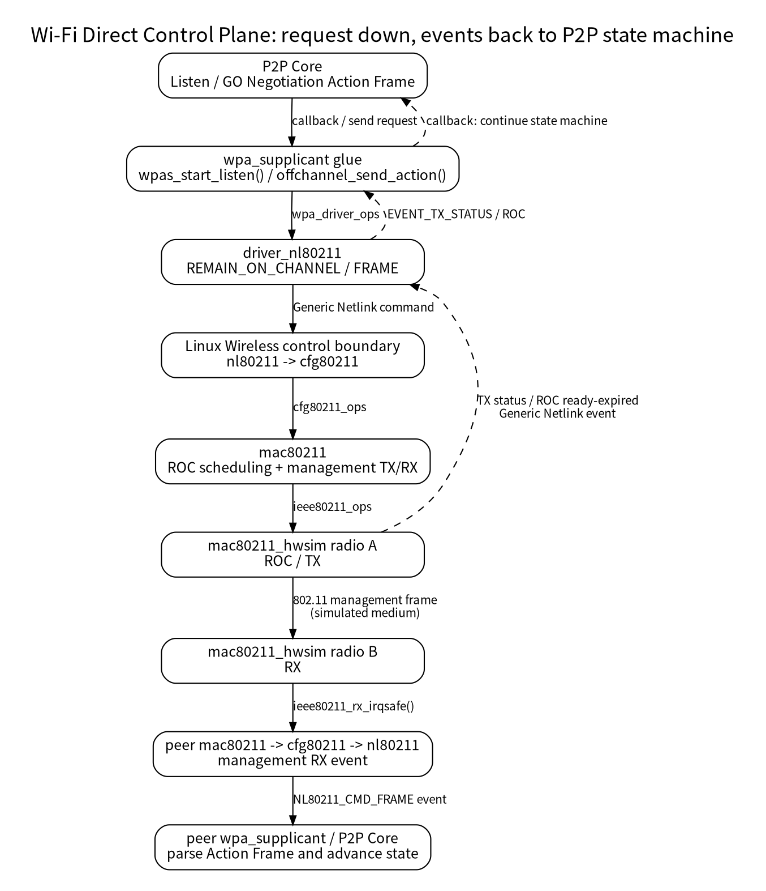

<meta name="referrer" content="no-referrer" />

# Wi-Fi Direct 源码分析（14）：控制面进入 Linux 内核后发生了什么——nl80211、cfg80211、mac80211 与管理帧 TX/RX

> 摘要：从 P2P Listen 与 Action Frame 两条真实路径追到 Linux Wireless 内核和 mac80211_hwsim，补齐 Wi-Fi Direct 控制面进入驱动后的 TX/RX 闭环。

[TOC]

第 01～13 篇已经把 Wi-Fi Direct 的主要用户态机制闭环：`wpa_cli` 命令进入 `wpa_supplicant`，P2P Core 完成 Discovery、GO Negotiation、Group Formation、Teardown 与 Persistent Group；`eloop`、radio work、callback 和状态机也已经有了明确的运行模型。

到这里还剩一个有意保留的黑盒：

```text
wpa_supplicant
    ↓
driver_nl80211
    ↓
Linux kernel / Wi-Fi driver
    ↓
802.11 frame
```

第 14 篇不把系列转成 Linux Wi-Fi 驱动教程，也不逐文件阅读 `nl80211.c`、`cfg80211` 和 `mac80211`。只选择 Wi-Fi Direct 最有代表性的两条控制面路径继续向下追踪：

1. **P2P Listen**：`remain_on_channel` 怎样让 radio 临时停留在指定信道；
2. **P2P Action Frame**：GO Negotiation Request/Response 等管理帧怎样真正 TX、怎样从另一块 radio RX，并把 TX status / RX event 返回 `wpa_supplicant`。

这两条链已经足以解释 Wi-Fi Direct 进入 Linux Wireless Stack 后做了什么。[S1][S2][S3][S4]

> **版本边界**：userspace 继续固定为 hostap/wpa_supplicant 2.12 commit `831364bf02710ad09c2f27d3efa92abeeb5634c0`。内核源码改为 upstream Linux `master` 的可复现快照：`72d3fcf802c45d00b300f25b848a93c3a2bd7c7e`（Linux 7.3-rc5，2026-09-27）。`master` 会继续前进，因此正文与随附源码包都绑定这个 commit；需要跟随最新 `master` 时可重新执行源码包中的 sparse-checkout 命令。[S1][S2][S5]

---

<a id="idx-boundary"></a>
## 1. 先分清四层：nl80211、cfg80211、mac80211、mac80211_hwsim 不是同一层

Linux Wireless 中最容易出现的误解，是把下面几个名称都笼统叫成“驱动”。实际上它们承担不同职责。[S5]

| 层 | 在本实验中的职责 | 是否 Wi-Fi Direct 专用 |
|---|---|---|
| `nl80211` | userspace 与 kernel 之间的 802.11 Generic Netlink ABI | 否 |
| `cfg80211` | Linux 802.11 配置/API 层，校验请求并通过 `cfg80211_ops` 调用具体实现 | 否 |
| `mac80211` | SoftMAC framework，在内核中实现大量 802.11 MAC 处理，并向 SoftMAC driver 提供 `ieee80211_ops` | 否 |
| `mac80211_hwsim` | 虚拟 SoftMAC radio driver，用内存中的 frame clone 模拟无线介质 | 否 |
| `wpa_supplicant P2P Core` | Wi-Fi Direct Discovery、Negotiation、Group lifecycle 状态机 | **是** |

Linux Kernel 文档对 `cfg80211` 的定位很直接：它是 Linux 的 802.11 configuration API，并通过 `nl80211` 向 userspace 提供统一接口；SoftMAC 设备则通常由 `mac80211` 实现这些 `cfg80211` callbacks，再调用底层 driver。[S5]

因此本实验中的控制链可以先压缩成：



这张图最重要的边界是：**Wi-Fi Direct 的协议决策仍在 `wpa_supplicant`；进入 kernel 以后，Linux Wireless Stack 执行的是“切换/停留信道、发送/接收 802.11 frame、返回状态”等无线操作。**

---

<a id="idx-listen-entry"></a>
## 2. P2P Listen 的真实 userspace 入口：`wpas_start_listen()` 不是直接调用 driver

第 08 篇已经追到 Find 回环会进入 Listen。第 14 篇从这里继续，而不重新展开 P2P Search/Listen 状态机。

P2P Core 初始化时，第 04 篇已经确认 callback 被绑定为：

```c
p2p.start_listen = wpas_start_listen;
```

因此 P2P Core 决定进入 Listen 后，会通过这个 callback 回到 `wpa_supplicant/p2p_supplicant.c`。[S1]

`wpas_start_listen()` 没有直接触碰 nl80211。它先保存 `freq`、`duration` 与 Probe Response IE，然后提交一个名为 `p2p-listen` 的 radio work：

```c
if (!radio_add_work(wpa_s, freq, "p2p-listen", 0,
                    wpas_start_listen_cb, lwork)) {
        wpas_p2p_listen_work_free(lwork);
        return -1;
}
```

这一步延续了前文已经建立的 radio scheduler 模型：同一 radio 上的 scan、listen、off-channel TX 不能彼此无条件并发，先进入 work queue，由 radio work 获得执行权后再真正操作硬件。

`wpas_start_listen_cb()` 获得执行权以后先做两件与 Listen 语义直接相关的准备：

- 配置 Probe Response IE；
- 要求 driver 上报 Probe Request。

然后才进入本篇第一条关键边界：

```c
if (wpa_drv_remain_on_channel(wpa_s, lwork->freq,
                              duration, NULL) < 0) {
        p2p_listen_failed(wpa_s->global->p2p, lwork->freq);
        wpas_p2p_listen_work_done(wpa_s);
        return;
}
```

因此 `P2P Listen` 在 userspace 中并不是一个“while 等待 Probe Request”的阻塞循环，而是：

```text
P2P Core 决定 Listen
    ↓
提交 p2p-listen radio work
    ↓
work 获得 radio
    ↓
请求 remain-on-channel
    ↓
返回 eloop 等待异步事件
```

这与前面整个系列的 Event/Callback 模型保持一致。[S1]

---

<a id="idx-driver-ops"></a>
## 3. `wpa_drv_remain_on_channel()`：wpa_supplicant 在这里才通过 driver ops 跨到 nl80211 backend

`wpa_drv_remain_on_channel()` 本身只是一个很薄的 wrapper：

```c
if (wpa_s->driver->remain_on_channel)
        return wpa_s->driver->remain_on_channel(
                wpa_s->drv_priv, freq, duration, filter_addr);
```

第 03 篇已经解释过 `wpa_s->driver`：当前工程通过 `-Dnl80211` 选择 nl80211 backend，因此此函数指针最终落到：

```text
wpa_driver_nl80211_remain_on_channel()
```

这里第一次出现真正发送给 kernel 的 nl80211 command。[S1]

hostap 2.12 构造的核心 attributes 是：

```text
NL80211_CMD_REMAIN_ON_CHANNEL
NL80211_ATTR_WIPHY_FREQ = freq
NL80211_ATTR_DURATION   = duration
```

并通过 libnl 将 Generic Netlink message 发送给 kernel。kernel 回复时会带回一个 `cookie`，`driver_nl80211` 保存到：

```text
drv->remain_on_chan_cookie
```

这个 cookie 很重要。ROC（Remain On Channel）是异步操作，发送请求成功只代表 kernel 接受了请求；后续“已经到达该信道”和“停留结束”需要使用同一个 cookie 对应回原请求。[S1][S2]

到这一层可以把职责分开：

| 对象 | 此时负责什么 |
|---|---|
| P2P Core | 为什么要 Listen、在哪个阶段 Listen |
| `p2p_supplicant.c` | 把 P2P Listen 转成 radio work 与 driver request |
| `driver_nl80211.c` | 把 `freq/duration` 编码为 nl80211 message |
| Generic Netlink | 负责 userspace ↔ kernel message transport |
| `nl80211` | 解释这个 message 的无线语义 |

Generic Netlink 本身并不知道 Wi-Fi Direct，也不知道 P2P Listen；它只负责把 `nl80211` family 的 message 送到正确的 kernel handler。

---

<a id="idx-nl80211-roc"></a>
## 4. 进入 kernel：`nl80211_remain_on_channel()` 做的是校验与分发

当前 Linux `master` 快照中，`NL80211_CMD_REMAIN_ON_CHANNEL` 对应 `net/wireless/nl80211.c` 的：

```c
static int nl80211_remain_on_channel(struct sk_buff *skb,
                                     struct genl_info *info)
```

这个函数不会实现“radio 怎样切频道”。当前 `master` 还把 cookie 的分配前移到 cfg80211/nl80211 公共层，再把 cookie 作为值传入具体 `cfg80211_ops`。它主要完成三类工作：[S2]

1. 检查 `NL80211_ATTR_WIPHY_FREQ`、`NL80211_ATTR_DURATION` 等输入；
2. 检查当前 wiphy 是否支持 remain-on-channel，以及 duration 是否在设备支持范围内；
3. 将频率解析成 `cfg80211` 使用的 channel/chandef，然后调用具体 `cfg80211_ops`。

关键跳转可以缩成：

```c
cookie = cfg80211_assign_cookie(rdev);
err = rdev_remain_on_channel(rdev, wdev, chandef.chan,
                             duration, cookie, rx_addr);
```

这里的 `rdev` 是 cfg80211 注册的无线设备，`rdev_remain_on_channel()` 最终调用该设备注册的：

```text
cfg80211_ops.remain_on_channel
```

所以：

> `nl80211` 是 userspace ABI 与 kernel handler，不是直接操作无线硬件的 driver。

---

<a id="idx-cfg-mac80211-roc"></a>
## 5. cfg80211 到 mac80211：SoftMAC 路径由 `ieee80211_remain_on_channel()` 接手

在 SoftMAC 设备上，mac80211 自己注册了一套 `cfg80211_ops`。当前 Linux `master` 快照的 ops table 中明确存在：[S3]

```c
.remain_on_channel = ieee80211_remain_on_channel,
.cancel_remain_on_channel = ieee80211_cancel_remain_on_channel,
.mgmt_tx = ieee80211_mgmt_tx,
```

因此本实验继续进入：

```text
net/mac80211/offchannel.c
    ieee80211_remain_on_channel()
```

该函数继续调用：

```text
ieee80211_start_roc_work()
```

这里 mac80211 建立 `ieee80211_roc_work`，保存 channel、duration、cookie、interface，并统一管理多个 ROC 请求。[S3]

mac80211 还会判断 driver 有没有实现：

```text
ieee80211_ops.remain_on_channel
```

如果没有硬件/driver ROC callback，mac80211 可以使用软件 off-channel work；如果 driver 提供了 callback，则通过：

```text
drv_remain_on_channel()
```

继续进入具体 SoftMAC driver。

当前 `mac80211_hwsim` 使用 channel-context ops，并把 callback 绑定为：[S4]

```c
.remain_on_channel = mac80211_hwsim_roc,
.cancel_remain_on_channel = mac80211_hwsim_croc,
```

到这里已经从：

```text
Wi-Fi Direct Listen
```

转换成了：

```text
让这个虚拟 radio 在指定 channel 上进入一段 ROC 时间窗
```

P2P 语义到这里已经基本退出内核主线。

---

<a id="idx-hwsim-roc"></a>
## 6. `mac80211_hwsim_roc()`：虚拟 radio 怎样模拟“真的到了这个信道”

`mac80211_hwsim` 没有真实 RF、PLL、PHY 或 firmware，因此它不能真的让射频前端切到 2412 MHz。它模拟的是 Linux Wireless 期望看到的 driver 行为。[S4]

`mac80211_hwsim_roc()` 保存：

```text
hwsim->roc_chan
hwsim->roc_duration
```

随后调度 `roc_start` delayed work。

`hw_roc_start()` 执行时把：

```text
hwsim->tmp_chan = hwsim->roc_chan
```

并调用：

```text
ieee80211_ready_on_channel()
```

告诉 mac80211：driver 已经进入请求的 channel。

duration 到期后，`hw_roc_done()` 调用：

```text
ieee80211_remain_on_channel_expired()
```

并清理 `tmp_chan`。

所以 hwsim 中一次 ROC 的本质不是“睡眠 duration 毫秒”，而是两个异步通知之间的一段状态窗口：

```text
mac80211_hwsim_roc()
    ↓
roc_start work
    ↓
tmp_chan = requested channel
    ↓
ieee80211_ready_on_channel()
    ↓
    [ROC active window]
    ↓
roc_done work
    ↓
ieee80211_remain_on_channel_expired()
    ↓
tmp_chan = NULL
```

真实 SoftMAC driver 会在相同 callback 契约下操作真实 radio/firmware；hwsim 则只模拟状态与事件。

---

<a id="idx-roc-return"></a>
## 7. ROC 为什么还要从 kernel 再返回 userspace

`wpa_supplicant` 在发出 ROC 请求后不能自行假设“radio 已经切到目标信道”。真正 ready 的时刻由 driver/mac80211 确认。

回程链路是：[S1][S2][S3][S4]

```text
mac80211_hwsim
    ieee80211_ready_on_channel()
        ↓
mac80211
        ↓
cfg80211_ready_on_channel()
        ↓
nl80211 multicast event
        ↓
driver_nl80211 event socket
        ↓
mlme_event_remain_on_channel()
        ↓
EVENT_REMAIN_ON_CHANNEL
        ↓
wpa_supplicant_event()
        ↓
wpas_p2p_remain_on_channel_cb()
        ↓
P2P Core / Listen state continues
```

结束事件同样沿：

```text
ieee80211_remain_on_channel_expired()
    ↓
cfg80211_remain_on_channel_expired()
    ↓
nl80211 event
    ↓
EVENT_CANCEL_REMAIN_ON_CHANNEL
```

返回 `driver_nl80211` 后还会比对 cookie；不是当前请求的 ROC event 不会误推进这次 Listen。

这正好把前面几篇不断出现的“异步 callback”从 userspace 继续延伸到了 kernel/driver：**状态机没有在 `remain_on_channel()` 调用点阻塞等待，而是提交请求、返回 event loop，再由 driver event 推动后续状态。**

---

<a id="idx-action-entry"></a>
## 8. 第二条路径：P2P Action Frame 最终不是 P2P Core 自己“发到空气中”

第 09 篇已经追过 GO Negotiation：P2P Core 构造 GO Negotiation Request 后，通过初始化阶段绑定的：

```text
p2p.send_action = wpas_send_action
```

回到 `wpa_supplicant`。[S1]

在 radio work 获得执行权后，`wpas_send_action_cb()` 调用：

```text
offchannel_send_action()
```

`offchannel_send_action()` 处理一个关键问题：

> 这个 Action Frame 要发送的 channel，是否就是 radio 当前已经所在的 channel？

如果 driver 支持直接 off-channel TX，可以直接通过 `wpa_drv_send_action()` 请求；如果当前不在目标 channel，还可能先发起 ROC，再等 `EVENT_REMAIN_ON_CHANNEL` 到达后发送 pending Action Frame。[S1]

因此 ROC 与 Action TX 并不是两个互不相关的知识点：

```text
Action Frame 要在 channel X 发送
          ↓
radio 当前不在 X
          ↓
Remain On Channel / off-channel scheduling
          ↓
radio ready on X
          ↓
真正发送 Action Frame
```

这就是为什么第 14 篇把 Listen 与 Management Frame TX 放在同一篇，而不是拆成两个独立内核专题。

---

<a id="idx-action-nl80211"></a>
## 9. `driver_nl80211`：把 P2P payload 包成真正的 802.11 Action Frame

P2P Core 交给 `wpas_send_action()` 的 buffer 从 Action Frame 的 Category 字段开始，并不是一整个完整的 802.11 MAC frame。

hostap 2.12 的 `wpa_driver_nl80211_send_action()` 会分配：

```text
24-byte IEEE 802.11 management header
+ P2P Action payload
```

并设置：

```text
frame type    = Management
frame subtype = Action
addr1         = destination
addr2         = source
addr3         = BSSID
```

然后通过 `nl80211_send_frame_cmd()` 形成：

```text
NL80211_CMD_FRAME
```

message 交给 kernel。[S1]

所以真正跨 userspace/kernel 的已经不是抽象的：

```text
GO Negotiation Request object
```

而是接近最终空口格式的：

```text
IEEE 802.11 Management Action Frame
```

`wpa_supplicant/P2P Core` 决定 Action body 的 P2P 协议内容；`driver_nl80211` 补上通用 802.11 management header 并提交给 Linux Wireless Stack。

---

<a id="idx-kernel-mgmt-tx"></a>
## 10. `NL80211_CMD_FRAME` 在 kernel 中怎样继续到 mac80211

当前 Linux `master` 快照中，`NL80211_CMD_FRAME` 进入：

```text
nl80211_tx_mgmt()
```

它检查 interface type、channel、off-channel 条件、wait duration 等 attributes，把 userspace 的 message 转成：

```text
struct cfg80211_mgmt_tx_params
```

然后调用：[S2]

```c
cookie = cfg80211_assign_cookie(rdev);
err = cfg80211_mlme_mgmt_tx(rdev, wdev, &params, cookie);
```

对于 mac80211 SoftMAC，这个 cfg80211 callback 最终进入：

```text
ieee80211_mgmt_tx()
```

`ieee80211_mgmt_tx()` 接收上层已经分配好的 cookie，创建 skb，设置是否需要 TX status、是否禁止 CCK rate，以及当前 frame 是否需要 off-channel。[S3]

两个分支最值得记住：

```text
当前 channel 可以直接 TX
    ↓
ieee80211_tx_skb_tid()
    ↓
mac80211 TX path
```

以及：

```text
需要 off-channel TX
    ↓
ieee80211_start_roc_work(..., txskb, IEEE80211_ROC_TYPE_MGMT_TX)
    ↓
ROC ready
    ↓
发送这个 skb
```

因此 mac80211 自己也把 **ROC 与 management TX 放在同一个 offchannel framework** 中。userspace 的 `offchannel_send_action()` 与 kernel 的 `ieee80211_start_roc_work()` 分别解决两层不同的调度问题，但心智模型是一致的：先保证 radio/channel 条件成立，再发 frame。

---

<a id="idx-hwsim-tx-rx"></a>
## 11. 到 `mac80211_hwsim` 后，TX/RX 是怎样被“模拟出来”的

mac80211 完成 TX handlers 后，会通过 `ieee80211_ops` 把 frame 交给具体 SoftMAC driver。本实验的 driver ops 中：

```text
.tx = mac80211_hwsim_tx
```

最终进入 `mac80211_hwsim_tx_frame_no_nl()`。[S4]

在默认没有 `wmediumd` 的模式下，hwsim 会遍历已经启用的虚拟 radios，只把 frame 复制给满足当前 channel/group/netgroup 条件的 radio：

```text
source hwsim radio
    ↓
TX skb
    ↓
检查 peer radio 是否正在运行、是否在兼容 channel
    ↓
skb_copy()
    ↓
mac80211_hwsim_rx(peer_radio, ...)
    ↓
ieee80211_rx_irqsafe(peer_hw, skb)
```

这一步非常适合建立“空口”的实验心智模型：

> `mac80211_hwsim` 没有真正把电磁波发出去，而是把一块虚拟 radio 的 802.11 skb 复制成另一块虚拟 radio 的 RX skb，再从对端 `ieee80211_rx_irqsafe()` 重新进入 mac80211 RX pipeline。[S4]

如果目标 MAC 能匹配，hwsim 还会把本次发送标记为可 ACK，并通过：

```text
ieee80211_tx_status_irqsafe()
```

把 TX status 送回 mac80211。

这就是为什么双 hwsim radio 能测试 GO Negotiation：P2P frame 内容仍然是真实的 hostap/mac80211 逻辑，只是“无线介质”被内核内存中的 frame delivery 替代。

---

<a id="idx-action-rx"></a>
## 12. 对端收到 Action Frame 后，为什么又能回到 wpa_supplicant

对端 hwsim 调用：

```text
ieee80211_rx_irqsafe()
```

后，frame 进入 mac80211 RX handlers。对于 userspace 已注册关注的 Action Frame，mac80211 会通过 cfg80211 management RX API 上送；当前 Linux `master` 快照中这一段仍通过 `cfg80211_rx_mgmt_ext()` 上送。[S3]

随后：

```text
cfg80211
    ↓
nl80211 management-frame event
    ↓
driver_nl80211 event socket readable
    ↓
NL80211_CMD_FRAME
    ↓
mlme_event_mgmt()
    ↓
wpa_supplicant_event(... EVENT_RX_MGMT ...)
    ↓
P2P RX Action handler
```

因此 GO Negotiation Request 的完整跨设备方向终于可以闭环：

```text
Device A P2P Core
    ↓
Action body
    ↓
driver_nl80211 / NL80211_CMD_FRAME
    ↓
Linux kernel / mac80211
    ↓
mac80211_hwsim radio A
    ↓
[virtual wireless medium]
    ↓
mac80211_hwsim radio B
    ↓
mac80211 RX / cfg80211
    ↓
nl80211 NL80211_CMD_FRAME event
    ↓
Device B driver_nl80211
    ↓
Device B P2P Core
```

P2P state machine 仍然只存在于 userspace；kernel 不解析“这个 Action Frame 是 GO Negotiation Request，所以应该进入哪个 P2P state”。kernel 负责把 802.11 frame 正确送达和上报。

---

<a id="idx-tx-status"></a>
## 13. TX Status 如何从 hwsim 回到 GO Negotiation 状态机

第 09 篇已经看到 Action TX 后还要等待 ACK / NO_ACK / FAILED。现在可以补上它在 kernel/driver 中的来源。

hwsim 在完成一次 TX 后调用：

```text
ieee80211_tx_status_irqsafe()
```

mac80211 根据这个 skb 是否请求 nl80211 TX status，把结果关联到 management TX cookie，再通过 cfg80211/nl80211 上报：

```text
NL80211_CMD_FRAME_TX_STATUS
```

hostap 2.12 的 `driver_nl80211_event.c` 由：

```text
mlme_event_mgmt_tx_status()
```

解析 frame、cookie、ACK 信息，最后生成：

```text
EVENT_TX_STATUS
```

`wpa_supplicant/events.c` 再把它交给 off-channel TX 状态处理，并最终回到：

```text
wpas_p2p_send_action_tx_status()
    ↓
p2p_send_action_cb()
```

P2P Core 才在这里根据 TX success / no-ack 等结果继续 GO Negotiation 状态机。[S1][S3][S4]

所以这里也不能把：

```text
send_action() 返回 0
```

理解成：

```text
对端已经收到 Action Frame
```

`send_action()` 返回成功只说明发送请求已被接受；真正的 TX 结果通过后续异步 status event 到达。

---

<a id="idx-control-summary"></a>
## 14. 把第 02～14 篇连起来：Wi-Fi Direct 控制面终于不再有“kernel 黑盒”

此前系列已经知道：

```text
wpa_cli
    ↓
control socket
    ↓
wpa_supplicant
    ↓
P2P Core
    ↓
scan / listen / action frame
```

第 14 篇补上后，可以继续向下：

```text
P2P Core
    ↓
wpa_supplicant glue / radio work
    ↓
wpa_driver_ops
    ↓
driver_nl80211
    ↓
Generic Netlink
    ↓
nl80211
    ↓
cfg80211
    ↓
mac80211
    ↓
mac80211_hwsim / real SoftMAC driver
    ↓
802.11 management frame TX/RX
```

回程则是：

```text
RX / TX status / ROC ready / ROC expired
    ↓
driver / mac80211
    ↓
cfg80211 / nl80211 event
    ↓
driver_nl80211
    ↓
wpa_supplicant_event()
    ↓
P2P callback / state machine
```

到这里已经足以理解 Wi-Fi Direct 控制面进入内核和 SoftMAC driver 后“做了什么”。继续深入 Generic Netlink internals、mac80211 rate control、AMPDU、firmware command、DMA ring 或 PHY，不再是理解 Wi-Fi Direct 的必要条件。

还剩最后一个不同性质的问题：**Group 已经建立以后，普通 TCP/UDP payload 不再走这条 P2P control path，那么它到底怎样从 Socket 变成 802.11 Data Frame，再从对端回到 `recv()`？** 这就是第 15 篇的主线。

---

## 关键源码索引

| 关键对象 / 符号 | 本文位置 | Git 源码 |
|---|---|---|
| `wpas_start_listen()` / `wpas_start_listen_cb()` | [P2P Listen 入口](#idx-listen-entry) | [hostap 2.12 `p2p_supplicant.c`](https://chromium.googlesource.com/chromiumos/third_party/hostap/+/refs/tags/hostap_2_12/wpa_supplicant/p2p_supplicant.c#3282) |
| `wpa_drv_remain_on_channel()` | [driver wrapper](#idx-driver-ops) | [hostap 2.12 `driver_i.h`](https://chromium.googlesource.com/chromiumos/third_party/hostap/+/refs/tags/hostap_2_12/wpa_supplicant/driver_i.h#463) |
| `wpa_driver_nl80211_remain_on_channel()` | [nl80211 backend](#idx-driver-ops) | [hostap 2.12 `driver_nl80211.c`](https://chromium.googlesource.com/chromiumos/third_party/hostap/+/refs/tags/hostap_2_12/src/drivers/driver_nl80211.c#10211) |
| `nl80211_remain_on_channel()` | [kernel ROC handler](#idx-nl80211-roc) | [Linux master snapshot `nl80211.c`](https://github.com/torvalds/linux/blob/72d3fcf802c45d00b300f25b848a93c3a2bd7c7e/net/wireless/nl80211.c#L14588) |
| `ieee80211_remain_on_channel()` | [cfg80211 → mac80211](#idx-cfg-mac80211-roc) | [Linux master snapshot `offchannel.c`](https://github.com/torvalds/linux/blob/72d3fcf802c45d00b300f25b848a93c3a2bd7c7e/net/mac80211/offchannel.c#L710) |
| `mac80211_hwsim_roc()` | [hwsim ROC](#idx-hwsim-roc) | [Linux master snapshot `mac80211_hwsim_main.c`](https://github.com/torvalds/linux/blob/72d3fcf802c45d00b300f25b848a93c3a2bd7c7e/drivers/net/wireless/virtual/mac80211_hwsim_main.c#L3325) |
| `offchannel_send_action()` | [Action Frame 入口](#idx-action-entry) | [hostap 2.12 `offchannel.c`](https://chromium.googlesource.com/chromiumos/third_party/hostap/+/refs/tags/hostap_2_12/wpa_supplicant/offchannel.c#259) |
| `wpa_driver_nl80211_send_action()` | [Action Frame 封装](#idx-action-nl80211) | [hostap 2.12 `driver_nl80211.c`](https://chromium.googlesource.com/chromiumos/third_party/hostap/+/refs/tags/hostap_2_12/src/drivers/driver_nl80211.c#10038) |
| `nl80211_tx_mgmt()` | [kernel management TX](#idx-kernel-mgmt-tx) | [Linux master snapshot `nl80211.c`](https://github.com/torvalds/linux/blob/72d3fcf802c45d00b300f25b848a93c3a2bd7c7e/net/wireless/nl80211.c#L14782) |
| `ieee80211_mgmt_tx()` | [mac80211 management TX](#idx-kernel-mgmt-tx) | [Linux master snapshot `offchannel.c`](https://github.com/torvalds/linux/blob/72d3fcf802c45d00b300f25b848a93c3a2bd7c7e/net/mac80211/offchannel.c#L817) |
| `mac80211_hwsim_tx_frame_no_nl()` / `mac80211_hwsim_rx()` | [hwsim TX/RX](#idx-hwsim-tx-rx) | [Linux master snapshot `mac80211_hwsim_main.c`](https://github.com/torvalds/linux/blob/72d3fcf802c45d00b300f25b848a93c3a2bd7c7e/drivers/net/wireless/virtual/mac80211_hwsim_main.c#L1860) |
| `mlme_event_mgmt_tx_status()` | [TX Status 回程](#idx-tx-status) | [hostap 2.12 `driver_nl80211_event.c`](https://chromium.googlesource.com/chromiumos/third_party/hostap/+/refs/tags/hostap_2_12/src/drivers/driver_nl80211_event.c#1493) |

## 资料来源

<a id="source-s1"></a>
### [S1] hostap / wpa_supplicant 2.12：P2P Listen、Action TX 与 nl80211 backend
- 类型：目标版本源码 + 用户提供源码快照
- 版本：`hostap_2_12` / commit `831364bf02710ad09c2f27d3efa92abeeb5634c0`
- 公开源码：<https://chromium.googlesource.com/chromiumos/third_party/hostap/+/refs/tags/hostap_2_12/>
- 关键文件/符号：`wpa_supplicant/p2p_supplicant.c`：`wpas_start_listen()`、`wpas_send_action()`；`wpa_supplicant/offchannel.c`：`offchannel_send_action()`；`wpa_supplicant/driver_i.h`：`wpa_drv_remain_on_channel()`；`src/drivers/driver_nl80211.c`：`wpa_driver_nl80211_remain_on_channel()`、`wpa_driver_nl80211_send_action()`；`src/drivers/driver_nl80211_event.c`：`mlme_event_remain_on_channel()`、`mlme_event_mgmt_tx_status()`
- 使用位置：第 2～3、7～9、12～13 节
- 支撑内容：P2P callback 到 radio work、ROC/action command 的 userspace 生成，以及 kernel event 返回 P2P Core 的路径。

<a id="source-s2"></a>
### [S2] Linux master snapshot：nl80211 userspace/kernel ABI
- 类型：upstream Linux 源码
- 基线：`master` snapshot `72d3fcf802c45d00b300f25b848a93c3a2bd7c7e`（Linux 7.3-rc5，2026-09-27）
- 文件：[`net/wireless/nl80211.c`](https://github.com/torvalds/linux/blob/72d3fcf802c45d00b300f25b848a93c3a2bd7c7e/net/wireless/nl80211.c)
- 关键符号：`nl80211_remain_on_channel()`、`nl80211_tx_mgmt()`、`cfg80211_assign_cookie()`、`NL80211_CMD_REMAIN_ON_CHANNEL`、`NL80211_CMD_FRAME`
- 使用位置：第 3～4、7、10、12～13 节
- 支撑内容：ROC / management TX attributes、cookie、cfg80211 dispatch 与 nl80211 event 边界。

<a id="source-s3"></a>
### [S3] Linux master snapshot：mac80211 off-channel、Management TX/RX 与 TX pipeline
- 类型：upstream Linux 源码
- 基线：`master` snapshot `72d3fcf802c45d00b300f25b848a93c3a2bd7c7e`
- 文件：[`net/mac80211/offchannel.c`](https://github.com/torvalds/linux/blob/72d3fcf802c45d00b300f25b848a93c3a2bd7c7e/net/mac80211/offchannel.c)、[`net/mac80211/tx.c`](https://github.com/torvalds/linux/blob/72d3fcf802c45d00b300f25b848a93c3a2bd7c7e/net/mac80211/tx.c)、[`net/mac80211/rx.c`](https://github.com/torvalds/linux/blob/72d3fcf802c45d00b300f25b848a93c3a2bd7c7e/net/mac80211/rx.c)、[`net/mac80211/cfg.c`](https://github.com/torvalds/linux/blob/72d3fcf802c45d00b300f25b848a93c3a2bd7c7e/net/mac80211/cfg.c)
- 关键符号：`ieee80211_start_roc_work()`、`ieee80211_remain_on_channel()`、`ieee80211_mgmt_tx()`、`cfg80211_rx_mgmt_ext()`
- 使用位置：第 5、7、10、12～13 节
- 支撑内容：cfg80211 callbacks 如何进入 mac80211、ROC 与 management TX 的共享调度、Action RX 上送与 TX status 回程。

<a id="source-s4"></a>
### [S4] Linux master snapshot：mac80211_hwsim 虚拟 radio
- 类型：upstream Linux driver 源码
- 基线：`master` snapshot `72d3fcf802c45d00b300f25b848a93c3a2bd7c7e`
- 文件：[`drivers/net/wireless/virtual/mac80211_hwsim_main.c`](https://github.com/torvalds/linux/blob/72d3fcf802c45d00b300f25b848a93c3a2bd7c7e/drivers/net/wireless/virtual/mac80211_hwsim_main.c)
- 关键符号：`mac80211_hwsim_roc()`、`hw_roc_start()`、`hw_roc_done()`、`mac80211_hwsim_tx_frame_no_nl()`、`mac80211_hwsim_rx()`
- 使用位置：第 5～7、11、13 节
- 支撑内容：hwsim 的 ROC 模拟、同频 radio 间 frame clone、`ieee80211_rx_irqsafe()` 与 `ieee80211_tx_status_irqsafe()`。

<a id="source-s5"></a>
### [S5] Linux Kernel / Linux Wireless：cfg80211 与 mac80211 官方文档
- 类型：官方内核文档
- URL/文档：[`cfg80211 subsystem`](https://docs.kernel.org/driver-api/80211/cfg80211.html)、[`Linux 802.11 Driver Developer's Guide`](https://docs.kernel.org/driver-api/80211/)、[`About mac80211`](https://wireless.docs.kernel.org/en/latest/en/developers/documentation/mac80211.html)
- 使用位置：版本边界、第 1、5、14 节
- 支撑内容：cfg80211 作为 Linux 802.11 configuration API、nl80211 userspace interface，以及 mac80211 作为 SoftMAC framework 的职责边界。
