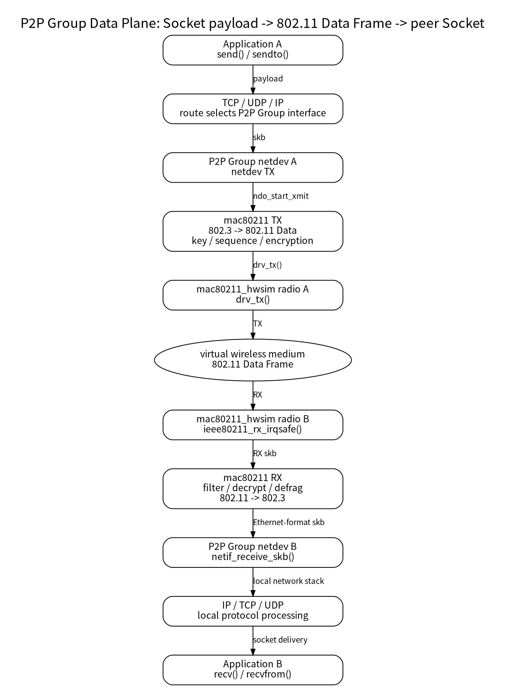

<meta name="referrer" content="no-referrer" />

# Wi-Fi Direct 源码分析（15）：Group 建立后的真实数据面——Socket、mac80211、hwsim 与 802.11 Data Frame TX/RX

> 摘要：沿 P2P Group netdev 追踪普通 TCP/UDP 数据的 Linux TX/RX 路径，说明业务 payload 如何绕过 P2P Core 进入 mac80211 与虚拟 radio。

[TOC]

第 11 篇已经建立一个关键边界：`P2P-GROUP-STARTED` 之后还需要完成 Group Interface、IP 和 route 配置；当三层网络 ready 后，应用不再调用“Wi-Fi Direct 数据发送 API”，而是直接使用标准 Socket。

第 14 篇又补齐了另一半：Discovery、Listen、GO Negotiation 等 **控制面**进入 kernel 后，会通过 `nl80211 → cfg80211 → mac80211 → driver` 完成 ROC、Management Frame TX/RX，再由异步 event 返回 `wpa_supplicant`。

还剩最后一个问题：

> `send()` / `sendto()` 产生的普通业务数据，在选中 P2P Group netdev 后，怎样真正变成 802.11 Data Frame；对端又怎样把它还原成 IP/TCP/UDP，最终交给 `recv()`？

第 15 篇只回答这条数据面主线。不会继续展开 TCP 拥塞控制、Linux routing internals、mac80211 rate control、A-MPDU、DMA ring、firmware 或 PHY；这些都不是理解 Wi-Fi Direct 数据交互所必需的内容。[S1][S2][S3][S4]

> **版本边界**：P2P 生命周期仍以 hostap/wpa_supplicant 2.12 为基线；数据面内核源码使用 upstream Linux `master` snapshot `72d3fcf802c45d00b300f25b848a93c3a2bd7c7e`（Linux 7.3-rc5，2026-09-27）。`master` 会继续变化，因此本文只把这个 snapshot 的函数名作为阅读定位，不把内部函数视为稳定 ABI。[S1][S2][S5]

---

<a id="idx-plane-boundary"></a>
## 1. 先固定一个结论：普通 TCP/UDP payload 不再逐包经过 wpa_supplicant

第 11 篇已经给出：

```text
Application
    ↓
Socket
    ↓
TCP / UDP / IP
    ↓
P2P Group netdev
```

第 15 篇从 `P2P Group netdev` 后面继续，不重新解释 DHCP、IP Address Allocation、route 或 Socket API。[S1]

当路由选择结果把一个 IP packet 送到 P2P Group interface 后，业务数据面进入 Linux networking/mac80211 路径。此时：

- `wpa_cli` 不参与；
- P2P Find/GO Negotiation state machine 不参与；
- `NL80211_CMD_FRAME` 也不是每个业务 packet 的发送接口；
- `wpa_supplicant` 仍运行，但负责控制、连接、安全状态和生命周期，而不是转发每个 TCP/UDP payload。

因此控制面与数据面的入口已经彻底分开：

| 路径 | userspace 入口 | kernel 入口特征 | 典型 frame |
|---|---|---|---|
| P2P 控制面 | `wpa_cli` / P2P Core | nl80211 command/event | Probe / Action / auth 等 Management Frame |
| Group 数据面 | `send()` / `sendto()` / TCP/IP | netdev TX | 802.11 Data Frame |

这个区别是整个系列最后一块必须固定的心智模型。

---

<a id="idx-overall"></a>
## 2. 本实验的数据面全景：应用看到 IP，hwsim 看到 802.11 skb



图中有两个非常重要的转换边界：

1. **Linux 网络栈 → mac80211**：上层交给 Group netdev 的是普通网络数据，mac80211 为无线传输准备 802.11 Data Frame；
2. **mac80211 RX → Linux 网络栈**：对端收到 802.11 Data Frame 后，mac80211 完成接收处理并重新交付为本机网络栈能够处理的 skb。

`mac80211_hwsim` 位于两端 mac80211 之间，只模拟“radio/无线介质”这一段。它既不是 P2P Core，也不是 TCP/IP stack。[S2][S3][S4]

---

<a id="idx-socket-to-netdev"></a>
## 3. `send()` 之后为什么能自动找到 P2P Group interface

应用调用：

```text
send()
sendto()
write()
```

之后，TCP/UDP/IP stack 根据 socket 的目的地址、绑定信息和 route 决定 packet 的 egress interface。第 11 篇已经说明：只要 peer IP 的 route 指向当前 P2P Group netdev，应用就不需要知道底层是 Wi-Fi Direct。[S1]

因此：

```text
TCP server 在 GO
```

或者：

```text
TCP server 在 P2P Client
```

都不会改变底层机制。GO/Client 是 Wi-Fi Direct Group role；Socket server/client 是传输层应用角色，两者互不绑定。

当 packet 被交给 P2P Group netdev 后，Linux 已经完成本篇不再展开的上层工作，例如：

```text
TCP/UDP header
    ↓
IP header
    ↓
route / neighbor resolution
    ↓
选择 Group netdev
```

接下来才进入 mac80211 数据面。

---

<a id="idx-netdev-entry"></a>
## 4. SoftMAC netdev 的 TX 入口：`ieee80211_subif_start_xmit()`

当前 Linux `master` 快照的 mac80211 为普通 802.3 风格 virtual interface 提供 netdev TX 入口：

```c
netdev_tx_t ieee80211_subif_start_xmit(struct sk_buff *skb,
                                       struct net_device *dev)
```

主路径继续进入：

```text
__ieee80211_subif_start_xmit()
```

这里开始把上层网络栈交来的 skb 转换成适合 802.11 发送的形式。[S2]

对本篇最重要的不是逐行理解整个 `tx.c`，而是知道 mac80211 在这一阶段掌握了：

- 当前 virtual interface / Group netdev；
- 目的 station；
- QoS/TID/queue；
- 当前 key；
- 需要构造的 802.11 header/addressing；
- 最终要交给哪一个 hardware/driver queue。

因此应用层并没有直接构造：

```text
Frame Control
Address 1 / Address 2 / Address 3
Sequence Control
CCMP header
```

这些属于 802.11 MAC/安全数据面的职责。

---

<a id="idx-80211-conversion"></a>
## 5. 从“普通网络 skb”到 802.11 Data Frame，mac80211 至少做了哪些事

mac80211 的 TX pipeline 很长，本篇只保留会改变“业务数据怎样变成 Wi-Fi frame”这一结论的步骤。[S2]

### 5.1 选择 station 与无线地址关系

mac80211 根据 interface type、目的 MAC 和 station table 决定接收 station，并把上层数据组织成对应的 802.11 Data/QoS Data frame。

在 P2P Group 中：

- GO 的 MAC 行为接近 AP；
- P2P Client 的 MAC 行为接近 STA；
- frame 中 To DS / From DS、RA/TA/BSSID 等地址语义由 802.11 角色决定。

这与应用层 IP 地址无关。应用只看到 peer IP；到了 MAC 层才转换为对应 station 的无线地址关系。

### 5.2 进入 TX handlers

当前 Linux `master` 快照的 mac80211 TX handlers 会执行一系列处理。与本文最相关的 handler 包括：[S2]

```text
association/control-port checks
    ↓
key selection
    ↓
rate control / sequence
    ↓
fragmentation（如适用）
    ↓
encryption
    ↓
duration / TX metadata
```

其中源码可以看到：

```text
ieee80211_tx_h_select_key()
ieee80211_tx_h_sequence()
ieee80211_tx_h_encrypt()
```

这说明第 10 篇建立的 WPA/RSN key 不只是“握手成功的状态”。进入数据面以后，mac80211/driver 会把已经安装的 key 用于真正的数据 frame 保护。[S2]

但这里必须保留一个实现边界：

> 加密不一定永远由 mac80211 在 CPU 上完成。具体 cipher 可由 mac80211 软件处理，也可以由 driver/hardware/firmware offload；取决于设备能力和 key 是否被上传到硬件。[S5]

因此不能把某个 SoftMAC/hwsim 分支泛化成所有真实 Wi-Fi 芯片。

---

<a id="idx-driver-tx"></a>
## 6. mac80211 最终怎样把 frame 交给 hwsim driver

经过 TX handlers 后，mac80211 最终从内部 TX path 进入 driver callback。当前 Linux `master` 快照仍可看到关键动作：

```text
drv_tx(local, &control, skb)
```

它对应 SoftMAC driver 注册的：

```text
struct ieee80211_ops
```

本实验的 `mac80211_hwsim` 把 TX callback 绑定为：

```text
.tx = mac80211_hwsim_tx
```

同时也提供 `wake_tx_queue` 等队列接口。[S2][S4]

所以从 Group netdev 到 hwsim 的最小链可以理解成：

```text
P2P Group netdev
    ↓
ieee80211_subif_start_xmit()
    ↓
802.11 header / key / TX handlers
    ↓
__ieee80211_tx()
    ↓
drv_tx()
    ↓
mac80211_hwsim_tx()
```

到这里 skb 已经属于 **802.11 TX frame**，而不再只是应用层理解的“TCP payload”。

---

<a id="idx-hwsim-medium"></a>
## 7. hwsim 如何模拟无线介质：不是 loopback，而是把 frame 投递给另一块 virtual radio

`mac80211_hwsim` 默认没有真实射频。没有 `wmediumd` 时，当前 Linux `master` 快照的 hwsim 使用内核内的“perfect medium simulation”路径：[S4]

```text
mac80211_hwsim_tx()
    ↓
mac80211_hwsim_tx_frame_no_nl()
```

`mac80211_hwsim_tx_frame_no_nl()` 会遍历 `hwsim_radios`，只选择满足条件的其他 radio，例如：

- radio 已启动；
- group/netgroup 允许互相通信；
- radio 当前 channel 与 TX channel 兼容，或者其 active interface 可以在该 channel 接收。

对符合条件的 radio，hwsim 复制一个新的 skb，并调用：

```text
mac80211_hwsim_rx(data2, &rx_status, nskb)
```

随后：

```c
ieee80211_rx_irqsafe(data->hw, skb);
```

把 frame 注入**对端 radio 自己的 mac80211 RX pipeline**。[S4]

因此 hwsim 的双 radio 实验不是：

```text
wlan0 packet → Linux loopback → wlan1
```

而更接近：

```text
radio A 生成 802.11 TX skb
    ↓
hwsim 模拟无线传播
    ↓
radio B 得到独立 RX skb
    ↓
radio B 的 mac80211 正常执行 RX 逻辑
```

这也是它能够验证管理帧和普通数据帧的根本原因。

---

<a id="idx-rx-entry"></a>
## 8. 对端 RX：`ieee80211_rx_irqsafe()` 之后发生了什么

对端 `mac80211_hwsim_rx()` 写入 `struct ieee80211_rx_status`，包括 channel/band、rate、signal 等接收元数据，然后调用：

```text
ieee80211_rx_irqsafe()
```

这相当于一个真实 SoftMAC driver 告诉 mac80211：

> 收到了一帧 802.11 frame，请按正常 RX pipeline 处理。

接下来的 `net/mac80211/rx.c` 很长。本篇只保留与普通 P2P Data Frame 到 Socket 有关的职责：[S3]

```text
802.11 frame basic validation
    ↓
station / interface lookup
    ↓
duplicate/reorder/fragment handling（按需）
    ↓
security / decrypt / replay checks（按需）
    ↓
802.11 Data → 802.3-style payload
    ↓
交给本机 netdev / network stack
```

Management Frame 在第 14 篇会通过 cfg80211/nl80211 上送 userspace；**普通 Data Frame 的目标不同：它要进入 Linux 本地数据栈，而不是进入 P2P Core。**

---

<a id="idx-deliver-stack"></a>
## 9. 最关键的 RX 边界：`ieee80211_deliver_skb_to_local_stack()`

当前 Linux `master` 快照的 `rx.c` 在完成 Data Frame 处理后，会进入：

```text
ieee80211_deliver_skb()
    ↓
ieee80211_deliver_skb_to_local_stack()
```

普通场景最终调用：[S3]

```c
netif_receive_skb(skb);
```

这一步可以看成第 15 篇最重要的“交接点”：

```text
mac80211 / 802.11 RX
        ↓
netif_receive_skb()
        ↓
Linux Ethernet-like netdev receive path
        ↓
IP
        ↓
TCP / UDP
        ↓
Socket receive queue
        ↓
recv() / recvfrom()
```

所以对端应用最终拿到的仍然是普通 TCP byte stream 或 UDP datagram。应用层完全不需要解析 802.11 header、CCMP、QoS Control 等无线字段。

---

<a id="idx-encryption"></a>
## 10. WPA/RSN 4-Way Handshake 与业务数据之间，真正的联系是什么

第 10 篇已经解释：4-Way Handshake 成功之后，安全连接进入可传数据状态。

第 15 篇可以把这个结论落到真实数据面：

```text
4-Way Handshake
    ↓
PTK/GTK 等 key 被建立并安装到连接/driver
    ↓
后续 Data Frame TX
    ↓
mac80211/driver 根据 key 做加密或硬件 offload
    ↓
802.11 protected Data Frame
    ↓
peer RX
    ↓
mac80211/driver decrypt / replay validation
    ↓
恢复可交付给 IP 层的数据
```

因此：

- WPS 不是逐包数据加密算法；
- GO Negotiation 也不参与每个业务 packet；
- WPA/RSN handshake 建立的是后续数据面需要使用的安全上下文；
- packet 真正发送时由 mac80211/driver/hardware 使用这些 key。[S1][S2][S5]

这把第 10 篇的“安全建立”与第 15 篇的“真实业务 TX/RX”连接起来了。

---

<a id="idx-control-vs-data"></a>
## 11. 为什么 Management Frame RX 会进 wpa_supplicant，而 Data Frame RX 通常不会

第 14 篇和第 15 篇对比后，可以清楚看到 RX 分叉。

### 11.1 Wi-Fi Direct Management Frame

例如 GO Negotiation Response：

```text
hwsim / driver RX
    ↓
mac80211
    ↓
cfg80211_rx_mgmt*
    ↓
nl80211 event
    ↓
driver_nl80211
    ↓
wpa_supplicant / P2P Core
```

原因是 P2P protocol state machine 需要解析并响应这些 management frames。

### 11.2 普通业务 Data Frame

例如 TCP payload：

```text
hwsim / driver RX
    ↓
mac80211 RX
    ↓
802.11 Data decapsulation
    ↓
netif_receive_skb()
    ↓
IP / TCP
    ↓
Socket
```

原因是 Group 已经建立，业务数据属于 Linux 网络数据面。

所以不能把：

```text
Wi-Fi Direct 通过 wpa_supplicant 建立连接
```

误解成：

```text
以后所有 Wi-Fi Direct 数据都由 wpa_supplicant 转发
```

`wpa_supplicant` 是控制面参与者，不是 TCP/UDP data proxy。

---

<a id="idx-go-forwarding"></a>
## 12. GO 作为 AP-like 角色时，数据也不一定总是交给本机 Socket

P2P GO 在无线 MAC 行为上接近 AP，因此 mac80211 RX path 还可能执行本地无线转发判断。[S3]

例如一个 GO 同时连接多个 P2P Clients 时，如果收到 Client A 发往 Client B 的 frame，AP/GO 数据面可能直接复制/转发给另一 station，而不是先送进 GO 本机应用 Socket。

本实验当前主要关注两台设备：

```text
GO ↔ one P2P Client
```

如果业务目的地址就是 GO 本机，则 Data Frame 经：

```text
mac80211
    ↓
netif_receive_skb()
    ↓
GO local IP stack
```

交给本机应用；反方向 Client 收到 GO 发来的数据时也是同一套本地交付逻辑。

这说明 P2P GO 的“像 AP”不仅存在于建组角色，也会影响 MAC 数据转发语义；但这些行为仍属于 mac80211/networking，而不是 P2P Core 状态机。

---

<a id="idx-real-hardware"></a>
## 13. 换成真实 Wi-Fi 芯片后，哪些部分仍成立，哪些会变化

本实验使用：

```text
cfg80211
    ↓
mac80211
    ↓
mac80211_hwsim
```

这是典型 SoftMAC 学习路径。[S4][S5]

真实产品可能仍然是 SoftMAC，例如：

```text
cfg80211
    ↓
mac80211
    ↓
real SoftMAC driver
    ↓
firmware / hardware
```

也可能是 FullMAC：

```text
cfg80211
    ↓
vendor FullMAC driver
    ↓
firmware
    ↓
Wi-Fi chip
```

此时大量 802.11 MAC、security、aggregation、rate-control 甚至 management 行为可能在 firmware 中完成，不一定经过 Linux `mac80211`。[S5]

但是从 Wi-Fi Direct 系统层理解，下列边界仍然成立：

```text
P2P control plane
    负责 discovery / negotiation / group/security lifecycle

Linux network data plane
    负责 Group 建成后的 ordinary IP traffic
```

变化的是“802.11 Data Frame 具体由 kernel、driver 还是 firmware 的哪一层加工”，不是应用层又重新进入 P2P Core。

---

<a id="idx-series-close"></a>
## 14. 01～15 的最终闭环：从 P2P_FIND 一直到真正的业务 TX/RX

整个系列现在可以收束成两条主线。

第一条是控制面：

```text
wpa_cli
    ↓
P2P_FIND / P2P_CONNECT
    ↓
wpa_supplicant / P2P Core
    ↓
Scan / Listen / GO Negotiation / WPS / WPA
    ↓
nl80211 / cfg80211 / driver
    ↓
802.11 Management Frame TX/RX
    ↓
P2P-GROUP-STARTED
```

第二条是数据面：

```text
Application
    ↓
TCP / UDP / IP
    ↓
P2P Group netdev
    ↓
mac80211 / driver
    ↓
802.11 protected Data Frame
    ↓
peer driver / mac80211
    ↓
IP / TCP / UDP
    ↓
peer Application
```

这两条路径共享同一块 Wi-Fi radio 和同一条已经建立的安全连接，但承担完全不同的职责。

到第 15 篇为止，理解 Wi-Fi Direct 所需要的系统级链路已经完整：

```text
发现设备
→ 协商角色
→ 建立安全 Group
→ 创建/选择 Group netdev
→ 配置 IP/route
→ Socket 发送业务数据
→ 802.11 Data Frame TX/RX
```

继续深入 `nl80211` Generic Netlink internals、mac80211 queue/aggregation、firmware command、DMA、PHY/RF，属于 Linux Wi-Fi driver/firmware 专题，而不再是本系列必须继续下钻的内容。

---

## 关键源码索引

| 关键对象 / 符号 | 本文位置 | Git 源码 |
|---|---|---|
| P2P Group `net_device` / `ieee80211_subif_start_xmit()` | [Group netdev TX 入口](#idx-netdev-entry) | [Linux master snapshot `tx.c`](https://github.com/torvalds/linux/blob/72d3fcf802c45d00b300f25b848a93c3a2bd7c7e/net/mac80211/tx.c#L4630) |
| `ieee80211_tx_h_select_key()` | [802.11 Data Frame 转换](#idx-80211-conversion) | [Linux master snapshot `tx.c`](https://github.com/torvalds/linux/blob/72d3fcf802c45d00b300f25b848a93c3a2bd7c7e/net/mac80211/tx.c#L593) |
| `ieee80211_tx_h_encrypt()` | [802.11 Data Frame 转换](#idx-80211-conversion) | [Linux master snapshot `tx.c`](https://github.com/torvalds/linux/blob/72d3fcf802c45d00b300f25b848a93c3a2bd7c7e/net/mac80211/tx.c#L1048) |
| `__ieee80211_tx()` / `drv_tx()` | [提交 SoftMAC driver](#idx-driver-tx) | [Linux master snapshot `tx.c`](https://github.com/torvalds/linux/blob/72d3fcf802c45d00b300f25b848a93c3a2bd7c7e/net/mac80211/tx.c#L1755) |
| `mac80211_hwsim_tx_frame_no_nl()` | [hwsim 虚拟介质](#idx-hwsim-medium) | [Linux master snapshot `mac80211_hwsim_main.c`](https://github.com/torvalds/linux/blob/72d3fcf802c45d00b300f25b848a93c3a2bd7c7e/drivers/net/wireless/virtual/mac80211_hwsim_main.c#L1902) |
| `mac80211_hwsim_rx()` / `ieee80211_rx_irqsafe()` | [对端 RX 入口](#idx-rx-entry) | [Linux master snapshot `mac80211_hwsim_main.c`](https://github.com/torvalds/linux/blob/72d3fcf802c45d00b300f25b848a93c3a2bd7c7e/drivers/net/wireless/virtual/mac80211_hwsim_main.c#L1860) |
| `ieee80211_deliver_skb()` | [交回本机网络栈](#idx-deliver-stack) | [Linux master snapshot `rx.c`](https://github.com/torvalds/linux/blob/72d3fcf802c45d00b300f25b848a93c3a2bd7c7e/net/mac80211/rx.c#L2793) |
| `ieee80211_deliver_skb_to_local_stack()` / `netif_receive_skb()` | [交回本机网络栈](#idx-deliver-stack) | [Linux master snapshot `rx.c`](https://github.com/torvalds/linux/blob/72d3fcf802c45d00b300f25b848a93c3a2bd7c7e/net/mac80211/rx.c#L2743) |

## 资料来源

<a id="source-s1"></a>
### [S1] 本系列第 10～11 篇与 hostap/wpa_supplicant 2.12
- 类型：系列既有源码结论 + 目标版本 hostap 源码
- 版本：`hostap_2_12` / commit `831364bf02710ad09c2f27d3efa92abeeb5634c0`
- 前置文章：[10-group-formation-security.md](10-group-formation-security.md)、[11-group-runtime.md](11-group-runtime.md)
- 公开源码：<https://chromium.googlesource.com/chromiumos/third_party/hostap/+/refs/tags/hostap_2_12/>
- 使用位置：第 1、3、10～11、14 节
- 支撑内容：`P2P-GROUP-STARTED`、WPA/RSN key 建立、Group Interface 与 IP/route ready 后业务进入普通 Socket 数据面。

<a id="source-s2"></a>
### [S2] Linux master snapshot：mac80211 TX path
- 类型：upstream Linux 源码
- 基线：`master` snapshot `72d3fcf802c45d00b300f25b848a93c3a2bd7c7e`（Linux 7.3-rc5，2026-09-27）
- 文件：[`net/mac80211/tx.c`](https://github.com/torvalds/linux/blob/72d3fcf802c45d00b300f25b848a93c3a2bd7c7e/net/mac80211/tx.c)
- 关键符号：`ieee80211_subif_start_xmit()`、`__ieee80211_subif_start_xmit()`、`ieee80211_tx_h_select_key()`、`ieee80211_tx_h_encrypt()`、`__ieee80211_tx()`、`drv_tx()`
- 使用位置：第 4～6、10、14 节
- 支撑内容：Group netdev 的 SoftMAC TX 入口、802.11 TX handlers、key/encryption 处理以及向 driver 提交 skb。

<a id="source-s3"></a>
### [S3] Linux master snapshot：mac80211 RX 与本地网络栈交付
- 类型：upstream Linux 源码
- 基线：`master` snapshot `72d3fcf802c45d00b300f25b848a93c3a2bd7c7e`
- 文件：[`net/mac80211/rx.c`](https://github.com/torvalds/linux/blob/72d3fcf802c45d00b300f25b848a93c3a2bd7c7e/net/mac80211/rx.c)
- 关键符号：mac80211 RX handlers、`ieee80211_deliver_skb()`、`ieee80211_deliver_skb_to_local_stack()`、`netif_receive_skb()`
- 使用位置：第 8～9、11～12、14 节
- 支撑内容：802.11 Data Frame RX 处理、恢复为本地网络栈 skb、AP-like local forwarding 与 IP stack 交接。

<a id="source-s4"></a>
### [S4] Linux master snapshot：mac80211_hwsim 数据 TX/RX
- 类型：upstream Linux driver 源码
- 基线：`master` snapshot `72d3fcf802c45d00b300f25b848a93c3a2bd7c7e`
- 文件：[`drivers/net/wireless/virtual/mac80211_hwsim_main.c`](https://github.com/torvalds/linux/blob/72d3fcf802c45d00b300f25b848a93c3a2bd7c7e/drivers/net/wireless/virtual/mac80211_hwsim_main.c)
- 关键符号：`mac80211_hwsim_tx()`、`mac80211_hwsim_tx_frame_no_nl()`、`mac80211_hwsim_rx()`、`ieee80211_rx_irqsafe()`
- 使用位置：第 2、6～8、13～14 节
- 支撑内容：默认无 wmediumd 时的 virtual medium、同频 radio frame clone、peer mac80211 RX 注入。

<a id="source-s5"></a>
### [S5] Linux Kernel / Linux Wireless：cfg80211、mac80211 与硬件 crypto 官方文档
- 类型：官方内核文档
- URL/文档：[`Linux 802.11 Driver Developer's Guide`](https://docs.kernel.org/driver-api/80211/)、[`cfg80211 subsystem`](https://docs.kernel.org/driver-api/80211/cfg80211.html)、[`About mac80211`](https://wireless.docs.kernel.org/en/latest/en/developers/documentation/mac80211.html)
- 使用位置：版本边界、第 5、10、13～14 节
- 支撑内容：cfg80211/mac80211 的 SoftMAC 职责边界、TX/RX processing 与 hardware crypto/offload 的实现边界，以及 FullMAC 不一定经过 mac80211。
